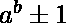
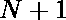
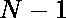

# 坎宁安数字

> 原文:[https://www.geeksforgeeks.org/cunningham-numbers/](https://www.geeksforgeeks.org/cunningham-numbers/)

**坎宁安数字**是形式的数字 **N** ，其中 a，b > = 2。
少数坎宁安编号为:

> 3、5、7、8、9、10、15、17、24、26、28……

### 检查 N 是否是坎宁安数字

给定一个数字 **N** ，任务是检查 **N** 是否为**坎宁安数字**。如果 **N** 是坎宁安号码，则打印**“是”**否则打印**“否”**。
**示例:**

> **输入:** N = 126
> **输出:**是
> **解释:**
> 126 = 5^3+1
> **输入:** N = 16
> **输出:**否

**方法:**想法是以期望的形式求解方程，使得检查该数是否是坎宁安数很容易。

```
// Cunningham Numbers are the 
// which can be represented as 
=> 
=> 
```

因此，如果或可以[用](https://www.geeksforgeeks.org/check-if-a-number-can-be-expressed-as-ab-set-2/) 的形式表示，那么这个数就是坎宁安数。
以下是上述方法的实施:

## C++

```
// C++ implementation for the
// above approach

#include <bits/stdc++.h>
using namespace std;

// Function to check if a number
// can be expressed as a^b.
bool isPower(int a)
{
    if (a == 1)
        return true;

    for (int i = 2; i * i <= a; i++) {
        double val = log(a) / log(i);
        if ((val - (int)val) < 0.00000001)
            return true;
    }

    return false;
}

// Function to check if N is a
// Cunningham number
bool isCunningham(int n)
{
    return isPower(n - 1) ||
           isPower(n + 1);
}

// Driver Code
int main()
{
    // Given Number
    int n = 126;

    // Function Call
    if (isCunningham(n))
        cout << "Yes";
    else
        cout << "No";
    return 0;
}
```

## Java 语言(一种计算机语言，尤用于创建网站)

```
// Java implementation for the above approach
import java.util.*;

class GFG{

// Function to check if a number
// can be expressed as a^b.
static boolean isPower(int a)
{
    if (a == 1)
        return true;

    for(int i = 2; i * i <= a; i++)
    {
       double val = Math.log(a) / Math.log(i);
       if ((val - (int)val) < 0.00000001)
           return true;
    }
    return false;
}

// Function to check if N is a
// Cunningham number
static boolean isCunningham(int n)
{
    return isPower(n - 1) ||
           isPower(n + 1);
}

// Driver Code
public static void main (String[] args)
{

    // Given Number
    int n = 126;

    // Function Call
    if (isCunningham(n))
        System.out.print("Yes");
    else
        System.out.print("No");
}
}

// This code is contributed by Ritik Bansal
```

## 蟒蛇 3

```
# Python3 implementation for the
# above approach
import math

# Function to check if a number
# can be expressed as a^b.
def isPower(a):

    if (a == 1):
        return True

    i = 2
    while(i * i <= a):
        val = math.log(a) / math.log(i)
        if ((val - int(val)) < 0.00000001):
            return True
        i += 1
    return False

# Function to check if N is a
# Cunningham number
def isCunningham(n):
    return isPower(n - 1) or isPower(n + 1)

# Driver Code

# Given Number
n = 126

# Function Call
if (isCunningham(n)):
    print("Yes")
else:
    print("No")

# This code is contributed by shubhamsingh10
```

## C#

```
// C# implementation for the
// above approach
using System;
class GFG{

// Function to check if a number
// can be expressed as a^b.
static bool isPower(int a)
{
    if (a == 1)
        return true;

    for(int i = 2; i * i <= a; i++)
    {
       double val = Math.Log(a) / Math.Log(i);
       if ((val - (int)val) < 0.00000001)
           return true;
    }
    return false;
}

// Function to check if N is a
// Cunningham number
static bool isCunningham(int n)
{
    return isPower(n - 1) ||
           isPower(n + 1);
}

// Driver Code
public static void Main (string[] args)
{

    // Given number
    int n = 126;

    // Function Call
    if (isCunningham(n))
        Console.Write("Yes");
    else
        Console.Write("No");
}
}

// This code is contributed by rock_cool
```

## java 描述语言

```
<script>
// Javascript implementation for the above approach

    // Function to check if a number
    // can be expressed as a^b.
    function isPower( a)
    {
        if (a == 1)
            return true;

        for ( let i = 2; i * i <= a; i++)
        {
            let val = Math.log(a) / Math.log(i);
            if ((val - parseInt( val) < 0.00000001))
                return true;
        }
        return false;
    }

    // Function to check if N is a
    // Cunningham number
    function isCunningham(n)
    {
        return isPower(n - 1) || isPower(n + 1);
    }

    // Driver Code

    // Given Number
    let n = 126;

    // Function Call
    if (isCunningham(n))
        document.write("Yes");
    else
        document.write("No");

// This code is contributed by Rajput-Ji
</script>
```

**Output:** 

```
Yes
```

***时间复杂度:** O(n <sup>1/2</sup> )*

***辅助空间:** O(1)*

**参考:**T2https://oeis.org/A080262