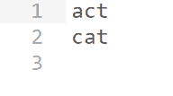

# 自定义混乱文字游戏

> 原文:[https://www.geeksforgeeks.org/custom-jumble-word-game/](https://www.geeksforgeeks.org/custom-jumble-word-game/)

给定一个字符串 **str** ，任务是打印给定字符串的所有[字谜，该字谜形成了一个存在于英语词典中的单词。](https://www.geeksforgeeks.org/print-pairs-anagrams-given-array-strings/)

**注意:**对于使用词典单词，使用文本文件，其中存储了词典的所有单词。

**示例:**

> **输入:** str = "tac"
> **输出:**
> act
> cat
> **解释:**
> 由给定的字符串组成的单词“tac”是 act，cat。
> 
> **输入:** str = "atrew"
> **输出:**
> tawer
> water
> wreat
> **解释:**
> 由给定的字符串“atrew”可以组成的单词有“tawer”、“water”、“wreat”。

**方法:**思路是使用[文件处理](https://www.geeksforgeeks.org/tag/c-file-handling/)的概念和一个包含所有有意义单词的文本文件(比如 **words.txt** )。以下是步骤:

1.  [给定字符串排序](https://www.geeksforgeeks.org/sort-string-characters/)。
2.  打开**word . txt**文件使用文件处理 **ifstream** 到[在 C++中读取文件为:

    > if stream word(【word。txt ")；
    > 
    > *   对于文件中的每个单词 **words.txt** 对单词进行排序，并将其与给定的排序字符串进行比较。*   如果在上述步骤中两个字符串都匹配，则在文件 **words.txt** 中打印当前单词。*   检查完所有文字后关闭文件。T21】](https://www.geeksforgeeks.org/readwrite-structure-file-c/) 

下面是上述方法的实现:

## C++

```
// C++ program for the above approach

#include <bits/stdc++.h>
using namespace std;

// Function that sorts the given string
// and transform a sorted string to uppercase
string sortString(string word)
{
    // Transformed to uppercase
    transform(word.begin(), word.end(),
              word.begin(), ::toupper);

    // Sort the words
    sort(word.begin(), word.end());
    return word;
}

// Function that finds the anagram of
// given string in the given text file
void jumbledString(string jumble)
{
    // Initialize strings
    string checkPerWord = "";
    string userEnteredAfterSorting;

    // Sort the string
    userEnteredAfterSorting
        = sortString(jumble);

    // Using filehandling ifstream
    // to read the file
    ifstream words("words.txt");

    // If file exist
    if (words) {

        // Check each and every word
        // of words.txt(dictionary)
        while (getline(words,
                       checkPerWord)) {

            string Ch
                = sortString(checkPerWord);

            // If words matches
            if (Ch
                == userEnteredAfterSorting) {

                // Print the word
                cout << checkPerWord
                     << endl;
            }
        }

        // Close the file
        words.close();
    }
}

// Driver Code
int main()
{
    // Given string str
    string string = "tac";

    // Function Call
    jumbledString(string);

    return 0;
}
```

**输出:**
[](https://media.geeksforgeeks.org/wp-content/uploads/20200829155201/Output.png)

**链接到文本文件:** [链接](https://contribute.geeksforgeeks.org/wp-content/uploads/words1.txt)