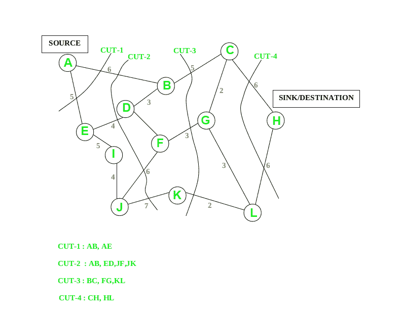
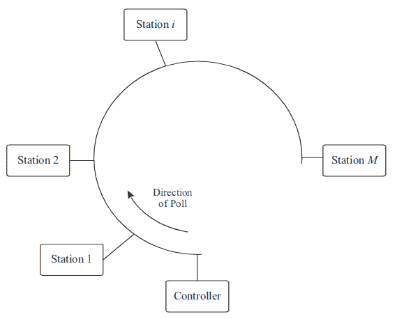
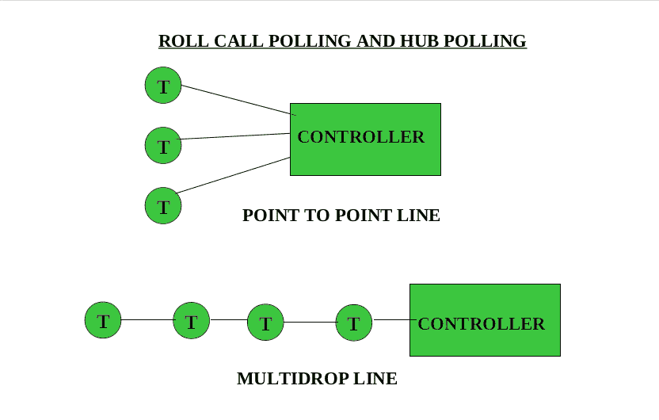

# 切割和网络流

> 原文:[https://www.geeksforgeeks.org/cuts-and-network-flow/](https://www.geeksforgeeks.org/cuts-and-network-flow/)

任何网络的主干分析都广泛地通过使用图论及其算法来完成。性能约束是**可靠性、延迟/吞吐量**，目标是**最小化成本。**

在网络的主干设计中，关注点和注意事项是:

1.  主干拓扑应该是什么？
2.  生产线产能的分配。
3.  线路和整个网络的流量分配。

**一些常见的定义:**

*   **网络:**网络是一个电路，它是返回到起始节点的相邻节点的序列。包含图中所有节点的电路称为**哈密顿电路。**
*   **生成树:**图的生成树是包含图的所有节点和一些选择的弧的集合的子图，使得每对节点之间正好有一条路径。
*   **截线:**图论中的一个概念是截线，它对网络承载能力建模很有用。X-Y 切割是一组弧，其移除会将节点 X 从节点 Y 断开。

    加权图中的割

    ```
    Four A-H cuts are shown in the figure above.

    Cut 1 : AB, AE (capacity = 11)
    Cut 2 : AB, ED, JF, JK (capacity = 23)
    Cut 3 : BC, FG, KL (capacity = 10)
    Cut 4 : CH, CL (capacity = 12)
    ```

*   **最小切割:**它是替换其任何成员重新连接图形的切割。换句话说，在最小的切割中，所有的弧都是必不可少的。弧 AB、AE 和 FG 的集合形成 A-H 切割，但切割不是最小的，因为恢复弧 FG 不会将节点 A 重新连接到节点 H。
*   **最小切割:**在加权图中，每个切割都有容量。最小容量的切割就是最小切割。在上图中，容量=10 的切口-3 是最小切口。
*   **最大流最小割定理:**任意图中任意两个节点之间的最大流不能超过分隔这两个节点的最小割的容量。
*   **轮询:**网络上的每个站都以某种预定的顺序进行轮询。在两次轮询之间，站点会在队列中累积消息，但在轮询之前不会传输。线路上的终端被连续邀请发送数据的过程。这可以通过让主站使用轮询列表来邀请终端发送数据，或者通过每个终端依次向下一个终端发送轮询消息以便它可以发送数据，或者通过使用令牌环中的令牌来控制数据的发送来实现。
*   **轮询序列:**邀请终端发送数据的序列。这可以基于轮询列表，其中终端 id 以它们将被轮询的顺序存储。
*   **Polling Techniques :**

    典型的轮询网络

    1.  **点名轮询:**主站使用一个或多个轮询列表来确定要轮询的下一个终端。中央计算机(控制器)必须依次轮询每个站。在工作站发送完积压的消息后，它会用最后一个数据包的后缀通知中央控制器。收到这个后缀包后，控制器向轮询序列中的下一站发送一个轮询。
    2.  **集线器轮询:**当前处于轮询模式的终端按顺序轮询下一个终端。在这种情况下，前进(后缀)数据包包含下一站地址。
        必须提供一个监控信道，以指示适当的站应该开始传输。本质上，许可是从一个站点直接传输到另一个站点的。
    3.  **令牌传递:**令牌被传递到网络(环或总线)上的下一个设备，该设备可以使用它来传输数据，也可以让它传递到下一个设备。

    点名轮询和集线器轮询

    为了高效的网络，我们需要考虑上面提到的几点。此外，还可以使用**排队论**来处理，在该理论中，排队系统可以用来模拟顾客到达等待轮到他们的服务、得到服务然后离开的过程。
    **链路赤字算法**也用于确定网络的高效主干。