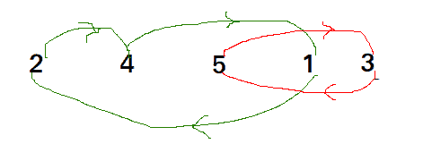

# 循环排序

> 原文:[https://www.geeksforgeeks.org/cycle-sort/](https://www.geeksforgeeks.org/cycle-sort/)

循环排序是一种就地排序算法，[不稳定排序算法](https://en.wikipedia.org/wiki/Sorting_algorithm#Stability)，这是一种比较排序，就对原始阵列的总写入次数而言，理论上是最佳的。

*   就内存写入次数而言，它是最佳的。它[最小化要排序的内存写入次数](https://www.geeksforgeeks.org/which-sorting-algorithm-makes-minimum-number-of-writes/)(每个值要么被写入零次，如果它已经在它的正确位置，要么被写入一次到它的正确位置。)
*   它基于这样的思想，即将被排序的数组可以被划分为循环。周期可以被可视化为图形。如果排序数组中第 I 个索引处的元素必须出现在第 j 个索引处，那么我们有 n 个节点和一条从节点 I 指向节点 j 的边。
    在 arr[]中循环= {2，4，5，1，3}



*   在 arr[]中循环= {4，3，2，1}


我们一个一个考虑所有的周期。我们首先考虑包含第一个元素的循环。我们找到第一个元素的正确位置，把它放在正确的位置，比如 j .我们考虑 arr[j]的旧值，找到它的正确位置，我们一直这样做，直到当前周期的所有元素都放在正确的位置，也就是说，我们没有回到周期的起点。

**说明:**

```
 arr[] = {10, 5, 2, 3}
 index =  0   1   2   3
cycle_start = 0 
item = 10 = arr[0]

Find position where we put the item  
pos = cycle_start
i=pos+1
while(i<n)
if (arr[i] < item)  
    pos++;

We put 10 at arr[3] and change item to 
old value of arr[3].
arr[] = {10, 5, 2, ***10***} 
item = 3 

Again rotate rest cycle that start with index '0' 
Find position where we put the item = 3 
we swap item with element at arr[1] now 
arr[] = {10, ***3***, 2, ***10***} 
item = 5

Again rotate rest cycle that start with index '0' and item = 5 
we swap item with element at arr[2].
arr[] = {10, ***3***, ***5***, ***10*** } 
item = 2

Again rotate rest cycle that start with index '0' and item = 2
arr[] = {***2***, ***3***, ***5***, ***10***}  

Above is one iteration for cycle_stat = 0.
Repeat above steps for cycle_start = 1, 2, ..n-2
```

## 卡片打印处理机（Card Print Processor 的缩写）

```
// C++ program to implement cycle sort
#include <iostream>
using namespace std;

// Function sort the array using Cycle sort
void cycleSort(int arr[], int n)
{
    // count number of memory writes
    int writes = 0;

    // traverse array elements and put it to on
    // the right place
    for (int cycle_start = 0; cycle_start <= n - 2; cycle_start++) {
        // initialize item as starting point
        int item = arr[cycle_start];

        // Find position where we put the item. We basically
        // count all smaller elements on right side of item.
        int pos = cycle_start;
        for (int i = cycle_start + 1; i < n; i++)
            if (arr[i] < item)
                pos++;

        // If item is already in correct position
        if (pos == cycle_start)
            continue;

        // ignore all duplicate  elements
        while (item == arr[pos])
            pos += 1;

        // put the item to it's right position
        if (pos != cycle_start) {
            swap(item, arr[pos]);
            writes++;
        }

        // Rotate rest of the cycle
        while (pos != cycle_start) {
            pos = cycle_start;

            // Find position where we put the element
            for (int i = cycle_start + 1; i < n; i++)
                if (arr[i] < item)
                    pos += 1;

            // ignore all duplicate  elements
            while (item == arr[pos])
                pos += 1;

            // put the item to it's right position
            if (item != arr[pos]) {
                swap(item, arr[pos]);
                writes++;
            }
        }
    }

    // Number of memory writes or swaps
    // cout << writes << endl ;
}

// Driver program to test above function
int main()
{
    int arr[] = { 1, 8, 3, 9, 10, 10, 2, 4 };
    int n = sizeof(arr) / sizeof(arr[0]);
    cycleSort(arr, n);

    cout << "After sort : " << endl;
    for (int i = 0; i < n; i++)
        cout << arr[i] << " ";
    return 0;
}
```

## Java 语言(一种计算机语言，尤用于创建网站)

```
// Java program to implement cycle sort

import java.util.*;
import java.lang.*;

class GFG {
    // Function sort the array using Cycle sort
    public static void cycleSort(int arr[], int n)
    {
        // count number of memory writes
        int writes = 0;

        // traverse array elements and put it to on
        // the right place
        for (int cycle_start = 0; cycle_start <= n - 2; cycle_start++) {
            // initialize item as starting point
            int item = arr[cycle_start];

            // Find position where we put the item. We basically
            // count all smaller elements on right side of item.
            int pos = cycle_start;
            for (int i = cycle_start + 1; i < n; i++)
                if (arr[i] < item)
                    pos++;

            // If item is already in correct position
            if (pos == cycle_start)
                continue;

            // ignore all duplicate elements
            while (item == arr[pos])
                pos += 1;

            // put the item to it's right position
            if (pos != cycle_start) {
                int temp = item;
                item = arr[pos];
                arr[pos] = temp;
                writes++;
            }

            // Rotate rest of the cycle
            while (pos != cycle_start) {
                pos = cycle_start;

                // Find position where we put the element
                for (int i = cycle_start + 1; i < n; i++)
                    if (arr[i] < item)
                        pos += 1;

                // ignore all duplicate elements
                while (item == arr[pos])
                    pos += 1;

                // put the item to it's right position
                if (item != arr[pos]) {
                    int temp = item;
                    item = arr[pos];
                    arr[pos] = temp;
                    writes++;
                }
            }
        }
    }

    // Driver program to test above function
    public static void main(String[] args)
    {
        int arr[] = { 1, 8, 3, 9, 10, 10, 2, 4 };
        int n = arr.length;
        cycleSort(arr, n);

        System.out.println("After sort : ");
        for (int i = 0; i < n; i++)
            System.out.print(arr[i] + " ");
    }
}

// Code Contributed by Mohit Gupta_OMG <(0_o)>
```

## 蟒蛇 3

```
# Python program to implement cycle sort

def cycleSort(array):
  writes = 0

  # Loop through the array to find cycles to rotate.
  for cycleStart in range(0, len(array) - 1):
    item = array[cycleStart]

    # Find where to put the item.
    pos = cycleStart
    for i in range(cycleStart + 1, len(array)):
      if array[i] < item:
        pos += 1

    # If the item is already there, this is not a cycle.
    if pos == cycleStart:
      continue

    # Otherwise, put the item there or right after any duplicates.
    while item == array[pos]:
      pos += 1
    array[pos], item = item, array[pos]
    writes += 1

    # Rotate the rest of the cycle.
    while pos != cycleStart:

      # Find where to put the item.
      pos = cycleStart
      for i in range(cycleStart + 1, len(array)):
        if array[i] < item:
          pos += 1

      # Put the item there or right after any duplicates.
      while item == array[pos]:
        pos += 1
      array[pos], item = item, array[pos]
      writes += 1

  return writes

# driver code
arr = [1, 8, 3, 9, 10, 10, 2, 4 ]
n = len(arr)
cycleSort(arr)

print("After sort : ")
for i in range(0, n) :
    print(arr[i], end = ' ')

# Code Contributed by Mohit Gupta_OMG <(0_o)>
```

## C#

```
// C# program to implement cycle sort
using System;

class GFG {

    // Function sort the array using Cycle sort
    public static void cycleSort(int[] arr, int n)
    {
        // count number of memory writes
        int writes = 0;

        // traverse array elements and
        // put it to on the right place
        for (int cycle_start = 0; cycle_start <= n - 2; cycle_start++)
        {
            // initialize item as starting point
            int item = arr[cycle_start];

            // Find position where we put the item.
            // We basically count all smaller elements
            // on right side of item.
            int pos = cycle_start;
            for (int i = cycle_start + 1; i < n; i++)
                if (arr[i] < item)
                    pos++;

            // If item is already in correct position
            if (pos == cycle_start)
                continue;

            // ignore all duplicate elements
            while (item == arr[pos])
                pos += 1;

            // put the item to it's right position
            if (pos != cycle_start) {
                int temp = item;
                item = arr[pos];
                arr[pos] = temp;
                writes++;
            }

            // Rotate rest of the cycle
            while (pos != cycle_start) {
                pos = cycle_start;

                // Find position where we put the element
                for (int i = cycle_start + 1; i < n; i++)
                    if (arr[i] < item)
                        pos += 1;

                // ignore all duplicate elements
                while (item == arr[pos])
                    pos += 1;

                // put the item to it's right position
                if (item != arr[pos]) {
                    int temp = item;
                    item = arr[pos];
                    arr[pos] = temp;
                    writes++;
                }
            }
        }
    }

    // Driver program to test above function
    public static void Main()
    {
        int[] arr = { 1, 8, 3, 9, 10, 10, 2, 4 };
        int n = arr.Length;

        // Function calling
        cycleSort(arr, n);

        Console.Write("After sort : ");
        for (int i = 0; i < n; i++)
            Console.Write(arr[i] + " ");
    }
}

// This code is contributed by Nitin Mittal
```

## java 描述语言

```
<script>
// Javascript program to implement cycle sort

    // Function sort the array using Cycle sort
    function cycleSort(arr, n)
    {

        // count number of memory writes
        let writes = 0;

        // traverse array elements and put it to on
        // the right place
        for (let cycle_start = 0; cycle_start <= n - 2; cycle_start++)
        {

            // initialize item as starting point
            let item = arr[cycle_start];

            // Find position where we put the item. We basically
            // count all smaller elements on right side of item.
            let pos = cycle_start;
            for (let i = cycle_start + 1; i < n; i++)
                if (arr[i] < item)
                    pos++;

            // If item is already in correct position
            if (pos == cycle_start)
                continue;

            // ignore all duplicate elements
            while (item == arr[pos])
                pos += 1;

            // put the item to it's right position
            if (pos != cycle_start)
            {
                let temp = item;
                item = arr[pos];
                arr[pos] = temp;
                writes++;
            }

            // Rotate rest of the cycle
            while (pos != cycle_start)
            {
                pos = cycle_start;

                // Find position where we put the element
                for (let i = cycle_start + 1; i < n; i++)
                    if (arr[i] < item)
                        pos += 1;

                // ignore all duplicate elements
                while (item == arr[pos])
                    pos += 1;

                // put the item to it's right position
                if (item != arr[pos]) {
                    let temp = item;
                    item = arr[pos];
                    arr[pos] = temp;
                    writes++;
                }
            }
        }
    }

// Driver code   

    let arr = [ 1, 8, 3, 9, 10, 10, 2, 4 ];
       let n = arr.length;
       cycleSort(arr, n);

      document.write("After sort : " + "<br/>");
       for (let i = 0; i < n; i++)
           document.write(arr[i] + " ");

  // This code is contributed by susmitakundugoaldanga.
</script>
```

**输出:**

```
After sort : 
1 2 3 4 8 9 10 10 
```

**时间复杂度** : O(n <sup>2</sup> )
最差情况:O(n <sup>2</sup> )
平均情况:O(n <sup>2</sup> )
最佳情况:O(n <sup>2</sup> )
这种排序算法最适合内存写入或交换操作成本较高的情况。

**参考:**
[【https://en.wikipedia.org/wiki/Cycle_sort】](https://en.wikipedia.org/wiki/Cycle_sort)
本文由 [**尼尚辛格**](https://practice.geeksforgeeks.org/user-profile.php?user=_code) 供稿。如果你喜欢 GeeksforGeeks 并想投稿，你也可以使用[contribute.geeksforgeeks.org](http://www.contribute.geeksforgeeks.org)写一篇文章或者把你的文章邮寄到 contribute@geeksforgeeks.org。看到你的文章出现在极客博客主页上，帮助其他极客。
如果发现有不正确的地方，或者想分享更多关于上述话题的信息，请写评论。