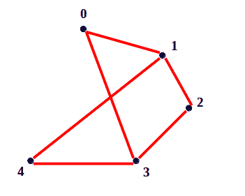

# 无向连通图中长度为 n 的圈

> 原文:[https://www . geeksforgeeks . org/长度为 n 的无向连通图循环/](https://www.geeksforgeeks.org/cycles-of-length-n-in-an-undirected-and-connected-graph/)

给定一个无向连通图和一个数 n，计算图中长度为 n 的循环总数。长度为 n 的循环简单地说就是这个循环包含 n 个顶点和 n 条边。我们必须计算所有存在的周期。
**例** :

```
Input :  n = 4
```



```
Output : Total cycles = 3
Explanation : Following 3 unique cycles 
   0 -> 1 -> 2 -> 3 -> 0
 0 -> 1 -> 4 -> 3 -> 0
 1 -> 2 -> 3 -> 4 -> 1
Note* : There are more cycles but
these 3 are unique as 0 -> 3 -> 2 -> 1
-> 0 and 0 -> 1 -> 2 -> 3 -> 0 are 
same cycles and hence will be counted as 1.
```

要解决这个问题，可以有效地使用 [DFS(深度优先搜索)](https://www.geeksforgeeks.org/depth-first-traversal-for-a-graph/)。使用 DFS，我们可以找到特定源(或起点)的每一条可能的路径长度(n-1)。然后我们检查这条路径是否以它开始的顶点结束，如果是，那么我们把它算作长度为 n 的循环。注意，我们寻找长度为(n-1)的路径，因为第 n 条<sup>边将是循环的结束边。
仅使用**V**–(**n**–**1**)个顶点(其中 V 是顶点的总数)就可以搜索长度为(n-1)的所有可能路径。
对于上述示例，长度为 4 的所有循环都可以仅使用 5-(4-1) = 2 个顶点来搜索。这背后的原因很简单，因为我们使用这 2 个顶点(包括剩余的 3 个顶点)来搜索长度(n-1) = 3 的所有可能路径。所以，这两个顶点也覆盖了剩下的 3 个顶点的循环，并且仅仅使用 3 个顶点，我们无论如何都不能形成长度为 4 的循环。
还有一点需要注意的是，每个顶点对于它形成的每个循环都找到 2 个重复循环。对于上面的示例 0 <sup>第</sup>个顶点找到两个重复的循环，即**0->3->2->1->0**和**0->1->2->3->0**。因此总计数必须除以 2，因为每个周期被计数两次。</sup> 

## C++

```
// CPP Program to count cycles of length n
// in a given graph.
#include <bits/stdc++.h>
using namespace std;

// Number of vertices
const int V = 5;

void DFS(bool graph[][V], bool marked[], int n,
               int vert, int start, int &count)
{
    // mark the vertex vert as visited
    marked[vert] = true;

    // if the path of length (n-1) is found
    if (n == 0) {

        // mark vert as un-visited to make
        // it usable again.
        marked[vert] = false;

        // Check if vertex vert can end with
        // vertex start
        if (graph[vert][start])
        {
            count++;
            return;
        } else
            return;
    }

    // For searching every possible path of
    // length (n-1)
    for (int i = 0; i < V; i++)
        if (!marked[i] && graph[vert][i])

            // DFS for searching path by decreasing
            // length by 1
            DFS(graph, marked, n-1, i, start, count);

    // marking vert as unvisited to make it
    // usable again.
    marked[vert] = false;
}

// Counts cycles of length N in an undirected
// and connected graph.
int countCycles(bool graph[][V], int n)
{
    // all vertex are marked un-visited initially.
    bool marked[V];
    memset(marked, 0, sizeof(marked));

    // Searching for cycle by using v-n+1 vertices
    int count = 0;
    for (int i = 0; i < V - (n - 1); i++) {
        DFS(graph, marked, n-1, i, i, count);

        // ith vertex is marked as visited and
        // will not be visited again.
        marked[i] = true;
    }

    return count/2;
}

int main()
{
    bool graph[][V] = {{0, 1, 0, 1, 0},
                      {1, 0, 1, 0, 1},
                      {0, 1, 0, 1, 0},
                      {1, 0, 1, 0, 1},
                      {0, 1, 0, 1, 0}};
    int n = 4;
    cout << "Total cycles of length " << n << " are "
         << countCycles(graph, n);
    return 0;
}
```

## Java 语言(一种计算机语言，尤用于创建网站)

```
// Java program to calculate cycles of
// length n in a given graph
public class Main {

    // Number of vertices
    public static final int V = 5;
    static int count = 0;

    static void DFS(int graph[][], boolean marked[],
                    int n, int vert, int start) {

        // mark the vertex vert as visited
        marked[vert] = true;

        // if the path of length (n-1) is found
        if (n == 0) {

            // mark vert as un-visited to
            // make it usable again
            marked[vert] = false;

            // Check if vertex vert end
            // with vertex start
            if (graph[vert][start] == 1) {
                count++;
                return;
            } else
                return;
        }

        // For searching every possible
        // path of length (n-1)
        for (int i = 0; i < V; i++)
            if (!marked[i] && graph[vert][i] == 1)

                // DFS for searching path by
                // decreasing length by 1
                DFS(graph, marked, n-1, i, start);

        // marking vert as unvisited to make it
        // usable again
        marked[vert] = false;
    }

    // Count cycles of length N in an
    // undirected and connected graph.
    static int countCycles(int graph[][], int n) {

        // all vertex are marked un-visited
        // initially.
        boolean marked[] = new boolean[V];

        // Searching for cycle by using
        // v-n+1 vertices
        for (int i = 0; i < V - (n - 1); i++) {
            DFS(graph, marked, n-1, i, i);

            // ith vertex is marked as visited
            // and will not be visited again
            marked[i] = true;
        }

        return count / 2;
    }

    // driver code
    public static void main(String[] args) {
        int graph[][] = {{0, 1, 0, 1, 0},
                        {1, 0, 1, 0, 1},
                        {0, 1, 0, 1, 0},
                        {1, 0, 1, 0, 1},
                        {0, 1, 0, 1, 0}};

        int n = 4;

        System.out.println("Total cycles of length "+
                          n + " are "+
                          countCycles(graph, n));
    }
}

// This code is contributed by nuclode
```

## 蟒蛇 3

```
# Python Program to count
# cycles of length n
# in a given graph.

# Number of vertices
V = 5

def DFS(graph, marked, n, vert, start, count):

    # mark the vertex vert as visited
    marked[vert] = True

    # if the path of length (n-1) is found
    if n == 0:

        # mark vert as un-visited to make
        # it usable again.
        marked[vert] = False

        # Check if vertex vert can end with
        # vertex start
        if graph[vert][start] == 1:
            count = count + 1
            return count
        else:
            return count

    # For searching every possible path of
    # length (n-1)
    for i in range(V):
        if marked[i] == False and graph[vert][i] == 1:

            # DFS for searching path by decreasing
            # length by 1
            count = DFS(graph, marked, n-1, i, start, count)

    # marking vert as unvisited to make it
    # usable again.
    marked[vert] = False
    return count

# Counts cycles of length
# N in an undirected
# and connected graph.
def countCycles( graph, n):

    # all vertex are marked un-visited initially.
    marked = [False] * V

    # Searching for cycle by using v-n+1 vertices
    count = 0
    for i in range(V-(n-1)):
        count = DFS(graph, marked, n-1, i, i, count)

        # ith vertex is marked as visited and
        # will not be visited again.
        marked[i] = True

    return int(count/2)

# main :
graph = [[0, 1, 0, 1, 0],
         [1 ,0 ,1 ,0, 1],
         [0, 1, 0, 1, 0],
         [1, 0, 1, 0, 1],
         [0, 1, 0, 1, 0]]

n = 4
print("Total cycles of length ",n," are ",countCycles(graph, n))

# this code is contributed by Shivani Ghughtyal
```

## C#

```
// C# program to calculate cycles of
// length n in a given graph
using System;

class GFG
{

    // Number of vertices
    public static int V = 5;
    static int count = 0;

    static void DFS(int [,]graph, bool []marked,
                    int n, int vert, int start)
    {

        // mark the vertex vert as visited
        marked[vert] = true;

        // if the path of length (n-1) is found
        if (n == 0)
        {

            // mark vert as un-visited to
            // make it usable again
            marked[vert] = false;

            // Check if vertex vert end
            // with vertex start
            if (graph[vert, start] == 1)
            {
                count++;
                return;
            }
            else
                return;
        }

        // For searching every possible
        // path of length (n-1)
        for (int i = 0; i < V; i++)
            if (!marked[i] && graph[vert, i] == 1)

                // DFS for searching path by
                // decreasing length by 1
                DFS(graph, marked, n - 1, i, start);

        // marking vert as unvisited to make it
        // usable again
        marked[vert] = false;
    }

    // Count cycles of length N in an
    // undirected and connected graph.
    static int countCycles(int [,]graph, int n)
    {

        // all vertex are marked un-visited
        // initially.
        bool []marked = new bool[V];

        // Searching for cycle by using
        // v-n+1 vertices
        for (int i = 0; i < V - (n - 1); i++)
        {
            DFS(graph, marked, n - 1, i, i);

            // ith vertex is marked as visited
            // and will not be visited again
            marked[i] = true;
        }

        return count / 2;
    }

    // Driver code
    public static void Main()
    {
        int [,]graph = {{0, 1, 0, 1, 0},
                        {1, 0, 1, 0, 1},
                        {0, 1, 0, 1, 0},
                        {1, 0, 1, 0, 1},
                        {0, 1, 0, 1, 0}};

        int n = 4;

        Console.WriteLine("Total cycles of length "+
                        n + " are "+
                        countCycles(graph, n));
    }
}

/* This code contributed by PrinciRaj1992 */
```

## java 描述语言

```
<script>

// JavaScript program to calculate cycles of
// length n in a given graph

// Number of vertices
var V = 5;
var count = 0;

function DFS(graph, marked, n, vert, start)
{

    // mark the vertex vert as visited
    marked[vert] = true;

    // if the path of length (n-1) is found
    if (n == 0)
    {

        // mark vert as un-visited to
        // make it usable again
        marked[vert] = false;

        // Check if vertex vert end
        // with vertex start
        if (graph[vert][start] == 1)
        {
            count++;
            return;
        }
        else
            return;
    }

    // For searching every possible
    // path of length (n-1)
    for (var i = 0; i < V; i++)
        if (!marked[i] && graph[vert][i] == 1)

            // DFS for searching path by
            // decreasing length by 1
            DFS(graph, marked, n - 1, i, start);

    // marking vert as unvisited to make it
    // usable again
    marked[vert] = false;
}

// Count cycles of length N in an
// undirected and connected graph.
function countCycles(graph, n)
{

    // all vertex are marked un-visited
    // initially.
    var marked = Array(V).fill(false);

    // Searching for cycle by using
    // v-n+1 vertices
    for (var i = 0; i < V - (n - 1); i++)
    {
        DFS(graph, marked, n - 1, i, i);

        // ith vertex is marked as visited
        // and will not be visited again
        marked[i] = true;
    }

    return parseInt(count / 2);
}

// Driver code
var graph = [[0, 1, 0, 1, 0],
                [1, 0, 1, 0, 1],
                [0, 1, 0, 1, 0],
                [1, 0, 1, 0, 1],
                [0, 1, 0, 1, 0]];

var n = 4;

document.write("Total cycles of length "+
                n + " are "+
                countCycles(graph, n));

</script>
```

**输出:**

```
Total cycles of length 4 are 3
```

本文由 [**舒巴姆拉纳**](https://auth.geeksforgeeks.org/profile.php?user=shubham_rana_77&list=practice) 供稿。如果你喜欢 GeeksforGeeks 并想投稿，你也可以使用[write.geeksforgeeks.org](https://write.geeksforgeeks.org)写一篇文章或者把你的文章邮寄到 review-team@geeksforgeeks.org。看到你的文章出现在极客博客主页上，帮助其他极客。
如果发现有不正确的地方，或者想分享更多关于上述话题的信息，请写评论。