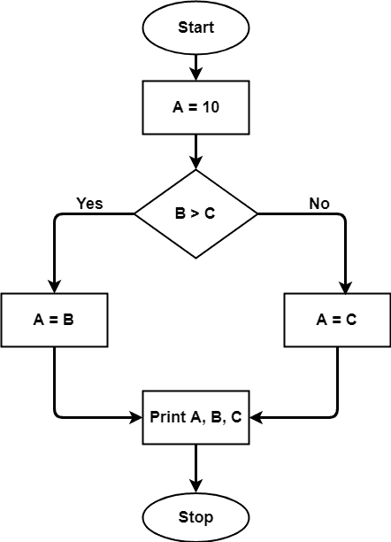

# 圈复杂度

> 原文:[https://www.geeksforgeeks.org/cyclomatic-complexity/](https://www.geeksforgeeks.org/cyclomatic-complexity/)

代码段的圈复杂度是对其中线性独立路径数量的量化度量。它是一种软件度量，用来表示程序的复杂性。它是使用程序的控制流图计算的。图中的节点表示程序的最小命令组，图中的有向边连接两个节点，即第二个命令是否可以紧跟第一个命令。

例如，如果源代码不包含控制流语句，那么它的圈复杂度将是 1，并且源代码中包含一条路径。同样，如果源代码包含一个 **if 条件**，那么圈复杂度将为 2，因为将有两条路径，一条为真，另一条为假。

数学上，对于结构化程序，控制流中的有向图是连接程序两个基本块的边，因为控制可以从第一个传递到第二个。
因此，圈复杂度 M 将被定义为，

> **M =东–北+ 2P**
> 
> 其中，
> E =控制流图中的边数
> N =控制流图中的节点数
> P =连接组件数

计算圈复杂度和测试用例设计应该遵循的步骤是:

*   用代码构造有节点和边的图。
*   独立路径的识别。
*   圈复杂度计算
*   测试用例的设计

让一段代码如下:

```
A = 10
   IF B > C THEN
      A = B
   ELSE
      A = C
   ENDIF
Print A
Print B
Print C
```

**上述代码的控制流程图**



为上述代码计算的圈复杂度将来自控制流图。该图显示了七个形状(节点)、七条线(边)，因此圈复杂度为 7-7+2 = 2。

**圈复杂度的使用:**

*   因此，确定独立的路径执行被证明对开发人员和测试人员非常有帮助。
*   它可以确保每条路径都至少经过一次测试。
*   从而有助于更多地关注未覆盖的路径。
*   代码覆盖率可以提高。
*   可以评估与计划相关的风险。
*   计划中较早使用的这些指标有助于降低风险。

**圈复杂度的优势:**。

*   它可以用作质量度量，给出各种设计的相对复杂性。
*   它能够比霍尔斯特德的指标计算得更快。
*   它用于测量测试的最小努力和最佳集中区域。
*   它能够指导测试过程。
*   很容易应用。

**圈复杂度的缺点:**

*   它衡量的是程序的控制复杂性，而不是数据的数据复杂性。
*   在这种情况下，嵌套条件结构比非嵌套结构更难理解。
*   在简单的比较和决策结构的情况下，它可能会给出一个误导性的数字。

**参考:**T2】https://en.wikipedia.org/wiki/Cyclomatic_complexity