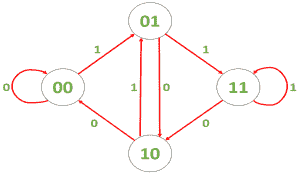

# De Bruijn 序列|集合 1

> 原文:[https://www.geeksforgeeks.org/de-bruijn-sequence-set-1/](https://www.geeksforgeeks.org/de-bruijn-sequence-set-1/)

给定一个整数 *n* 和一组大小为 *k* 的字符 *A* ，找到一个字符串 *S* ，使得长度为 *n* 的 A 上的每个可能的字符串在 *S* 中作为子字符串恰好出现一次。这样的字符串称为 [de Bruijn 序列](https://en.wikipedia.org/wiki/De_Bruijn_sequence)。

**示例:**

> **输入:** n = 3，k = 2，A = {0，1)
> **输出:** 0011101000
> 长度为三的所有可能的字符串(000，001，010，011，100，101，110 和 111)在 A 中作为子字符串恰好出现一次
> 
> **输入:** n = 2，k = 2，A = {0，1)
> 输出: 01100

**方法:**
我们可以通过构造一个具有 k 个 <sup>n-1 个</sup>节点的有向图来解决这个问题，每个节点都有 k 条输出边。每个节点对应一个大小为 n-1 的字符串。每条边对应于 A 中的 k 个字符之一，并将该字符添加到起始字符串中。

例如，如果 n=3，k=2，那么我们构造如下图:



*   节点“01”通过边缘“1”连接到节点“11”，因为将“1”添加到“01”(并删除第一个字符)会得到“11”。
*   我们可以观察到这个图中的每个节点都有相等的入度和出度，这意味着这个图中存在一个[欧拉回路](https://www.geeksforgeeks.org/eulerian-path-and-circuit/)。
*   欧拉回路将对应于一个 de Bruijn 序列，因为一个节点和一个输出边的每个组合代表一个长度为 n 的唯一字符串。
*   de Bruijn 序列将包含起始节点的字符和所有边的字符，其顺序为遍历顺序。
*   因此弦的长度为 k <sup>n</sup> +n-1。我们将使用[海尔霍尔泽算法](https://www.geeksforgeeks.org/hierholzers-algorithm-directed-graph/)来寻找欧拉回路。这种方法的时间复杂度为 0(T4)n(T5)。

下面是上述方法的实现:

## C++

```
// C++ implementation of
// the above approach
#include <bits/stdc++.h>
using namespace std;

unordered_set<string> seen;
vector<int> edges;

// Modified DFS in which no edge
// is traversed twice
void dfs(string node, int& k, string& A)
{
    for (int i = 0; i < k; ++i) {
        string str = node + A[i];
        if (seen.find(str) == seen.end()) {
            seen.insert(str);
            dfs(str.substr(1), k, A);
            edges.push_back(i);
        }
    }
}

// Function to find a de Bruijn sequence
// of order n on k characters
string deBruijn(int n, int k, string A)
{

    // Clearing global variables
    seen.clear();
    edges.clear();

    string startingNode = string(n - 1, A[0]);
    dfs(startingNode, k, A);

    string S;

    // Number of edges
    int l = pow(k, n);
    for (int i = 0; i < l; ++i)
        S += A[edges[i]];
    S += startingNode;

    return S;
}

// Driver code
int main()
{
    int n = 3, k = 2;
    string A = "01";

    cout << deBruijn(n, k, A);

    return 0;
}
```

## Java 语言(一种计算机语言，尤用于创建网站)

```
// Java implementation of
// the above approach
import java.util.*;

class GFG
{

    static Set<String> seen = new HashSet<String>();
    static Vector<Integer> edges = new Vector<Integer>();

    // Modified DFS in which no edge
    // is traversed twice
    static void dfs(String node, int k, String A)
    {
        for (int i = 0; i < k; ++i)
        {
            String str = node + A.charAt(i);
            if (!seen.contains(str))
            {
                seen.add(str);
                dfs(str.substring(1), k, A);
                edges.add(i);
            }
        }
    }

    // Function to find a de Bruijn sequence
    // of order n on k characters
    static String deBruijn(int n, int k, String A)
    {

        // Clearing global variables
        seen.clear();
        edges.clear();

        String startingNode = string(n - 1, A.charAt(0));
        dfs(startingNode, k, A);

        String S = "";

        // Number of edges
        int l = (int) Math.pow(k, n);
        for (int i = 0; i < l; ++i)
            S += A.charAt(edges.get(i));
        S += startingNode;

        return S;
    }

    private static String string(int n, char charAt)
    {
        String str = "";
        for (int i = 0; i < n; i++)
            str += charAt;
        return str;
    }

    // Driver code
    public static void main(String[] args)
    {
        int n = 3, k = 2;
        String A = "01";

        System.out.print(deBruijn(n, k, A));
    }
}

// This code is contributed by 29AjayKumar
```

## 蟒蛇 3

```
# Python3 implementation of
# the above approach
import math

seen = set()
edges = []

# Modified DFS in which no edge
# is traversed twice
def dfs( node, k, A):

    for i in range(k):
        str = node + A[i]
        if (str not in seen):
            seen.add(str)
            dfs(str[1:], k, A)
            edges.append(i)

# Function to find a de Bruijn sequence
# of order n on k characters
def deBruijn(n, k, A):

    # Clearing global variables
    seen.clear()
    edges.clear()

    startingNode = A[0] * (n - 1)
    dfs(startingNode, k, A)

    S = ""

    # Number of edges
    l = int(math.pow(k, n))
    for i in range(l):
        S += A[edges[i]]

    S += startingNode
    return S

# Driver code
n = 3
k = 2
A = "01"

print(deBruijn(n, k, A))

# This code is contributed by shubhamsingh10
```

## C#

```
// C# implementation of
// the above approach
using System;
using System.Collections.Generic;

class GFG
{

    static HashSet<String> seen = new HashSet<String>();
    static List<int> edges = new List<int>();

    // Modified DFS in which no edge
    // is traversed twice
    static void dfs(String node, int k, String A)
    {
        for (int i = 0; i < k; ++i)
        {
            String str = node + A[i];
            if (!seen.Contains(str))
            {
                seen.Add(str);
                dfs(str.Substring(1), k, A);
                edges.Add(i);
            }
        }
    }

    // Function to find a de Bruijn sequence
    // of order n on k characters
    static String deBruijn(int n, int k, String A)
    {

        // Clearing global variables
        seen.Clear();
        edges.Clear();

        String startingNode = strings(n - 1, A[0]);
        dfs(startingNode, k, A);

        String S = "";

        // Number of edges
        int l = (int) Math.Pow(k, n);
        for (int i = 0; i < l; ++i)
            S += A[edges[i]];
        S += startingNode;

        return S;
    }

    private static String strings(int n, char charAt)
    {
        String str = "";
        for (int i = 0; i < n; i++)
            str += charAt;
        return str;
    }

    // Driver code
    public static void Main(String[] args)
    {
        int n = 3, k = 2;
        String A = "01";

        Console.Write(deBruijn(n, k, A));
    }
}

// This code is contributed by 29AjayKumar
```

## java 描述语言

```
<script>

// Javascript implementation of
// the above approach
var seen = new Set();
var edges = [];

// Modified DFS in which no edge
// is traversed twice
function dfs(node, k, A)
{
    for (var i = 0; i < k; ++i)
    {
        var str = node + A[i];
        if (!seen.has(str))
        {
            seen.add(str);
            dfs(str.substring(1), k, A);
            edges.push(i);
        }
    }
}

// Function to find a de Bruijn sequence
// of order n on k characters
function deBruijn(n, k, A)
{

    // Clearing global variables
    seen = new Set();
    edges = [];
    var startingNode = A[0].repeat(n-1);
    dfs(startingNode, k, A);
    var S = "";

    // Number of edges
    var l = Math.pow(k, n);
    for (var i = 0; i < l; ++i)
        S += A[edges[i]];
    S += startingNode;
    return S;
}
function strings(n, charAt)
{
    var str = "";
    for (var i = 0; i < n; i++)
        str += charAt;
    return str;
}

// Driver code
var n = 3, k = 2;
var A = "01";
document.write(deBruijn(n, k, A));

// This code is contributed by rrrtnx.
</script>
```

**Output:** 

```
0011101000
```