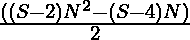

# 十进制数

> 原文:[https://www.geeksforgeeks.org/decakismyriagon-number/](https://www.geeksforgeeks.org/decakismyriagon-number/)

给定一个数字 **N** ，任务是找到**N<sup>th</sup>T5【十进制数。** 

> 十进制数是一类图形数。它有一个 100000 边的多边形，叫做 Decakismyriagon。**第 N 个十进制数**计数 100000 个点，所有其他点用一个公共共享角包围并形成一个图案。十六醇的前几个数字是 **1，100000，299997，599992，…**

**例:**

> **输入:** N = 2
> **输出:** 100000
> **说明:**
> 第二个十六醇数是 100000。
> **输入:** N = 3
> **输出:** 299997

**方法:**第 N 个十进制数由公式
给出

*   S 边多边形的第 n 项= 
*   因此，100000 边多边形的第 **N 项**由:
    给出

> 

以下是上述方法的实现:

C/C++

## C++

```
// C++ program for the above approach
#include <bits/stdc++.h>
using namespace std;

// Function to find the N-th
// Decakismyriagon Number
int DecakismyriagonNum(int N)
{
    return (99998 * N * N - 99996 * N)
        / 2;
}

// Driver Code
int main()
{
    // Given Number N
    int N = 3;

    // Function Call
    cout << DecakismyriagonNum(N);

    return 0;
}
```

## Java 语言(一种计算机语言，尤用于创建网站)

```
// Java program for the above approach
class GFG{

// Function to find the N-th
// Decakismyriagon Number
static int DecakismyriagonNum(int N)
{
    return (99998 * N * N - 99996 * N) / 2;
}

// Driver code
public static void main(String[] args)
{

    // Given Number N
    int N = 3;

    // Function Call
    System.out.println(DecakismyriagonNum(N));
}
}

// This code is contributed by Pratima Pandey
```

## 蟒蛇 3

```
# Python3 program for the above approach

# Function to find the N-th
# Decakismyriagon Number
def DecakismyriagonNum(N):

    return (99998 * N * N - 99996 * N) // 2;

# Driver Code

# Given Number N
N = 3;

# Function Call
print(DecakismyriagonNum(N));

# This code is contributed by Code_Mech
```

## C#

```
// C# program for the above approach
using System;
class GFG{

// Function to find the N-th
// Decakismyriagon Number
static int DecakismyriagonNum(int N)
{
    return (99998 * N * N - 99996 * N) / 2;
}

// Driver code
public static void Main()
{

    // Given Number N
    int N = 3;

    // Function Call
    Console.Write(DecakismyriagonNum(N));
}
}

// This code is contributed by Code_Mech
```

## java 描述语言

```
<script>

// JavaScript program for the above approach

// Function to find the N-th
// Decakismyriagon Number
function DecakismyriagonNum(N) {
    return (99998 * N * N - 99996 * N) / 2;
}

// Driver Code

// Given Number N
let N = 3;

// Function Call
console.log(DecakismyriagonNum(N));

// This code is contributed by blalverma92
</script>
```

**Output:** 

```
299997
```

**时间复杂度:** *O(1)*