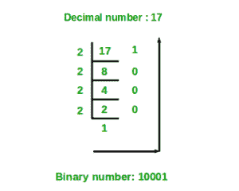

# 使用递归将十进制数转换为二进制数

> 原文:[https://www . geesforgeks . org/十进制-二进制-数字-使用递归/](https://www.geeksforgeeks.org/decimal-binary-number-using-recursion/)

给定一个十进制数作为输入，我们需要编写一个程序，将给定的十进制数转换成等价的二进制数。

**示例:**

```
Input : 7                                                         
Output :111

Input :10
Output :1010
```

我们已经在下面的帖子中讨论了一个迭代解决方案。
[十进制到二进制转换的程序](https://www.geeksforgeeks.org/program-decimal-binary-conversion/)
下面是递归解:

```
findBinary(decimal)
   if (decimal == 0)
      binary = 0
   else
      binary = decimal % 2 + 10 * (findBinary(decimal / 2)
```



一步一步的过程，为了更好的理解算法是如何工作的
让十进制数为 10。
第 1 步- > 10 % 2 相等-太 0 + 10 * ( 10/2 ) % 2
第 2 步- > 5 % 2 相等-太 1 + 10 * ( 5 / 2) % 2
第 3 步- > 2 % 2 相等-太 0 + 10 * ( 2 / 2 ) % 2
第 4 步- > 1 % 2 相等-太 1 + 10 * ( 1 / 2 ) % 2

## C++

```
// C++ program for decimal to binary
// conversion using recursion
#include <bits/stdc++.h>
using namespace std;

// Decimal to binary conversion
// using recursion
int find(int decimal_number)
{
    if (decimal_number == 0)
        return 0;
    else
        return (decimal_number % 2 + 10 *
                find(decimal_number / 2));
}

// Driver code
int main()
{
    int decimal_number = 10;
    cout << find(decimal_number);
    return 0;
}
// This code is contributed by shivanisinghss2110
```

## C

```
// C/C++ program for decimal to binary
// conversion using recursion
#include <stdio.h>

// Decimal to binary conversion
// using recursion
int find(int decimal_number)
{
    if (decimal_number == 0)
        return 0;
    else
        return (decimal_number % 2 + 10 *
                find(decimal_number / 2));
}

// Driver code
int main()
{
    int decimal_number = 10;
    printf("%d", find(decimal_number));
    return 0;
}
```

## Java 语言(一种计算机语言，尤用于创建网站)

```
// Java program for decimal to binary
// conversion using recursion
import java.io.*;

class GFG
{

    // Decimal to binary conversion
    // using recursion
    static int find(int decimal_number)
    {
        if (decimal_number == 0)
            return 0;

        else

        return (decimal_number % 2 + 10 *
                find(decimal_number / 2));
    }

// Driver Code
public static void main(String args[])
{
    int decimal_number = 10;
    System.out.println(find(decimal_number));
}

}

// This code is contributed by Nikita Tiwari
```

## 蟒蛇 3

```
# Python3 code for decimal to binary
# conversion using recursion

# Decimal to binary conversion
# using recursion
def find( decimal_number ):
    if decimal_number == 0:
        return 0
    else:
        return (decimal_number % 2 + 10 *
                find(int(decimal_number // 2)))

# Driver Code
decimal_number = 10
print(find(decimal_number))

# This code is contributed
# by "Sharad_Bhardwaj"
```

## C#

```
// C# program for decimal to binary
// conversion using recursion
using System;

class GFG
{

    // Decimal to binary conversion
    // using recursion
    static int find(int decimal_number)
    {
        if (decimal_number == 0)
            return 0;

        else

        return (decimal_number % 2 + 10 *
                find(decimal_number / 2));
    }

    // Driver Code
    public static void Main()
    {

        int decimal_number = 10;

        Console.WriteLine(find(decimal_number));
    }
}

// This code is contributed by vt_m
```

## 服务器端编程语言（Professional Hypertext Preprocessor 的缩写）

```
<?php
// PHP program for decimal to binary
// conversion using recursion

// Decimal to binary
// conversion using recursion
function find($decimal_number)
{
    if ($decimal_number == 0)
        return 0;
    else
        return ($decimal_number % 2 + 10 *
                find($decimal_number / 2));
}

// Driver Code
$decimal_number = 10;
echo(find($decimal_number));

// This code is contributed by Ajit.
?>
```

## java 描述语言

```
<script>

// Javascript program for decimal to binary
// conversion using recursion

// Decimal to binary conversion
// using recursion
function find(decimal_number)
{
    if (decimal_number == 0)
        return 0;
    else
        return ((decimal_number % 2) + 10 *
                find(parseInt(decimal_number / 2)));
}

// Driver code
var decimal_number = 10;
document.write( find(decimal_number));

// This code is contributed by noob2000.
</script>
```

**Output**

```
1010
```

除非您想将十进制中大于 1023 的数字转换为二进制，否则上述方法可以正常工作。1024 的二进制数是 10000000000(一个 1 和十个 0)，超出了 int 的范围。即使使用 long long unsigned 作为返回类型，最高值也是 1048575，比 int 的范围小得多。一种更简单但有效的方法是将二进制数的单个数字存储在布尔向量中。

## C++

```
// C++ program for decimal to binary
// conversion using recursion
#include<bits/stdc++.h>
using namespace std;

// Function to convert decimal to binary
void deci_to_bin(int x, string & bin_num)
{

    // Base Case
    if (x <= 1)
        bin_num += (char)(x + '0');
    else {

        // Recursion call
        deci_to_bin(x / 2, bin_num);

        // If x is divisible by 2
        if(x%2)
          bin_num += '1';

        // otherwise
        else
          bin_num += '0';
    }
}

// Driver Code
int main()
{
    string bin_num = "";
    deci_to_bin(1048576, bin_num);

    cout<<bin_num;
    return 0;
}
```

## Java 语言(一种计算机语言，尤用于创建网站)

```
// Java program for decimal to binary
// conversion using recursion
public class Main
{
    static String bin_num = "";

    // Function to convert decimal to binary
    static void deci_to_bin(int x)
    {

        // Base Case
        if (x <= 1)
            bin_num += (char)(x + '0');
        else {

            // Recursion call
            deci_to_bin((int)(x / 2));

            // If x is divisible by 2
            if(x%2 != 0)
              bin_num += '1';

            // otherwise
            else
              bin_num += '0';
        }
    }

    public static void main(String[] args) {
        deci_to_bin(1048576);

        System.out.print(bin_num);
    }
}

// This code is contributed by divyesh072019.
```

## 蟒蛇 3

```
# Python3 code for decimal to binary
# conversion using recursion

# Decimal to binary conversion
# using recursion
def getbinary(number):

    # Base case
    if number == 0:
        return 0

     # Recursion call and storing the result
    smallans = getbinary(number // 2)

    return number % 2 + 10 * smallans

# Driver Code
decimal_number = 1048576
print(getbinary(decimal_number))

# This code is contributed
# by "Sarthak Sethi"
```

## C#

```
// C# program for decimal to binary
// conversion using recursion
using System;
class GFG {

    static string bin_num = "";

    // Function to convert decimal to binary
    static void deci_to_bin(int x)
    {

        // Base Case
        if (x <= 1)
            bin_num += (char)(x + '0');
        else {

            // Recursion call
            deci_to_bin((int)(x / 2));

            // If x is divisible by 2
            if(x%2 != 0)
              bin_num += '1';

            // otherwise
            else
              bin_num += '0';
        }
    }

  static void Main() {
    deci_to_bin(1048576);

    Console.Write(bin_num);
  }
}

// This code is contributed by mukesh07.
```

## java 描述语言

```
<script>
    // Javascript program for decimal to binary
    // conversion using recursion

    let bin_num = "";

    // Function to convert decimal to binary
    function deci_to_bin(x)
    {

        // Base Case
        if (x <= 1)
            bin_num += String.fromCharCode(x + '0'.charCodeAt());
        else {

            // Recursion call
            deci_to_bin(parseInt(x / 2, 10));

            // If x is divisible by 2
            if(x%2 != 0)
              bin_num += '1';

            // otherwise
            else
              bin_num += '0';
        }
    }

    deci_to_bin(1048576);

    document.write(bin_num);

    // This code is contributed by divyeshrabadiya07.
</script>
```

**Output**

```
100000000000000000000
```