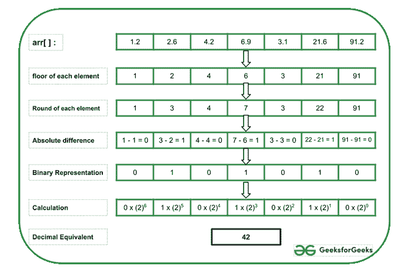

# 数组元素的基底绝对差和舍入值连接成二进制字符串的十进制等价形式

> 原文:[https://www . geeksforgeeks . org/十进制等效二进制字符串数组元素的绝对差值和舍入值串联/](https://www.geeksforgeeks.org/decimal-equivalent-of-concatenation-of-absolute-difference-of-floor-and-rounded-off-values-of-array-elements-as-a-binary-string/)

给定一个由**N**T6】浮点数组成的[数组](https://www.geeksforgeeks.org/array-data-structure/)**arr【】**，任务是打印二进制数组的十进制表示，该二进制数组是根据每个数组元素的[楼层](https://www.geeksforgeeks.org/python-math-floor-function/)和[舍入](https://www.geeksforgeeks.org/how-to-round-numbers-in-python/)值之间的绝对差值构建的。

**示例:**

> **输入:** arr[] = {1.2，2.6，4.2，6.9，3.1，21.6，91.2}
> **输出:** 42
> **解释:**
> 下图为上例举例说明:
> 
> 
> 
> **输入:** arr[] = {5.7，2.8，1.9，5.6，2.2 }
> T3】输出: 30

**方法:**按照以下步骤解决问题:

*   初始化一个变量，将**结果**设为 **0** ，存储形成的结果数。
*   初始化一个变量，将**功率**设为 **0** ，保持每一步增加的 **2** 的功率。
*   [从头到尾遍历给定数组](https://www.geeksforgeeks.org/c-program-to-traverse-an-array/) **arr[]** ，并执行以下步骤:
    *   初始化一个变量，比如**位**，它存储每个数组元素的舍入值和基底值之间的绝对差值。
    *   如果绝对差值为 **1** ，则将该数字乘以 **2** 的适当**幂**，并将其加到变量**结果**中。
    *   将**功率**的值增加 **1** 。
*   完成上述步骤后，将**结果**的值打印为所需的二进制表示的[十进制等效值。](https://www.geeksforgeeks.org/program-binary-decimal-conversion/)

下面是上述方法的实现:

## C++

```
// C++ program for the above approach

#include <bits/stdc++.h>
using namespace std;

// Function to find the decimal equivalent
// of the new binary array constructed
// from absolute decimal of floor and
// the round-off values
int findDecimal(float arr[], int N)
{
    int bit, power = 0, result = 0;

    // Traverse the givenarray from
    // the end
    for (int i = N - 1; i >= 0; i--) {

        // Stores the absolute difference
        // between floor and round-off
        // each array element
        bit = abs(floor(arr[i])
                  - round(arr[i]));

        // If bit / difference is 1, then
        // calculate the bit by proper
        // power of 2 and add it to result
        if (bit)
            result += pow(2, power);

        // Increment the value of power
        power++;
    }

    // Print the result
    cout << result;
}

// Driver Code
int main()
{
    float arr[] = { 1.2, 2.6, 4.2, 6.9,
                    3.1, 21.6, 91.2 };
    int N = sizeof(arr) / sizeof(arr[0]);
    findDecimal(arr, N);

    return 0;
}
```

## Java 语言(一种计算机语言，尤用于创建网站)

```
// Java program for above approach
import java.io.*;
import java.lang.*;
import java.util.*;

class GFG
{

// Function to find the decimal equivalent
// of the new binary array constructed
// from absolute decimal of floor and
// the round-off values
static void findDecimal(double arr[], int N)
{
    int bit, power = 0, result = 0;

    // Traverse the givenarray from
    // the end
    for (int i = N - 1; i >= 0; i--)
    {

        // Stores the absolute difference
        // between floor and round-off
        // each array element
        bit = Math.abs((int)Math.floor(arr[i])
                  - (int)Math.round(arr[i]));

        // If bit / difference is 1, then
        // calculate the bit by proper
        // power of 2 and add it to result
        if (bit != 0)
            result += Math.pow(2, power);

        // Increment the value of power
        power++;
    }

    // Print the result
    System.out.print(result);
}

    // Driver Code
    public static void main(String[] args)
    {
    double arr[] = { 1.2, 2.6, 4.2, 6.9,
                    3.1, 21.6, 91.2 };
    int N = arr.length;
    findDecimal(arr, N);
    }
}

// This code is contributed by souravghosh0416.
```

## 蟒蛇 3

```
# Python program for the above approach

# Function to find the decimal equivalent
# of the new binary array constructed
# from absolute decimal of floor and
# the round-off values
def findDecimal(arr, N):
    power = 0;
    result = 0;

    # Traverse the givenarray from
    # the end
    for i in range(N - 1, -1, -1):

        # Stores the absolute difference
        # between floor and round-off
        # each array element
        bit = abs(int(arr[i]) - round(arr[i]));

        # If bit / difference is 1, then
        # calculate the bit by proper
        # power of 2 and add it to result
        if (bit):
            result += pow(2, power);

        # Increment the value of power
        power += 1;

    # Print the result
    print(result);

# Driver Code

arr = [ 1.2, 2.6, 4.2, 6.9, 3.1, 21.6, 91.2 ];
N = len(arr)
findDecimal(arr, N);

# This code is contributed by gfgking.
```

## C#

```
// C# program for the above approach
using System;

class GFG{

// Function to find the decimal equivalent
// of the new binary array constructed
// from absolute decimal of floor and
// the round-off values
static void findDecimal(double[] arr, int N)
{
    int bit, power = 0, result = 0;

    // Traverse the givenarray from
    // the end
    for(int i = N - 1; i >= 0; i--)
    {

        // Stores the absolute difference
        // between floor and round-off
        // each array element
        bit = Math.Abs((int)Math.Floor(arr[i]) -
                       (int)Math.Round(arr[i]));

        // If bit / difference is 1, then
        // calculate the bit by proper
        // power of 2 and add it to result
        if (bit != 0)
            result += (int)Math.Pow(2, power);

        // Increment the value of power
        power++;
    }

    // Print the result
    Console.WriteLine(result);
}

// Driver Code
public static void Main()
{
    double[] arr = { 1.2, 2.6, 4.2, 6.9,
                     3.1, 21.6, 91.2 };
    int N = arr.Length;

    findDecimal(arr, N);
}
}

// This code is contriobuted by sanjoy_62
```

## java 描述语言

```
<script>

        // JavaScript program for the above approach

        // Function to find the decimal equivalent
        // of the new binary array constructed
        // from absolute decimal of floor and
        // the round-off values
        function findDecimal(arr, N) {
            let bit, power = 0, result = 0;

            // Traverse the givenarray from
            // the end
            for (let i = N - 1; i >= 0; i--) {

                // Stores the absolute difference
                // between floor and round-off
                // each array element
                bit = Math.abs(Math.floor(arr[i])
                    - Math.round(arr[i]));

                // If bit / difference is 1, then
                // calculate the bit by proper
                // power of 2 and add it to result
                if (bit != 0)
                    result += Math.pow(2, power);

                // Increment the value of power
                power++;
            }

            // Print the result
            document.write(result);
        }

        // Driver Code

        let arr = [1.2, 2.6, 4.2, 6.9,
            3.1, 21.6, 91.2];
        let N = arr.length;
        findDecimal(arr, N);

        // This code is contributed by Hritik

</script>
```

**Output:** 

```
42
```

***时间复杂度:**O(N)*
T5**辅助空间:** O(1)