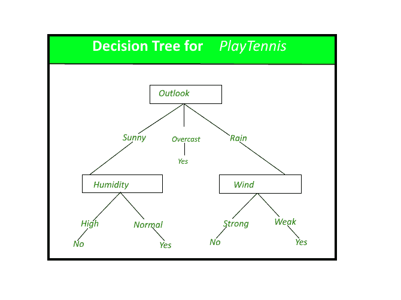

# 决策树

> 原文:[https://www.geeksforgeeks.org/decision-tree/](https://www.geeksforgeeks.org/decision-tree/)

**决策树:**决策树是目前最强大、最流行的分类预测工具。决策树是类似于树结构的流程图，其中每个内部节点表示一个属性测试，每个分支表示测试的结果，每个叶节点(终端节点)保存一个类标签。

*概念 PlayTennis 的决策树。*

**决策树的构建:**
通过基于属性值测试将源集拆分为子集，可以*学习一棵树。这个过程以一种叫做*递归划分*的递归方式在每个派生子集上重复。当节点上的子集都具有相同的目标变量值时，或者当拆分不再给预测增加值时，递归就完成了。决策树分类器的构建不需要任何领域知识或参数设置，因此适用于探索性知识发现。决策树可以处理高维数据。一般来说，决策树分类器具有良好的准确性。决策树归纳是学习分类知识的典型归纳方法。*

***决策树表示法:**
决策树通过从根到某个叶节点对实例进行分类，从而提供实例的分类。实例的分类是从树的根节点开始，测试该节点指定的属性，然后向下移动对应于该属性值的树分支，如上图所示。然后，对以新节点为根的子树重复这个过程。*

*上图中的决策树根据是否适合打网球对特定的早晨进行分类，并返回与特定叶子相关联的分类。(在这种情况下是或否)。
例如，实例* 

> *(展望=雨，温度=热，湿度=高，风=强)*

 *将沿着决策树最左边的分支排序，因此将被分类为否定实例。*

*换句话说，我们可以说决策树表示对实例属性值的约束的合取析取。*

> *(展望=晴^湿度=正常)v(展望=阴)v(展望=雨^风=弱)*

***决策树方法的优缺点**
决策树方法的优点是:* 

*   *决策树能够生成可理解的规则。*
*   *决策树在不需要太多计算的情况下执行分类。*
*   *决策树能够处理连续变量和分类变量。*
*   *决策树提供了对预测或分类最重要的字段的清晰指示。*

*决策树方法的弱点:* 

*   *决策树不太适合以预测连续属性的值为目标的评估任务。*
*   *决策树在分类问题中容易出错，分类问题的类别多，训练样本相对较少。*
*   *决策树的训练在计算上非常昂贵。生成决策树的过程计算量很大。在每个节点上，在找到最佳分割之前，必须对每个候选分割字段进行排序。在一些算法中，使用字段的组合，并且必须搜索最佳组合权重。修剪算法也可能是昂贵的，因为必须形成和比较许多候选子树。*

***参考文献:**
机器学习，汤姆·米切尔，麦格劳·希尔，1997。*

*在下一篇文章中，我们将讨论由昆兰给出的构造决策树的 ID3 算法。*

*本文由**萨洛尼·古普塔**供稿。如果你喜欢 GeeksforGeeks 并想投稿，你也可以使用[write.geeksforgeeks.org](https://write.geeksforgeeks.org)写一篇文章或者把你的文章邮寄到 review-team@geeksforgeeks.org。看到你的文章出现在极客博客主页上，帮助其他极客。*

*如果你发现任何不正确的地方，或者你想分享更多关于上面讨论的话题的信息，请写评论。*