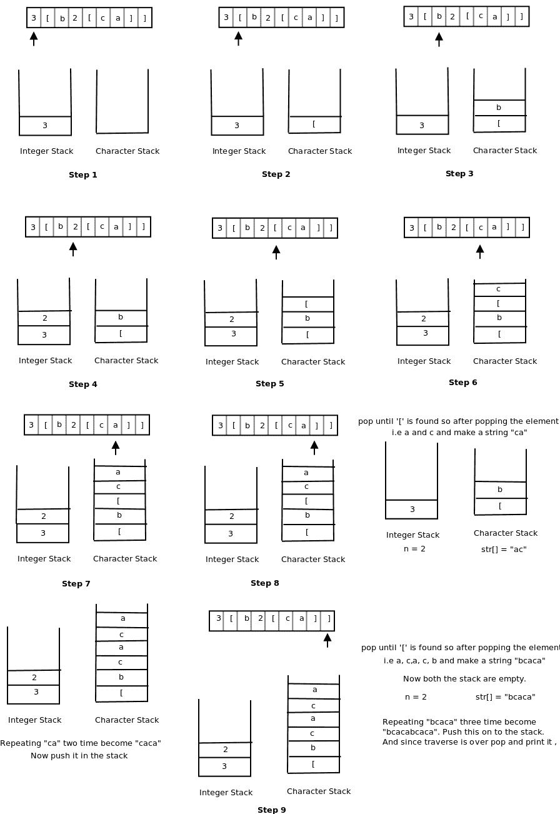

# 解码递归编码为计数后跟子串

的字符串

> 原文:[https://www . geesforgeks . org/decode-string-递归编码-count-后跟-substring/](https://www.geeksforgeeks.org/decode-string-recursively-encoded-count-followed-substring/)

给出一个编码字符串，任务是解码它。字符串编码的模式如下。

```
<count>[sub_str] ==> The substring 'sub_str' 
                      appears count times.
```

**示例:**

```
Input : str[] = "1[b]"
Output : b

Input : str[] = "2[ab]"
Output : abab

Input : str[] = "2[a2[b]]"
Output : abbabb

Input : str[] = "3[b2[ca]]"
Output : bcacabcacabcaca
```

## 方法 1(使用两个堆栈)

这个想法是使用两个堆栈，一个用于整数，另一个用于字符。
现在，遍历字符串，

1.  每当我们遇到任何数字时，将其推入整数堆栈，如果遇到任何字母(a 到 z)或开括号('[')，将其推入字符堆栈。
2.  每当遇到任何右括号(“]”)时，从字符堆栈中弹出字符，直到在字符堆栈中找不到左括号(“[”)。此外，从整数堆栈中弹出顶部元素，比如 n。现在让一个字符串重复弹出的字符 n 次。现在，将字符串的所有字符推入堆栈。


下面是该方法的实现:

## C++

```
// C++ program to decode a string recursively
// encoded as count followed substring
#include<bits/stdc++.h>
using namespace std;

// Returns decoded string for 'str'
string decode(string str)
{
    stack<int> integerstack;
    stack<char> stringstack;
    string temp = "", result = "";

    // Traversing the string
    for (int i = 0; i < str.length(); i++)
    {
        int count = 0;

        // If number, convert it into number
        // and push it into integerstack.
        if (str[i] >= '0' && str[i] <='9')
        {
            while (str[i] >= '0' && str[i] <= '9')
            {
                count = count * 10 + str[i] - '0';
                i++;
            }

            i--;
            integerstack.push(count);
        }

        // If closing bracket ']', pop element until
        // '[' opening bracket is not found in the
        // character stack.
        else if (str[i] == ']')
        {
            temp = "";
            count = 0;

            if (! integerstack.empty())
            {
                count = integerstack.top();
                integerstack.pop();
            }

            while (! stringstack.empty() && stringstack.top()!='[' )
            {
                temp = stringstack.top() + temp;
                stringstack.pop();
            }

            if (! stringstack.empty() && stringstack.top() == '[')
                stringstack.pop();

            // Repeating the popped string 'temo' count
            // number of times.
            for (int j = 0; j < count; j++)
                result = result + temp;

            // Push it in the character stack.
            for (int j = 0; j < result.length(); j++)
                stringstack.push(result[j]);

            result = "";
        }

        // If '[' opening bracket, push it into character stack.
        else if (str[i] == '[')
        {
            if (str[i-1] >= '0' && str[i-1] <= '9')
                stringstack.push(str[i]);

            else
            {
                stringstack.push(str[i]);
                integerstack.push(1);
            }
        }

        else
            stringstack.push(str[i]);
    }

    // Pop all the element, make a string and return.
    while (! stringstack.empty())
    {
        result = stringstack.top() + result;
        stringstack.pop();
    }

    return result;
}

// Driven Program
int main()
{
    string str = "3[b2[ca]]";
    cout << decode(str) << endl;
    return 0;
}
```

## Java 语言(一种计算机语言，尤用于创建网站)

```
// Java program to decode a string recursively
// encoded as count followed substring

import java.util.Stack;

class Test
{
    // Returns decoded string for 'str'
    static String decode(String str)
    {
        Stack<Integer> integerstack = new Stack<>();
        Stack<Character> stringstack = new Stack<>();
        String temp = "", result = "";

        // Traversing the string
        for (int i = 0; i < str.length(); i++)
        {
            int count = 0;

            // If number, convert it into number
            // and push it into integerstack.
            if (Character.isDigit(str.charAt(i)))
            {
                while (Character.isDigit(str.charAt(i)))
                {
                    count = count * 10 + str.charAt(i) - '0';
                    i++;
                }

                i--;
                integerstack.push(count);
            }

            // If closing bracket ']', pop element until
            // '[' opening bracket is not found in the
            // character stack.
            else if (str.charAt(i) == ']')
            {
                temp = "";
                count = 0;

                if (!integerstack.isEmpty())
                {
                    count = integerstack.peek();
                    integerstack.pop();
                }

                while (!stringstack.isEmpty() && stringstack.peek()!='[' )
                {
                    temp = stringstack.peek() + temp;
                    stringstack.pop();
                }

                if (!stringstack.empty() && stringstack.peek() == '[')
                    stringstack.pop();

                // Repeating the popped string 'temo' count
                // number of times.
                for (int j = 0; j < count; j++)
                    result = result + temp;

                // Push it in the character stack.
                for (int j = 0; j < result.length(); j++)
                    stringstack.push(result.charAt(j));

                result = "";
            }

            // If '[' opening bracket, push it into character stack.
            else if (str.charAt(i) == '[')
            {
                if (Character.isDigit(str.charAt(i-1)))
                    stringstack.push(str.charAt(i));

                else
                {
                    stringstack.push(str.charAt(i));
                    integerstack.push(1);
                }
            }

            else
                stringstack.push(str.charAt(i));
        }

        // Pop all the element, make a string and return.
        while (!stringstack.isEmpty())
        {
            result = stringstack.peek() + result;
            stringstack.pop();
        }

        return result;
    }

    // Driver method
    public static void main(String args[])
    {
        String str = "3[b2[ca]]";
        System.out.println(decode(str));
    }
}
```

## 蟒蛇 3

```
# Python program to decode a string recursively
# encoded as count followed substring

# Returns decoded string for 'str'
def decode(Str):
    integerstack = []
    stringstack = []
    temp = ""
    result = ""
    i = 0
    # Traversing the string
    while i < len(Str):
        count = 0

        # If number, convert it into number
        # and push it into integerstack.
        if (Str[i] >= '0' and Str[i] <='9'):
            while (Str[i] >= '0' and Str[i] <= '9'):
                count = count * 10 + ord(Str[i]) - ord('0')
                i += 1
            i -= 1
            integerstack.append(count)

        # If closing bracket ']', pop element until
        # '[' opening bracket is not found in the
        # character stack.
        elif (Str[i] == ']'):
            temp = ""
            count = 0

            if (len(integerstack) != 0):
                count = integerstack[-1]
                integerstack.pop()

            while (len(stringstack) != 0 and stringstack[-1] !='[' ):
                temp = stringstack[-1] + temp
                stringstack.pop()

            if (len(stringstack) != 0 and stringstack[-1] == '['):
                stringstack.pop()

            # Repeating the popped string 'temo' count
            # number of times.
            for j in range(count):
                result = result + temp

            # Push it in the character stack.
            for j in range(len(result)):
                stringstack.append(result[j])

            result = ""

        # If '[' opening bracket, push it into character stack.
        elif (Str[i] == '['):
            if (Str[i-1] >= '0' and Str[i-1] <= '9'):
                stringstack.append(Str[i])

            else:
                stringstack.append(Str[i])
                integerstack.append(1)

        else:
            stringstack.append(Str[i])

        i += 1

    # Pop all the element, make a string and return.
    while len(stringstack) != 0:
        result = stringstack[-1] + result
        stringstack.pop()

    return result

# Driven code
if __name__ == '__main__':
    Str = "3[b2[ca]]"
    print(decode(Str))

# This code is contributed by PranchalK.
```

## C#

```
// C# program to decode a string recursively
// encoded as count followed substring
using System;
using System.Collections.Generic;

class GFG
{
// Returns decoded string for 'str'
public static string decode(string str)
{
    Stack<int> integerstack = new Stack<int>();
    Stack<char> stringstack = new Stack<char>();
    string temp = "", result = "";

    // Traversing the string
    for (int i = 0; i < str.Length; i++)
    {
        int count = 0;

        // If number, convert it into number
        // and push it into integerstack.
        if (char.IsDigit(str[i]))
        {
            while (char.IsDigit(str[i]))
            {
                count = count * 10 + str[i] - '0';
                i++;
            }

            i--;
            integerstack.Push(count);
        }

        // If closing bracket ']', pop element
        // until '[' opening bracket is not found
        // in the character stack.
        else if (str[i] == ']')
        {
            temp = "";
            count = 0;

            if (integerstack.Count > 0)
            {
                count = integerstack.Peek();
                integerstack.Pop();
            }

            while (stringstack.Count > 0 &&
                   stringstack.Peek() != '[')
            {
                temp = stringstack.Peek() + temp;
                stringstack.Pop();
            }

            if (stringstack.Count > 0 &&
                stringstack.Peek() == '[')
            {
                stringstack.Pop();
            }

            // Repeating the popped string 'temo'
            // count number of times.
            for (int j = 0; j < count; j++)
            {
                result = result + temp;
            }

            // Push it in the character stack.
            for (int j = 0; j < result.Length; j++)
            {
                stringstack.Push(result[j]);
            }

            result = "";
        }

        // If '[' opening bracket, push it
        // into character stack.
        else if (str[i] == '[')
        {
            if (char.IsDigit(str[i - 1]))
            {
                stringstack.Push(str[i]);
            }

            else
            {
                stringstack.Push(str[i]);
                integerstack.Push(1);
            }
        }

        else
        {
            stringstack.Push(str[i]);
        }
    }

    // Pop all the element, make a
    // string and return.
    while (stringstack.Count > 0)
    {
        result = stringstack.Peek() + result;
        stringstack.Pop();
    }

    return result;
}

// Driver Code
public static void Main(string[] args)
{
    string str = "3[b2[ca]]";
    Console.WriteLine(decode(str));
}
}

// This code is contributed by Shrikant13
```

## java 描述语言

```
<script>
    // Javascript program to decode a string recursively
    // encoded as count followed substring

    // Returns decoded string for 'str'
    function decode(str)
    {
        let integerstack = [];
        let stringstack = [];
        let temp = "", result = "";

        // Traversing the string
        for (let i = 0; i < str.length; i++)
        {
            let count = 0;

            // If number, convert it into number
            // and push it into integerstack.
            if (str[i] >= '0' && str[i] <='9')
            {
                while (str[i] >= '0' && str[i] <='9')
                {
                    count = count * 10 + str[i] - '0';
                    i++;
                }

                i--;
                integerstack.push(count);
            }

            // If closing bracket ']', pop element
            // until '[' opening bracket is not found
            // in the character stack.
            else if (str[i] == ']')
            {
                temp = "";
                count = 0;

                if (integerstack.length > 0)
                {
                    count = integerstack[integerstack.length - 1];
                    integerstack.pop();
                }

                while (stringstack.length > 0 &&
                       stringstack[stringstack.length - 1] != '[')
                {
                    temp = stringstack[stringstack.length - 1] + temp;
                    stringstack.pop();
                }

                if (stringstack.length > 0 &&
                    stringstack[stringstack.length - 1] == '[')
                {
                    stringstack.pop();
                }

                // Repeating the popped string 'temo'
                // count number of times.
                for (let j = 0; j < count; j++)
                {
                    result = result + temp;
                }

                // Push it in the character stack.
                for (let j = 0; j < result.length; j++)
                {
                    stringstack.push(result[j]);
                }

                result = "";
            }

            // If '[' opening bracket, push it
            // into character stack.
            else if (str[i] == '[')
            {
                if (str[i - 1] >= '0' && str[i - 1] <='9')
                {
                    stringstack.push(str[i]);
                }

                else
                {
                    stringstack.push(str[i]);
                    integerstack.push(1);
                }
            }

            else
            {
                stringstack.push(str[i]);
            }
        }

        // Pop all the element, make a
        // string and return.
        while (stringstack.length > 0)
        {
            result = stringstack[stringstack.length - 1] + result;
            stringstack.pop();
        }

        return result;
    }

    let str = "3[b2[ca]]";
    document.write(decode(str));

// This code is contributed by divyeshrabadiy07.
</script>
```

**Output**

```
bcacabcacabcaca
```

上述代码的图解为“3[B2[ca]]”>



## 方法 2(使用 1 个堆栈)

**算法:**

遍历字符串的字符

如果字符不是“]”，将其添加到堆栈中

如果字符是']':

当栈顶不包含“[”时，从栈中弹出字符，并将其存储在字符串 temp 中(确保字符串不是以相反的顺序)

从堆栈中弹出“[”

当堆栈顶部包含一个数字时，将其弹出并存储在 dig 中

多次连接字符串 temp，并将其存储在字符串重复中

将重复字符串添加到堆栈中

弹出堆栈中的所有字符(也要确保字符串不是以相反的顺序)

下面是该方法的实现:

## C++

```
#include <iostream>
#include <stack>
using namespace std;

string decodeString(string s)
{
    stack<char> st;
    for (int i = 0; i < s.length(); i++) {
        // When ']' is encountered, we need to start
        // decoding
        if (s[i] == ']') {
            string temp;
            while (!st.empty() && st.top() != '[') {
                // st.top() + temp makes sure that the
                // string won't be in reverse order eg, if
                // the stack contains 12[abc temp = c + "" =>
                // temp = b + "c" => temp = a + "bc"
                temp = st.top() + temp;
                st.pop();
            }
            // remove the '[' from the stack
            st.pop();
            string num;
            // remove the digits from the stack
            while (!st.empty() && isdigit(st.top())) {
                num = st.top() + num;
                st.pop();
            }
            int number = stoi(num);
            string repeat;
            for (int j = 0; j < number; j++)
                repeat += temp;
            for (char c : repeat)
                st.push(c);
        }
        // if s[i] is not ']', simply push s[i] to the stack
        else
            st.push(s[i]);
    }
    string res;
    while (!st.empty()) {
        res = st.top() + res;
        st.pop();
    }
    return res;
}
// driver code
int main()
{
    string str = "3[b2[ca]]";
    cout << decodeString(str);
    return 0;
}
```

## 蟒蛇 3

```
def decodeString(s):
    st = []
    for i in range(len(s)):

        # When ']' is encountered, we need to start decoding
        if s[i] == ']':
            temp = ""
            while len(st) > 0 and st[-1] != '[':

                # st.top() + temp makes sure that the
                # string won't be in reverse order eg, if
                # the stack contains 12[abc temp = c + "" =>
                # temp = b + "c" => temp = a + "bc"
                temp = st[-1] + temp
                st.pop()

            # remove the '[' from the stack
            st.pop()
            num = ""

            # remove the digits from the stack
            while len(st) > 0 and ord(st[-1]) >= 48 and ord(st[-1]) <= 57:
                num = st[-1] + num
                st.pop()
            number = int(num)
            repeat = ""
            for j in range(number):
                repeat += temp
            for c in range(len(repeat)):
                st.append(repeat)

        # if s[i] is not ']', simply push s[i] to the stack
        else:
            st.append(s[i])
    res = "bcacabcacabcaca"
    while len(st) < 0:
        res =  st[-1] + res
        st.pop()
    return res

Str = "3[b2[ca]]"
print(decodeString(Str))

# This code is contributed by mukesh07.
```

## C#

```
using System;
using System.Collections.Generic;

class GFG{

static string decodeString(string s)
{
    List<char> st = new List<char>();

    for(int i = 0; i < s.Length; i++)
    {

        // When ']' is encountered, we need to
        // start decoding
        if (s[i] == ']')
        {
            string temp = "";
            while (st.Count > 0 && st[st.Count - 1] != '[')
            {

                // st.top() + temp makes sure that the
                // string won't be in reverse order eg, if
                // the stack contains 12[abc temp = c + "" =>
                // temp = b + "c" => temp = a + "bc"
                temp = st[st.Count - 1] + temp;
                st.RemoveAt(st.Count - 1);
            }

            // Remove the '[' from the stack
            st.RemoveAt(st.Count - 1);
            string num = "";

            // Remove the digits from the stack
            while (st.Count > 0 &&
                   st[st.Count - 1] >= 48 &&
                   st[st.Count - 1] <= 57)
            {
                num = st[st.Count - 1] + num;
                st.RemoveAt(st.Count - 1);
            }

            int number = int.Parse(num);
            string repeat = "";
            for(int j = 0; j < number; j++)
                repeat += temp;

            foreach(char c in repeat)
                st.Add(c);
        }

        // If s[i] is not ']', simply push
        // s[i] to the stack
        else
            st.Add(s[i]);
    }
    string res = "";
    while (st.Count > 0)
    {
        res = st[st.Count - 1] + res;
        st.RemoveAt(st.Count - 1);
    }
    return res;
}

// Driver code
static void Main()
{
    string str = "3[b2[ca]]";
    Console.Write(decodeString(str));
}
}

// This code is contributed by decode2207
```

## java 描述语言

```
<script>

    function decodeString(s)
    {
        let st = [];
        for (let i = 0; i < s.length; i++)
        {

            // When ']' is encountered, we need to start
            // decoding
            if (s[i] == ']') {
                let temp = "";
                while (st.length > 0 && st[st.length - 1] != '[')
                {

                    // st.top() + temp makes sure that the
                    // string won't be in reverse order eg, if
                    // the stack contains 12[abc temp = c + "" =>
                    // temp = b + "c" => temp = a + "bc"
                    temp = st[st.length - 1] + temp;
                    st.pop();
                }

                // remove the '[' from the stack
                st.pop();
                let num = "";

                // remove the digits from the stack
                while (st.length > 0 && st[st.length - 1].charCodeAt() >= 48 && st[st.length - 1].charCodeAt() <= 57) {
                    num = st[st.length - 1] + num;
                    st.pop();
                }
                let number = parseInt(num);
                let repeat = "";
                for (let j = 0; j < number; j++)
                    repeat += temp;
                for (let c = 0; c < repeat.length; c++)
                    st.push(repeat);
            }

            // if s[i] is not ']', simply push s[i] to the stack
            else
                st.push(s[i]);
        }
        let res = "";
        while (st.length > 0) {
            res =  st[st.length - 1] + res;
            st.pop();
        }
        return res;
    }

    let str = "3[b2[ca]]";
    document.write(decodeString(str));

// This code is contributed by divyesh072019.
</script>
```

**Output**

```
bcacabcacabcaca
```

本文由 **Anuj Chauhan** 和 **Gobinath A L** 投稿。如果你喜欢 GeeksforGeeks 并想投稿，你也可以使用[write.geeksforgeeks.org](http://www.write.geeksforgeeks.org)写一篇文章或者把你的文章邮寄到 review-team@geeksforgeeks.org。看到你的文章出现在极客博客主页上，帮助其他极客。
如果发现有不正确的地方，或者想分享更多关于上述话题的信息，请写评论。