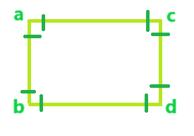

# 循环图的度数

> 原文:[https://www.geeksforgeeks.org/degree-of-a-cycle-graph/](https://www.geeksforgeeks.org/degree-of-a-cycle-graph/)

给定循环图中的顶点数。任务是找到循环图的度和边数。

**度:**任意顶点的度定义为入射到其上的边数。

**循环图:**在图论中，由单个循环组成的图称为**循环图或循环图**。有 n 个顶点的循环图叫做 **Cn** 。

**循环图的性质:-**

*   这是一个连通图。
*   循环图或循环图是由单个循环组成的图。
*   在循环图中，顶点的数量等于边的数量。
*   循环图是 2 边可着色或 2 顶点可着色的，当且仅当它有偶数个顶点。
*   循环图是 3 边可着色的或 3 边可着色的，当且仅当它有奇数个顶点。
*   在循环图中，图中每个顶点的度数是 2。
*   循环图的度数是顶点数的 2 倍。因为每条边都要计算两次。

**示例:**

```
Input: Number of vertices = 4
Output: Degree is 8
        Edges are 4
Explanation: 
The total edges are 4 
and the Degree of the Graph is 8
as 2 edge incident on each of 
the vertices i.e on a, b, c, and d. 
```



```
Input: number of vertices = 5
Output: Degree is 10
        Edges are 5
```

下面是上述问题的实现:

**程序 1:** 对于 4 顶点循环图

## C++

```
// C++ implementation of above program.

#include <bits/stdc++.h>
using namespace std;

// function that calculates the
// number of Edge in a cycle graph.
int getnumberOfEdges(int numberOfVertices)
{
    int numberOfEdges = 0;

    // The numberOfEdges of the cycle graph
    // will be same as the numberOfVertices
    numberOfEdges = numberOfVertices;

    // return the numberOfEdges
    return numberOfEdges;
}

// function that calculates the degree
int getDegree(int numberOfVertices)
{
    int degree;

    // The degree of the cycle graph
    // will be twice the numberOfVertices
    degree = 2 * numberOfVertices;

    // return the degree
    return degree;
}

// Driver code
int main()
{

    // Get the number of vertices
    int numberOfVertices = 4;

    // Find the numberOfEdges and degree
    // from the numberOfVertices
    // and print the result
    cout << "For numberOfVertices = "
         << numberOfVertices
         << "\nDegree = "
         << getDegree(numberOfVertices)
         << "\nNumber of Edges = "
         << getnumberOfEdges(numberOfVertices);

    return 0;
}
```

## Java 语言(一种计算机语言，尤用于创建网站)

```
// Java implementation of above program.
import java.io.*;

class GFG {

    // function that calculates the
    // number of Edge in a cycle graph.
    static int getnumberOfEdges(int numberOfVertices)
    {
        int numberOfEdges = 0;

        // The numberOfEdges of the cycle graph
        // will be same as the numberOfVertices
        numberOfEdges = numberOfVertices;

        // return the numberOfEdges
        return numberOfEdges;
    }

    // function that calculates the degree
    static int getDegree(int numberOfVertices)
    {
        int degree;

        // The degree of the cycle graph
        // will be twice the numberOfVertices
        degree = 2 * numberOfVertices;

        // return the degree
        return degree;
    }

    // Driver code
    public static void main(String[] args)
    {
        // Get the number of vertices
        int numberOfVertices = 4;

        // Find the numberOfEdges and degree
        // from the numberOfVertices
        // and print the result
        System.out.print("For numberOfVertices = "
                         + numberOfVertices
                         + "\nDegree = "
                         + getDegree(numberOfVertices)
                         + "\nNumber of Edges = "
                         + getnumberOfEdges(numberOfVertices));
    }
}

// This code is contributed by anuj_67..
```

## 蟒蛇 3

```
# Python3 implementation of above program.

# function that calculates the
# number of Edge in a cycle graph.
def getnumberOfEdges(numberOfVertices) :

    # The numberOfEdges of the cycle graph
    # will be same as the numberOfVertices
    numberOfEdges = numberOfVertices

    # return the numberOfEdges
    return numberOfEdges

# function that calculates the degree
def getDegree(numberOfVertices) :

    # The degree of the cycle graph
    # will be twice the numberOfVertices
    degree = 2 * numberOfVertices

    # return the degree
    return degree

# Driver code    
if __name__ == "__main__" :

    # Get the number of vertices
    numberOfVertices = 4

    # Find the numberOfEdges and degree
    # from the numberOfVertices
    # and print the result
    print("For numberOfVertices =", numberOfVertices,
          "\nDegree =", getDegree(numberOfVertices),
          "\nNumber of Edges =", getnumberOfEdges(numberOfVertices))

# This code is contributed by ANKITRAI1
```

## C#

```
// C# implementation of above program.
using System;

class GFG {

    // function that calculates the
    // number of Edge in a cycle graph.
    static int getnumberOfEdges(int numberOfVertices)
    {
        int numberOfEdges = 0;

        // The numberOfEdges of the cycle graph
        // will be same as the numberOfVertices
        numberOfEdges = numberOfVertices;

        // return the numberOfEdges
        return numberOfEdges;
    }

    // function that calculates the degree
    static int getDegree(int numberOfVertices)
    {
        int degree;

        // The degree of the cycle graph
        // will be twice the numberOfVertices
        degree = 2 * numberOfVertices;

        // return the degree
        return degree;
    }

    // Driver code
    public static void Main()
    {
        // Get the number of vertices
        int numberOfVertices = 4;

        // Find the numberOfEdges and degree
        // from the numberOfVertices
        // and print the result
        Console.WriteLine("For numberOfVertices = "
                          + numberOfVertices
                          + "\nDegree = "
                          + getDegree(numberOfVertices)
                          + "\nNumber of Edges = "
                          + getnumberOfEdges(numberOfVertices));
    }
}

// This code is contributed by anuj_67..
```

## 服务器端编程语言（Professional Hypertext Preprocessor 的缩写）

```
<?php
// PHP implementation of above program

// function that calculates the
// number of Edge in a cycle graph.
function getnumberOfEdges($numberOfVertices)
{
    $numberOfEdges = 0;

    // The numberOfEdges of the cycle graph
    // will be same as the numberOfVertices
    $numberOfEdges = $numberOfVertices;

    // return the numberOfEdges
    return $numberOfEdges;
}

// function that calculates the degree
function getDegree($numberOfVertices)
{

    // The degree of the cycle graph
    // will be twice the numberOfVertices
    $degree = 2 * $numberOfVertices;

    // return the degree
    return $degree;
}

// Driver code

// Get the number of vertices
$numberOfVertices = 4;

// Find the numberOfEdges and degree
// from the numberOfVertices
// and print the result
echo ("For numberOfVertices = ");
echo ($numberOfVertices);
echo ("\nDegree = ");
echo getDegree($numberOfVertices);
echo("\nNumber of Edges = ");
echo getnumberOfEdges($numberOfVertices);

// This code is contributed by Shivi_Aggarwal
?>
```

## java 描述语言

```
<script>

// Javascript implementation of above program.

// function that calculates the
// number of Edge in a cycle graph.
function getnumberOfEdges(numberOfVertices)
{
    var numberOfEdges = 0;

    // The numberOfEdges of the cycle graph
    // will be same as the numberOfVertices
    numberOfEdges = numberOfVertices;

    // return the numberOfEdges
    return numberOfEdges;
}

// function that calculates the degree
function getDegree(numberOfVertices)
{
    var degree;

    // The degree of the cycle graph
    // will be twice the numberOfVertices
    degree = 2 * numberOfVertices;

    // return the degree
    return degree;
}

// Driver code

// Get the number of vertices
var numberOfVertices = 4;

// Find the numberOfEdges and degree
// from the numberOfVertices
// and print the result
document.write("For numberOfVertices = " +
               numberOfVertices + "<br>Degree = " +
               getDegree(numberOfVertices) +
               "<br>Number of Edges = " +
               getnumberOfEdges(numberOfVertices));

// This code is contributed by itsok

</script>
```

**Output:** 

```
For numberOfVertices = 4
Degree = 8
Number of Edges = 4
```

**程序 2:** 为 6 顶点循环图

## C++

```
// C++ implementation of above program.

#include <bits/stdc++.h>
using namespace std;

// function that calculates the
// number of Edge in a cycle graph.
int getnumberOfEdges(int numberOfVertices)
{
    int numberOfEdges = 0;

    // The numberOfEdges of the cycle graph
    // will be same as the numberOfVertices
    numberOfEdges = numberOfVertices;

    // return the numberOfEdges
    return numberOfEdges;
}

// function that calculates the degree
int getDegree(int numberOfVertices)
{
    int degree;

    // The degree of the cycle graph
    // will be twice the numberOfVertices
    degree = 2 * numberOfVertices;

    // return the degree
    return degree;
}

// Driver code
int main()
{

    // Get the number of vertices
    int numberOfVertices = 6;

    // Find the numberOfEdges and degree
    // from the numberOfVertices
    // and print the result
    cout << "For numberOfVertices = "
         << numberOfVertices
         << "\nDegree = "
         << getDegree(numberOfVertices)
         << "\nNumber of Edges = "
         << getnumberOfEdges(numberOfVertices);

    return 0;
}
```

## Java 语言(一种计算机语言，尤用于创建网站)

```
// Java implementation of above program.
class GfG {

    // function that calculates the
    // number of Edge in a cycle graph.
    static int getnumberOfEdges(int numberOfVertices)
    {
        int numberOfEdges = 0;

        // The numberOfEdges of the cycle graph
        // will be same as the numberOfVertices
        numberOfEdges = numberOfVertices;

        // return the numberOfEdges
        return numberOfEdges;
    }

    // function that calculates the degree
    static int getDegree(int numberOfVertices)
    {
        int degree;

        // The degree of the cycle graph
        // will be twice the numberOfVertices
        degree = 2 * numberOfVertices;

        // return the degree
        return degree;
    }

    // Driver code
    public static void main(String[] args)
    {

        // Get the number of vertices
        int numberOfVertices = 6;

        // Find the numberOfEdges and degree
        // from the numberOfVertices
        // and print the result
        System.out.println("For numberOfVertices = "
                           + numberOfVertices + "\nDegree = "
                           + getDegree(numberOfVertices)
                           + "\nNumber of Edges = "
                           + getnumberOfEdges(numberOfVertices));
    }
}

// This code contributed by Rajput-Ji
```

## 蟒蛇 3

```
# Python 3 implementation of above program

# function that calculates the
# number of Edge in a cycle graph.
def getnumberOfEdges(numberOfVertices):

    numberOfEdges = 0

    # The numberOfEdges of the cycle graph
    # will be same as the numberOfVertices
    numberOfEdges = numberOfVertices

    # return the numberOfEdges
    return numberOfEdges

# function that calculates the degree
def getDegree(numberOfVertices):

    # The degree of the cycle graph
    # will be twice the numberOfVertices
    degree = 2 * numberOfVertices

    # return the degree
    return degree

# Driver code
if __name__ == "__main__":

    # Get the number of vertices
    numberOfVertices = 6

    # Find the numberOfEdges and degree
    # from the numberOfVertices
    # and print the result
    print("For numberOfVertices = ",
           numberOfVertices, "\nDegree = ",
               getDegree(numberOfVertices),
          "\nNumber of Edges = ",
        getnumberOfEdges(numberOfVertices))

# This code is contributed by ChitraNayal
```

## C#

```
// C# implementation of above program.
class GfG {

    // function that calculates the
    // number of Edge in a cycle graph.
    static int getnumberOfEdges(int numberOfVertices)
    {
        int numberOfEdges = 0;

        // The numberOfEdges of the cycle graph
        // will be same as the numberOfVertices
        numberOfEdges = numberOfVertices;

        // return the numberOfEdges
        return numberOfEdges;
    }

    // function that calculates the degree
    static int getDegree(int numberOfVertices)
    {
        int degree;

        // The degree of the cycle graph
        // will be twice the numberOfVertices
        degree = 2 * numberOfVertices;

        // return the degree
        return degree;
    }

    // Driver code
    static void Main()
    {

        // Get the number of vertices
        int numberOfVertices = 6;

        // Find the numberOfEdges and degree
        // from the numberOfVertices
        // and print the result
        System.Console.WriteLine("For numberOfVertices = "
                                 + numberOfVertices + "\nDegree = "
                                 + getDegree(numberOfVertices)
                                 + "\nNumber of Edges = "
                                 + getnumberOfEdges(numberOfVertices));
    }
}

// This code contributed by mits
```

## 服务器端编程语言（Professional Hypertext Preprocessor 的缩写）

```
<?php
// PHP implementation of above program.

// function that calculates the
// number of Edge in a cycle graph.
function getnumberOfEdges($numberOfVertices)
{
    $numberOfEdges = 0;

    // The numberOfEdges of the cycle graph
    // will be same as the numberOfVertices
    $numberOfEdges = $numberOfVertices;

    // return the numberOfEdges
    return $numberOfEdges;
}

// function that calculates the degree
function getDegree($numberOfVertices)
{
    $degree = 0;

    // The degree of the cycle graph
    // will be twice the numberOfVertices
    $degree = 2 * $numberOfVertices;

    // return the degree
    return $degree;
}

// Driver code

// Get the number of vertices
$numberOfVertices = 6;

// Find the numberOfEdges and degree
// from the numberOfVertices
// and print the result
echo "For numberOfVertices = " . $numberOfVertices .
     "\nDegree = " . getDegree($numberOfVertices) .
     "\nNumber of Edges = " .
      getnumberOfEdges($numberOfVertices);

// This code is contributed by mits
?>
```

## java 描述语言

```
<script>
// Javascript implementation of above program

    // function that calculates the
    // number of Edge in a cycle graph.
    function getnumberOfEdges(numberOfVertices)
    {
        let numberOfEdges = 0;

        // The numberOfEdges of the cycle graph
        // will be same as the numberOfVertices
        numberOfEdges = numberOfVertices;

        // return the numberOfEdges
        return numberOfEdges;
    }
    // function that calculates the degree
    function getDegree(numberOfVertices)
    {
        let degree;

        // The degree of the cycle graph
        // will be twice the numberOfVertices
        degree = 2 * numberOfVertices;

        // return the degree
        return degree;
    }

    // Driver code

    // Get the number of vertices
    let numberOfVertices = 6;

    // Find the numberOfEdges and degree
        // from the numberOfVertices
        // and print the result
    document.write("For numberOfVertices = "
                           + numberOfVertices + "<br>Degree = "
                           + getDegree(numberOfVertices)
                           + "<br>Number of Edges = "
                           + getnumberOfEdges(numberOfVertices));

// This code is contributed by avanitrachhadiya2155
</script>
```

**Output:** 

```
For numberOfVertices = 6
Degree = 12
Number of Edges = 6
```