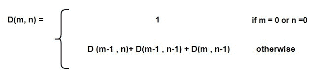

# delanny 编号

> 原文:[https://www.geeksforgeeks.org/delannoy-number/](https://www.geeksforgeeks.org/delannoy-number/)

在数学中，一个 **D** 描述了从一个矩形网格的西南角(0，0)到东北角(m，n)的路径数，仅使用单个步骤北、东北或东。
例如，D(3，3)等于 63。
德拉诺尼数可以通过:
计算



德拉诺尼数可以用来查找:

*   计算长度为 m 和 n 的两个序列的全局比对数

*   m 维整数格中距离原点最多 n 步的点数。

*   在细胞自动机中，半径为 n 的 m 维冯·诺依曼邻域内的细胞数
*   半径为 n 的 m 维冯诺依曼邻域的曲面上的单元数。

**例:**

```
Input : n = 3, m = 3
Output : 63

Input : n = 4, m = 5
Output : 681
```

下面是查找 Delannoy 号的实现:

## C++

```
// CPP Program of finding nth Delannoy Number.
#include <bits/stdc++.h>
using namespace std;

// Return the nth Delannoy Number.
int dealnnoy(int n, int m)
{
    // Base case
    if (m == 0 || n == 0)
        return 1;

    // Recursive step.
    return dealnnoy(m - 1, n) +
           dealnnoy(m - 1, n - 1) +
           dealnnoy(m, n - 1);
}

// Driven Program
int main()
{
    int n = 3, m = 4;
    cout << dealnnoy(n, m) << endl;
    return 0;
}
```

## Java 语言(一种计算机语言，尤用于创建网站)

```
// Java Program for finding nth Delannoy Number.
import java.util.*;
import java.lang.*;

public class GfG{

    // Return the nth Delannoy Number.
    public static int dealnnoy(int n, int m)
    {
        // Base case
        if (m == 0 || n == 0)
            return 1;

        // Recursive step.
        return dealnnoy(m - 1, n) +
            dealnnoy(m - 1, n - 1) +
            dealnnoy(m, n - 1);
    }

    // driver function
    public static void main(String args[]){
        int n = 3, m = 4;
        System.out.println(dealnnoy(n, m));
    }
}

/* This code is contributed by Sagar Shukla. */
```

## 蟒蛇 3

```
# Python3 Program for finding
# nth Delannoy Number.

# Return the nth Delannoy Number.
def dealnnoy(n, m):

    # Base case
    if (m == 0 or n == 0) :
        return 1

    # Recursive step.
    return dealnnoy(m - 1, n) + dealnnoy(m - 1, n - 1) + dealnnoy(m, n - 1)

# Driven code
n = 3
m = 4;
print( dealnnoy(n, m) )

# This code is contributed by "rishabh_jain".
```

## C#

```
// C# Program for finding nth Delannoy Number.
using System;

public class GfG {

    // Return the nth Delannoy Number.
    public static int dealnnoy(int n, int m)
    {

        // Base case
        if (m == 0 || n == 0)
            return 1;

        // Recursive step.
        return dealnnoy(m - 1, n) +
               dealnnoy(m - 1, n - 1) +
                     dealnnoy(m, n - 1);
    }

    // driver function
    public static void Main()
    {
        int n = 3, m = 4;
        Console.WriteLine(dealnnoy(n, m));
    }
}

/* This code is contributed by vt_m. */
```

## 服务器端编程语言（Professional Hypertext Preprocessor 的缩写）

```
<?php
// PHP Program of finding nth
// Delannoy Number.

// Return the nth Delannoy Number.
function dealnnoy( $n, $m)
{

    // Base case
    if ($m == 0 or $n == 0)
        return 1;

    // Recursive step.
    return dealnnoy($m - 1, $n) +
           dealnnoy($m - 1, $n - 1) +
           dealnnoy($m, $n - 1);
}

    // Driver Code
    $n = 3;
    $m = 4;
    echo dealnnoy($n, $m);

// This code is contributed by anuj_67.
?>
```

## java 描述语言

```
<script>
// javascript Program for finding nth Delannoy Number.

 // Return the nth Delannoy Number.
   function dealnnoy(n, m)
    {
        // Base case
        if (m == 0 || n == 0)
            return 1;

        // Recursive step.
        return dealnnoy(m - 1, n) +
            dealnnoy(m - 1, n - 1) +
            dealnnoy(m, n - 1);
    }

// Driver code

         let n = 3, m = 4;
        document.write(dealnnoy(n, m));

       // This code is contributed by susmitakundugoaldanga.
</script>
```

**输出:**

```
129
```

下面是寻找第 n 个延迟数的动态规划程序:

## C++

```
// CPP Program of finding nth Delannoy Number.
#include <bits/stdc++.h>
using namespace std;

// Return the nth Delannoy Number.
int dealnnoy(int n, int m)
{
    int dp[m + 1][n + 1];

    // Base cases
    for (int i = 0; i <= m; i++)
        dp[i][0] = 1;
    for (int i = 0; i <= m; i++)
        dp[0][i] = 1;   

    for (int i = 1; i <= m; i++)
        for (int j = 1; j <= n; j++)
            dp[i][j] = dp[i - 1][j] +
                       dp[i - 1][j - 1] +
                       dp[i][j - 1];

    return dp[m][n];
}

// Driven Program
int main()
{
    int n = 3, m = 4;
    cout << dealnnoy(n, m) << endl;
    return 0;
}
```

## Java 语言(一种计算机语言，尤用于创建网站)

```
// Java Program of finding nth Delannoy Number.

import java.io.*;

class GFG {

    // Return the nth Delannoy Number.
    static int dealnnoy(int n, int m)
    {
        int dp[][]=new int[m + 1][n + 1];

        // Base cases
        for (int i = 0; i <= m; i++)
            dp[i][0] = 1;
        for (int i = 0; i < m; i++)
            dp[0][i] = 1;   

        for (int i = 1; i <= m; i++)
            for (int j = 1; j <= n; j++)
                dp[i][j] = dp[i - 1][j] +
                           dp[i - 1][j - 1] +
                           dp[i][j - 1];

        return dp[m][n];
    }

    // Driven Program
    public static void main(String args[])
    {
        int n = 3, m = 4;
        System.out.println(dealnnoy(n, m));

    }
}

// This code is contributed by Nikita Tiwari.
```

## 蟒蛇 3

```
# Python3 Program for finding nth
# Delannoy Number.

# Return the nth Delannoy Number.
def dealnnoy (n, m):
    dp = [[0 for x in range(n+1)] for x in range(m+1)]

    # Base cases
    for i in range(m):
        dp[0][i] = 1

    for i in range(1, m + 1):
        dp[i][0] = 1

    for i in range(1, m + 1):
        for j in range(1, n + 1):
            dp[i][j] = dp[i - 1][j] + dp[i - 1][j - 1] + dp[i][j - 1];

    return dp[m][n]

# Driven code
n = 3
m = 4
print(dealnnoy(n, m))

# This code is contributed by "rishabh_jain".
```

## C#

```
// C# Program of finding nth Delannoy Number.
using System;

class GFG {

    // Return the nth Delannoy Number.
    static int dealnnoy(int n, int m)
    {

        int[, ] dp = new int[m + 1, n + 1];

        // Base cases
        for (int i = 0; i <= m; i++)
            dp[i, 0] = 1;
        for (int i = 0; i < m; i++)
            dp[0, i] = 1;

        for (int i = 1; i <= m; i++)
            for (int j = 1; j <= n; j++)
                dp[i, j] = dp[i - 1, j]
                     + dp[i - 1, j - 1]
                         + dp[i, j - 1];

        return dp[m, n];
    }

    // Driven Program
    public static void Main()
    {
        int n = 3, m = 4;

        Console.WriteLine(dealnnoy(n, m));
    }
}

// This code is contributed by vt_m.
```

## 服务器端编程语言（Professional Hypertext Preprocessor 的缩写）

```
<?php
// PHP Program of finding
// nth Delannoy Number.

// Return the nth Delannoy Number.
function dealnnoy($n, $m)
{
    $dp[$m + 1][$n + 1] = 0;

    // Base cases
    for ($i = 0; $i <= $m; $i++)
        $dp[$i][0] = 1;
    for ( $i = 0; $i <= $m; $i++)
        $dp[0][$i] = 1;

    for ($i = 1; $i <= $m; $i++)
        for ($j = 1; $j <= $n; $j++)
            $dp[$i][$j] = $dp[$i - 1][$j] +
                      $dp[$i - 1][$j - 1] +
                           $dp[$i][$j - 1];

    return $dp[$m][$n];
}

// Driven Code
$n = 3; $m = 4;
echo dealnnoy($n, $m) ;

// This code is contributed by SanjuTomar
?>
```

## java 描述语言

```
<script>

// Javascript Program of finding
// nth Delannoy Number.

// Return the nth Delannoy Number.
function dealnnoy(n, m)
{
    var dp = Array.from(Array(m+1),
        () => Array(n+1));

    // Base cases
    for (var i = 0; i <= m; i++)
        dp[i][0] = 1;
    for (var i = 0; i <= m; i++)
        dp[0][i] = 1;   

    for (var i = 1; i <= m; i++)
        for (var j = 1; j <= n; j++)
            dp[i][j] = dp[i - 1][j] +
                       dp[i - 1][j - 1] +
                       dp[i][j - 1];

    return dp[m][n];
}

// Driven Program
var n = 3, m = 4;
document.write( dealnnoy(n, m));

</script>
```

**输出:**

```
129
```