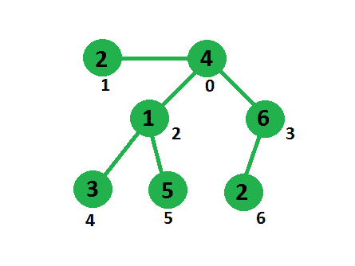

# 删除边，最小化子树和差

> 原文:[https://www . geesforgeks . org/delete-edge-minimum-subtree-sum-difference/](https://www.geeksforgeeks.org/delete-edge-minimize-subtree-sum-difference/)

给定一个无向树，其每个**节点与一个权重**相关联。我们需要删除一条边，使得一个子树中的权重总和与其他子树中的权重总和之间的差异最小化。

**示例:**



```
In above tree, 
We have 6 choices for edge deletion,
edge 0-1,  subtree sum difference = 21 - 2 = 19
edge 0-2,  subtree sum difference = 14 - 9 = 5
edge 0-3,  subtree sum difference = 15 - 8 = 7
edge 2-4,  subtree sum difference = 20 - 3 = 17
edge 2-5,  subtree sum difference = 18 - 5 = 13
edge 3-6,  subtree sum difference = 21 - 2 = 19
```

我们可以用 DFS 来解决这个问题。一个**简单的解决方法**是逐个删除每条边，检查子树和差。最后选择其中的最小值。这种方法需要二次时间。一种有效的**方法**可以通过使用树的总和计算两个子树的总和来在线性时间内解决这个问题。我们可以通过从树的总和中减去一个子树的总和来得到其他树的总和，这样就可以在 O(1)时间内计算出每个节点上的子树总和差。首先我们计算完全树的权重，然后在每个节点上进行 DFS 时，我们计算它的子树和，通过使用这两个值我们可以计算子树和差。
在下面的代码中，另一个数组子树用于存储子树[i]中以节点 I 为根的子树的和。每次使用当前节点索引和父索引调用 DFS，以便仅在每个节点上循环子节点。

请参见下面的代码，以便更好地理解。

## C++

```
// C++ program to minimize subtree sum 
// difference by one edge deletion 
#include <bits/stdc++.h> 
using namespace std; 

/* DFS method to traverse through edges, 
calculating subtree sum at each node and 
updating the difference between subtrees */
void dfs(int u, int parent, int totalSum, 
        vector<int> edge[], int subtree[], int& res) 
{ 
    int sum = subtree[u]; 

    /* loop for all neighbors except parent and 
        aggregate sum over all subtrees */
    for (int i = 0; i < edge[u].size(); i++) 
    { 
        int v = edge[u][i]; 
        if (v != parent) 
        { 
            dfs(v, u, totalSum, edge, subtree, res); 
            sum += subtree[v]; 
        } 
    } 

    // store sum in current node's subtree index 
    subtree[u] = sum; 

    /* at one side subtree sum is 'sum' and other side 
        subtree sum is 'totalSum - sum' so their difference 
        will be totalSum - 2*sum, by which we'll update 
        res */
    if (u != 0 && abs(totalSum - 2*sum) < res) 
        res = abs(totalSum - 2*sum); 
} 

// Method returns minimum subtree sum difference 
int getMinSubtreeSumDifference(int vertex[], 
                    int edges[][2], int N) 
{ 
    int totalSum = 0; 
    int subtree[N]; 

    // Calculating total sum of tree and initializing 
    // subtree sum's by vertex values 
    for (int i = 0; i < N; i++) 
    { 
        subtree[i] = vertex[i]; 
        totalSum += vertex[i]; 
    } 

    // filling edge data structure 
    vector<int> edge[N]; 
    for (int i = 0; i < N - 1; i++) 
    { 
        edge[edges[i][0]].push_back(edges[i][1]); 
        edge[edges[i][1]].push_back(edges[i][0]); 
    } 

    int res = INT_MAX; 

    // calling DFS method at node 0, with parent as -1 
    dfs(0, -1, totalSum, edge, subtree, res); 
    return res; 
} 

// Driver code to test above methods 
int main() 
{ 
    int vertex[] = {4, 2, 1, 6, 3, 5, 2}; 
    int edges[][2] = {{0, 1}, {0, 2}, {0, 3}, 
                    {2, 4}, {2, 5}, {3, 6}}; 
    int N = sizeof(vertex) / sizeof(vertex[0]); 

    cout << getMinSubtreeSumDifference(vertex, edges, N); 
    return 0; 
} 
```

## Java 语言(一种计算机语言，尤用于创建网站)

```
// Java program to minimize subtree sum
// difference by one edge deletion
import java.util.ArrayList;

class Graph{

static int res;

// DFS method to traverse through edges, 
// calculating subtree sum at each node 
// and updating the difference between subtrees
static void dfs(int u, int parent, int totalSum,
                ArrayList<Integer>[] edge, int subtree[]) 
{
    int sum = subtree[u];

    // Loop for all neighbors except parent 
    // and aggregate sum over all subtrees
    for(int i = 0; i < edge[u].size(); i++) 
    {
        int v = edge[u].get(i);

        if (v != parent)
        {
            dfs(v, u, totalSum, edge, subtree);
            sum += subtree[v];
        }
    }

    // Store sum in current node's subtree index
    subtree[u] = sum;

    // At one side subtree sum is 'sum' and other
    // side subtree sum is 'totalSum - sum' so
    // their difference will be totalSum - 2*sum, 
    // by which we'll update res
    if (u != 0 && Math.abs(totalSum - 2 * sum) < res)
        res = Math.abs(totalSum - 2 * sum);
}

// Method returns minimum subtree sum difference
static int getMinSubtreeSumDifference(int vertex[], 
                                      int[][] edges,
                                      int N)
{
    int totalSum = 0;
    int[] subtree = new int[N];

    // Calculating total sum of tree and 
    // initializing subtree sum's by 
    // vertex values
    for(int i = 0; i < N; i++) 
    {
        subtree[i] = vertex[i];
        totalSum += vertex[i];
    }

    // Filling edge data structure
    @SuppressWarnings("unchecked")
    ArrayList<Integer>[] edge = new ArrayList[N];
    for(int i = 0; i < N; i++)
    {
        edge[i] = new ArrayList<>();
    }
    for(int i = 0; i < N - 1; i++) 
    {
        edge[edges[i][0]].add(edges[i][1]);
        edge[edges[i][1]].add(edges[i][0]);
    }

    // int res = Integer.MAX_VALUE;

    // Calling DFS method at node 0, with
    // parent as -1
    dfs(0, -1, totalSum, edge, subtree);
    return res;
}

// Driver code 
public static void main(String[] args)
{
    res = Integer.MAX_VALUE;

    int[] vertex = { 4, 2, 1, 6, 3, 5, 2 };
    int[][] edges = { { 0, 1 }, { 0, 2 },
                      { 0, 3 }, { 2, 4 },
                      { 2, 5 }, { 3, 6 } };
    int N = vertex.length;

    System.out.println(getMinSubtreeSumDifference(
        vertex, edges, N));
}
}

// This code is contributed by sanjeev2552
```

## 蟒蛇 3

```
# Python3 program to minimize subtree 
# Sum difference by one edge deletion 

# DFS method to traverse through edges, 
# calculating subtree Sum at each node and 
# updating the difference between subtrees 
def dfs(u, parent, totalSum, edge, 
                    subtree, res): 
    Sum = subtree[u] 

    # loop for all neighbors except parent 
    # and aggregate Sum over all subtrees 
    for i in range(len(edge[u])): 
        v = edge[u][i] 
        if (v != parent): 
            dfs(v, u, totalSum, edge, 
                        subtree, res) 
            Sum += subtree[v] 

    # store Sum in current node's 
    # subtree index 
    subtree[u] = Sum

    # at one side subtree Sum is 'Sum' and 
    # other side subtree Sum is 'totalSum - Sum' 
    # so their difference will be totalSum - 2*Sum, 
    # by which we'll update res 
    if (u != 0 and abs(totalSum - 2 * Sum) < res[0]): 
        res[0] = abs(totalSum - 2 * Sum) 

# Method returns minimum subtree 
# Sum difference 
def getMinSubtreeSumDifference(vertex, edges, N): 
    totalSum = 0
    subtree = [None] * N 

    # Calculating total Sum of tree 
    # and initializing subtree Sum's 
    # by vertex values 
    for i in range(N): 
        subtree[i] = vertex[i] 
        totalSum += vertex[i] 

    # filling edge data structure 
    edge = [[] for i in range(N)] 
    for i in range(N - 1): 
        edge[edges[i][0]].append(edges[i][1]) 
        edge[edges[i][1]].append(edges[i][0]) 

    res = [999999999999] 

    # calling DFS method at node 0, 
    # with parent as -1 
    dfs(0, -1, totalSum, edge, subtree, res) 
    return res[0] 

# Driver Code 
if __name__ == '__main__': 

    vertex = [4, 2, 1, 6, 3, 5, 2] 
    edges = [[0, 1], [0, 2], [0, 3], 
            [2, 4], [2, 5], [3, 6]] 
    N = len(vertex) 

    print(getMinSubtreeSumDifference(vertex, 
                                    edges, N)) 

# This code is contributed by PranchalK 
```

## C#

```
// C# program to minimize subtree sum
// difference by one edge deletion
using System;
using System.Collections.Generic;

public class Graph{

static int res;

// DFS method to traverse through edges, 
// calculating subtree sum at each node 
// and updating the difference between subtrees
static void dfs(int u, int parent, int totalSum,
                List<int>[] edge, int []subtree) 
{
    int sum = subtree[u];

    // Loop for all neighbors except parent 
    // and aggregate sum over all subtrees
    for(int i = 0; i < edge[u].Count; i++) 
    {
        int v = edge[u][i];

        if (v != parent)
        {
            dfs(v, u, totalSum, edge, subtree);
            sum += subtree[v];
        }
    }

    // Store sum in current node's subtree index
    subtree[u] = sum;

    // At one side subtree sum is 'sum' and other
    // side subtree sum is 'totalSum - sum' so
    // their difference will be totalSum - 2*sum, 
    // by which we'll update res
    if (u != 0 && Math.Abs(totalSum - 2 * sum) < res)
        res = Math.Abs(totalSum - 2 * sum);
}

// Method returns minimum subtree sum difference
static int getMinSubtreeSumDifference(int []vertex, 
                                      int[,] edges,
                                      int N)
{
    int totalSum = 0;
    int[] subtree = new int[N];

    // Calculating total sum of tree and 
    // initializing subtree sum's by 
    // vertex values
    for(int i = 0; i < N; i++) 
    {
        subtree[i] = vertex[i];
        totalSum += vertex[i];
    }

    // Filling edge data structure
    List<int>[] edge = new List<int>[N];
    for(int i = 0; i < N; i++)
    {
        edge[i] = new List<int>();
    }
    for(int i = 0; i < N - 1; i++) 
    {
        edge[edges[i,0]].Add(edges[i,1]);
        edge[edges[i,1]].Add(edges[i,0]);
    }

    // int res = int.MaxValue;

    // Calling DFS method at node 0, with
    // parent as -1
    dfs(0, -1, totalSum, edge, subtree);
    return res;
}

// Driver code 
public static void Main(String[] args)
{
    res = int.MaxValue;

    int[] vertex = { 4, 2, 1, 6, 3, 5, 2 };
    int[,] edges = { { 0, 1 }, { 0, 2 },
                      { 0, 3 }, { 2, 4 },
                      { 2, 5 }, { 3, 6 } };
    int N = vertex.Length;

    Console.WriteLine(getMinSubtreeSumDifference(
        vertex, edges, N));
}
}

// This code is contributed by aashish1995. 
```

## java 描述语言

```
<script>

function addEdge( a , b)
{
   adj[a].push(b);
   adj[b].push(a);
}

function getWeight( parent , a, visited) {

    let weight = vertex_weight[a];

    visited[a] = 1;

    for (let i = 0; i < adj[a].length; i++) {
        if (visited[adj[a][i]] == 0 && adj[a][i] != parent ) {
            weight = weight + getWeight( a , adj[a][i], visited);
        }

    }

    return weight;
}

let vertex_weight = [ 4, 2, 1, 6, 3, 5, 2 ];

let edges = [ [ 0, 1 ], [ 0, 2 ], [ 0, 3 ], [ 2, 4 ], [ 2, 5 ], [ 3, 6 ] ];

let adj = new Array(vertex_weight.length);

for(let i=0;i<adj.length;i++)
{
    adj[i] = [];
}

for(let i=0;i<edges.length;i++)
{

    addEdge( edges[i][0] , edges[i][1] );

}

let total_weight = 0;

for(let i=0;i<vertex_weight.length;i++)
{
    total_weight = total_weight + vertex_weight[i];
}

let min_weight_diff = Number.MAX_SAFE_INTEGER;

let deleted_edge;

for (let i = 0; i < vertex_weight.length; i++) {

    for (let j = 0; j < adj[i].length; j++) {

        let visited = new Array(vertex_weight.length).fill(0);

        if (i != j) {

            let weight = getWeight( i , adj[i][j], visited);

            if ( Math.abs( (total_weight - weight) - weight ) < min_weight_diff) {
                min_weight_diff = (total_weight - weight) - weight;

                deleted_edge = [i, adj[i][j]];
            }

        }
    }
}

console.log(min_weight_diff);

console.log( deleted_edge , 'deleted_edge');

document.write(min_weight_diff);

</script>
```

**输出:**

```
5
```

本文由 [**乌卡什·特里维迪**](https://in.linkedin.com/in/utkarsh-trivedi-253069a7) 供稿。如果你喜欢 GeeksforGeeks 并想投稿，你也可以使用[write.geeksforgeeks.org](http://www.write.geeksforgeeks.org)写一篇文章或者把你的文章邮寄到 review-team@geeksforgeeks.org。看到你的文章出现在极客博客主页上，帮助其他极客。
如果发现有不正确的地方，或者想分享更多关于上述话题的信息，请写评论。