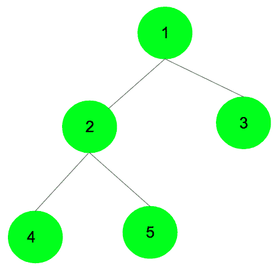

# 使用删除关键字

删除二叉树

> 原文:[https://www . geesforgeks . org/deleting-a-二叉树-使用-delete-关键字/](https://www.geeksforgeeks.org/deleting-a-binary-tree-using-the-delete-keyword/)

一个[递归](https://www.geeksforgeeks.org/write-a-c-program-to-delete-a-tree/)和一个[非递归](https://www.geeksforgeeks.org/non-recursive-program-to-delete-an-entire-binary-tree/)程序删除整个二叉树已经在之前的帖子中讨论过了。在这篇文章中，讨论了在 C++中使用 **delete** 关键字删除整个二叉树。

在“BinaryTreeNode”类中声明一个**析构函数**，该类已经被定义为创建一个树节点。对类的对象使用“delete”关键字会删除整个二叉树。，它的析构函数在析构函数中被调用。为孩子使用 ***【删除】*** 关键词；因此，子对象的析构函数将被一个接一个地调用，这个过程将递归进行，直到整个二叉树被删除。考虑如下所示的树，一旦为根即“1”调用析构函数，它将为“2”和“3”调用析构函数，然后 2 将为其左右子级分别调用相同的数据“4”和“5”。最终，该树将按以下顺序删除:**4->5->2->3->1**(后顺序)



下面是上述方法的 C++实现:

```
// C++ program to delete the entire binary
// tree using the delete keyword
#include <iostream>
using namespace std;

class BinaryTreeNode {

    // Making data members public to
    // avoid the usage of getter and setter functions
public:
    int data;
    BinaryTreeNode* left;
    BinaryTreeNode* right;

    // Constructor function to
    // assign data to the node
    BinaryTreeNode(int data)
    {
        this->data = data;
        this->left = NULL;
        this->right = NULL;
    }

    // Destructor function to delete the tree
    ~BinaryTreeNode()
    {
        // using keyword to delete the tree
        delete left;
        delete right;

        // printing the node which has been deleted
        cout << "Deleting " << this->data << endl;
    }
};

// Driver Code
int main()
{
    // Creating the nodes dynamically
    BinaryTreeNode* root = new BinaryTreeNode(1);
    BinaryTreeNode* node1 = new BinaryTreeNode(2);
    BinaryTreeNode* node2 = new BinaryTreeNode(3);
    BinaryTreeNode* node3 = new BinaryTreeNode(4);
    BinaryTreeNode* node4 = new BinaryTreeNode(5);

    // Creating the binary tree
    root->left = node1;
    root->right = node2;
    node1->left = node3;
    node1->right = node4;

    // Calls the destructor function which actually deletes the tree entirely
    delete root;

    return 0;
}
```

**Output:**

```
Deleting 4
Deleting 5
Deleting 2
Deleting 3
Deleting 1

```