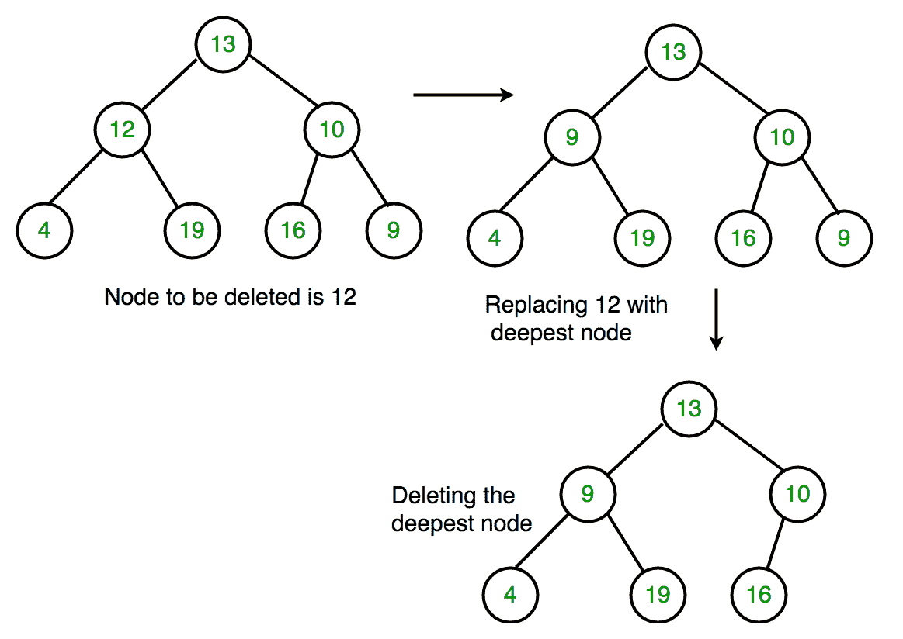

# 二叉树中的删除

> 原文:[https://www.geeksforgeeks.org/deletion-binary-tree/](https://www.geeksforgeeks.org/deletion-binary-tree/)

给定一个二叉树，通过确保该树从底部收缩来删除其中的一个节点(即删除的节点被最底部和最右边的节点替换)。这与 [BST 删除](https://www.geeksforgeeks.org/binary-search-tree-set-2-delete/)不同。这里我们没有元素之间的任何顺序，所以我们用最后一个元素替换。

示例:

```
Delete 10 in below tree
       10
     /    \         
    20     30
Output :    
       30
     /             
    20     

Delete 20 in below tree
       10
     /    \         
    20     30
            \
            40
Output :    
       10
     /   \             
    40    30   
```

**算法**
**1。**从根开始，找到二叉树中最深最右的节点和我们要删除的节点。
**2。**用要删除的节点替换最右边最深节点的数据。
**3。**然后删除最右边最深的节点。



## C++

```
// C++ program to delete element in binary tree
#include <bits/stdc++.h>
using namespace std;

/* A binary tree node has key, pointer to left
child and a pointer to right child */
struct Node {
    int key;
    struct Node *left, *right;
};

/* function to create a new node of tree and
return pointer */
struct Node* newNode(int key)
{
    struct Node* temp = new Node;
    temp->key = key;
    temp->left = temp->right = NULL;
    return temp;
};

/* Inorder traversal of a binary tree*/
void inorder(struct Node* temp)
{
    if (!temp)
        return;
    inorder(temp->left);
    cout << temp->key << " ";
    inorder(temp->right);
}

/* function to delete the given deepest node
(d_node) in binary tree */
void deletDeepest(struct Node* root,
                  struct Node* d_node)
{
    queue<struct Node*> q;
    q.push(root);

    // Do level order traversal until last node
    struct Node* temp;
    while (!q.empty()) {
        temp = q.front();
        q.pop();
        if (temp == d_node) {
            temp = NULL;
            delete (d_node);
            return;
        }
        if (temp->right) {
            if (temp->right == d_node) {
                temp->right = NULL;
                delete (d_node);
                return;
            }
            else
                q.push(temp->right);
        }

        if (temp->left) {
            if (temp->left == d_node) {
                temp->left = NULL;
                delete (d_node);
                return;
            }
            else
                q.push(temp->left);
        }
    }
}

/* function to delete element in binary tree */
Node* deletion(struct Node* root, int key)
{
    if (root == NULL)
        return NULL;

    if (root->left == NULL && root->right == NULL) {
        if (root->key == key)
            return NULL;
        else
            return root;
    }

    queue<struct Node*> q;
    q.push(root);

    struct Node* temp;
    struct Node* key_node = NULL;

    // Do level order traversal to find deepest
    // node(temp) and node to be deleted (key_node)
    while (!q.empty()) {
        temp = q.front();
        q.pop();

        if (temp->key == key)
            key_node = temp;

        if (temp->left)
            q.push(temp->left);

        if (temp->right)
            q.push(temp->right);
    }

    if (key_node != NULL) {
        int x = temp->key;
        deletDeepest(root, temp);
        key_node->key = x;
    }
    return root;
}

// Driver code
int main()
{
    struct Node* root = newNode(10);
    root->left = newNode(11);
    root->left->left = newNode(7);
    root->left->right = newNode(12);
    root->right = newNode(9);
    root->right->left = newNode(15);
    root->right->right = newNode(8);

    cout << "Inorder traversal before deletion : ";
    inorder(root);

    int key = 11;
    root = deletion(root, key);

    cout << endl;
    cout << "Inorder traversal after deletion : ";
    inorder(root);

    return 0;
}
```