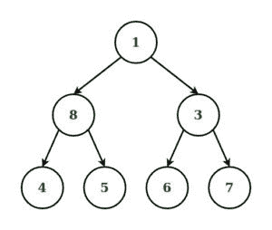
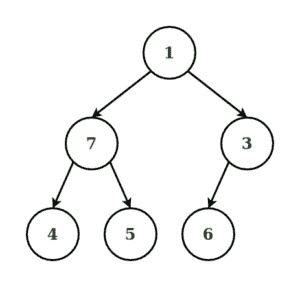
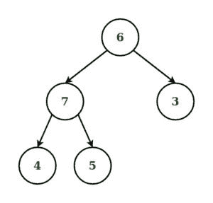
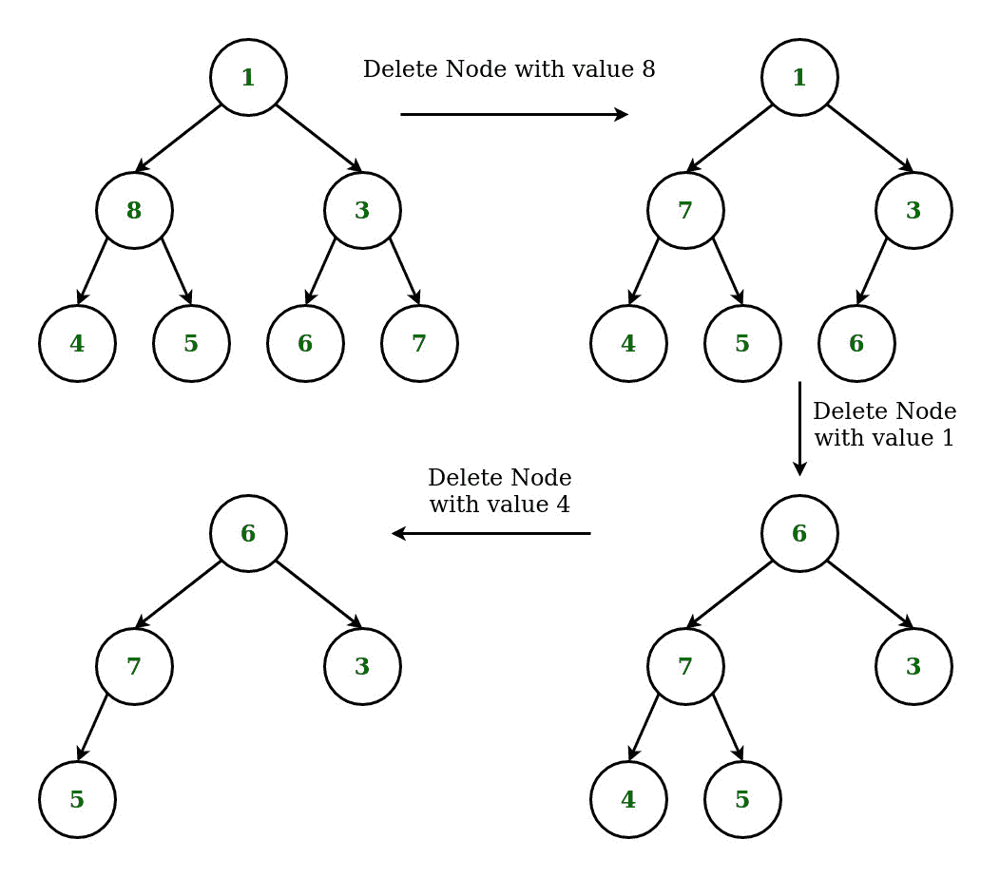

# 使用级别顺序遍历删除二叉树中给定的节点 K

> 原文:[https://www . geesforgeks . org/删除二叉树中的给定节点 k-使用级别顺序遍历/](https://www.geeksforgeeks.org/deletion-of-a-given-node-k-in-a-binary-tree-using-level-order-traversal/)

给定一棵[二叉树](https://www.geeksforgeeks.org/binary-tree-data-structure/)和一个节点 K，任务是通过使用[级序遍历](https://www.geeksforgeeks.org/level-order-tree-traversal/)确保树从底部收缩(即被删除的节点被最底部和最右侧的节点替换)，从而从中删除节点 K。

**示例:**

> **输入:** K = 8，树=
> 
> 
> 
> **输出:**
> 
> 
> 
> **说明:**
> 说明请参考下文。
> 
> **输入:** K = 1，树=
> 
> 
> 
> **输出:**
> 
> 

**进场:**

*   从根开始搜索要删除的节点的地址，按[级顺序遍历](https://www.geeksforgeeks.org/level-order-tree-traversal/)。
*   继续遍历树，按级别顺序找到最深和最右边的节点，找到最深和最右边的节点。
*   如果要删除的节点与最右边的最深节点不同，则用最右边的最深节点替换要删除的节点，并删除后面的节点
*   如果要删除的节点与最右边最深的节点相同，那么只需删除该节点。

**例如:**考虑上面的例子 1



下面是上述方法的实现。

## C++

```
// C++ implementation to delete a node
// in Binary Tree using Level Order Traversal

#include <bits/stdc++.h>
using namespace std;

// Structure of Binary Tree
struct node {
    int data;
    node* left;
    node* right;
};

// Function to create new node
// of a Binary Tree.
node* newnode(int d)
{
    node* temp = new node;
    temp->data = d;
    temp->left = temp->right = NULL;
    return temp;
}

// Function for Level Order
// Traversal of Binary Tree
void levelorder(node* curr)
{

    // Queue to store the nodes
    // in a level
    queue<node*> q;
    if (curr)
        q.push(curr);

    // Loop to Traverse the Binary
    // Tree in Level Order
    while (!q.empty()) {
        curr = q.front();
        q.pop();
        cout << curr->data << " ";
        if (curr->left)
            q.push(curr->left);
        if (curr->right)
            q.push(curr->right);
    }
}

// Function to Delete the deepest
// right-most node of the Binary Tree
void deletedeepest(node* root,
                node* temp)
{
    queue<node*> q;
    q.push(root);

    // Loop to Traverse Binary Tree
    // in level order and delete Node
    while (!q.empty()) {
        node* T = q.front();
        q.pop();
        if (T->right == temp) {
            T->right = NULL;
            delete (temp);
            return;
        }
        else
            q.push(T->right);
        if (T->left == temp) {
            T->left = NULL;
            delete (temp);
            return;
        }
        else
            q.push(T->left);
    }
}

// Function to Delete Node
// in Binary Tree
node* deletenode(node* root, int data)
{
    if (root == NULL)
        return NULL;

    // Condition if the Root node
    // is a leaf node.
    if (root->left == NULL
        && root->right == NULL) {
        if (root->data == data) {
            return NULL;
        }
        else
            return root;
    }
    queue<node*> q;
    q.push(root);
    node* temp = NULL;
    node* nodetodelete = NULL;

    // Loop to Traverse Tree in
    // Level Order and find the
    // Rightmost Deepest Node of the
    // Binary Tree and Node to be Deleted
    while (!q.empty()) {
        temp = q.front();
        q.pop();
        if (temp->data == data) {
            nodetodelete = temp;
        }
        if (temp->left) {
            q.push(temp->left);
        }
        if (temp->right) {
            q.push(temp->right);
        }
    }

    // if node to be deleted is not found
    if (nodetodelete != NULL) {

        // Condition to check if node to delete
        // is not same as node to replace
        if (temp != nodetodelete) {
            int t = temp->data;
            deletedeepest(root, temp);
            nodetodelete->data = t;
        }

        // if node to delete is also
        // rightmost deepest node
        else {
            deletedeepest(root, temp);
        }
    }
    return root;
}

// Driver Code
int main()
{

    // Construction of Tree
    node* root = newnode(1);
    root->left = newnode(8);
    root->right = newnode(3);
    root->left->left = newnode(4);
    root->left->right = newnode(5);
    root->right->left = newnode(6);
    root->right->right = newnode(7);

    cout << "Original Tree: ";
    levelorder(root);

    // Deleting node with key 8
    root = deletenode(root, 8);
    cout << endl;
    cout << "Deleting node with key 8: ";
    levelorder(root);

    // Deleting node with key 1
    root = deletenode(root, 1);
    cout << endl;
    cout << "Deleting node with key 1: ";
    levelorder(root);

    // Deleting node with key 4
    root = deletenode(root, 4);
    cout << endl;
    cout << "Deleting node with key 4: ";
    levelorder(root);
}
```

## Java 语言(一种计算机语言，尤用于创建网站)

```
// Java implementation to delete a node
// in Binary Tree using Level Order Traversal
import java.util.LinkedList;
import java.util.Queue;

// Binary Tree
class TreeNode
{
    int data;
    TreeNode left = null;
    TreeNode right = null;

    TreeNode(int data)
    {
        this.data = data;
    }
}

class BinaryTreeDeleteKNode{

public TreeNode insert(TreeNode root,
                    int value)
{
    if (root == null)
    {
        root = new TreeNode(value);
        return root;
    }

    // Do level order traversal and add
    // node to first null
    Queue<TreeNode> q = new LinkedList<TreeNode>();
    q.add(root);

    while (!q.isEmpty())
    {
        TreeNode tn = q.remove();
        if (tn.left != null)
        {
            q.add(tn.left);
        }
        else
        {
            tn.left = new TreeNode(value);
            return root;
        }
        if (tn.right != null)
        {
            q.add(tn.right);
        }
        else
        {
            tn.right = new TreeNode(value);
            return root;
        }
    }
    return root;
}

// Function for Level Order
// Traversal of Binary Tree
public void levelOrder(TreeNode root)
{
    if (root == null)
    {
        System.out.println("Tree is empty!!");
    }

    // Queue to store the nodes
    // in a level
    Queue<TreeNode> q = new LinkedList<TreeNode>();
    q.add(root);

    // Loop to Traverse the Binary
    // Tree in Level Order
    while (!q.isEmpty())
    {
        TreeNode tn = q.remove();
        System.out.print(tn.data + " ");

        if (tn.left != null)
            q.add(tn.left);
        if (tn.right != null)
            q.add(tn.right);
    }
}

// Function to delete node node with value K
public TreeNode deleteIn(TreeNode root, int k)
{
    if (root == null)
        return root;

    // Do level order traversal if node found
    // with the value k then select that node
    // keep traversal till we find deepest
    // node with empty value keep track of
    // the parent node of the deepest node
    TreeNode searchedNode = null;
    TreeNode tn = null;

    Queue<TreeNode> q = new LinkedList<TreeNode>();
    TreeNode deepestNodeParent = null;
    q.add(root);

    while (!q.isEmpty())
    {
        boolean isParent = false;
        tn = q.remove();

        if (searchedNode == null && tn.data == k)
        {
            searchedNode = tn;
        }
        if (tn.left != null)
        {
            q.add(tn.left);
            isParent = true;
        }
        if (tn.right != null)
        {
            q.add(tn.right);
            isParent = true;
        }
        if (isParent) deepestNodeParent = tn;
    }

    if (searchedNode == null)
    {
        System.out.print("Node with value '" + k +
                        "' not exists.");
        return root;
    }
    searchedNode.data = tn.data;
    if (deepestNodeParent != null &&
        deepestNodeParent.left != null &&
        deepestNodeParent.left.data == tn.data)
    {
    deepestNodeParent.left = null;
    }
    else
    {
        deepestNodeParent.right = null;
    }
    return root;
}

// Driver code
public static void main(String[] args)
{
    TreeNode node = null;
    BinaryTreeDeleteKNode binaryTreeDeleteKNode = new BinaryTreeDeleteKNode();

    // Construction of Tree
    node = binaryTreeDeleteKNode.insert(node, 1);
    node = binaryTreeDeleteKNode.insert(node, 8);
    node = binaryTreeDeleteKNode.insert(node, 3);
    node = binaryTreeDeleteKNode.insert(node, 4);
    node = binaryTreeDeleteKNode.insert(node, 5);
    node = binaryTreeDeleteKNode.insert(node, 6);
    node = binaryTreeDeleteKNode.insert(node, 7);

    System.out.print("Original Tree: ");
    binaryTreeDeleteKNode.levelOrder(node);

    // Deleting node with key 8
    node = binaryTreeDeleteKNode.deleteIn(node,8);
    System.out.print("\nDeleting node with key 8: ");
    binaryTreeDeleteKNode.levelOrder(node);

    // Deleting node with key 1
    node = binaryTreeDeleteKNode.deleteIn(node,1);
    System.out.print("\nDeleting node with key 1: ");
    binaryTreeDeleteKNode.levelOrder(node);

    // Deleting node with key 4
    node = binaryTreeDeleteKNode.deleteIn(node,4);
    System.out.print("\nDeleting node with key 4: ");
    binaryTreeDeleteKNode.levelOrder(node);
}
}

// This code is contributed by anshulgtbit91
```

## 蟒蛇 3

```
# Python3 implementation to delete a node
# in Binary Tree using Level Order Traversal
from collections import deque

# Structure of Binary Tree
class Node:

    def __init__(self, x):

        self.data = x
        self.left = None
        self.right = None

# Function for Level Order
# Traversal of Binary Tree
def levelorder(curr):

    # Queue to store the nodes
    # in a level
    q = deque()

    if (curr):
        q.append(curr)

    # Loop to Traverse the Binary
    # Tree in Level Order
    while len(q) > 0:
        curr = q.popleft()
        #q.pop()
        print(curr.data, end = " ")

        if (curr.left):
            q.append(curr.left)
        if (curr.right):
            q.append(curr.right)

# Function to Delete the deepest
# right-most node of the Binary Tree
def deletedeepest(root, temp):

    q = deque()
    q.append(root)

    # Loop to Traverse Binary Tree
    # in level order and delete Node
    while (len(q) > 0):
        T = q.popleft()
        #q.pop()

        if (T.right == temp):
            T.right = None
            #delete (temp)
            return
        else:
            q.append(T.right)

        if (T.left == temp):
            T.left = None
            #delete (temp)
            return
        else:
            q.append(T.left)

# Function to Delete Node
# in Binary Tree
def deletenode(root, data):

    if (root == None):
        return None

    # Condition if the Root node
    # is a leaf node.
    if (root.left == None and
        root.right == None):
        if (root.data == data):
            return None
        else:
            return root

    q = deque()
    q.append(root)
    temp = None
    nodetodelete = None

    # Loop to Traverse Tree in
    # Level Order and find the
    # Rightmost Deepest Node of the
    # Binary Tree and Node to be Deleted
    while (len(q) > 0):
        temp = q.popleft()
        #q.pop()

        if (temp.data == data):
            nodetodelete = temp
        if (temp.left):
            q.append(temp.left)
        if (temp.right):
            q.append(temp.right)

    # If node to be deleted is not found
    if (nodetodelete != None):

        # Condition to check if node to delete
        # is not same as node to replace
        if (temp != nodetodelete):
            t = temp.data
            deletedeepest(root, temp)
            nodetodelete.data = t

        # If node to delete is also
        # rightmost deepest node
        else:
            deletedeepest(root, temp)

    return root

# Driver Code
if __name__ == '__main__':

    # Construction of Tree
    root = Node(1)
    root.left = Node(8)
    root.right = Node(3)
    root.left.left = Node(4)
    root.left.right = Node(5)
    root.right.left = Node(6)
    root.right.right = Node(7)

    print("Original Tree: ", end = "")
    levelorder(root)

    # Deleting node with key 8
    root = deletenode(root, 8)
    print()
    print("Deleting node with key 8: ", end = "")
    levelorder(root)

    # Deleting node with key 1
    root = deletenode(root, 1)
    print()
    print("Deleting node with key 1: ", end = "")
    levelorder(root)

    # Deleting node with key 4
    root = deletenode(root, 4)
    print()
    print("Deleting node with key 4: ", end = "")
    levelorder(root)

# This code is contributed by mohit kumar 29
```

## java 描述语言

```
<script>
// Javascript implementation to delete a node
// in Binary Tree using Level Order Traversal

// Binary Tree
class TreeNode
{
    constructor(data)
    {
        this.data=data;
        this.left=this.right=null;
    }
}

function insert(root,value)
{
    if (root == null)
    {
        root = new TreeNode(value);
        return root;
    }

    // Do level order traversal and add
    // node to first null
    let q = [];
    q.push(root);

    while (q.length!=0)
    {
        let tn = q.shift();
        if (tn.left != null)
        {
            q.push(tn.left);
        }
        else
        {
            tn.left = new TreeNode(value);
            return root;
        }
        if (tn.right != null)
        {
            q.push(tn.right);
        }
        else
        {
            tn.right = new TreeNode(value);
            return root;
        }
    }
    return root;
}

// Function for Level Order
// Traversal of Binary Tree
function levelOrder(root)
{
if (root == null)
    {
        document.write("Tree is empty!!<br>");
    }

    // Queue to store the nodes
    // in a level
    let q = [];
    q.push(root);

    // Loop to Traverse the Binary
    // Tree in Level Order
    while (q.length!=0)
    {
        let tn = q.shift();
        document.write(tn.data + " ");

        if (tn.left != null)
            q.push(tn.left);
        if (tn.right != null)
            q.push(tn.right);
    }
}

// Function to delete node node with value K
function deleteIn(root,k)
{
    if (root == null)
        return root;

    // Do level order traversal if node found
    // with the value k then select that node
    // keep traversal till we find deepest
    // node with empty value keep track of
    // the parent node of the deepest node
    let searchedNode = null;
    let tn = null;

    let q = [];
    let deepestNodeParent = null;
    q.push(root);

    while (q.length!=0)
    {
        let isParent = false;
        tn = q.shift();

        if (searchedNode == null && tn.data == k)
        {
            searchedNode = tn;
        }
        if (tn.left != null)
        {
            q.push(tn.left);
            isParent = true;
        }
        if (tn.right != null)
        {
            q.push(tn.right);
            isParent = true;
        }
        if (isParent) deepestNodeParent = tn;
    }

    if (searchedNode == null)
    {
        document.write("Node with value '" + k +
                        "' not exists.");
        return root;
    }
    searchedNode.data = tn.data;
    if (deepestNodeParent != null &&
        deepestNodeParent.left != null &&
        deepestNodeParent.left.data == tn.data)
    {
    deepestNodeParent.left = null;
    }
    else
    {
        deepestNodeParent.right = null;
    }
    return root;
}

// Driver code
let node = null;
// Construction of Tree
node = insert(node, 1);
node = insert(node, 8);
node = insert(node, 3);
node = insert(node, 4);
node = insert(node, 5);
node = insert(node, 6);
node = insert(node, 7);

document.write("Original Tree: ");
levelOrder(node);

// Deleting node with key 8
node = deleteIn(node,8);
document.write("<br>Deleting node with key 8: ");
levelOrder(node);

// Deleting node with key 1
node = deleteIn(node,1);
document.write("<br>Deleting node with key 1: ");
levelOrder(node);

// Deleting node with key 4
node = deleteIn(node,4);
document.write("<br>Deleting node with key 4: ");
levelOrder(node);

// This code is contributed by unknown2108
</script>
```

**Output:** 

```
Original Tree: 1 8 3 4 5 6 7 
Deleting node with key 8: 1 7 3 4 5 6 
Deleting node with key 1: 6 7 3 4 5 
Deleting node with key 4: 6 7 3 5
```