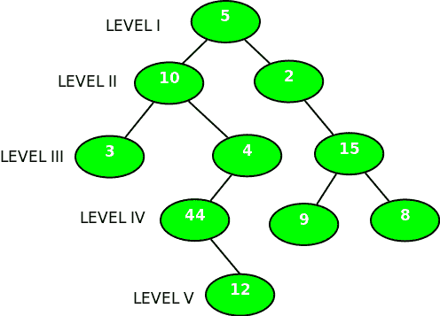

# 二叉树中最深奇数层节点的深度

> 原文:[https://www . geesforgeks . org/depth-deep-奇数层-node-二叉树/](https://www.geeksforgeeks.org/depth-deepest-odd-level-node-binary-tree/)

给定一棵二叉树，找出最深奇数层叶节点的深度。将根级别作为深度 1。
**例:**

```
Input : 
```



```
Output : 5

Input : 10
       /     \
     28       13
            /     \
          14       15
                  /  \
                 23   24
Output : 3
```

我们可以从根级开始遍历树，保留节点的 *curr_level* 。
每次我们向左或向右移动一个子树时，增加 *curr_level* 。
返回奇数层的最大深度(如果存在)。
算法:

```
    1) return 0 if curr_node == NULL
    2) if curr_node is leaf and curr_level is odd, 
       return curr_level
    3) else maximum(depthOdd(left subtree), 
                    depthOdd(right subtree))
```

下面是实现。

## C++

```
// C++ program to find depth of the deepest
// odd level node
#include<bits/stdc++.h>
using namespace std;

// A Tree node
struct Node
{
    int key;
    struct Node *left, *right;
};

// Utility function to create a new node
Node* newNode(int key)
{
    Node* temp = new Node;
    temp->key = key;
    temp->left = temp->right = NULL;
    return (temp);
}

// Utility function which
// returns whether the current node
// is a leaf or not
bool isleaf(Node *curr_node)
{
    return (curr_node->left == NULL &&
            curr_node->right == NULL);
}

// function to return the longest
// odd level depth if it exists
// otherwise 0
int deepestOddLevelDepthUtil(Node *curr_node, int curr_level)
{
    // Base case
    // return from here
    if ( curr_node == NULL)
        return 0;

    // increment current level
    curr_level += 1;

    // if curr_level is odd
    // and its a leaf node
    if ( curr_level % 2 != 0 && isleaf(curr_node))
        return curr_level;

    return max(deepestOddLevelDepthUtil(curr_node->left,curr_level),
               deepestOddLevelDepthUtil(curr_node->right,curr_level));
}

// A wrapper over deepestOddLevelDepth()
int deepestOddLevelDepth(Node *curr_node)
{
    return deepestOddLevelDepthUtil(curr_node, 0);
}

// Driver code
int main()
{
    /*   10
       /     \
     28       13
            /     \
          14       15
                  /  \
                 23   24
    Let us create Binary Tree shown in above example */
    Node *root  = newNode(10);
    root->left  = newNode(28);
    root->right = newNode(13);

    root->right->left   = newNode(14);
    root->right->right  = newNode(15);

    root->right->right->left  = newNode(23);
    root->right->right->right = newNode(24);

    cout << deepestOddLevelDepth(root) << endl;

    return 0;
}
```

## Java 语言(一种计算机语言，尤用于创建网站)

```
// Java program to find depth of the deepest
// odd level node
class GfG {

// A Tree node
static class Node
{
    int key;
    Node left, right;
}

// Utility function to create a new node
static Node newNode(int key)
{
    Node temp = new Node();
    temp.key = key;
    temp.left = null;
    temp.right = null;
    return (temp);
}

// Utility function which
// returns whether the current node
// is a leaf or not
static boolean isleaf(Node curr_node)
{
    return (curr_node.left == null && curr_node.right == null);
}

// function to return the longest
// odd level depth if it exists
// otherwise 0
static int deepestOddLevelDepthUtil(Node curr_node, int curr_level)
{
    // Base case
    // return from here
    if ( curr_node == null)
        return 0;

    // increment current level
    curr_level += 1;

    // if curr_level is odd
    // and its a leaf node
    if ( curr_level % 2 != 0 && isleaf(curr_node))
        return curr_level;

    return Math.max(deepestOddLevelDepthUtil(curr_node.left,curr_level),
                deepestOddLevelDepthUtil(curr_node.right,curr_level));
}

// A wrapper over deepestOddLevelDepth()
static int deepestOddLevelDepth(Node curr_node)
{
    return deepestOddLevelDepthUtil(curr_node, 0);
}

public static void main(String[] args)
{
    /* 10
    / \
    28 13
            / \
        14 15
                / \
                23 24
    Let us create Binary Tree shown in above example */
    Node root = newNode(10);
    root.left = newNode(28);
    root.right = newNode(13);

    root.right.left = newNode(14);
    root.right.right = newNode(15);

    root.right.right.left = newNode(23);
    root.right.right.right = newNode(24);

    System.out.println(deepestOddLevelDepth(root));
}

}
```

## 蟒蛇 3

```
# Python3 program to find depth of
# the deepest odd level node

# Helper function that allocates a
# new node with the given data and
# None left and right poers.                                    
class newNode:

    # Constructor to create a new node
    def __init__(self, data):
        self.data = data
        self.left = None
        self.right = None

# Utility function which returns
# whether the current node is a
# leaf or not
def isleaf(curr_node) :
    return (curr_node.left == None and
            curr_node.right == None)

# function to return the longest
# odd level depth if it exists
# otherwise 0
def deepestOddLevelDepthUtil(curr_node,
                             curr_level) :

    # Base case
    # return from here
    if (curr_node == None) :
        return 0

    # increment current level
    curr_level += 1

    # if curr_level is odd and
    # its a leaf node
    if (curr_level % 2 != 0 and
        isleaf(curr_node)) :
        return curr_level

    return max(deepestOddLevelDepthUtil(curr_node.left,
                                           curr_level),
               deepestOddLevelDepthUtil(curr_node.right,
                                            curr_level))

# A wrapper over deepestOddLevelDepth()
def deepestOddLevelDepth(curr_node) :

    return deepestOddLevelDepthUtil(curr_node, 0)

# Driver Code
if __name__ == '__main__':

    """ 10
    /     \
    28     13
            /     \
        14     15
                / \
                23 24
    Let us create Binary Tree shown in
    above example """
    root = newNode(10)
    root.left = newNode(28)
    root.right = newNode(13)
    root.right.left = newNode(14)
    root.right.right = newNode(15)
    root.right.right.left = newNode(23)
    root.right.right.right = newNode(24)
    print(deepestOddLevelDepth(root))

# This code is contributed by
# Shubham Singh(SHUBHAMSINGH10)
```

## C#

```
// C# program to find depth of the deepest
// odd level node
using System;

class GfG
{

    // A Tree node
    class Node
    {
        public int key;
        public Node left, right;
    }

    // Utility function to create a new node
    static Node newNode(int key)
    {
        Node temp = new Node();
        temp.key = key;
        temp.left = null;
        temp.right = null;
        return (temp);
    }

    // Utility function which
    // returns whether the current node
    // is a leaf or not
    static bool isleaf(Node curr_node)
    {
        return (curr_node.left == null &&
                curr_node.right == null);
    }

    // function to return the longest
    // odd level depth if it exists
    // otherwise 0
    static int deepestOddLevelDepthUtil(Node curr_node,
                                        int curr_level)
    {
        // Base case
        // return from here
        if ( curr_node == null)
            return 0;

        // increment current level
        curr_level += 1;

        // if curr_level is odd
        // and its a leaf node
        if ( curr_level % 2 != 0 && isleaf(curr_node))
            return curr_level;

        return Math.Max(deepestOddLevelDepthUtil(curr_node.left,curr_level),
                    deepestOddLevelDepthUtil(curr_node.right,curr_level));
    }

    // A wrapper over deepestOddLevelDepth()
    static int deepestOddLevelDepth(Node curr_node)
    {
        return deepestOddLevelDepthUtil(curr_node, 0);
    }

    public static void Main(String[] args)
    {
        /* 10
        / \
        28 13
                / \
            14 15
                    / \
                    23 24
        Let us create Binary Tree shown in above example */
        Node root = newNode(10);
        root.left = newNode(28);
        root.right = newNode(13);

        root.right.left = newNode(14);
        root.right.right = newNode(15);

        root.right.right.left = newNode(23);
        root.right.right.right = newNode(24);

        Console.WriteLine(deepestOddLevelDepth(root));
    }
}

// This code is contributed by PrinciRaj1992
```

## java 描述语言

```
<script>

// JavaScript program to find depth of the deepest
// odd level node
// A Tree node
class Node
{
    constructor()
    {
        this.key = 0;
        this.left = null;
        this.right = null;
    }
}
// Utility function to create a new node
function newNode(key)
{
    var temp = new Node();
    temp.key = key;
    temp.left = null;
    temp.right = null;
    return (temp);
}
// Utility function which
// returns whether the current node
// is a leaf or not
function isleaf(curr_node)
{
    return (curr_node.left == null &&
            curr_node.right == null);
}
// function to return the longest
// odd level depth if it exists
// otherwise 0
function deepestOddLevelDepthUtil(curr_node, curr_level)
{
    // Base case
    // return from here
    if ( curr_node == null)
        return 0;
    // increment current level
    curr_level += 1;
    // if curr_level is odd
    // and its a leaf node
    if ( curr_level % 2 != 0 && isleaf(curr_node))
        return curr_level;
    return Math.max(deepestOddLevelDepthUtil(curr_node.left,curr_level),
                deepestOddLevelDepthUtil(curr_node.right,curr_level));
}
// A wrapper over deepestOddLevelDepth()
function deepestOddLevelDepth(curr_node)
{
    return deepestOddLevelDepthUtil(curr_node, 0);
}

/* 10
/ \
28 13
        / \
    14 15
            / \
            23 24
Let us create Binary Tree shown in above example */
var root = newNode(10);
root.left = newNode(28);
root.right = newNode(13);
root.right.left = newNode(14);
root.right.right = newNode(15);
root.right.right.left = newNode(23);
root.right.right.right = newNode(24);
document.write(deepestOddLevelDepth(root));

</script>
```

**输出:**

```
3
```

本文由 [**舒巴姆·古普塔**](https://www.facebook.com/Shubh1307) 供稿。如果你喜欢 GeeksforGeeks 并想投稿，你也可以使用[write.geeksforgeeks.org](https://write.geeksforgeeks.org)写一篇文章或者把你的文章邮寄到 review-team@geeksforgeeks.org。看到你的文章出现在极客博客主页上，帮助其他极客。
如果发现有不正确的地方，或者想分享更多关于上述话题的信息，请写评论。