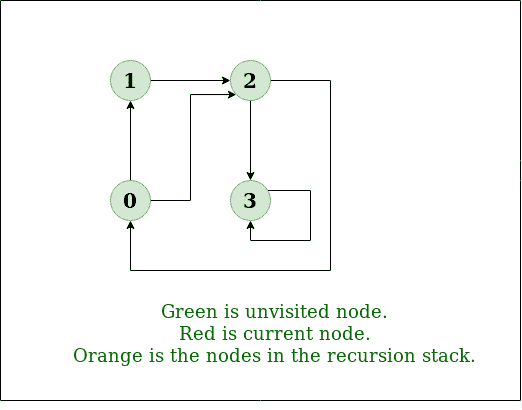
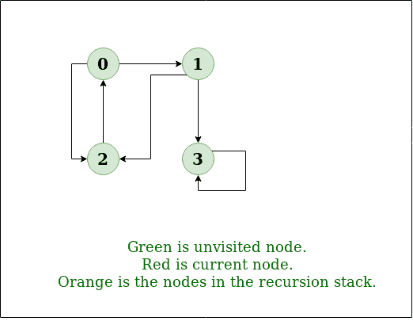

# 深度优先搜索或图的 DFS

> 原文:[https://www . geesforgeks . org/depth-first-search-or-DFS-for-graph/](https://www.geeksforgeeks.org/depth-first-search-or-dfs-for-a-graph/)

图的深度优先遍历(或搜索)类似于树的深度优先遍历[。](https://www.geeksforgeeks.org/tree-traversals-inorder-preorder-and-postorder/)这里唯一的问题是，与树不同，图可能包含循环(一个节点可能被访问两次)。为了避免多次处理节点，请使用布尔访问数组。

**示例:**

> **输入:** n = 4，e = 6
> 0 - > 1，0 - > 2，1 - > 2，2 - > 0，2 - > 3，3 - > 3
> **输出:**从顶点 1 开始的 DFS:1 2 0 3
> **解释:**
> DFS 图:
> 
> 
> 
> **输入:** n = 4，e = 6
> 2 - > 0，0 - > 2，1 - > 2，0 - > 1，3 - > 3，1 - > 3
> **输出:**从顶点 2 开始的 DFS:2 0 1 3
> T7】解释:
> DFS 图:
> 
> 

**先决条件:**
深度优先遍历的所有应用见[本帖](https://www.geeksforgeeks.org/archives/11644)。

**方法:**
深度优先搜索是一种遍历或搜索树或图数据结构的算法。该算法从根节点开始(在图的情况下，选择某个任意节点作为根节点)，并在回溯之前尽可能沿着每个分支进行探索。所以基本思想是从根或者任意节点开始，标记该节点，移动到相邻的未标记节点，继续这个循环，直到没有未标记的相邻节点。然后回溯并检查其他未标记的节点并遍历它们。最后，打印路径中的节点。

**算法:**
创建一个递归函数，获取节点的索引和一个访问过的数组。

1.  将当前节点标记为已访问，并打印该节点。
2.  遍历所有相邻和未标记的节点，并使用相邻节点的索引调用递归函数。

**实现:**
下面是简单深度优先遍历的实现。C++实现使用图的邻接表表示。STL 的列表容器用于存储相邻节点的列表。

## C++

```
// C++ program to print DFS traversal from
// a given vertex in a  given graph
#include <bits/stdc++.h>
using namespace std;

// Graph class represents a directed graph
// using adjacency list representation
class Graph {
public:
    map<int, bool> visited;
    map<int, list<int> > adj;

    // function to add an edge to graph
    void addEdge(int v, int w);

    // DFS traversal of the vertices
    // reachable from v
    void DFS(int v);
};

void Graph::addEdge(int v, int w)
{
    adj[v].push_back(w); // Add w to v’s list.
}

void Graph::DFS(int v)
{
    // Mark the current node as visited and
    // print it
    visited[v] = true;
    cout << v << " ";

    // Recur for all the vertices adjacent
    // to this vertex
    list<int>::iterator i;
    for (i = adj[v].begin(); i != adj[v].end(); ++i)
        if (!visited[*i])
            DFS(*i);
}

// Driver code
int main()
{
    // Create a graph given in the above diagram
    Graph g;
    g.addEdge(0, 1);
    g.addEdge(0, 2);
    g.addEdge(1, 2);
    g.addEdge(2, 0);
    g.addEdge(2, 3);
    g.addEdge(3, 3);

    cout << "Following is Depth First Traversal"
            " (starting from vertex 2) \n";
    g.DFS(2);

    return 0;
}

// improved by Vishnudev C
```

## Java 语言(一种计算机语言，尤用于创建网站)

```
// Java program to print DFS
// mtraversal from a given given
// graph
import java.io.*;
import java.util.*;

// This class represents a
// directed graph using adjacency
// list representation
class Graph {
    private int V; // No. of vertices

    // Array  of lists for
    // Adjacency List Representation
    private LinkedList<Integer> adj[];

    // Constructor
    @SuppressWarnings("unchecked") Graph(int v)
    {
        V = v;
        adj = new LinkedList[v];
        for (int i = 0; i < v; ++i)
            adj[i] = new LinkedList();
    }

    // Function to add an edge into the graph
    void addEdge(int v, int w)
    {
        adj[v].add(w); // Add w to v's list.
    }

    // A function used by DFS
    void DFSUtil(int v, boolean visited[])
    {
        // Mark the current node as visited and print it
        visited[v] = true;
        System.out.print(v + " ");

        // Recur for all the vertices adjacent to this
        // vertex
        Iterator<Integer> i = adj[v].listIterator();
        while (i.hasNext()) {
            int n = i.next();
            if (!visited[n])
                DFSUtil(n, visited);
        }
    }

    // The function to do DFS traversal.
    // It uses recursive
    // DFSUtil()
    void DFS(int v)
    {
        // Mark all the vertices as
        // not visited(set as
        // false by default in java)
        boolean visited[] = new boolean[V];

        // Call the recursive helper
        // function to print DFS
        // traversal
        DFSUtil(v, visited);
    }

    // Driver Code
    public static void main(String args[])
    {
        Graph g = new Graph(4);

        g.addEdge(0, 1);
        g.addEdge(0, 2);
        g.addEdge(1, 2);
        g.addEdge(2, 0);
        g.addEdge(2, 3);
        g.addEdge(3, 3);

        System.out.println(
            "Following is Depth First Traversal "
            + "(starting from vertex 2)");

        g.DFS(2);
    }
}
// This code is contributed by Aakash Hasija
```

## 蟒蛇 3

```
# Python3 program to print DFS traversal
# from a given given graph
from collections import defaultdict

# This class represents a directed graph using
# adjacency list representation

class Graph:

    # Constructor
    def __init__(self):

        # default dictionary to store graph
        self.graph = defaultdict(list)

    # function to add an edge to graph
    def addEdge(self, u, v):
        self.graph[u].append(v)

    # A function used by DFS
    def DFSUtil(self, v, visited):

        # Mark the current node as visited
        # and print it
        visited.add(v)
        print(v, end=' ')

        # Recur for all the vertices
        # adjacent to this vertex
        for neighbour in self.graph[v]:
            if neighbour not in visited:
                self.DFSUtil(neighbour, visited)

    # The function to do DFS traversal. It uses
    # recursive DFSUtil()
    def DFS(self, v):

        # Create a set to store visited vertices
        visited = set()

        # Call the recursive helper function
        # to print DFS traversal
        self.DFSUtil(v, visited)

# Driver code

# Create a graph given
# in the above diagram
g = Graph()
g.addEdge(0, 1)
g.addEdge(0, 2)
g.addEdge(1, 2)
g.addEdge(2, 0)
g.addEdge(2, 3)
g.addEdge(3, 3)

print("Following is DFS from (starting from vertex 2)")
g.DFS(2)

# This code is contributed by Neelam Yadav
```

## C#

```
// C# program to print DFS traversal
// from a given graph
using System;
using System.Collections.Generic;

// This class represents a directed graph
// using adjacency list representation
class Graph {
    private int V; // No. of vertices

    // Array of lists for
    // Adjacency List Representation
    private List<int>[] adj;

    // Constructor
    Graph(int v)
    {
        V = v;
        adj = new List<int>[ v ];
        for (int i = 0; i < v; ++i)
            adj[i] = new List<int>();
    }

    // Function to Add an edge into the graph
    void AddEdge(int v, int w)
    {
        adj[v].Add(w); // Add w to v's list.
    }

    // A function used by DFS
    void DFSUtil(int v, bool[] visited)
    {
        // Mark the current node as visited
        // and print it
        visited[v] = true;
        Console.Write(v + " ");

        // Recur for all the vertices
        // adjacent to this vertex
        List<int> vList = adj[v];
        foreach(var n in vList)
        {
            if (!visited[n])
                DFSUtil(n, visited);
        }
    }

    // The function to do DFS traversal.
    // It uses recursive DFSUtil()
    void DFS(int v)
    {
        // Mark all the vertices as not visited
        // (set as false by default in c#)
        bool[] visited = new bool[V];

        // Call the recursive helper function
        // to print DFS traversal
        DFSUtil(v, visited);
    }

    // Driver Code
    public static void Main(String[] args)
    {
        Graph g = new Graph(4);

        g.AddEdge(0, 1);
        g.AddEdge(0, 2);
        g.AddEdge(1, 2);
        g.AddEdge(2, 0);
        g.AddEdge(2, 3);
        g.AddEdge(3, 3);

        Console.WriteLine(
            "Following is Depth First Traversal "
            + "(starting from vertex 2)");

        g.DFS(2);
        Console.ReadKey();
    }
}

// This code is contributed by techno2mahi
```

## java 描述语言

```
<script>

// Javascript program to print DFS
// traversal from a given given
// graph

// This class represents a
// directed graph using adjacency
// list representation
class Graph
{

    // Constructor
    constructor(v)
    {
        this.V = v;
        this.adj = new Array(v);
        for(let i = 0; i < v; i++)
            this.adj[i] = [];
    }

    // Function to add an edge into the graph
    addEdge(v, w)
    {

        // Add w to v's list.
        this.adj[v].push(w);
    }

    // A function used by DFS
    DFSUtil(v, visited)
    {

        // Mark the current node as visited and print it
        visited[v] = true;
        document.write(v + " ");

        // Recur for all the vertices adjacent to this
        // vertex
        for(let i of this.adj[v].values())
        {
            let n = i
            if (!visited[n])
                this.DFSUtil(n, visited);
        }
    }

    // The function to do DFS traversal.
    // It uses recursive
    // DFSUtil()
    DFS(v)
    {

        // Mark all the vertices as
        // not visited(set as
        // false by default in java)
        let visited = new Array(this.V);
        for(let i = 0; i < this.V; i++)
            visited[i] = false;

        // Call the recursive helper
        // function to print DFS
        // traversal
        this.DFSUtil(v, visited);
    }
}

// Driver Code
g = new Graph(4);

g.addEdge(0, 1);
g.addEdge(0, 2);
g.addEdge(1, 2);
g.addEdge(2, 0);
g.addEdge(2, 3);
g.addEdge(3, 3);

document.write("Following is Depth First Traversal " +
               "(starting from vertex 2)<br>");

g.DFS(2);

// This code is contributed by avanitrachhadiya2155

</script>
```

**输出:**

```
Following is Depth First Traversal (starting from vertex 2)
2 0 1 3
```

**复杂度分析:**

*   **时间复杂度:** O(V + E)，其中 V 为图中顶点数，E 为图中边数。
*   **空间复杂度:** O(V)，因为需要一个额外访问的大小为 V 的数组。

**处理断开的图形:**

*   **解决方案:**
    这将通过处理一个角落的案例来实现。
    上述代码仅遍历从给定源顶点可到达的顶点。不是所有的顶点都可以从一个给定的顶点到达，如在一个断开的图中。要对这些图进行完整的 DFS 遍历，请在 DFS 之后从所有未访问的节点运行 DFS。
    *递归函数保持不变。*
*   **算法:**
    1.  创建一个递归函数，获取节点的索引和访问过的数组。
    2.  将当前节点标记为已访问，并打印该节点。
    3.  遍历所有相邻和未标记的节点，并使用相邻节点的索引调用递归函数。
    4.  运行一个从 0 到顶点数的循环，并检查该节点在之前的 DFS 中是否未被访问，用当前节点调用递归函数。

**实施:**

## C++

```
// C++ program to print DFS
// traversal for a given given
// graph
#include <bits/stdc++.h>
using namespace std;

class Graph {

    // A function used by DFS
    void DFSUtil(int v);

public:
    map<int, bool> visited;
    map<int, list<int> > adj;
    // function to add an edge to graph
    void addEdge(int v, int w);

    // prints DFS traversal of the complete graph
    void DFS();
};

void Graph::addEdge(int v, int w)
{
    adj[v].push_back(w); // Add w to v’s list.
}

void Graph::DFSUtil(int v)
{
    // Mark the current node as visited and print it
    visited[v] = true;
    cout << v << " ";

    // Recur for all the vertices adjacent to this vertex
    list<int>::iterator i;
    for (i = adj[v].begin(); i != adj[v].end(); ++i)
        if (!visited[*i])
            DFSUtil(*i);
}

// The function to do DFS traversal. It uses recursive
// DFSUtil()
void Graph::DFS()
{
    // Call the recursive helper function to print DFS
    // traversal starting from all vertices one by one
    for (auto i : adj)
        if (visited[i.first] == false)
            DFSUtil(i.first);
}

// Driver  Code
int main()
{
    // Create a graph given in the above diagram
    Graph g;
    g.addEdge(0, 1);
    g.addEdge(0, 9);
    g.addEdge(1, 2);
    g.addEdge(2, 0);
    g.addEdge(2, 3);
    g.addEdge(9, 3);

    cout << "Following is Depth First Traversal \n";
    g.DFS();

    return 0;
}
// improved by Vishnudev C
```

## Java 语言(一种计算机语言，尤用于创建网站)

```
// Java program to print DFS
// traversal from a given given
// graph
import java.io.*;
import java.util.*;

// This class represents a
// directed graph using adjacency
// list representation
class Graph {
    private int V; // No. of vertices

    // Array  of lists for
    // Adjacency List Representation
    private LinkedList<Integer> adj[];

    // Constructor
    @SuppressWarnings("unchecked") Graph(int v)
    {
        V = v;
        adj = new LinkedList[v];
        for (int i = 0; i < v; ++i)
            adj[i] = new LinkedList();
    }

    // Function to add an edge into the graph
    void addEdge(int v, int w)
    {
        adj[v].add(w); // Add w to v's list.
    }

    // A function used by DFS
    void DFSUtil(int v, boolean visited[])
    {
        // Mark the current node as visited and print it
        visited[v] = true;
        System.out.print(v + " ");

        // Recur for all the vertices adjacent to this
        // vertex
        Iterator<Integer> i = adj[v].listIterator();
        while (i.hasNext()) {
            int n = i.next();
            if (!visited[n])
                DFSUtil(n, visited);
        }
    }

    // The function to do DFS traversal. It uses recursive
    // DFSUtil()
    void DFS()
    {
        // Mark all the vertices as not visited(set as
        // false by default in java)
        boolean visited[] = new boolean[V];

        // Call the recursive helper function to print DFS
        // traversal starting from all vertices one by one
        for (int i = 0; i < V; ++i)
            if (visited[i] == false)
                DFSUtil(i, visited);
    }

    // Driver Code
    public static void main(String args[])
    {
        Graph g = new Graph(4);

        g.addEdge(0, 1);
        g.addEdge(0, 2);
        g.addEdge(1, 2);
        g.addEdge(2, 0);
        g.addEdge(2, 3);
        g.addEdge(3, 3);

        System.out.println(
            "Following is Depth First Traversal");

        g.DFS();
    }
}
// This code is contributed by Aakash Hasija
```

## 计算机编程语言

```
'''Python program to print DFS traversal for complete graph'''
from collections import defaultdict

# this class represents a directed graph using adjacency list representation

class Graph:
    # Constructor
    def __init__(self):
        # default dictionary to store graph
        self.graph = defaultdict(list)

    # Function to add an edge to graph
    def addEdge(self, u, v):
        self.graph[u].append(v)
    # A function used by DFS

    def DFSUtil(self, v, visited):
        # Mark the current node as visited and print it
        visited.add(v)
        print(v)

        # recur for all the vertices adjacent to this vertex
        for neighbour in self.graph[v]:
            if neighbour not in visited:
                self.DFSUtil(neighbour, visited)
        # The function to do DFS traversal. It uses recursive DFSUtil

    def DFS(self):
        # create a set to store all visited vertices
        visited = set()
        # call the recursive helper function to print DFS traversal starting from all
        # vertices one by one
        for vertex in self.graph:
            if vertex not in visited:
                self.DFSUtil(vertex, visited)
# Driver code
# create a graph given in the above diagram

g = Graph()
g.addEdge(0, 1)
g.addEdge(0, 2)
g.addEdge(1, 2)
g.addEdge(2, 0)
g.addEdge(2, 3)
g.addEdge(3, 3)
g.DFS()

# Improved by Dheeraj Kumar
```

## C#

```
// C# program to print DFS
// traversal from a given given
// graph
using System;
using System.Collections.Generic;

// This class represents a
// directed graph using adjacency
// list representation
public class Graph {
    private int V; // No. of vertices

    // Array of lists for
    // Adjacency List Representation
    private List<int>[] adj;

    // Constructor
    Graph(int v)
    {
        V = v;
        adj = new List<int>[ v ];
        for (int i = 0; i < v; ++i)
            adj[i] = new List<int>();
    }

    // Function to add an edge into the graph
    void addEdge(int v, int w)
    {
        adj[v].Add(w); // Add w to v's list.
    }

    // A function used by DFS
    void DFSUtil(int v, bool[] visited)
    {
        // Mark the current
        // node as visited and print it
        visited[v] = true;
        Console.Write(v + " ");

        // Recur for all the
        // vertices adjacent to this
        // vertex
        foreach(int i in adj[v])
        {
            int n = i;
            if (!visited[n])
                DFSUtil(n, visited);
        }
    }

    // The function to do
    // DFS traversal. It uses recursive
    // DFSUtil()
    void DFS()
    {
        // Mark all the vertices as not visited(set as
        // false by default in java)
        bool[] visited = new bool[V];

        // Call the recursive helper
        // function to print DFS
        // traversal starting from
        // all vertices one by one
        for (int i = 0; i < V; ++i)
            if (visited[i] == false)
                DFSUtil(i, visited);
    }

    // Driver code
    public static void Main(String[] args)
    {
        Graph g = new Graph(4);

        g.addEdge(0, 1);
        g.addEdge(0, 2);
        g.addEdge(1, 2);
        g.addEdge(2, 0);
        g.addEdge(2, 3);
        g.addEdge(3, 3);

        Console.WriteLine(
            "Following is Depth First Traversal");

        g.DFS();
    }
}

// This code is contributed by PrinciRaj1992
```

## java 描述语言

```
<script>
      // JavaScript program to print DFS
      // traversal from a given given
      // graph

      // This class represents a
      // directed graph using adjacency
      // list representation
      class Graph
      {

        // Constructor
        constructor(v) {
          this.V = v;
          this.adj = new Array(v).fill([]);
        }

        // Function to Add an edge into the graph
        AddEdge(v, w) {
          this.adj[v].push(w); // Add w to v's list.
        }

        // A function used by DFS
        DFSUtil(v, visited)
        {

          // Mark the current
          // node as visited and print it
          visited[v] = true;
          document.write(v + " ");

          // Recur for all the
          // vertices adjacent to this
          // vertex
          for (const n of this.adj[v]) {
            if (!visited[n]) this.DFSUtil(n, visited);
          }
        }

        // The function to do
        // DFS traversal. It uses recursive
        // DFSUtil()
        DFS()
        {

          // Mark all the vertices as not visited(set as
          var visited = new Array(this.V).fill(false);

          // Call the recursive helper
          // function to print DFS
          // traversal starting from
          // all vertices one by one
          for (var i = 0; i < this.V; ++i)
            if (visited[i] == false) this.DFSUtil(i, visited);
        }
      }

      // Driver Code
      var g = new Graph(4);

      g.AddEdge(0, 1);
      g.AddEdge(0, 2);
      g.AddEdge(1, 2);
      g.AddEdge(2, 0);
      g.AddEdge(2, 3);
      g.AddEdge(3, 3);

      document.write("Following is Depth First Traversal<br>");

      g.DFS();

      // This code is contributed by rdtank.
    </script>
```

**输出:**

```
Following is Depth First Traversal
0 1 2 3 9
```

**复杂度分析:**

*   **时间复杂度:** O(V + E)，其中 V 为图中顶点数，E 为图中边数。
*   **空间复杂度:** O(V)，因为需要一个额外访问的大小为 V 的数组。

https://youtu.be/Y40bRyPQQr0 

*   [**DFS 的应用。**T3】](https://www.geeksforgeeks.org/applications-of-depth-first-search/)
*   图的广度优先 [**遍历**](https://www.geeksforgeeks.org/breadth-first-traversal-for-a-graph/)
*   [**最近在 DFS 上的文章**](https://www.geeksforgeeks.org/tag/dfs/)

如果你发现任何不正确的地方或者分享更多关于上面讨论的话题的信息，请你写评论好吗？