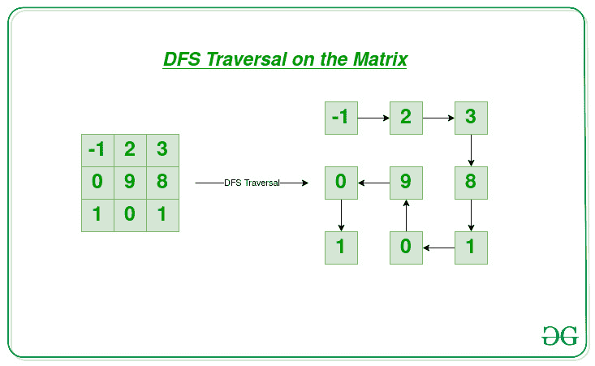

# 2D 阵列上的深度优先遍历

> 原文:[https://www . geesforgeks . org/depth-first-遍历-dfs-on-a-2d-array/](https://www.geeksforgeeks.org/depth-first-traversal-dfs-on-a-2d-array/)

给定维度为 **N * M** 的 [2D 阵列](https://www.geeksforgeeks.org/multidimensional-arrays-c-cpp/) **网格[][]** ，任务是在给定的 [2D 阵列](https://www.geeksforgeeks.org/multidimensional-arrays-in-java/)上执行[深度优先搜索](https://www.geeksforgeeks.org/depth-first-search-or-dfs-for-a-graph/)遍历。

**示例:**

> **输入:**网格[][] = {{-1，2，3}，{0，9，8}，{1，0，1}}
> **输出:** -1 2 3 8 1 0 9 0 1
> **解释:**使用 DFS 遍历矩阵元素的顺序是 **-1，2，3，8，1，0，9，0，1。**
> 
> 
> 
> **输入:**网格[][] = {{1，2，3}，{5，6，7}，{9，10，11 } }
> T3】输出: 1 2 3 7 11 10 6 5 9

**方法:**思路是使用[栈数据结构](https://www.geeksforgeeks.org/stack-data-structure/)在 [2D 数组](https://www.geeksforgeeks.org/dynamically-allocate-2d-array-c/)上执行 **DFS 遍历**。按照以下步骤解决给定的问题:

*   初始化一个[栈](https://www.geeksforgeeks.org/stack-data-structure/)，说 **S，**，起始单元格坐标为 **(0，0)** 。
*   初始化维度 **N * M** 的辅助布尔 [2D 数组](https://www.geeksforgeeks.org/multidimensional-arrays-c-cpp/)，所有值为**假**，用于标记访问的单元格。
*   声明一个函数 **isValid()** 来检查单元格坐标是否有效，即是否位于给定矩阵的边界内，是否未被访问。
*   当[栈不为空](https://www.geeksforgeeks.org/stack-empty-and-stack-size-in-c-stl/)时迭代，并执行以下步骤:
    *   [弹出](https://www.geeksforgeeks.org/stack-push-and-pop-in-c-stl/)堆栈顶部[的单元格](https://www.geeksforgeeks.org/stack-top-c-stl/)，并打印该单元格的元素。
    *   [通过使用 **isValid()** 功能检查与上述弹出单元格相邻的单元格是否有效，将它们推入堆栈。](https://www.geeksforgeeks.org/stack-push-and-pop-in-c-stl/)

**注意:**方向向量用于以给定的顺序遍历给定单元的相邻单元。例如， **(x，y)** 是一个需要遍历相邻单元格**(x–1，y)，(x，y + 1)，(x + 1，y)，(x，y–1)**的单元格，则可以使用方向向量 **(-1，0)，(0，1)，(1，0)，(0，-1)** 按照上、左、下、右的顺序进行。

下面是上述方法的实现:

## C++

```
// C++ program of the above approach
#include <bits/stdc++.h>
using namespace std;
#define ROW 3
#define COL 3

// Initialize direction vectors
int dRow[] = { 0, 1, 0, -1 };
int dCol[] = { -1, 0, 1, 0 };

// Function to check if mat[row][col]
// is unvisited and lies within the
// boundary of the given matrix
bool isValid(bool vis[][COL],
             int row, int col)
{
    // If cell is out of bounds
    if (row < 0 || col < 0
        || row >= ROW || col >= COL)
        return false;

    // If the cell is already visited
    if (vis[row][col])
        return false;

    // Otherwise, it can be visited
    return true;
}

// Function to perform DFS
// Traversal on the matrix grid[]
void DFS(int row, int col,
         int grid[][COL],
         bool vis[][COL])
{
    // Initialize a stack of pairs and
    // push the starting cell into it
    stack<pair<int, int> > st;
    st.push({ row, col });

    // Iterate until the
    // stack is not empty
    while (!st.empty()) {
        // Pop the top pair
        pair<int, int> curr = st.top();
        st.pop();
        int row = curr.first;
        int col = curr.second;

        // Check if the current popped
        // cell is a valid cell or not
        if (!isValid(vis, row, col))
            continue;

        // Mark the current
        // cell as visited
        vis[row][col] = true;

        // Print the element at
        // the current top cell
        cout << grid[row][col] << " ";

        // Push all the adjacent cells
        for (int i = 0; i < 4; i++) {
            int adjx = row + dRow[i];
            int adjy = col + dCol[i];
            st.push({ adjx, adjy });
        }
    }
}

// Driver Code
int main()
{
    int grid[ROW][COL] = { { -1, 2, 3 },
                           { 0, 9, 8 },
                           { 1, 0, 1 } };

    // Stores whether the current
    // cell is visited or not
    bool vis[ROW][COL];
    memset(vis, false, sizeof vis);

    // Function call
    DFS(0, 0, grid, vis);

    return 0;
}
```

## Java 语言(一种计算机语言，尤用于创建网站)

```
// Java program of the above approach
import java.util.Stack;

class GFG{

static int ROW = 3;
static int COL = 3;

// Initialize direction vectors
static int dRow[] = { 0, 1, 0, -1 };
static int dCol[] = { -1, 0, 1, 0 };

static class pair
{
    public int first;
    public int second;

    public pair(int first, int second)
    {
        this.first = first;
        this.second = second;
    }
}

static Boolean isValid(Boolean vis[][], int row,
                                        int col)
{

    // If cell is out of bounds
    if (row < 0 || col < 0 ||
        row >= ROW || col >= COL)
        return false;

    // If the cell is already visited
    if (vis[row][col])
        return false;

    // Otherwise, it can be visited
    return true;
}

// Function to perform DFS
// Traversal on the matrix grid[]
static void DFS(int row, int col, int grid[][],
                               Boolean vis[][])
{

    // Initialize a stack of pairs and
    // push the starting cell into it
    Stack<pair> st = new Stack<pair>();
    st.push(new pair(row, col));

    // Iterate until the
    // stack is not empty
    while (!st.empty())
    {

        // Pop the top pair
        pair curr = st.pop();

        row = curr.first;
        col = curr.second;

        // Check if the current popped
        // cell is a valid cell or not
        if (!isValid(vis, row, col))
            continue;

        // Mark the current
        // cell as visited
        vis[row][col] = true;

        // Print the element at
        // the current top cell
        System.out.print(grid[row][col] + " ");

        // Push all the adjacent cells
        for(int i = 0; i < 4; i++)
        {
            int adjx = row + dRow[i];
            int adjy = col + dCol[i];
            st.push(new pair(adjx, adjy));
        }
    }
}

// Driver code
public static void main(String[] args)
{
    int grid[][] = { { -1, 2, 3 },
                     { 0, 9, 8 },
                     { 1, 0, 1 } };

    Boolean vis[][] = new Boolean[ROW][COL];
    for(int i = 0; i < ROW; i++)
    {
        for(int j = 0; j < COL; j++)
        {
            vis[i][j] = false;
        }
    }

    // Function call
    DFS(0, 0, grid, vis);
}
}

// This code is contributed by abhinavjain194
```

## 蟒蛇 3

```
# Python 3 program of the above approach
ROW = 3
COL = 3

# Initialize direction vectors
dRow = [0, 1, 0, -1]
dCol = [-1, 0, 1, 0]
vis = [[False for i in range(3)] for j in range(3)]

# Function to check if mat[row][col]
# is unvisited and lies within the
# boundary of the given matrix
def isValid(row, col):
    global ROW
    global COL
    global vis

    # If cell is out of bounds
    if (row < 0 or col < 0 or row >= ROW or col >= COL):
        return False

    # If the cell is already visited
    if (vis[row][col]):
        return False

    # Otherwise, it can be visited
    return True

# Function to perform DFS
# Traversal on the matrix grid[]
def DFS(row, col, grid):
    global dRow
    global dCol
    global vis

    # Initialize a stack of pairs and
    # push the starting cell into it
    st = []
    st.append([row, col])

    # Iterate until the
    # stack is not empty
    while (len(st) > 0):
        # Pop the top pair
        curr = st[len(st) - 1]
        st.remove(st[len(st) - 1])
        row = curr[0]
        col = curr[1]

        # Check if the current popped
        # cell is a valid cell or not
        if (isValid(row, col) == False):
            continue

        # Mark the current
        # cell as visited
        vis[row][col] = True

        # Print the element at
        # the current top cell
        print(grid[row][col], end = " ")

        # Push all the adjacent cells
        for i in range(4):
            adjx = row + dRow[i]
            adjy = col + dCol[i]
            st.append([adjx, adjy])

# Driver Code
if __name__ == '__main__':
    grid =  [[-1, 2, 3],
             [0, 9, 8],
             [1, 0, 1]]

    # Function call
    DFS(0, 0, grid)

    # This code is contributed by SURENDRA_GANGWAR.
```

## C#

```
// C# program of the above approach
using System;
using System.Collections;

class GFG{

static int ROW = 3;
static int COL = 3;

// Initialize direction vectors
static int[] dRow = { 0, 1, 0, -1 };
static int[] dCol = { -1, 0, 1, 0 };

static bool isValid(bool[,] vis, int row, int col)
{

    // If cell is out of bounds
    if (row < 0 || col < 0 ||
        row >= ROW || col >= COL)
        return false;

    // If the cell is already visited
    if (vis[row,col])
        return false;

    // Otherwise, it can be visited
    return true;
}

// Function to perform DFS
// Traversal on the matrix grid[]
static void DFS(int row, int col,
                int[,] grid, bool[,] vis)
{

    // Initialize a stack of pairs and
    // push the starting cell into it
    Stack st = new Stack();
    st.Push(new Tuple<int, int>(row, col));

    // Iterate until the
    // stack is not empty
    while (st.Count > 0)
    {

        // Pop the top pair
        Tuple<int, int> curr = (Tuple<int, int>)st.Peek();
        st.Pop();

        row = curr.Item1;
        col = curr.Item2;

        // Check if the current popped
        // cell is a valid cell or not
        if (!isValid(vis, row, col))
            continue;

        // Mark the current
        // cell as visited
        vis[row, col] = true;

        // Print the element at
        // the current top cell
        Console.Write(grid[row, col] + " ");

        // Push all the adjacent cells
        for(int i = 0; i < 4; i++)
        {
            int adjx = row + dRow[i];
            int adjy = col + dCol[i];
            st.Push(new Tuple<int, int>(adjx, adjy));
        }
    }
}

// Driver code
static void Main()
{
    int[,] grid = { { -1, 2, 3 },
                    { 0, 9, 8 },
                    { 1, 0, 1 } };

    bool[,] vis = new bool[ROW, COL];
    for(int i = 0; i < ROW; i++)
    {
        for(int j = 0; j < COL; j++)
        {
            vis[i, j] = false;
        }
    }

    // Function call
    DFS(0, 0, grid, vis);
}
}

// This code is contributed by mukesh07
```

## java 描述语言

```
<script>

// Javascript program of the above approach
var ROW = 3;
var COL = 3

// Initialize direction vectors
var dRow = [0, 1, 0, -1];
var dCol = [ -1, 0, 1, 0];

// Function to check if mat[row][col]
// is unvisited and lies within the
// boundary of the given matrix
function isValid(vis, row, col)
{
    // If cell is out of bounds
    if (row < 0 || col < 0
        || row >= ROW || col >= COL)
        return false;

    // If the cell is already visited
    if (vis[row][col])
        return false;

    // Otherwise, it can be visited
    return true;
}

// Function to perform DFS
// Traversal on the matrix grid[]
function DFS(row, col,grid, vis)
{
    // Initialize a stack of pairs and
    // push the starting cell into it
    var st = [];
    st.push([ row, col ]);

    // Iterate until the
    // stack is not empty
    while (st.length!=0) {
        // Pop the top pair
        var curr = st[st.length-1];
        st.pop();
        var row = curr[0];
        var col = curr[1];

        // Check if the current popped
        // cell is a valid cell or not
        if (!isValid(vis, row, col))
            continue;

        // Mark the current
        // cell as visited
        vis[row][col] = true;

        // Print the element at
        // the current top cell
        document.write( grid[row][col] + " ");

        // Push all the adjacent cells
        for (var i = 0; i < 4; i++) {
            var adjx = row + dRow[i];
            var adjy = col + dCol[i];
            st.push([ adjx, adjy ]);
        }
    }
}

// Driver Code
var grid = [ [ -1, 2, 3 ],
                       [ 0, 9, 8 ],
                       [ 1, 0, 1 ] ];
// Stores whether the current
// cell is visited or not
var vis = Array.from(Array(ROW), ()=> Array(COL).fill(false));
// Function call
DFS(0, 0, grid, vis);

</script>
```

**Output:** 

```
-1 2 3 8 1 0 9 0 1
```

***时间复杂度:** O(N * M)*
***辅助空间:** O(N * M )*