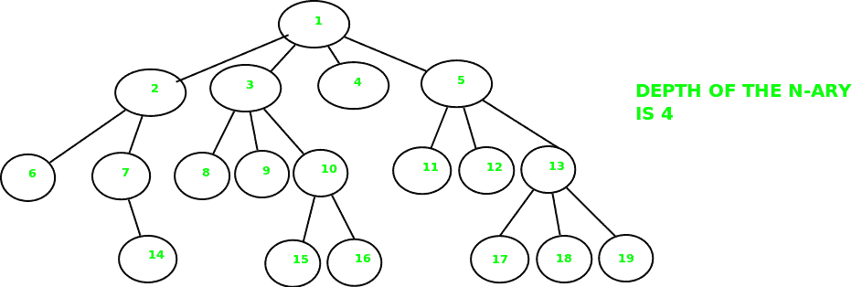
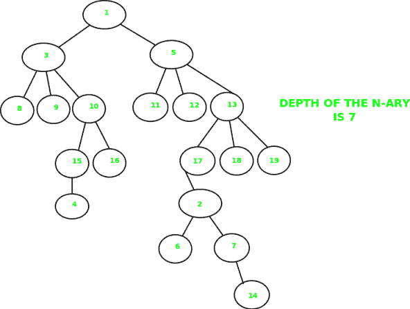

# N 元树的深度

> 原文:[https://www.geeksforgeeks.org/depth-n-ary-tree/](https://www.geeksforgeeks.org/depth-n-ary-tree/)

给定一棵 [N 元树](https://en.wikipedia.org/wiki/K-ary_tree)，找到树的深度。N 元树是节点最多可以有 N 个**子节点的树。
**例:**
例 1:** 



示例 2:



n 元树可以像普通树一样被遍历。我们只需要考虑给定节点的所有子节点，并在每个节点上递归调用该函数。

## C++

```
// C++ program to find the height of
// an N-ary tree
#include <bits/stdc++.h>
using namespace std;

// Structure of a node of an n-ary tree
struct Node
{
   char key;
   vector<Node *> child;
};

// Utility function to create a new tree node
Node *newNode(int key)
{
   Node *temp = new Node;
   temp->key = key;
   return temp;
}

// Function that will return the depth
// of the tree
int depthOfTree(struct Node *ptr)
{
    // Base case
    if (!ptr)
        return 0;

    // Check for all children and find
    // the maximum depth
    int maxdepth = 0;
    for (vector<Node*>::iterator it = ptr->child.begin();
                              it != ptr->child.end(); it++)
        maxdepth = max(maxdepth, depthOfTree(*it));

    return maxdepth + 1 ;
}

// Driver program
int main()
{
   /*   Let us create below tree
   *             A
   *         / /  \  \
   *       B  F   D  E
   *      / \    |  /|\
   *     K  J    G  C H I
   *      /\            \
   *    N   M            L
   */

   Node *root = newNode('A');
   (root->child).push_back(newNode('B'));
   (root->child).push_back(newNode('F'));
   (root->child).push_back(newNode('D'));
   (root->child).push_back(newNode('E'));
   (root->child[0]->child).push_back(newNode('K'));
   (root->child[0]->child).push_back(newNode('J'));
   (root->child[2]->child).push_back(newNode('G'));
   (root->child[3]->child).push_back(newNode('C'));
   (root->child[3]->child).push_back(newNode('H'));
   (root->child[3]->child).push_back(newNode('I'));
   (root->child[0]->child[0]->child).push_back(newNode('N'));
   (root->child[0]->child[0]->child).push_back(newNode('M'));
   (root->child[3]->child[2]->child).push_back(newNode('L'));

   cout << depthOfTree(root) << endl;

   return 0;
}
```

## Java 语言(一种计算机语言，尤用于创建网站)

```
// Java program to find the height of
// an N-ary tree
import java.util.*;

class GFG
{

// Structure of a node of an n-ary tree
static class Node
{
    char key;
    Vector<Node > child;
};

// Utility function to create a new tree node
static Node newNode(int key)
{
    Node temp = new Node();
    temp.key = (char) key;
    temp.child = new Vector<Node>();
    return temp;
}

// Function that will return the depth
// of the tree
static int depthOfTree(Node ptr)
{
    // Base case
    if (ptr == null)
        return 0;

    // Check for all children and find
    // the maximum depth
    int maxdepth = 0;
    for (Node it : ptr.child)
        maxdepth = Math.max(maxdepth,
                            depthOfTree(it));

    return maxdepth + 1 ;
}

// Driver Code
public static void main(String[] args)
{
    /* Let us create below tree
    *             A
    *         / / \ \
    *     B F D E
    *     / \ | /|\
    *     K J G C H I
    *     /\         \
    * N M         L
    */

    Node root = newNode('A');
    (root.child).add(newNode('B'));
    (root.child).add(newNode('F'));
    (root.child).add(newNode('D'));
    (root.child).add(newNode('E'));
    (root.child.get(0).child).add(newNode('K'));
    (root.child.get(0).child).add(newNode('J'));
    (root.child.get(2).child).add(newNode('G'));
    (root.child.get(3).child).add(newNode('C'));
    (root.child.get(3).child).add(newNode('H'));
    (root.child.get(3).child).add(newNode('I'));
    (root.child.get(0).child.get(0).child).add(newNode('N'));
    (root.child.get(0).child.get(0).child).add(newNode('M'));
    (root.child.get(3).child.get(2).child).add(newNode('L'));

    System.out.print(depthOfTree(root) + "\n");
}
}

// This code is contributed by Rajput-Ji
```

## C#

```
// C# program to find the height of
// an N-ary tree
using System;
using System.Collections.Generic;

class GFG
{

// Structure of a node of an n-ary tree
public class Node
{
    public char key;
    public List<Node > child;
};

// Utility function to create a new tree node
static Node newNode(int key)
{
    Node temp = new Node();
    temp.key = (char) key;
    temp.child = new List<Node>();
    return temp;
}

// Function that will return the depth
// of the tree
static int depthOfTree(Node ptr)
{
    // Base case
    if (ptr == null)
        return 0;

    // Check for all children and find
    // the maximum depth
    int maxdepth = 0;
    foreach (Node it in ptr.child)
        maxdepth = Math.Max(maxdepth,
                            depthOfTree(it));

    return maxdepth + 1 ;
}

// Driver Code
public static void Main(String[] args)
{

    /* Let us create below tree
    *             A
    *         / / \ \
    *     B F D E
    *     / \ | /|\
    *     K J G C H I
    *     /\         \
    * N M         L
    */
    Node root = newNode('A');
    (root.child).Add(newNode('B'));
    (root.child).Add(newNode('F'));
    (root.child).Add(newNode('D'));
    (root.child).Add(newNode('E'));
    (root.child[0].child).Add(newNode('K'));
    (root.child[0].child).Add(newNode('J'));
    (root.child[2].child).Add(newNode('G'));
    (root.child[3].child).Add(newNode('C'));
    (root.child[3].child).Add(newNode('H'));
    (root.child[3].child).Add(newNode('I'));
    (root.child[0].child[0].child).Add(newNode('N'));
    (root.child[0].child[0].child).Add(newNode('M'));
    (root.child[3].child[2].child).Add(newNode('L'));

    Console.Write(depthOfTree(root) + "\n");
}
}

// This code is contributed by Rajput-Ji
```

## java 描述语言

```
<script>

// JavaScript program to find the height of
// an N-ary tree

// Structure of a node of an n-ary tree
class Node
{
    constructor()
    {
        this.key = 0;
        this.child = [];
    }
};

// Utility function to create a new tree node
function newNode(key)
{
    var temp = new Node();
    temp.key =  key;
    temp.child = [];
    return temp;
}

// Function that will return the depth
// of the tree
function depthOfTree(ptr)
{
    // Base case
    if (ptr == null)
        return 0;

    // Check for all children and find
    // the maximum depth
    var maxdepth = 0;
    for(var it of ptr.child)
        maxdepth = Math.max(maxdepth,
                            depthOfTree(it));

    return maxdepth + 1 ;
}

// Driver Code

/* Let us create below tree
*             A
*         / / \ \
*     B F D E
*     / \ | /|\
*     K J G C H I
*     /\         \
* N M         L
*/
var root = newNode('A');
(root.child).push(newNode('B'));
(root.child).push(newNode('F'));
(root.child).push(newNode('D'));
(root.child).push(newNode('E'));
(root.child[0].child).push(newNode('K'));
(root.child[0].child).push(newNode('J'));
(root.child[2].child).push(newNode('G'));
(root.child[3].child).push(newNode('C'));
(root.child[3].child).push(newNode('H'));
(root.child[3].child).push(newNode('I'));
(root.child[0].child[0].child).push(newNode('N'));
(root.child[0].child[0].child).push(newNode('M'));
(root.child[3].child[2].child).push(newNode('L'));
document.write(depthOfTree(root) + "<br>");

</script>
```

**输出:**

```
4
```

本文由 [**舒巴姆·古普塔**](https://www.facebook.com/Shubh1307) 供稿。如果你喜欢 GeeksforGeeks 并想投稿，你也可以使用[write.geeksforgeeks.org](https://write.geeksforgeeks.org)写一篇文章或者把你的文章邮寄到 review-team@geeksforgeeks.org。看到你的文章出现在极客博客主页上，帮助其他极客。
如果发现有不正确的地方，或者想分享更多关于上述话题的信息，请写评论。