# 用黄金分割率推导斐波那契数的表达式

> 原文:[https://www . geeksforgeeks . org/推导黄金分割率中斐波那契数的表达式/](https://www.geeksforgeeks.org/deriving-the-expression-of-fibonacci-numbers-in-terms-of-golden-ratio/)

**先决条件:** [生成函数](https://en.wikipedia.org/wiki/Generating_function)[斐波那契数](https://www.geeksforgeeks.org/interesting-facts-fibonacci-numbers/)[寻找斐波那契数的方法](https://www.geeksforgeeks.org/program-for-nth-fibonacci-number/)。

利用[生成函数](https://en.wikipedia.org/wiki/Generating_function)求解著名且有用的[斐波那契数](https://www.geeksforgeeks.org/program-for-nth-fibonacci-number/)递推的方法，本文已经讨论过了。

**生成函数**是解决各种数学问题的强大工具，包括计数问题。它是一个正式的幂级数。例如，在计算问题时，我们经常对寻找大小物体的数量感兴趣。在这种情况下，我们定义一个幂级数，简单来说就是一个无限项多项式，其中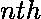次项的系数是序列的项。这有助于我们发现许多有趣而重要的结果。需要注意的是，在使用母函数时，我们一般使用母函数幂级数中的系数，很少使用级数中的变量。在这个职位上，我们也将这样做。某些 a n 的普通生成函数是:

> 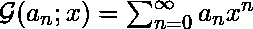

[斐波那契数](https://www.geeksforgeeks.org/program-for-nth-fibonacci-number/)是数学中的基本数列之一，人们已经发现了许多方法来找出这个数列的高阶项。这篇文章讨论了这样一种方法。

让我们首先为斐波那契数定义一个生成函数，然后将该函数简化以得到一个递归。利用这一点，扩展简化并将其分解为部分分数，然后使用两个标准幂级数，然后将它们结合起来，得出斐波那契数列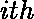项的惊人结果。

让我们将生成函数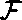定义为

> 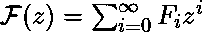
> 
> 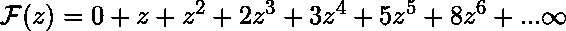，
> 
> 其中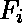是第 I 个斐波那契数。

因为，

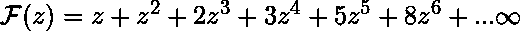。

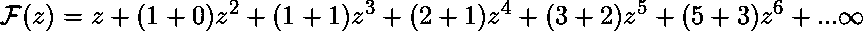。

重新排列我们得到的，

![\mathcal{F}(z) = z + [z^2 + z^3 + 2z^4 + 3z^5 + 5z^6 + ... \infty] + [0 + z^3 + z^4 + 2z^5 + 3z^6 + ... \infty]](img/12e090d559b564effa3b75bafe1c2ec9.png "Rendered by QuickLaTeX.com")。

用通用术语来说，

![\mathcal{F}(z) = z + (z)[z + z^2 + 2z^3 + 3z^4 + 5z^5 + ... \infty]](img/391fe8b7aa0e0aa497213d62a9bdba44.png "Rendered by QuickLaTeX.com")
![+ (z^2)[0 + z^1 + z^2 + z^3 + 3z^4 + ... \infty]](img/d0e877b5453783d6a16ef2b299b79fa9.png "Rendered by QuickLaTeX.com")

进一步简化，得到下面的函数。

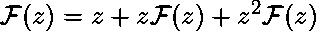。

求解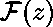，我们得到:

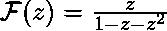。

通过以上运算，我们得到以下公式:

> 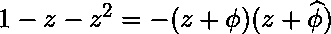，
> 
> 其中，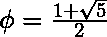和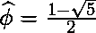。

因此，

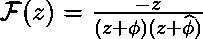
还要注意的是，

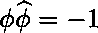。

因此，保持上面表达式中的关系，我们得到，

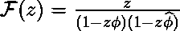。

现在，上面表达式的右边可以分成部分分数，

![\mathcal{F}(z) = \frac{1}{\sqrt{5}}\left [ \frac{1}{(1-\phi z)} - \frac{1}{(1-\widehat{\phi} z)}\right ]](img/58db6900b02ada2ad2c4665a1ee7a00f.png "Rendered by QuickLaTeX.com")。

在两个分数上使用[展开](https://en.wikipedia.org/wiki/Series_expansion)，

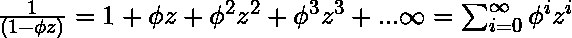。

同样的，

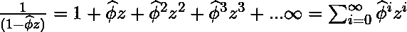。

因此，

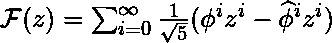。

因此，

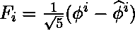。

现在，

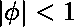，

还有，

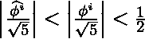

利用以上两个事实，可以有把握地得出结论

> 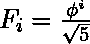，四舍五入到最接近的整数。

[利用黄金分割比](https://www.geeksforgeeks.org/find-nth-fibonacci-number-using-golden-ratio/)求第 n 个斐波那契数就是这个公式的应用之一。