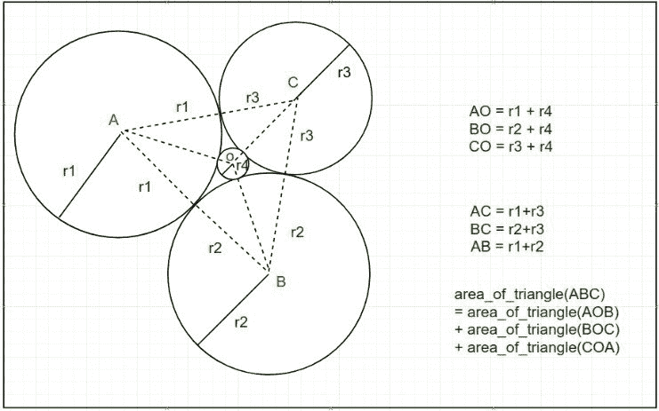
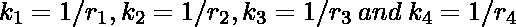
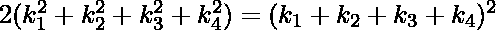
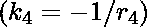
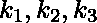
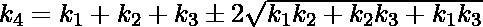
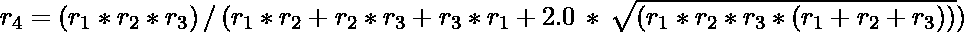

# 笛卡尔圆定理及其实现

> 原文:[https://www . geeksforgeeks . org/笛卡尔-圆-定理-带实现/](https://www.geeksforgeeks.org/descartes-circle-theorem-with-implementation/)

在几何学中，**笛卡尔定理**指出，对于每四个**相互相切的**圆**，圆的半径满足某个二次方程。可以构造与三个给定的相互相切的圆相切的第四个圆。
笛卡儿圆定理**帮助我们在有如下图所示的正整数半径 **r1** 、 **r2** 、 **r3** 和 **r4** 的圆时，求圆的半径。找到如下图所示的三个半径为 **r1** 、 **r2** 、 **r3** 的圆的半径 **r4** 。
(注意下图中的圆是相切的。)



**例:**

> **输入:** r1 = 1，r2 = 1，r3 = 1
> **输出:** 0.154701
> **输入:** r1 =23，r2 = 46，r3 = 69
> **输出:** 6.000000

定理说这些圆的半径或“曲率”的倒数

> 
> 满足以下关系:
> 

其中一个圆可以包含在其余三个圆中，如图所示，在这种情况下，这里对应的曲率被认为是负的，并且上述关系仍然成立。
如果已知，可以解为 k4、

在解上面的方程时我们得到第四个圆的半径。求第四个圆半径的公式为:

> 

因此，如果 r1、r2 和 r3 已知，r4 可以很容易地用上述公式计算。
以下是上述方法的实现:

## 卡片打印处理机（Card Print Processor 的缩写）

```
// C++ implementation of the
// above formulae
#include <bits/stdc++.h>
using namespace std;

// Function to find the fourth circle's
// when three radius are given
double findRadius(double r1, double r2, double r3)
{
    double r4 = (r1 * r2 * r3)
                / (r1 * r2 + r2 * r3
                   + r1 * r3 + 2.0 * sqrt(r1 * r2 * r3 * (r1 + r2 + r3)));

    return r4;
}

// Driver code
int main()
{
    // Radius of three circles
    double r1 = 1;
    double r2 = 1;
    double r3 = 1;

    // Calculation of r4 using formula given above
    double r4 = findRadius(r1, r2, r3);

    cout << "The radius of fourth circle: " << r4;
    return 0;
}
```

## Java 语言(一种计算机语言，尤用于创建网站)

```
/*package whatever //do not write package name here */
// Java implementation of the
// above formulae
import java.io.*;

class GFG
{

        // Function to find the fourth circle's
        // when three radius are given
        static double findRadius(double r1, double r2, double r3)
        {
        double r4 = (r1 * r2 * r3)
                / (r1 * r2 + r2 * r3
                   + r1 * r3 + 2.0 * Math.sqrt(r1 * r2 * r3 * (r1 + r2 + r3)));

        return r4;
        }

      // Driver code
    public static void main (String[] args)
    {

        // Radius of three circles
    double r1 = 1;
    double r2 = 1;
    double r3 = 1;

    // Calculation of r4 using formula given above
    double r4 = findRadius(r1, r2, r3);
        System.out.println("The radius of fourth circle: " + r4);
    }
}

// This code is contributed by CoderSaty.
```

## 蟒蛇 3

```
# Python 3 implementation of the
# above formulae

from math import sqrt

# Function to find the fourth circle's
# when three radius are given
def findRadius(r1, r2, r3):
    r4 = (r1 * r2 * r3) / (r1 * r2 + r2 * r3 + r1 * r3 + 2.0 * sqrt(r1 * r2 * r3 * (r1 + r2 + r3)))

    return r4

# Driver code
if __name__ == '__main__':

    # Radius of three circles
    r1 = 1
    r2 = 1
    r3 = 1

    # Calculation of r4 using formula given above
    r4 = findRadius(r1, r2, r3)

    print("The radius of fourth circle:",r4)

    # This code is contributed by SURENDRA_GANGWAR.
```

## C#

```
// C# implementation of the
// above formulae
using System;

class GFG
{

  // Function to find the fourth circle's
  // when three radius are given
  static double findRadius(double r1, double r2, double r3)
  {
    double r4 = (r1 * r2 * r3)
      / (r1 * r2 + r2 * r3
         + r1 * r3 + 2.0 * Math.Sqrt(r1 * r2 * r3 * (r1 + r2 + r3)));

    return r4;
  }

  // Driver code
  public static void Main (String[] args)
  {

    // Radius of three circles
    double r1 = 1;
    double r2 = 1;
    double r3 = 1;

    // Calculation of r4 using formula given above
    double r4 = Math.Round(findRadius(r1, r2, r3),6);

    Console.Write("The radius of fourth circle: " + r4);
  }
}

// This code is contributed by shivanisinghss2110
```

## java 描述语言

```
<script>
// Javascript implementation of the
// above formulae

// Function to find the fourth circle's
// when three radius are given
function findRadius(r1, r2, r3) {
  let r4 =
    (r1 * r2 * r3) /
    (r1 * r2 +
      r2 * r3 +
      r1 * r3 +
      2.0 * Math.sqrt(r1 * r2 * r3 * (r1 + r2 + r3)));

  return r4.toFixed(6);
}

// Driver code

// Radius of three circles
let r1 = 1;
let r2 = 1;
let r3 = 1;

// Calculation of r4 using formula given above
let r4 = findRadius(r1, r2, r3);

document.write("The radius of fourth circle: " + r4);

// This code is contributed by gfgking.
</script>
```

**Output:** 

```
The radius of fourth circle: 0.154701
```