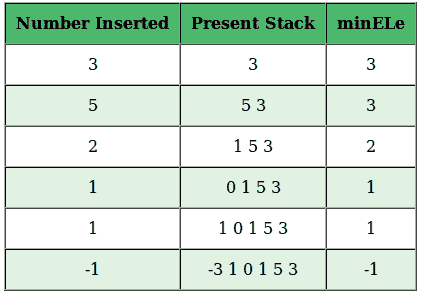

# 使用支持 O(1)时间和 O(1)额外空间的 getMin()的数组设计动态堆栈

> 原文:[https://www . geesforgeks . org/design-a-dynamic-stack-using-arrays-support-getmin-in-O1-time-and-O1-extra-space/](https://www.geeksforgeeks.org/design-a-dynamic-stack-using-arrays-that-supports-getmin-in-o1-time-and-o1-extra-space/)

使用[数组](https://www.geeksforgeeks.org/array-data-structure/)设计一个特殊的动态[堆栈](https://www.geeksforgeeks.org/stack-data-structure/)，该数组支持所有堆栈操作，如 **push()** 、 **pop()** 、 **peek()、isEmpty()** 和 **getMin()** 在恒定的时间和空间复杂度下的操作。

**示例:**

> 假设从右到左方向为从上到下方向，并执行以下操作:
> 
> 1.  **推(10):** 10 加到栈顶。此后，堆栈修改为{10}。
> 2.  **Push(4):** 4 加到栈顶。此后，堆栈修改为{10，4}。
> 3.  **推(9):** 9 加到栈顶。此后，堆栈修改为{10，4，9}。
> 4.  **推(6):** 6 加到栈顶。此后，堆栈修改为{10，4，9，6}。
> 5.  **Push(5):** 5 加到栈顶。此后，堆栈修改为{10，4，9，6，5}。
> 6.  **Peek():** 打印堆栈 5 的顶部元素。
> 7.  **getMin():** 打印堆栈 4 的最小元素。
> 8.  **Pop():** 从堆栈中删除最上面的元素 5。此后，堆栈修改为{10，4，9，6}。
> 9.  **Pop():** 从堆栈中删除最上面的元素 6。此后，堆栈修改为{10，4，9}。
> 10.  **Pop():** 从堆栈中删除最上面的元素 9。此后，堆栈修改为{10，4}。
> 11.  **Pop():** 从堆栈中删除最上面的元素 4。此后，堆栈修改为{10}。
> 12.  **Peek():** 打印堆栈 10 的顶部元素。
> 13.  **getMin():** 打印堆栈 10 的最小元素。

**方法:**要使用数组实现动态堆栈，想法是每次数组变满时将数组的大小增加一倍。按照以下步骤解决问题:

*   初始化一个数组，比如说 **arr[]** 用一个初始大小 **5** 来实现堆栈。
*   另外，初始化两个变量，比如说 **top** 和 **minEle** 来存储堆栈的 [top 元素的索引和堆栈的最小元素。](https://www.geeksforgeeks.org/stack-top-c-stl/)
*   现在，执行以下堆栈操作:
    *   **isEmpty():** 检查[堆栈是否为空](https://www.geeksforgeeks.org/stack-empty-method-in-java/)。
        *   如果**顶部**小于或等于 **0** ，则返回真。否则，返回 false。
    *   **推(x):** 在堆栈顶部插入 **x** 。
        *   如果栈是空的，将 **x** 插入栈中，使 **minEle** 等于 **x** 。
        *   如果堆栈不为空，将 **x** 与 **minEle** 进行比较。出现了两种情况:
            *   如果 **x** 大于或等于 **minEle** ，只需插入 **x** 。
            *   如果 **x** 小于 **minEle** ，则将**(2 * x–minEle)**插入堆栈，使 **minEle** 等于 **x** 。
        *   如果使用的数组已满，则将数组的大小加倍，然后将前一个数组的所有元素复制到新数组中，然后将新数组的地址分配给原始数组。此后，如上所述执行推送操作。
    *   **Pop():** 从堆栈顶部移除元素。
        *   让移除的元素为 **y** 。出现了两种情况
        *   如果 **y** 大于或等于 **minEle** ，则堆栈中的最小元素仍然是 **minEle** 。
        *   如果 **y** 小于 **minEle** ，最小元素现在变成**(2 * minEle–y)**，所以更新 **minEle** 为 **minEle = 2*minEle-y** 。
    *   **getMin():** 求栈的最小值。
        *   如果堆栈不为空，则返回 **minEle** 的值。否则，返回“ **-1** ”并打印“**底流**”。

插图:

**推(x)**



*   要插入的数字:3，堆栈为空，所以在堆栈中插入 3，minEle = 3。
*   要插入的数字:5，堆栈不为空，5> minEle，在堆栈中插入 5，minEle = 3。
*   要插入的数字:2，堆栈不为空，2< minEle，将(2*2-3 = 1)插入堆栈，minEle = 2。
*   要插入的数字:1，堆栈不为空，1< minEle，将(2*1-2 = 0)插入堆栈，minEle = 1。
*   要插入的数字:1，堆栈不为空，1 = minEle，在堆栈中插入 1，minEle = 1。
*   要插入的数字:-1，堆栈不为空，-1 < minEle，将(2 *-1–1 =-3)插入堆栈，minEle = -1。

**【pop()**


*   最初堆栈中的最小元素 minEle 是-1。
*   删除的数字:-3，因为-3 小于最小元素，所以要删除的原始数字是-1，新的数字是= 2 *-1 –(-3)= 1
*   移除的数字:1，1 == minEle，所以移除的数字是 1，minEle 仍然等于 1。
*   删除的数字:0，0< minEle，原始数字是 minEle，即 1，新的 minEle = 2 * 1–0 = 2。
*   移除的号码:1，1< minEle，原始号码是 minEle，它是 2，新的 minEle = 2 * 2–1 = 3。
*   移除的数字:5，5> minEle，原始数字是 5，minEle 仍然是 3

下面是上述方法的实现:

## C++

```
// C++ program for the above approach
#include <bits/stdc++.h>
using namespace std;

// A class to create
// our special stack
class Stack {
private:

    // Initial size of
    // the Array
    int Max = 5;

    // Array for the stack
    // implementation
    int* arr = new int(Max);

    // Stores the minimum
    // Element of the stack
    int minEle = 0;

    // Stores the top element
    // of the stack
    int top = 0;

public:
    // Method to check whether
    // stack is empty or not
    bool empty()
    {
        if (top <= 0) {
            return true;
        }
        else {
            return false;
        }
    }
    // Method to push elements
    // to the Special Stack
    void push(int x)
    {
        // If stack is empty
        if (empty()) {

            // Assign x to minEle
            minEle = x;

            // Assign x to arr[top]
            arr[top] = x;

            // Increment top by 1
            top++;
        }
        // If array is full
        else if (top == Max) {

            // Update the Max size
            Max = 2 * Max;

            int* temp = new int(Max);

            // Traverse the array arr[]
            for (int i = 0; i < top; i++) {
                temp[i] = arr[i];
            }

            // If x is less than minEle
            if (x < minEle) {

                // Push 2*x-minEle
                temp[top] = 2 * x - minEle;

                // Assign x to minEle
                minEle = x;

                top++;
            }
            // Else
            else {

                // Push x to stack
                temp[top] = x;
                top++;
            }
            // Assign address of the
            // temp to arr
            arr = temp;
        }
        else {
            // If x is less
            // than minEle
            if (x < minEle) {

                // Push 2*x-minEle
                arr[top] = 2 * x - minEle;
                top++;

                // Update minEle
                minEle = x;
            }
            else {
                // Push x to the
                // stack
                arr[top] = x;
                top++;
            }
        }
    }
    // Method to pop the elements
    // from the stack.
    void pop()
    {
        // If stack is empty
        if (empty()) {
            cout << "Underflow" << endl;
            return;
        }
        // Stores the top element
        // of the stack
        int t = arr[top - 1];

        // If t is less than
        // the minEle
        if (t < minEle) {
            // Pop the minEle
            cout << "Popped element : " << minEle << endl;

            // Update minEle
            minEle = 2 * minEle - t;
        }
        // Else
        else {
            // Pop the topmost element
            cout << "Popped element : " << t << endl;
        }
        top--;
        return;
    }

    // Method to find the topmost
    // element of the stack
    int peek()
    {
        // If stack is empty
        if (empty()) {
            cout << "Underflow" << endl;
            return -1;
        }

        // Stores the top element
        // of the stack
        int t = arr[top - 1];

        // If t is less than
        // the minEle
        if (t < minEle) {
            return minEle;
        }
        // Else
        else {
            return t;
        }
    }
    // Method to find the Minimum
    // element of the Special stack
    int getMin()
    {
        // If stack is empty
        if (empty()) {
            cout << "Underflow" << endl;
            return -1;
        }
        // Else
        else {
            return minEle;
        }
    }
};
// Driver Code
int main()
{
    Stack S;

    S.push(10);
    S.push(4);
    S.push(9);
    S.push(6);
    S.push(5);

    cout << "Top Element : " << S.peek() << endl;

    cout << "Minimum Element : " << S.getMin() << endl;

    S.pop();
    S.pop();
    S.pop();
    S.pop();

    cout << "Top Element : " << S.peek() << endl;
    cout << "Minimum Element : " << S.getMin() << endl;

    return 0;
}
```

## Java 语言(一种计算机语言，尤用于创建网站)

```
// Java program for the above approach
public class Main
{
    // Initial size of
    // the Array
    static int Max = 5;

    // Array for the stack
    // implementation
    static int[] arr = new int[Max];

    // Stores the minimum
    // Element of the stack
    static int minEle = 0;

    // Stores the top element
    // of the stack
    static int Top = 0;

    // Method to check whether
    // stack is empty or not
    static boolean empty()
    {
        if (Top <= 0) {
            return true;
        }
        else {
            return false;
        }
    }
    // Method to push elements
    // to the Special Stack
    static void push(int x)
    {
        // If stack is empty
        if (empty()) {

            // Assign x to minEle
            minEle = x;

            // Assign x to arr[top]
            arr[Top] = x;

            // Increment top by 1
            Top++;
        }
        // If array is full
        else if (Top == Max) {

            // Update the Max size
            Max = 2 * Max;

            int[] temp = new int[Max];

            // Traverse the array arr[]
            for (int i = 0; i < Top; i++) {
                temp[i] = arr[i];
            }

            // If x is less than minEle
            if (x < minEle) {

                // Push 2*x-minEle
                temp[Top] = 2 * x - minEle;

                // Assign x to minEle
                minEle = x;

                Top++;
            }
            // Else
            else {

                // Push x to stack
                temp[Top] = x;
                Top++;
            }
            // Assign address of the
            // temp to arr
            arr = temp;
        }
        else {
            // If x is less
            // than minEle
            if (x < minEle) {

                // Push 2*x-minEle
                arr[Top] = 2 * x - minEle;
                Top++;

                // Update minEle
                minEle = x;
            }
            else {
                // Push x to the
                // stack
                arr[Top] = x;
                Top++;
            }
        }
    }
    // Method to pop the elements
    // from the stack.
    static void pop()
    {
        // If stack is empty
        if (empty()) {
            System.out.print("Underflow");
            return;
        }
        // Stores the top element
        // of the stack
        int t = arr[Top - 1];

        // If t is less than
        // the minEle
        if (t < minEle) {
            // Pop the minEle
            System.out.println("Popped element : " + minEle);

            // Update minEle
            minEle = 2 * minEle - t;
        }
        // Else
        else {
            // Pop the topmost element
            System.out.println("Popped element : " + t);
        }
        Top--;
        return;
    }

    // Method to find the topmost
    // element of the stack
    static int peek()
    {
        // If stack is empty
        if (empty()) {
            System.out.println("Underflow");
            return -1;
        }

        // Stores the top element
        // of the stack
        int t = arr[Top - 1];

        // If t is less than
        // the minEle
        if (t < minEle) {
            return minEle;
        }
        // Else
        else {
            return t;
        }
    }
    // Method to find the Minimum
    // element of the Special stack
    static int getMin()
    {
        // If stack is empty
        if (empty()) {
            System.out.println("Underflow");
            return -1;
        }
        // Else
        else {
            return minEle;
        }
    }

  // Driver code
    public static void main(String[] args) {
        push(10);
        push(4);
        push(9);
        push(6);
        push(5);

        System.out.println("Top Element : " + peek());

        System.out.println("Minimum Element : " + getMin());

        pop();
        pop();
        pop();
        pop();

        System.out.println("Top Element : " + peek());
        System.out.println("Minimum Element : " + getMin());
    }
}

// This code is contributed by rameshtravel07.
```

## 蟒蛇 3

```
# Python3 program for the above approach

# Initial size of
# the Array
Max = 5

# Array for the stack
# implementation
arr = [0]*Max

# Stores the minimum
# Element of the stack
minEle = 0

# Stores the top element
# of the stack
Top = 0

# Method to check whether
# stack is empty or not
def empty():

    if (Top <= 0):
        return True
    else:
        return False

# Method to push elements
# to the Special Stack
def push(x):
    global arr, Top, Max, minEle

    # If stack is empty
    if empty():

        # Assign x to minEle
        minEle = x

        # Assign x to arr[top]
        arr[Top] = x

        # Increment top by 1
        Top+=1
    # If array is full
    elif (Top == Max):

        # Update the Max size
        Max = 2 * Max

        temp = [0]*Max

        # Traverse the array arr[]
        for i in range(Top):
            temp[i] = arr[i]

        # If x is less than minEle
        if (x < minEle):
            # Push 2*x-minEle
            temp[Top] = 2 * x - minEle

            # Assign x to minEle
            minEle = x

            Top+=1
        # Else
        else:
            # Push x to stack
            temp[Top] = x
            Top+=1
        # Assign address of the
        # temp to arr
        arr = temp
    else:
        # If x is less
        # than minEle
        if (x < minEle):
            # Push 2*x-minEle
            arr[Top] = 2 * x - minEle
            Top+=1

            # Update minEle
            minEle = x
        else:
            # Push x to the
            # stack
            arr[Top] = x
            Top+=1

# Method to pop the elements
# from the stack.
def pop():
    global Top, minEle

    # If stack is empty
    if empty():
        print("Underflow")
        return

    # Stores the top element
    # of the stack
    t = arr[Top - 1]

    # If t is less than
    # the minEle
    if (t < minEle) :
        # Pop the minEle
        print("Popped element :", minEle)

        # Update minEle
        minEle = 2 * minEle - t
    # Else
    else:
        # Pop the topmost element
        print("Popped element :", t)
    Top-=1
    return

# Method to find the topmost
# element of the stack
def peek():
    # If stack is empty
    if empty():
        print("Underflow")
        return -1

    # Stores the top element
    # of the stack
    t = arr[Top - 1]

    # If t is less than
    # the minEle
    if (t < minEle):
        return minEle
    # Else
    else:
        return t

# Method to find the Minimum
# element of the Special stack
def getMin():
    # If stack is empty
    if empty():
        print("Underflow")
        return -1

    # Else
    else:
        return minEle

push(10)
push(4)
push(9)
push(6)
push(5)

print("Top Element :", peek())

print("Minimum Element :", getMin())

pop()
pop()
pop()
pop()

print("Top Element :", peek())
print("Minimum Element :", getMin())

# This code is contributed by mukesh07.
```

## C#

```
// C# program for the above approach
using System;
class GFG {

    // Initial size of
    // the Array
    static int Max = 5;

    // Array for the stack
    // implementation
    static int[] arr = new int[Max];

    // Stores the minimum
    // Element of the stack
    static int minEle = 0;

    // Stores the top element
    // of the stack
    static int Top = 0;

    // Method to check whether
    // stack is empty or not
    static bool empty()
    {
        if (Top <= 0) {
            return true;
        }
        else {
            return false;
        }
    }
    // Method to push elements
    // to the Special Stack
    static void push(int x)
    {
        // If stack is empty
        if (empty()) {

            // Assign x to minEle
            minEle = x;

            // Assign x to arr[top]
            arr[Top] = x;

            // Increment top by 1
            Top++;
        }
        // If array is full
        else if (Top == Max) {

            // Update the Max size
            Max = 2 * Max;

            int[] temp = new int[Max];

            // Traverse the array arr[]
            for (int i = 0; i < Top; i++) {
                temp[i] = arr[i];
            }

            // If x is less than minEle
            if (x < minEle) {

                // Push 2*x-minEle
                temp[Top] = 2 * x - minEle;

                // Assign x to minEle
                minEle = x;

                Top++;
            }
            // Else
            else {

                // Push x to stack
                temp[Top] = x;
                Top++;
            }
            // Assign address of the
            // temp to arr
            arr = temp;
        }
        else {
            // If x is less
            // than minEle
            if (x < minEle) {

                // Push 2*x-minEle
                arr[Top] = 2 * x - minEle;
                Top++;

                // Update minEle
                minEle = x;
            }
            else {
                // Push x to the
                // stack
                arr[Top] = x;
                Top++;
            }
        }
    }
    // Method to pop the elements
    // from the stack.
    static void pop()
    {
        // If stack is empty
        if (empty()) {
            Console.WriteLine("Underflow");
            return;
        }
        // Stores the top element
        // of the stack
        int t = arr[Top - 1];

        // If t is less than
        // the minEle
        if (t < minEle) {
            // Pop the minEle
            Console.WriteLine("Popped element : " + minEle);

            // Update minEle
            minEle = 2 * minEle - t;
        }
        // Else
        else {
            // Pop the topmost element
            Console.WriteLine("Popped element : " + t);
        }
        Top--;
        return;
    }

    // Method to find the topmost
    // element of the stack
    static int peek()
    {
        // If stack is empty
        if (empty()) {
            Console.WriteLine("Underflow");
            return -1;
        }

        // Stores the top element
        // of the stack
        int t = arr[Top - 1];

        // If t is less than
        // the minEle
        if (t < minEle) {
            return minEle;
        }
        // Else
        else {
            return t;
        }
    }
    // Method to find the Minimum
    // element of the Special stack
    static int getMin()
    {
        // If stack is empty
        if (empty()) {
            Console.WriteLine("Underflow");
            return -1;
        }
        // Else
        else {
            return minEle;
        }
    }

  static void Main() {
    push(10);
    push(4);
    push(9);
    push(6);
    push(5);

    Console.WriteLine("Top Element : " + peek());

    Console.WriteLine("Minimum Element : " + getMin());

    pop();
    pop();
    pop();
    pop();

    Console.WriteLine("Top Element : " + peek());
    Console.WriteLine("Minimum Element : " + getMin());
  }
}

// This code is contributed by suresh07.
```

## java 描述语言

```
<script>
    // Javascript program for the above approach

    // Initial size of
    // the Array
    let Max = 5;

    // Array for the stack
    // implementation
    let arr = new Array(Max);

    // Stores the minimum
    // Element of the stack
    let minEle = 0;

    // Stores the top element
    // of the stack
    let Top = 0;

    // Method to check whether
    // stack is empty or not
    function empty()
    {
        if (Top <= 0) {
            return true;
        }
        else {
            return false;
        }
    }
    // Method to push elements
    // to the Special Stack
    function push(x)
    {
        // If stack is empty
        if (empty()) {

            // Assign x to minEle
            minEle = x;

            // Assign x to arr[top]
            arr[Top] = x;

            // Increment top by 1
            Top++;
        }
        // If array is full
        else if (Top == Max) {

            // Update the Max size
            Max = 2 * Max;

            let temp = new Array(Max);

            // Traverse the array arr[]
            for (let i = 0; i < Top; i++) {
                temp[i] = arr[i];
            }

            // If x is less than minEle
            if (x < minEle) {

                // Push 2*x-minEle
                temp[Top] = 2 * x - minEle;

                // Assign x to minEle
                minEle = x;

                Top++;
            }
            // Else
            else {

                // Push x to stack
                temp[Top] = x;
                Top++;
            }
            // Assign address of the
            // temp to arr
            arr = temp;
        }
        else {
            // If x is less
            // than minEle
            if (x < minEle) {

                // Push 2*x-minEle
                arr[Top] = 2 * x - minEle;
                Top++;

                // Update minEle
                minEle = x;
            }
            else {
                // Push x to the
                // stack
                arr[Top] = x;
                Top++;
            }
        }
    }
    // Method to pop the elements
    // from the stack.
    function pop()
    {
        // If stack is empty
        if (empty()) {
            document.write("Underflow" + "</br>");
            return;
        }
        // Stores the top element
        // of the stack
        let t = arr[Top - 1];

        // If t is less than
        // the minEle
        if (t < minEle) {
            // Pop the minEle
            document.write("Popped element : " + minEle + "</br>");

            // Update minEle
            minEle = 2 * minEle - t;
        }
        // Else
        else {
            // Pop the topmost element
            document.write("Popped element : " + t + "</br>");
        }
        Top--;
        return;
    }

    // Method to find the topmost
    // element of the stack
    function peek()
    {
        // If stack is empty
        if (empty()) {
            document.write("Underflow" + "</br>");
            return -1;
        }

        // Stores the top element
        // of the stack
        let t = arr[Top - 1];

        // If t is less than
        // the minEle
        if (t < minEle) {
            return minEle;
        }
        // Else
        else {
            return t;
        }
    }
    // Method to find the Minimum
    // element of the Special stack
    function getMin()
    {
        // If stack is empty
        if (empty()) {
            document.write("Underflow" + "</br>");
            return -1;
        }
        // Else
        else {
            return minEle;
        }
    }

    push(10);
    push(4);
    push(9);
    push(6);
    push(5);

    document.write("Top Element : " + peek() + "</br>");

    document.write("Minimum Element : " + getMin() + "</br>");

    pop();
    pop();
    pop();
    pop();

    document.write("Top Element : " + peek() + "</br>");
    document.write("Minimum Element : " + getMin() + "</br>");

    // This code is contributed by divyesh072019.
</script>
```

**Output**

```
Top Element : 5
Minimum Element : 4
Popped element : 5
Popped element : 6
Popped element : 9
Popped element : 4
Top Element : 10
Minimum Element : 10
```

***时间复杂度:** O(1)每次操作*
***辅助空间:** O(1)*