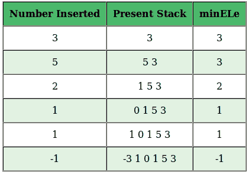
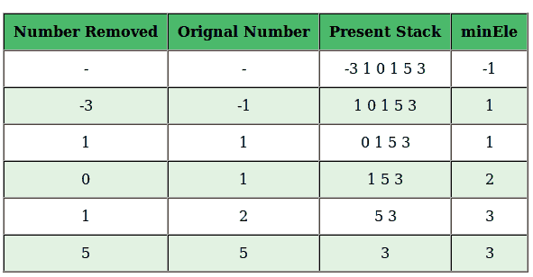

# 设计一个在 O(1)时间和 O(1)额外空间支持 getMin()的堆栈

> 原文:[https://www . geesforgeks . org/design-a-stack-in-O1-time-and-O1-extra-space/](https://www.geeksforgeeks.org/design-a-stack-that-supports-getmin-in-o1-time-and-o1-extra-space/)

**问题:**设计一个数据结构 SpecialStack，它支持所有的堆栈操作，比如 push()，pop()，isEmpty()，isFull()和一个额外的操作 getMin()，它应该从 SpecialStack 返回最小元素。SpecialStack 的所有这些操作都必须是 O(1)。要实现 SpecialStack，您应该只使用标准的 Stack 数据结构，而不使用其他数据结构，如数组、列表，..等等。
示例:

```
Consider the following SpecialStack
16  --> TOP
15
29
19
18

When getMin() is called it should return 15, 
which is the minimum element in the current stack. 

If we do pop two times on stack, the stack becomes
29  --> TOP
19
18

When getMin() is called, it should return 18 
which is the minimum in the current stack.
```

这里讨论了一种使用 O(1)时间和 O(n)额外空间的方法。
在这篇文章中，讨论了一种新的方法，支持最小 O(1)额外空间。我们定义了一个变量 **minEle** ，它存储堆栈中的当前最小元素。现在有趣的部分是，如何处理最小元素被移除的情况。为了处理这个问题，我们将“2x–minEle”而不是 x 推入堆栈，这样就可以使用当前的 minEle 及其存储在堆栈中的值来检索先前的最小元素。下面是工作的详细步骤和说明。
**推(x)** :在栈顶插入 x。

*   如果堆栈为空，将 x 插入堆栈，并使 minEle 等于 x。
*   如果堆栈不为空，将 x 与 minEle 进行比较。出现了两种情况:
    *   如果 x 大于或等于 minEle，只需插入 x。
    *   如果 x 小于 minEle，则在堆栈中插入(2 * x–minEle)，并使 minEle 等于 x。例如，假设先前的 minEle 为 3。现在我们要插入 2。我们将 minEle 更新为 2，并在堆栈中插入 2 * 2–3 = 1。

**Pop() :** 从堆栈顶部移除元素。

*   从顶部移除元素。假设被移除的元素是 y。出现两种情况:
    *   如果 y 大于或等于 minEle，堆栈中的最小元素仍然是 minEle。
    *   如果 y 小于 minEle，最小元素现在变成(2 * minEle–y)，所以更新(minEle = 2 * minEle–y)。这是我们从当前最小值中检索先前最小值及其在堆栈中的值的地方。例如，让要移除的元素为 1，minEle 为 2。我们移除 1，并将 minEle 更新为 2 * 2–1 = 3。

**要点:**

*   如果一个元素的实际值到目前为止是最小的，那么堆栈就不保存它。
*   实际的最小元素总是存储在 minEle 中

**插图**

**推(x)**



*   要插入的数字:3，堆栈为空，所以在堆栈中插入 3，minEle = 3。
*   要插入的数字:5，堆栈不为空，5> minEle，在堆栈中插入 5，minEle = 3。
*   要插入的数字:2，堆栈不为空，2< minEle，将(2*2-3 = 1)插入堆栈，minEle = 2。
*   要插入的数字:1，堆栈不为空，1< minEle，将(2*1-2 = 0)插入堆栈，minEle = 1。
*   要插入的数字:1，堆栈不为空，1 = minEle，在堆栈中插入 1，minEle = 1。
*   要插入的数字:-1，堆栈不为空，-1 < minEle，将(2 *-1–1 =-3)插入堆栈，minEle = -1。

**【pop()**



*   最初堆栈中的最小元素 minEle 是-1。
*   删除的数字:-3，因为-3 小于最小元素，所以要删除的原始数字是-1，新的数字是= 2 *-1 –(-3)= 1
*   移除的数字:1，1 == minEle，所以移除的数字是 1，minEle 仍然等于 1。
*   删除的数字:0，0< minEle，原始数字是 minEle，即 1，新的 minEle = 2 * 1–0 = 2。
*   移除的号码:1，1< minEle，原始号码是 minEle，它是 2，新的 minEle = 2 * 2–1 = 3。
*   移除的数字:5，5> minEle，原始数字是 5，minEle 仍然是 3

## C++

```
// C++ program to implement a stack that supports
// getMinimum() in O(1) time and O(1) extra space.
#include <bits/stdc++.h>
using namespace std;

// A user defined stack that supports getMin() in
// addition to push() and pop()
struct MyStack
{
    stack<int> s;
    int minEle;

    // Prints minimum element of MyStack
    void getMin()
    {
        if (s.empty())
            cout << "Stack is empty\n";

        // variable minEle stores the minimum element
        // in the stack.
        else
            cout <<"Minimum Element in the stack is: "
                 << minEle << "\n";
    }

    // Prints top element of MyStack
    void peek()
    {
        if (s.empty())
        {
            cout << "Stack is empty ";
            return;
        }

        int t = s.top(); // Top element.

        cout << "Top Most Element is: ";

        // If t < minEle means minEle stores
        // value of t.
        (t < minEle)? cout << minEle: cout << t;
    }

    // Remove the top element from MyStack
    void pop()
    {
        if (s.empty())
        {
            cout << "Stack is empty\n";
            return;
        }

        cout << "Top Most Element Removed: ";
        int t = s.top();
        s.pop();

        // Minimum will change as the minimum element
        // of the stack is being removed.
        if (t < minEle)
        {
            cout << minEle << "\n";
            minEle = 2*minEle - t;
        }

        else
            cout << t << "\n";
    }

    // Removes top element from MyStack
    void push(int x)
    {
        // Insert new number into the stack
        if (s.empty())
        {
            minEle = x;
            s.push(x);
            cout <<  "Number Inserted: " << x << "\n";
            return;
        }

        // If new number is less than minEle
        else if (x < minEle)
        {
            s.push(2*x - minEle);
            minEle = x;
        }

        else
           s.push(x);

        cout <<  "Number Inserted: " << x << "\n";
    }
};

// Driver Code
int main()
{
    MyStack s;
    s.push(3);
    s.push(5);
    s.getMin();
    s.push(2);
    s.push(1);
    s.getMin();
    s.pop();
    s.getMin();
    s.pop();
    s.peek();

    return 0;
}
```

## Java 语言(一种计算机语言，尤用于创建网站)

```
// Java program to implement a stack that supports
// getMinimum() in O(1) time and O(1) extra space.
import java.util.*;

// A user defined stack that supports getMin() in
// addition to push() and pop()
class MyStack
{
    Stack<Integer> s;
    Integer minEle;

    // Constructor
    MyStack() { s = new Stack<Integer>(); }

    // Prints minimum element of MyStack
    void getMin()
    {
        // Get the minimum number in the entire stack
        if (s.isEmpty())
            System.out.println("Stack is empty");

        // variable minEle stores the minimum element
        // in the stack.
        else
            System.out.println("Minimum Element in the " +
                               " stack is: " + minEle);
    }

    // prints top element of MyStack
    void peek()
    {
        if (s.isEmpty())
        {
            System.out.println("Stack is empty ");
            return;
        }

        Integer t = s.peek(); // Top element.

        System.out.print("Top Most Element is: ");

        // If t < minEle means minEle stores
        // value of t.
        if (t < minEle)
            System.out.println(minEle);
        else
            System.out.println(t);
    }

    // Removes the top element from MyStack
    void pop()
    {
        if (s.isEmpty())
        {
            System.out.println("Stack is empty");
            return;
        }

        System.out.print("Top Most Element Removed: ");
        Integer t = s.pop();

        // Minimum will change as the minimum element
        // of the stack is being removed.
        if (t < minEle)
        {
            System.out.println(minEle);
            minEle = 2*minEle - t;
        }

        else
            System.out.println(t);
    }

    // Insert new number into MyStack
    void push(Integer x)
    {
        if (s.isEmpty())
        {
            minEle = x;
            s.push(x);
            System.out.println("Number Inserted: " + x);
            return;
        }

        // If new number is less than original minEle
        if (x < minEle)
        {
            s.push(2*x - minEle);
            minEle = x;
        }

        else
            s.push(x);

        System.out.println("Number Inserted: " + x);
    }
};

// Driver Code
public class Main
{
    public static void main(String[] args)
    {
        MyStack s = new MyStack();
        s.push(3);
        s.push(5);
        s.getMin();
        s.push(2);
        s.push(1);
        s.getMin();
        s.pop();
        s.getMin();
        s.pop();
        s.peek();
    }
}
```

## 蟒蛇 3

```
# Class to make a Node
class Node:
    # Constructor which assign argument to nade's value
    def __init__(self, value):
        self.value = value
        self.next = None

    # This method returns the string representation of the object.
    def __str__(self):
        return "Node({})".format(self.value)

    # __repr__ is same as __str__
    __repr__ = __str__

class Stack:
    # Stack Constructor initialise top of stack and counter.
    def __init__(self):
        self.top = None
        self.count = 0
        self.minimum = None

    # This method returns the string representation of the object (stack).
    def __str__(self):
        temp = self.top
        out = []
        while temp:
            out.append(str(temp.value))
            temp = temp.next
        out = '\n'.join(out)
        return ('Top {} \n\nStack :\n{}'.format(self.top,out))

    # __repr__ is same as __str__
    __repr__=__str__

    # This method is used to get minimum element of stack
    def getMin(self):
        if self.top is None:
            return "Stack is empty"
        else:
            print("Minimum Element in the stack is: {}" .format(self.minimum))

    # Method to check if Stack is Empty or not
    def isEmpty(self):
        # If top equals to None then stack is empty
        if self.top == None:
            return True
        else:
        # If top not equal to None then stack is empty
            return False

    # This method returns length of stack    
    def __len__(self):
        self.count = 0
        tempNode = self.top
        while tempNode:
            tempNode = tempNode.next
            self.count+=1
        return self.count

    # This method returns top of stack    
    def peek(self):
        if self.top is None:
            print ("Stack is empty")
        else:
            if self.top.value < self.minimum:
                print("Top Most Element is: {}" .format(self.minimum))
            else:
                print("Top Most Element is: {}" .format(self.top.value))

    # This method is used to add node to stack
    def push(self,value):
        if self.top is None:
            self.top = Node(value)
            self.minimum = value

        elif value < self.minimum:
            temp = (2 * value) - self.minimum
            new_node = Node(temp)
            new_node.next = self.top
            self.top = new_node
            self.minimum = value
        else:
            new_node = Node(value)
            new_node.next = self.top
            self.top = new_node
        print("Number Inserted: {}" .format(value))

    # This method is used to pop top of stack
    def pop(self):
        if self.top is None:
            print( "Stack is empty")
        else:
            removedNode = self.top.value
            self.top = self.top.next
            if removedNode < self.minimum:
                print ("Top Most Element Removed :{} " .format(self.minimum))
                self.minimum = ( ( 2 * self.minimum ) - removedNode )
            else:
                print ("Top Most Element Removed : {}" .format(removedNode))

# Driver program to test above class
stack = Stack()

stack.push(3)
stack.push(5)
stack.getMin()
stack.push(2)
stack.push(1)
stack.getMin()    
stack.pop()
stack.getMin()
stack.pop()
stack.peek()

# This code is contributed by Blinkii
```

## C#

```
// C# program to implement a stack
// that supports getMinimum() in O(1)
// time and O(1) extra space.
using System;
using System.Collections;

// A user defined stack that supports
// getMin() in addition to Push() and Pop()
public class MyStack
{
    public Stack s;
    public int minEle;

    // Constructor
    public MyStack()
    {
        s = new Stack();
    }

    // Prints minimum element of MyStack
    public void getMin()
    {
        // Get the minimum number
        // in the entire stack
        if (s.Count==0)
            Console.WriteLine("Stack is empty");

        // variable minEle stores the minimum
        // element in the stack.
        else
            Console.WriteLine("Minimum Element in the " +
                            " stack is: " + minEle);
    }

    // prints top element of MyStack
    public void Peek()
    {
        if (s.Count==0)
        {
            Console.WriteLine("Stack is empty ");
            return;
        }

        int t =(int)s.Peek(); // Top element.

        Console.Write("Top Most Element is: ");

        // If t < minEle means minEle stores
        // value of t.
        if (t < minEle)
            Console.WriteLine(minEle);
        else
            Console.WriteLine(t);
    }

    // Removes the top element from MyStack
    public void Pop()
    {
        if (s.Count==0)
        {
            Console.WriteLine("Stack is empty");
            return;
        }

        Console.Write("Top Most Element Removed: ");
        int t = (int)s.Pop();

        // Minimum will change as the minimum element
        // of the stack is being removed.
        if (t < minEle)
        {
            Console.WriteLine(minEle);
            minEle = 2*minEle - t;
        }

        else
            Console.WriteLine(t);
    }

    // Insert new number into MyStack
    public void Push(int x)
    {
        if (s.Count==0)
        {
            minEle = x;
            s.Push(x);
            Console.WriteLine("Number Inserted: " + x);
            return;
        }

        // If new number is less than original minEle
        if (x < minEle)
        {
            s.Push(2 * x - minEle);
            minEle = x;
        }

        else
            s.Push(x);

        Console.WriteLine("Number Inserted: " + x);
    }
}

// Driver Code
public class main
{
    public static void Main(String []args)
    {
        MyStack s = new MyStack();
        s.Push(3);
        s.Push(5);
        s.getMin();
        s.Push(2);
        s.Push(1);
        s.getMin();
        s.Pop();
        s.getMin();
        s.Pop();
        s.Peek();
    }
}

// This code is contributed by Arnab Kundu
```

**Output**

```
Number Inserted: 3
Number Inserted: 5
Minimum Element in the stack is: 3
Number Inserted: 2
Number Inserted: 1
Minimum Element in the stack is: 1
Top Most Element Removed: 1
Minimum Element in the stack is: 2
Top Most Element Removed: 2
Top Most Element is: 5
```

**输出:**

```
Number Inserted: 3

Number Inserted: 5

Minimum Element in the stack is: 3

Number Inserted: 2

Number Inserted: 1

Minimum Element in the stack is: 1

Top Most Element Removed: 1

Minimum Element in the stack is: 2

Top Most Element Removed: 2

Top Most Element is: 5
```

**这种方法是如何工作的？**
当要插入的元素小于 minEle 时，我们插入“2x–minEle”。需要注意的重要一点是，2x–minEle 将始终小于 x(如下所示)，即新的 minEle，当弹出这个元素时，我们会看到一些不寻常的事情发生了，因为弹出的元素小于 minEle。所以我们将更新 minEle。

```
How 2*x - minEle is less than x in push()? 
x < minEle which means x - minEle < 0

// Adding x on both sides
x - minEle + x < 0 + x 

2*x - minEle < x 

We can conclude 2*x - minEle < new minEle 
```

弹出时，如果我们发现元素(y)小于当前的 minEle，我们会发现新的 minEle = 2 * minEle–y .

```
How previous minimum element, prevMinEle is, 2*minEle - y
in pop() is y the popped element?

 // We pushed y as 2x - prevMinEle. Here 
 // prevMinEle is minEle before y was inserted
 y = 2*x - prevMinEle  

 // Value of minEle was made equal to x
 minEle = x .

 new minEle = 2 * minEle - y 
            = 2*x - (2*x - prevMinEle)
            = prevMinEle // This is what we wanted

```

**练习:**
类似的方法也可以用来寻找最大元素。在 O(1)时间和常量额外空间中实现一个支持 getMax()的堆栈。
本文由**尼克尔·特克瓦尼供稿。**如果你喜欢 GeeksforGeeks，想投稿，也可以写一篇文章，把文章发到 review-team@geeksforgeeks.org。看到你的文章出现在极客博客主页上，帮助其他极客。
如果发现有不正确的地方，或者想分享更多关于上述话题的信息，请写评论。

**方法 2:**

创建一个有两个变量 val 和 min 的类节点。val 将存储我们将要插入堆栈的实际值，其中 as min 将存储到该节点为止的最小值。查看代码以便更好地理解。

## Java 语言(一种计算机语言，尤用于创建网站)

```
/*package whatever //do not write package name here */

import java.io.*;
import java.util.*;
class MinStack {
    Stack<Node> s;

    class Node{
        int val;
        int min;
        public Node(int val,int min){
            this.val=val;
            this.min=min;

        }

    }

    /** initialize your data structure here. */
    public MinStack() {
        this.s=new Stack<Node>();
    }
    public void push(int x) {
        if(s.isEmpty()){
            this.s.push(new Node(x,x));
        }else{
            int min=Math.min(this.s.peek().min,x);
            this.s.push(new Node(x,min));
        }   
    }  
    public int pop() {

            return this.s.pop().val;  
    }
    public int top() {

            return this.s.peek().val;  
    }
     public int getMin() {

            return this.s.peek().min;   
    }
}

class GFG {

    public static void main (String[] args) {
      MinStack s=new MinStack();
      s.push(-1);
      s.push(10);
      s.push(-4);
      s.push(0);
      System.out.println(s.getMin());
      System.out.println(s.pop());
      System.out.println(s.pop());
      System.out.println(s.getMin());

    }
}
//time O(1);
//it takes o(n) space since every node has to remember min value
//this code is contributed by gireeshgudaparthi
```

**Output**

```
-4
0
-4
-1
```