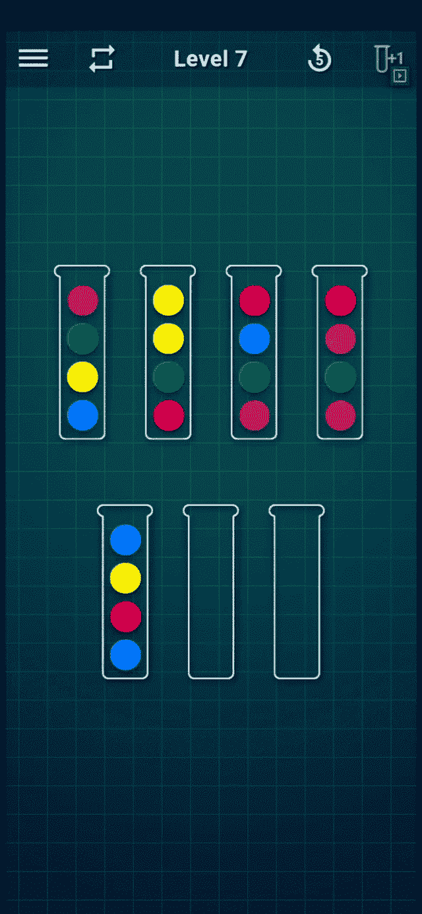
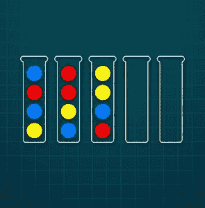
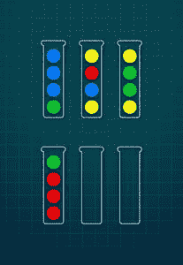

# 设计算法解决球排序难题

> 原文:[https://www . geesforgeks . org/design-algorithm-to-solve-ball-sort-拼图/](https://www.geeksforgeeks.org/designing-algorithm-to-solve-ball-sort-puzzle/)

在[球分类拼图](https://play.google.com/store/apps/details?id=com.spicags.ballsort&hl=en_IN&gl=US)游戏中，我们有每种颜色的 p 个球和 n 种不同的颜色，总共有 p×n 个球，排列成 n 个堆叠。此外，我们还有 2 个空堆栈。在给定时间内，任何堆叠中最多可以有 p 个球。**游戏的目标是按颜色对每个** ***n*** **堆叠中的球进行排序。**

规则:

*   只能移动每个堆叠的顶部球。
*   一个球可以在另一个相同颜色的球上移动
*   一个球可以在空堆里移动。

游戏示例(7 级)请参考以下 GIF:



7 级游戏性

**方法一【递归和回溯】:**

*   根据给定的规则，可以生成如下简单的递归算法:
    *   从给定的所有球的初始位置开始
    *   创建初始空队列。
    *   循环:
        *   如果当前位置已排序:
            *   返回
        *   其他
            *   将所有可能的移动排入队列。
            *   从队列中取消下一个移动。
            *   转到循环。

然而，这种方法看起来简单而正确，它没有什么警告:

*   **不正确:**
    *   如果队列中有 1 次以上的移动导致球的位置相同，我们可能会陷入无限循环。
*   **低效:**
    *   我们最终可能会多次访问同一个位置。

因此，消除上述瓶颈将解决这个问题。

**方法二【使用哈希映射的内存化】:**

*   假设:
    *   我们将球的位置表示为字符串的向量:{“gbbb”、“ybry”、“yggy”、“rrrg”}
*   创建一个名为<字符串>的 ***访问过的*** 的集合，该集合将访问过的位置作为一个长字符串包含。
*   为 **A** ***nswer*** 创建一个空向量，该向量将存储试管的位置< a、b >，以将顶部球从试管 A 移动到试管 b 中。
*   用球的初始设置初始化 ***网格*** 。
*   func 求解器( ***网格*** ):
    *   添加 ***网格*** 到 ***拜访***
    *   循环遍历所有栈(**):

        *   循环遍历所有堆栈(***【j】***):
            *   如果移动***I***->***j***有效，用该移动创建 ***新网格*** 。
                *   如果球在 ***新网格*** 中排序，
                    *   更新 ***回答***；
                    *   返回；
                *   如果 ***纽格*** 是**不是**在 ***拜访***
                    *   求解器(**)**
                    *   **如果解决了:

                        *   更新 ***回答******* 

****游戏输入示例 1:****

****

三级**** 

****样本输入一:****

```
**5
ybrb
byrr
rbyy**
```

****样本输出一:****

```
**Move 1 to 4 1 times
Move 1 to 5 1 times
Move 1 to 4 1 times
Move 2 to 5 2 times
Move 1 to 2 1 times
Move 3 to 1 1 times
Move 1 to 2 1 times
Move 3 to 1 1 times
Move 2 to 1 3 times
Move 2 to 3 1 times
Move 3 to 4 1 times
Move 3 to 2 1 times
Move 2 to 4 1 times
Move 3 to 5 1 times**
```

****游戏输入示例二:****

****

5 级**** 

****样本输入二:****

```
**6
gbbb
ybry
yggy
rrrg**
```

****样本输出二:****

```
**Move 1 to 5 3 times
Move 2 to 6 1 times
Move 3 to 6 1 times
Move 1 to 3 1 times
Move 2 to 1 1 times
Move 2 to 5 1 times
Move 2 to 6 1 times
Move 3 to 2 3 times
Move 3 to 6 1 times
Move 4 to 2 1 times
Move 1 to 4 1 times**
```

****请参考下面的 C++实现，并附上注释以供参考:****

## ****C++****

```
**// C++ program for the above approach
#include <bits/stdc++.h>
using namespace std;
using Grid = vector<string>;

Grid configureGrid(string stacks[], int numberOfStacks)
{

    Grid grid;
    for (int i = 0; i < numberOfStacks; i++)
        grid.push_back(stacks[i]);

    return grid;
}

// Function to find the max
int getStackHeight(Grid grid)
{
    int max = 0;
    for (auto stack : grid)
        if (max < stack.size())
            max = stack.size();
    return max;
}

// Convert vector of strings to
// canonicalRepresentation of strings
string canonicalStringConversion(Grid grid)
{
    string finalString;
    sort(grid.begin(), grid.end());
    for (auto stack : grid) {
        finalString += (stack + ";");
    }
    return finalString;
}

// Function to check if it is solved
// or not
bool isSolved(Grid grid, int stackHeight)
{

    for (auto stack : grid) {
        if (!stack.size())
            continue;
        else if (stack.size() < stackHeight)
            return false;
        else if (std::count(stack.begin(),
                            stack.end(),
                            stack[0])
                 != stackHeight)
            return false;
    }
    return true;
}

// Check if the move is valid
bool isValidMove(string sourceStack,
                 string destinationStack,
                 int height)
{

    // Can't move from an empty stack
    // or to a FULL STACK
    if (sourceStack.size() == 0
        || destinationStack.size() == height)
        return false;

    int colorFreqs
        = std::count(sourceStack.begin(),
                     sourceStack.end(),
                     sourceStack[0]);

    // If the source stack is same colored,
    // don't touch it
    if (colorFreqs == height)
        return false;

    if (destinationStack.size() == 0) {

        // If source stack has only
        // same colored balls,
        // don't touch it
        if (colorFreqs == sourceStack.size())
            return false;
        return true;
    }
    return (
        sourceStack[sourceStack.size() - 1]
        == destinationStack[destinationStack.size() - 1]);
}

// Function to solve the puzzle
bool solvePuzzle(Grid grid, int stackHeight,
                 unordered_set<string>& visited,
                 vector<vector<int> >& answerMod)
{
    if (stackHeight == -1) {
        stackHeight = getStackHeight(grid);
    }
    visited.insert(
        canonicalStringConversion(grid));

    for (int i = 0; i < grid.size(); i++) {

        // Iterate over all the stacks
        string sourceStack = grid[i];
        for (int j = 0; j < grid.size(); j++) {
            if (i == j)
                continue;
            string destinationStack = grid[j];
            if (isValidMove(sourceStack,
                            destinationStack,
                            stackHeight)) {

                // Creating a new Grid
                // with the valid move
                Grid newGrid(grid);

                // Adding the ball
                newGrid[j].push_back(newGrid[i].back());

                // Adding the ball
                newGrid[i].pop_back();
                if (isSolved(newGrid, stackHeight)) {
                    answerMod.push_back(
                        vector<int>{ i, j, 1 });
                    return true;
                }
                if (visited.find(
                        canonicalStringConversion(newGrid))
                    == visited.end()) {
                    bool solveForTheRest
                        = solvePuzzle(newGrid, stackHeight,
                                      visited, answerMod);
                    if (solveForTheRest) {
                        vector<int> lastMove
                            = answerMod[answerMod.size()
                                        - 1];

                        // Optimisation - Concatenating
                        // consecutive moves of the same
                        // ball
                        if (lastMove[0] == i
                            && lastMove[1] == j)
                            answerMod[answerMod.size() - 1]
                                     [2]++;
                        else
                            answerMod.push_back(
                                vector<int>{ i, j, 1 });
                        return true;
                    }
                }
            }
        }
    }
    return false;
}

// Checks whether the grid is valid or not
bool checkGrid(Grid grid)
{

    int numberOfStacks = grid.size();
    int stackHeight = getStackHeight(grid);
    int numBallsExpected
        = ((numberOfStacks - 2) * stackHeight);
    // Cause 2 empty stacks
    int numBalls = 0;

    for (auto i : grid)
        numBalls += i.size();
    if (numBalls != numBallsExpected) {
        cout << "Grid has incorrect # of balls"
             << endl;
        return false;
    }
    map<char, int> ballColorFrequency;
    for (auto stack : grid)
        for (auto ball : stack)
            if (ballColorFrequency.find(ball)
                != ballColorFrequency.end())
                ballColorFrequency[ball] += 1;
            else
                ballColorFrequency[ball] = 1;
    for (auto ballColor : ballColorFrequency) {
        if (ballColor.second != getStackHeight(grid)) {
            cout << "Color " << ballColor.first
                 << " is not " << getStackHeight(grid)
                 << endl;
            return false;
        }
    }
    return true;
}

// Driver Code
int main(void)
{

    // Including 2 empty stacks
    int numberOfStacks = 6;
    std::string stacks[]
        = { "gbbb", "ybry", "yggy", "rrrg", "", "" };

    Grid grid = configureGrid(
        stacks, numberOfStacks);
    if (!checkGrid(grid)) {
        cout << "Invalid Grid" << endl;
        return 1;
    }
    if (isSolved(grid, getStackHeight(grid))) {
        cout << "Problem is already solved"
             << endl;
        return 0;
    }
    unordered_set<string> visited;
    vector<vector<int> > answerMod;

    // Solve the puzzle instance
    solvePuzzle(grid, getStackHeight(grid),
                visited,
                answerMod);

    // Since the values of Answers are appended
    // When the problem was completely
    // solved and backwards from there
    reverse(answerMod.begin(), answerMod.end());

    for (auto v : answerMod) {
        cout << "Move " << v[0] + 1
             << " to " << v[1] + 1
             << " " << v[2] << " times"
             << endl;
    }
    return 0;
}**
```

******Output**

```
Move 1 to 5 3 times
Move 2 to 6 1 times
Move 3 to 6 1 times
Move 1 to 3 1 times
Move 2 to 1 1 times
Move 2 to 5 1 times
Move 2 to 6 1 times
Move 3 to 2 3 times
Move 3 to 6 1 times
Move 4 to 2 1 times
Move 1 to 4 1 times
```****