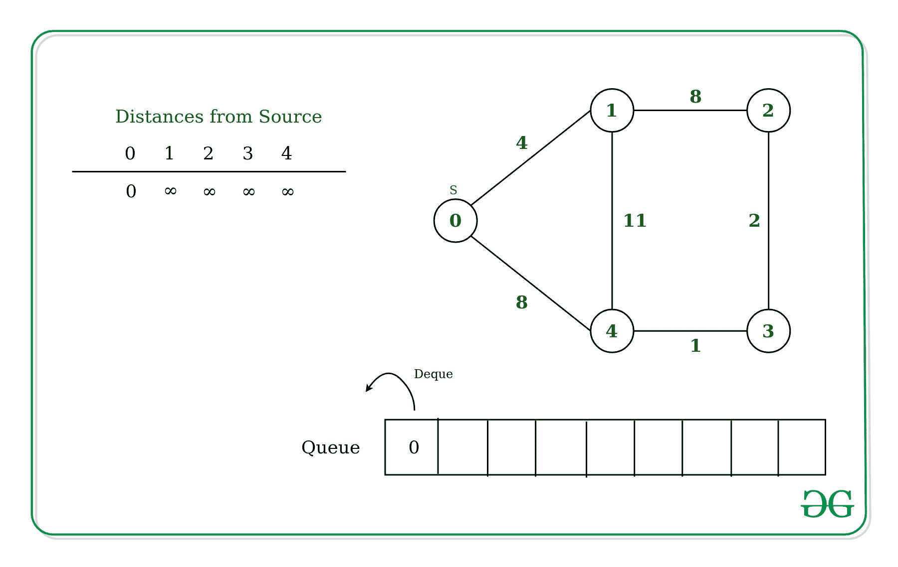
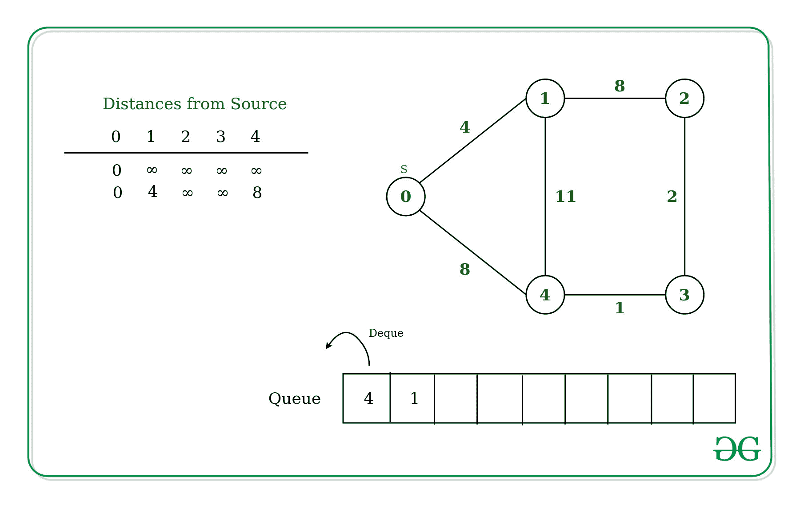
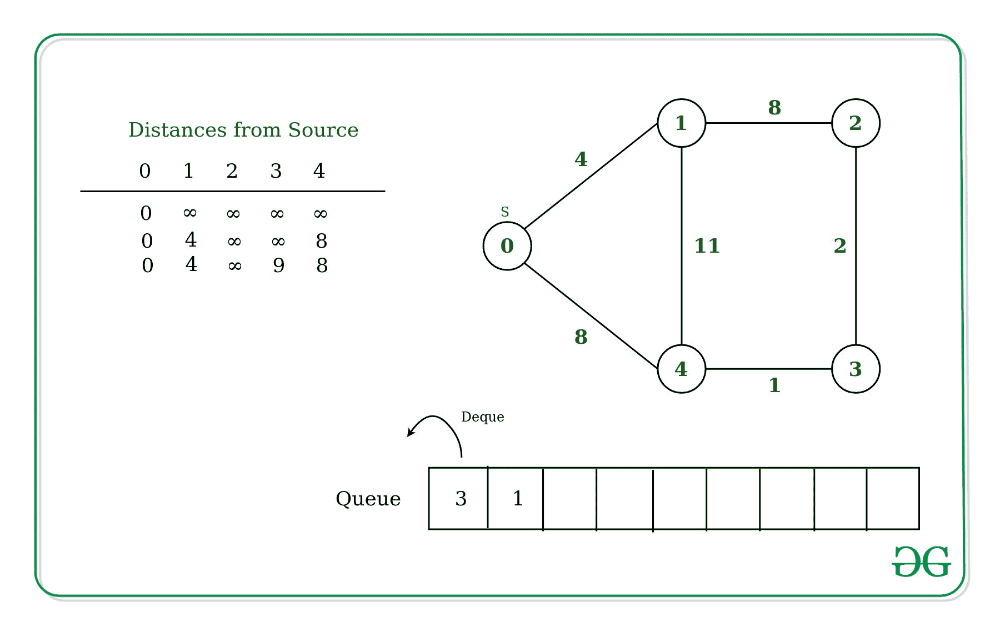
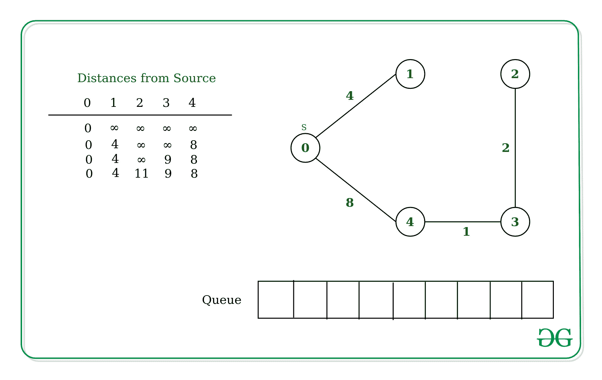

# 德索普-帕普算法:单源最短路径

> 原文:[https://www . geesforgeks . org/desopo-pape-algorithm-单一来源-最短路径/](https://www.geeksforgeeks.org/desopo-pape-algorithm-single-source-shortest-path/)

给定一个图和一个源顶点 **src** 在一个**加权无向图**中，找到从 src 到给定图中所有顶点的最短路径。该图可能包含负权重边。

对于这个问题，我们已经讨论过[迪克斯特拉算法](https://www.geeksforgeeks.org/dijkstras-shortest-path-algorithm-greedy-algo-7/)和[贝尔曼-福特算法](https://www.geeksforgeeks.org/bellman-ford-algorithm-dp-23/)。但是，在大多数情况下，德索普-帕普算法表现得相当好。然而，在某些情况下，这需要指数时间。

[Recommended: Please solve it on “***<u>PRACTICE</u>*** ” first, before moving on to the solution.](https://practice.geeksforgeeks.org/problems/negative-weight-cycle/0) 

**算法:**
**输入:**图的邻接表和源顶点 src。
**输出:**从 src 到所有顶点的最短距离。
该算法使用双向队列存储要操作的顶点。

下面是算法的详细步骤。

1.  初始化数组中顶点从源到无限的距离。
2.  维护一个[](https://www.geeksforgeeks.org/queue-data-structure/)**队列，该队列将存储要操作的顶点，并且还维护一个用于决定该顶点是否已经出现在队列中的布尔数组。**
3.  **在队列中追加源顶点。**
4.  **从队列中开始弹出顶点，直到队列为空，并对每个弹出的顶点执行以下步骤(让 **U** 成为弹出的顶点) :

    *   将顶点 **U** 设置为不在队列中。
    *   对于 **U** 的每个相邻顶点 **V** ，检查其当前最小**距离**是否大于通过 **U** 、
        的距离，即**距离【U】+连接 U 和 V 的边的重量**。
    *   如果是，更新距离[V] =距离[U] +连接 U 和 V 的边的权重。
        借助布尔数组检查队列中是否不存在 V:
        1.  如果 **V** 是第一次进入队列，则在队列后面的**处追加 V，并借助布尔数组将顶点 V 设置为在队列中存在。**
        2.  否则追加到队列的**前面，并将 V 顶点设置为队列中存在的顶点。**** 
5.  **返回列表**距离**，它将具有每个顶点到源顶点的最短距离。**

****例如:**
最初，从源到自身的距离将是 0，对于其他顶点，它将是无限的。**

****

**现在，对于源的每个相邻顶点，即 **0** ,在这种情况下是【1，4 】,更新距离，并将顶点分别标记为权重为 4 和 8 的。**

****

**现在从队列中取出顶点 **4** ，下面是连接到顶点 4–**

*   ****顶点 1**–由于顶点 1 已经访问过，到达顶点 1 的权重为 4，而当通过边 4-1 从源移动到顶点 1 时，总权重将为 11，大于距离数组中存储的权重。**
*   ****顶点 3**–由于顶点 3 没有被访问，也不在队列中，因此顶点 3 的距离被更新为 9，并且也在前面排队。**

****

**类似地，从队列中删除顶点 3，并更新相邻顶点的值。顶点 3 的相邻顶点是顶点 4 和顶点 2。**

*   ****顶点 4**–由于顶点 4 已经被访问，权重已经最小，因此距离不会更新。**
*   ****顶点 2**–由于顶点 2 没有被访问，也不在队列中，因此顶点 3 的距离被更新为 11，并且也在前面排队。**

****

**下面是上述方法的实现。**

## **C++**

```
// C++ implementation for
// D'Esopo-Pape algorithm
#include <bits/stdc++.h>
using namespace std;
#define inf INT_MAX

vector<int> desopo(vector<vector<int>> &graph)
{

  // Number of vertices in graph
  int v = graph.size();

  // Adjacency list of graph
  map<int, vector<pair<int, int>>> adj;
  for(int i = 0; i < v; i++) {
    for(int j = i + 1; j < v; j++)
    {
      if (graph[i][j] != 0)
      {
        adj[i].push_back({graph[i][j], j});
        adj[j].push_back({graph[i][j], i});
      }
    }
  }

  // Queue to store unoperated vertices
  deque<int> q;

  // Distance from source vertex
  // distance =[float('inf')]*v
  vector<int> distance(v, inf);

  // Status of vertex
  vector<bool> is_in_queue(v, false);

  // let 0 be the source vertex
  int source = 0;
  distance = 0;
  q.push_back(source);
  is_in_queue = true;

  while (!q.empty())
  {

    // Pop from front of the queue
    int u = q.front();
    q.pop_front();
    is_in_queue[u] = false;

    // Scan adjacent vertices of u
    for(auto e : adj[u])
    {

      // e <- [weight, vertex]
      if (distance[e.second] >
          distance[u] + e.first)
      {
        distance[e.second] = distance[u] + e.first;
        if (!is_in_queue[e.second])
        {

          // if e.second is entering
          // first time in the queue
          if (distance[e.second] == inf)

            // Append at back of queue
            q.push_back(e.second);
          else

            // Append at front of queue
            q.push_front(e.second);

          is_in_queue[e.second] = true;
        }
      }
    }
  }
  return distance;
}

// Driver Code
int main(int argc, char const *argv[])
{

  // Adjacency matrix of graph
  vector<vector<int>> graph = { { 0, 4, 0, 0, 8 },
                                { 0, 0, 8, 0, 11 },
                                { 0, 8, 0, 2, 0 },
                                { 0, 0, 2, 0, 1 },
                                { 8, 11, 0, 1, 0 } };
  for(auto i : desopo(graph))
  {
    cout << i << " ";
  }
  return 0;
}

// This code is contributed by sanjeev2552
```

## **蟒蛇 3**

```
# Python3 implementation for
# D'Esopo-Pape algorithm

from collections import defaultdict, deque

def desopo(graph):
    # Number of vertices in graph
    v = len(graph)

    # Adjacency list of graph
    adj = defaultdict(list)
    for i in range(v):
        for j in range(i + 1, v):
            if graph[i][j] != 0:
                adj[i].append(
                    [graph[i][j], j]
                )
                adj[j].append(
                    [graph[i][j], i]
                )

    # Queue to store unoperated vertices
    q = deque([])

    # Distance from source vertex
    distance =[float('inf')]*v

    # Status of vertex
    is_in_queue =[False]*v

    # let 0 be the source vertex
    source = 0
    distance= 0
    q.append(source)
    is_in_queue= True

    while q:
        # Pop from front of the queue
        u = q.popleft()
        is_in_queue[u]= False

        # scan adjacent vertices of u
        for e in adj[u]:
            # e <- [weight, vertex]
            if distance[e[1]] > distance[u]+e[0]:
                distance[e[1]]= distance[u]+e[0]
                if is_in_queue[e[1]]== False:
                    # if e[1] is entering
                    # first time in the queue
                    if distance[e[1]]== float('inf'):
                        # Append at back of queue
                        q.append(e[1])
                    else:
                        # Append at front of queue
                        q.appendleft(e[1])
                    is_in_queue[e[1]] = True
    return distance

# Driver Code
if __name__ == "__main__":
    # Adjacency matrix of graph
    graph = [[0, 4, 0, 0, 8],
            [0, 0, 8, 0, 11],
            [0, 8, 0, 2, 0],
            [0, 0, 2, 0, 1],
            [8, 11, 0, 1, 0]
            ]
    print(desopo(graph))
```

****Output:** 

```
[0, 4, 11, 9, 8]
```**