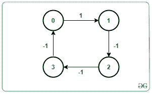
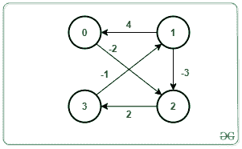

# 使用最短路径快速算法检测图形中的负循环

> 原文:[https://www . geesforgeks . org/detect-a-负循环图-使用最短路径-更快-算法/](https://www.geeksforgeeks.org/detect-a-negative-cycle-in-a-graph-using-shortest-path-faster-algorithm/)

给定一个由值为**【0，N–1】**的节点、一个源 **S** 和一个类型为{ **u，v，w** }的数组**Edges【】【3】**组成的[图，该数组表示在节点 **u** 和权重为 **w** 的 **v** 之间存在有向边，任务是检查是否存在有向边如果发现是真的，那么打印**“是”**。否则，打印**“否”**。](https://www.geeksforgeeks.org/introduction-to-graphs/)

> 一个**负循环**是一个循环，在这个循环中它的所有重量之和为**负**。

**示例:**

> **输入:** N = 4，M = 4，边[][] = {{0，1，1}，{1，2，-1}，{2，3，-1}，{3，0，-1}}，S = 0
> T3】输出:是
> T6】解释:T8】
> 
> 
> 
> 从源节点 0 开始，图形包含循环为 0 -> 1 -> 2 -> 3 -> 0。
> 上述路径的权重之和为 1–1–1–1 =-2。
> 因此，该图包含负循环。
> 
> **输入:** N = 4，M = 5，Edges[][] = {{0，2，-2}，{1，0，4}，{1，2，-3}，{2，3}，{3，1}}，W[] = {-2，4，-3，2，-1}，S = 1
> T3】输出:是
> **解释:**
> 
> 
> 
> 从源节点 1 开始，该图包含循环为 1 -> 2 -> 3 -> 1。
> 上述路径中权重之和为-3+2–1 =-2。
> 因此，该图包含负循环。

**方法:**想法是使用[最短路径快速算法(SPFA)](https://www.geeksforgeeks.org/shortest-path-faster-algorithm/) 来发现负循环是否存在，以及从图中的源顶点是否可达。按照以下步骤解决问题:

*   用大值初始化数组 **dis[]** ，用 false 初始化 **vis[]** ，用 **cnt[]** 存储顶点松弛次数的计数。
*   [使用](https://www.geeksforgeeks.org/algorithms-gq/graph-traversals-gq/) [SPFA 算法](https://www.geeksforgeeks.org/shortest-path-faster-algorithm/)遍历图形。
*   每当顶点放松时，增加每个顶点的计数。

> 术语**松弛**意味着更新连接到顶点 **v** 的所有顶点的成本，如果这些成本通过包括经由顶点 **v** 的路径而得到改善的话。

*   在第 N 个时间内，当某个顶点放松时，停止算法并打印**“是”**，因为只有 **N 个**顶点，即从 **0** 到**N–1**。
*   否则，打印**“否”**。

下面是上述方法的实现:

## C++

```
// C++ program for the above approach
#include <bits/stdc++.h>
using namespace std;

bool sfpa(int V, int src, int Edges[][3],
          int M)
{
    // Stores the adjacency list of
    // the given graph
    vector<pair<int, int> > g[V];

    // Create Adjacency List
    for (int i = 0; i < M; i++) {

        int u = Edges[i][0];
        int v = Edges[i][1];
        int w = Edges[i][2];

        g[u].push_back({ v, w });
    }

    // Stores the distance of all
    // reachable vertex from source
    vector<int> dist(V, INT_MAX);

    // Check if vertex is present
    // in queue or not
    vector<bool> inQueue(V, false);

    // Counts the relaxation for
    // each vertex
    vector<int> cnt(V, 0);

    // Distance from src to src is 0
    dist[src] = 0;

    // Create a queue
    queue<int> q;

    // Push source in the queue
    q.push(src);

    // Mark source as visited
    inQueue[src] = true;

    while (!q.empty()) {

        // Front vertex of Queue
        int u = q.front();
        q.pop();

        inQueue[u] = false;

        // Relaxing all edges of
        // vertex from the Queue
        for (pair<int, int> x : g[u]) {

            int v = x.first;
            int cost = x.second;

            // Update the dist[v] to
            // minimum distance
            if (dist[v] > dist[u] + cost) {

                dist[v] = dist[u] + cost;

                // If vertex v is in Queue
                if (!inQueue[v]) {
                    q.push(v);
                    inQueue[v] = true;
                    cnt[v]++;

                    // Negative cycle
                    if (cnt[v] >= V)
                        return true;
                }
            }
        }
    }

    // No cycle found
    return false;
}

// Driver Code
int main()
{
    // Number of vertices
    int N = 4;

    // Given source node src
    int src = 0;

    // Number of Edges
    int M = 4;

    // Given Edges with weight
    int Edges[][3] = { { 0, 1, 1 },
                       { 1, 2, -1 },
                       { 2, 3, -1 },
                       { 3, 0, -1 } };

    // If cycle is present
    if (sfpa(N, src, Edges, M) == true)
        cout << "Yes" << endl;
    else
        cout << "No" << endl;

    return 0;
}
```

## Java 语言(一种计算机语言，尤用于创建网站)

```
// Java program for
// the above approach
import java.util.*;
class GFG{

static class pair
{
  int first, second;
  public pair(int first,
              int second) 
  {
    this.first = first;
    this.second = second;
  }   
}

static boolean sfpa(int V, int src,
                    int Edges[][], int M)
{
  // Stores the adjacency list of
  // the given graph
  Vector<pair> []g = new Vector[V];
  for (int i = 0; i < V; i++)
  {
    g[i] = new Vector<pair>();
  }

  // Create Adjacency List
  for (int i = 0; i < M; i++)
  {
    int u = Edges[i][0];
    int v = Edges[i][1];
    int w = Edges[i][2];
    g[u].add(new pair(v, w));
  }

  // Stores the distance of all
  // reachable vertex from source
  int []dist = new int[V];
  Arrays.fill(dist, Integer.MAX_VALUE);

  // Check if vertex is present
  // in queue or not
  boolean []inQueue = new boolean[V];

  // Counts the relaxation for
  // each vertex
  int []cnt = new int[V];

  // Distance from src
  // to src is 0
  dist[src] = 0;

  // Create a queue
  Queue<Integer> q = new LinkedList<>();

  // Push source in the queue
  q.add(src);

  // Mark source as visited
  inQueue[src] = true;

  while (!q.isEmpty())
  {
    // Front vertex of Queue
    int u = q.peek();
    q.remove();

    inQueue[u] = false;

    // Relaxing all edges of
    // vertex from the Queue
    for (pair x : g[u])
    {
      int v = x.first;
      int cost = x.second;

      // Update the dist[v] to
      // minimum distance
      if (dist[v] > dist[u] + cost)
      {
        dist[v] = dist[u] + cost;

        // If vertex v is in Queue
        if (!inQueue[v])
        {
          q.add(v);
          inQueue[v] = true;
          cnt[v]++;

          // Negative cycle
          if (cnt[v] >= V)
            return true;
        }
      }
    }
  }

  // No cycle found
  return false;
}

// Driver Code
public static void main(String[] args)
{
  // Number of vertices
  int N = 4;

  // Given source node src
  int src = 0;

  // Number of Edges
  int M = 4;

  // Given Edges with weight
  int Edges[][] = {{0, 1, 1},
                   {1, 2, -1},
                   {2, 3, -1},
                   {3, 0, -1}};

  // If cycle is present
  if (sfpa(N, src, Edges, M) == true)
    System.out.print("Yes" + "\n");
  else
    System.out.print("No" + "\n");
}
}

// This code is contributed by 29AjayKumar
```

## 蟒蛇 3

```
# Python3 program for the above approach
import sys

def sfpa(V, src, Edges, M):

    # Stores the adjacency list of
    # the given graph
    g = [[] for i in range(V)]

    # Create Adjacency List
    for i in range(M):
        u = Edges[i][0]
        v = Edges[i][1]
        w = Edges[i][2]

        g[u].append([v, w])

    # Stores the distance of all
    # reachable vertex from source
    dist = [sys.maxsize for i in range(V)]

    # Check if vertex is present
    # in queue or not
    inQueue = [False for i in range(V)]

    # Counts the relaxation for
    # each vertex
    cnt = [0 for i in range(V)]

    # Distance from src to src is 0
    dist[src] = 0

    # Create a queue
    q = []

    # Push source in the queue
    q.append(src)

    # Mark source as visited
    inQueue[src] = True

    while (len(q)):

        # Front vertex of Queue
        u = q[0]
        q.remove(q[0])

        inQueue[u] = False

        # Relaxing all edges of
        # vertex from the Queue
        for x in g[u]:
            v = x[0]
            cost = x[1]

            # Update the dist[v] to
            # minimum distance
            if (dist[v] > dist[u] + cost):
                dist[v] = dist[u] + cost

                # If vertex v is in Queue
                if (inQueue[v] == False):
                    q.append(v)
                    inQueue[v] = True
                    cnt[v] += 1

                    # Negative cycle
                    if (cnt[v] >= V):
                        return True

    # No cycle found
    return False

# Driver Code
if __name__ == '__main__':

    # Number of vertices
    N = 4

    # Given source node src
    src = 0

    # Number of Edges
    M = 4

    # Given Edges with weight
    Edges = [ [ 0, 1, 1 ],
              [ 1, 2, -1 ],
              [ 2, 3, -1 ],
              [ 3, 0, -1 ] ]

    # If cycle is present
    if (sfpa(N, src, Edges, M) == True):
        print("Yes")
    else:
        print("No")

# This code is contributed by SURENDRA_GANGWAR
```

## C#

```
// C# program for
// the above approach
using System;
using System.Collections.Generic;
class GFG{

class pair
{
  public int first, second;
  public pair(int first,
              int second) 
  {
    this.first = first;
    this.second = second;
  }   
}

static bool sfpa(int V, int src,
                 int [,]Edges, int M)
{
  // Stores the adjacency list of
  // the given graph
  List<pair> []g = new List<pair>[V];
  for (int i = 0; i < V; i++)
  {
    g[i] = new List<pair>();
  }

  // Create Adjacency List
  for (int i = 0; i < M; i++)
  {
    int u = Edges[i, 0];
    int v = Edges[i, 1];
    int w = Edges[i, 2];
    g[u].Add(new pair(v, w));
  }

  // Stores the distance of all
  // reachable vertex from source
  int []dist = new int[V];
  for (int i = 0; i < V; i++)
    dist[i] = int.MaxValue;

  // Check if vertex is present
  // in queue or not
  bool []inQueue = new bool[V];

  // Counts the relaxation for
  // each vertex
  int []cnt = new int[V];

  // Distance from src
  // to src is 0
  dist[src] = 0;

  // Create a queue
  Queue<int> q = new Queue<int>();

  // Push source in the queue
  q.Enqueue(src);

  // Mark source as visited
  inQueue[src] = true;

  while (q.Count != 0)
  {
    // Front vertex of Queue
    int u = q.Peek();
    q.Dequeue();

    inQueue[u] = false;

    // Relaxing all edges of
    // vertex from the Queue
    foreach (pair x in g[u])
    {
      int v = x.first;
      int cost = x.second;

      // Update the dist[v] to
      // minimum distance
      if (dist[v] > dist[u] + cost)
      {
        dist[v] = dist[u] + cost;

        // If vertex v is in Queue
        if (!inQueue[v])
        {
          q.Enqueue(v);
          inQueue[v] = true;
          cnt[v]++;

          // Negative cycle
          if (cnt[v] >= V)
            return true;
        }
      }
    }
  }

  // No cycle found
  return false;
}

// Driver Code
public static void Main(String[] args)
{
  // Number of vertices
  int N = 4;

  // Given source node src
  int src = 0;

  // Number of Edges
  int M = 4;

  // Given Edges with weight
  int [,]Edges = {{0, 1, 1},
                  {1, 2, -1},
                  {2, 3, -1},
                  {3, 0, -1}};

  // If cycle is present
  if (sfpa(N, src, Edges, M) == true)
    Console.Write("Yes" + "\n");
  else
    Console.Write("No" + "\n");
}
}

// This code is contributed by 29AjayKumar
```

## java 描述语言

```
<script>

// Javascript program for
// the above approach

class pair
{
    constructor(first, second)
    {
        this.first = first;
        this.second = second;
    }
}

function sfpa(V, src, Edges, M)
{
  // Stores the adjacency list of
  // the given graph
  var g = Array.from(Array(V), ()=>Array());

  // Create Adjacency List
  for(var i = 0; i < M; i++)
  {
    var u = Edges[i][0];
    var v = Edges[i][1];
    var w = Edges[i][2];
    g[u].push(new pair(v, w));
  }

  // Stores the distance of all
  // reachable vertex from source
  var dist = Array(V);
  for (var i = 0; i < V; i++)
    dist[i] = 1000000000;

  // Check if vertex is present
  // in queue or not
  var inQueue = Array(V).fill(false);

  // Counts the relaxation for
  // each vertex
  var cnt = Array(V).fill(0);

  // Distance from src
  // to src is 0
  dist[src] = 0;

  // Create a queue
  var q = [];

  // Push source in the queue
  q.push(src);

  // Mark source as visited
  inQueue[src] = true;

  while (q.length != 0)
  {
    // Front vertex of Queue
    var u = q[0];
    q.shift();

    inQueue[u] = false;

    // Relaxing all edges of
    // vertex from the Queue
    for(var x of g[u])
    {
      var v = x.first;
      var cost = x.second;

      // Update the dist[v] to
      // minimum distance
      if (dist[v] > dist[u] + cost)
      {
        dist[v] = dist[u] + cost;

        // If vertex v is in Queue
        if (!inQueue[v])
        {
          q.push(v);
          inQueue[v] = true;
          cnt[v]++;

          // Negative cycle
          if (cnt[v] >= V)
            return true;
        }
      }
    }
  }

  // No cycle found
  return false;
}

// Driver Code
// Number of vertices
var N = 4;
// Given source node src
var src = 0;
// Number of Edges
var M = 4;
// Given Edges with weight
var Edges = [[0, 1, 1],
                [1, 2, -1],
                [2, 3, -1],
                [3, 0, -1]];
// If cycle is present
if (sfpa(N, src, Edges, M) == true)
  document.write("Yes" + "<br>");
else
  document.write("No" + "<br>");

</script>
```

**Output:** 

```
Yes
```

***时间复杂度:** O(N*M)，其中 N 为顶点数，M 为边数。*
***辅助空间:** O(N + M)*