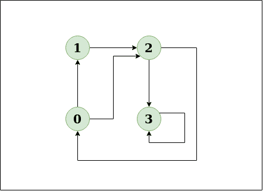
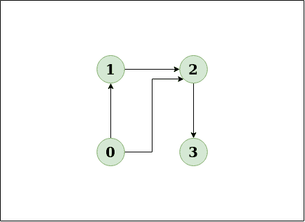
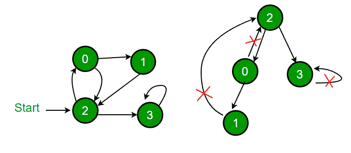

# 使用颜色检测有向图中的循环

> 原文:[https://www . geesforgeks . org/detect-cycle-direct-graph-use-colors/](https://www.geeksforgeeks.org/detect-cycle-direct-graph-using-colors/)

给定一个有向图，检查该图是否包含循环。如果给定的图形至少包含一个循环，则函数应该返回 true，否则返回 false。

**示例:**

> **输入:** n = 4，e = 6
> 0 - > 1，0 - > 2，1 - > 2，2 - > 0，2 - > 3，3->3
> T4】输出:是
> T7】说明:T9】
> 
> 
> 
> 该图清楚地显示了周期 0 -> 2 -> 0。
> 
> **输入:** n = 4，e = 3
> 0 - > 1，0 - > 2，1 - > 2，2->3
> T4】输出:否
> T7】解释:T9】
> 
> 
> 
> 这个图表清楚地显示没有周期。

**<u>解决方案</u>**
**方法:**深度优先遍历可用于检测图形中的循环。连通图的 DFS 生成一棵树。只有当图中存在[后沿](http://en.wikipedia.org/wiki/Depth-first_search#Output_of_a_depth-first_search)时，图中才有循环。后边缘是从一个节点到其自身(自循环)或其在由 DFS 产生的树中的祖先之一的边缘。在下图中，有 3 条后边缘，用十字符号标记。可以观察到，这 3 条后边缘表示图中存在 3 个循环。



对于一个断开的图，我们得到 DFS 森林作为输出。为了检测循环，我们可以通过检查后边缘来检查单个树中的循环。

*图片来源:*[*http://www . cs . Yale . edu/homes/aspnes/pine wiki/depthfirst search . html*](http://www.cs.yale.edu/homes/aspnes/pinewiki/DepthFirstSearch.html)
在[之前的帖子](https://www.geeksforgeeks.org/detect-cycle-in-a-graph/)中，我们讨论了一个解决方案，将访问过的顶点存储在一个单独的数组中，该数组存储当前递归调用堆栈的顶点。

在这篇文章中，讨论了一种不同的解决方案。解决方案来自 [CLRS 书](http://www.amazon.in/Introduction-Algorithms-Thomas-H-Cormen/dp/8120340078/ref=as_sl_pc_qf_sp_asin_til?tag=geeksforgeeks-21&linkCode=w00&linkId=ECBJHKOAMA4NJO33&creativeASIN=8120340078)。这个想法是对一个给定的图进行离散傅立叶变换，并在进行遍历时，给每个顶点分配下面三种颜色中的一种。

> **白色**:顶点尚未处理。最初，所有顶点都是白色的。
> 在进行离散傅立叶变换时，如果从当前顶点到灰色顶点遇到一条边，那么这条边就是后边缘，因此存在一个循环。

**算法:**

1.  创建一个递归函数，接受边和颜色数组(这也可以作为一个全局变量保存)
2.  将当前节点标记为 GREY。
3.  遍历所有相邻的节点，如果任何节点被标记为灰色，则返回真，因为循环必然存在。
4.  如果任何相邻的顶点是白色的，那么调用该节点的递归函数。如果函数返回真。回归真实。
5.  如果没有相邻节点是灰色的或者没有返回真，那么将当前节点标记为黑色并返回假。

**实施:**

## C++

```
// A DFS based approach to find if there is a cycle
// in a directed graph.  This approach strictly follows
// the algorithm given in CLRS book.
#include <bits/stdc++.h>
using namespace std;

enum Color {WHITE, GRAY, BLACK};

// Graph class represents a directed graph using
// adjacency list representation
class Graph
{
    int V; // No. of vertices
    list<int>* adj; // adjacency lists

    // DFS traversal of the vertices reachable from v
    bool DFSUtil(int v, int color[]);
public:
    Graph(int V);  // Constructor

    // function to add an edge to graph
    void addEdge(int v, int w);

    bool isCyclic();
};

// Constructor
Graph::Graph(int V)
{
    this->V = V;
    adj = new list<int>[V];
}

// Utility function to add an edge
void Graph::addEdge(int v, int w)
{
    adj[v].push_back(w); // Add w to v's list.
}

// Recursive function to find if there is back edge
// in DFS subtree tree rooted with 'u'
bool Graph::DFSUtil(int u, int color[])
{
    // GRAY :  This vertex is being processed (DFS
    //         for this vertex has started, but not
    //         ended (or this vertex is in function
    //         call stack)
    color[u] = GRAY;

    // Iterate through all adjacent vertices
    list<int>::iterator i;
    for (i = adj[u].begin(); i != adj[u].end(); ++i)
    {
        int v = *i;  // An adjacent of u

        // If there is
        if (color[v] == GRAY)
          return true;

        // If v is not processed and there is a back
        // edge in subtree rooted with v
        if (color[v] == WHITE && DFSUtil(v, color))
          return true;
    }

    // Mark this vertex as processed
    color[u] = BLACK;

    return false;
}

// Returns true if there is a cycle in graph
bool Graph::isCyclic()
{
    // Initialize color of all vertices as WHITE
    int *color = new int[V];
    for (int i = 0; i < V; i++)
        color[i] = WHITE;

    // Do a DFS traversal beginning with all
    // vertices
    for (int i = 0; i < V; i++)
        if (color[i] == WHITE)
           if (DFSUtil(i, color) == true)
              return true;

    return false;
}

// Driver code to test above
int main()
{
    // Create a graph given in the above diagram
    Graph g(4);
    g.addEdge(0, 1);
    g.addEdge(0, 2);
    g.addEdge(1, 2);
    g.addEdge(2, 0);
    g.addEdge(2, 3);
    g.addEdge(3, 3);

    if (g.isCyclic())
        cout << "Graph contains cycle";
    else
        cout << "Graph doesn't contain cycle";

    return 0;
}
```

## Java 语言(一种计算机语言，尤用于创建网站)

```
import java.io.*;
import java.util.*;

class GFG 
{

    // A DFS based approach to find if there is a cycle 
    // in a directed graph. This approach strictly follows 
    // the algorithm given in CLRS book. 
    static int WHITE = 0, GRAY = 1, BLACK = 2;

    // Graph class represents a directed graph using 
    // adjacency list representation 
    static class Graph 
    {
            int V;
            LinkedList<Integer>[] adjList;

            // Constructor 
            Graph(int ver)
            {
                V = ver;
                adjList = new LinkedList[V];
                for (int i = 0; i < V; i++)
                    adjList[i] = new LinkedList<>();
            }
    }

    // Utility function to add an edge 
    static void addEdge(Graph g, int u, int v)
    {
            g.adjList[u].add(v); // Add v to u's list. 
    }

    // Recursive function to find if there is back edge 
    // in DFS subtree tree rooted with 'u' 
    static boolean DFSUtil(Graph g, int u, int[] color) 
    {
            // GRAY : This vertex is being processed (DFS 
            // for this vertex has started, but not 
            // ended (or this vertex is in function 
            // call stack) 
            color[u] = GRAY;

            // Iterate through all adjacent vertices
            for (Integer in : g.adjList[u]) 
            {
                // If there is
                if (color[in] == GRAY)
                    return true;

                // If v is not processed and there is a back 
                // edge in subtree rooted with v 
                if (color[in] == WHITE && DFSUtil(g, in, color) == true)
                    return true;
            }

            // Mark this vertex as processed 
            color[u] = BLACK;
            return false;
    }

    // Returns true if there is a cycle in graph
    static boolean isCyclic(Graph g)
    {
            // Initialize color of all vertices as WHITE
            int[] color = new int[g.V];
            for (int i = 0; i < g.V; i++)
            {
                color[i] = WHITE;
            }

            // Do a DFS traversal beginning with all 
            // vertices 
            for (int i = 0; i < g.V; i++) 
            {
                if (color[i] == WHITE)
                {
                    if(DFSUtil(g, i, color) == true) 
                        return true;
                } 
            }
            return false;

    }

    // Driver code to test above
    public static void main(String args[])
    {
            // Create a graph given in the above diagram
            Graph g = new Graph(4);
            addEdge(g, 0, 1);
            addEdge(g, 0, 2);
            addEdge(g, 1, 2);
            addEdge(g, 2, 0);
            addEdge(g, 2, 3);
            addEdge(g, 3, 3);
            if (isCyclic(g))
                System.out.println("Graph contains cycle");
            else
                System.out.println("Graph doesn't contain cycle");
    }
}

// This code is contributed by rachana soma 
```

## 计算机编程语言

```
# Python program to detect cycle in 
# a directed graph

from collections import defaultdict

class Graph():
    def __init__(self, V):
        self.V = V
        self.graph = defaultdict(list)

    def addEdge(self, u, v):
        self.graph[u].append(v)

    def DFSUtil(self, u, color):
        # GRAY :  This vertex is being processed (DFS
        #         for this vertex has started, but not
        #         ended (or this vertex is in function
        #         call stack)
        color[u] = "GRAY"

        for v in self.graph[u]:

            if color[v] == "GRAY":
                return True

            if color[v] == "WHITE" and self.DFSUtil(v, color) == True:
                return True

        color[u] = "BLACK"
        return False

    def isCyclic(self):
        color = ["WHITE"] * self.V

        for i in range(self.V):
            if color[i] == "WHITE":
                if self.DFSUtil(i, color) == True:
                    return True
        return False

# Driver program to test above functions

g = Graph(4)
g.addEdge(0, 1)
g.addEdge(0, 2)
g.addEdge(1, 2)
g.addEdge(2, 0)
g.addEdge(2, 3)
g.addEdge(3, 3)
print "Graph contains cycle" if g.isCyclic() == True\
                             else "Graph doesn't contain cycle"

# This program is contributed by Divyanshu Mehta                             
```

## C#

```
// A C# program to detect cycle in
// an undirected graph using BFS.
using System;
using System.Collections.Generic;

class GFG 
{

    // A DFS based approach to find if 
    // there is a cycle in a directed graph. 
    // This approach strictly follows the 
    // algorithm given in CLRS book. 
    static int WHITE = 0, GRAY = 1, BLACK = 2;

    // Graph class represents a directed graph 
    // using adjacency list representation 
    public class Graph 
    {
        public int V;
        public List<int>[] adjList;

        // Constructor 
        public Graph(int ver)
        {
            V = ver;
            adjList = new List<int>[V];
            for (int i = 0; i < V; i++)
                adjList[i] = new List<int>();
        }
    }

    // Utility function to add an edge 
    static void addEdge(Graph g, int u, int v)
    {
        g.adjList[u].Add(v); // Add v to u's list. 
    }

    // Recursive function to find if there is back edge 
    // in DFS subtree tree rooted with 'u' 
    static bool DFSUtil(Graph g, int u, int[] color) 
    {
        // GRAY : This vertex is being processed (DFS 
        // for this vertex has started, but not 
        // ended (or this vertex is in function 
        // call stack) 
        color[u] = GRAY;

        // Iterate through all adjacent vertices
        foreach (int iN in g.adjList[u]) 
        {
            // If there is
            if (color[iN] == GRAY)
                return true;

            // If v is not processed and there is a back 
            // edge in subtree rooted with v 
            if (color[iN] == WHITE && 
                DFSUtil(g, iN, color) == true)
                return true;
        }

        // Mark this vertex as processed 
        color[u] = BLACK;
        return false;
    }

    // Returns true if there is a cycle in graph
    static bool isCyclic(Graph g)
    {
        // Initialize color of all vertices as WHITE
        int[] color = new int[g.V];
        for (int i = 0; i < g.V; i++)
        {
            color[i] = WHITE;
        }

        // Do a DFS traversal beginning with all 
        // vertices 
        for (int i = 0; i < g.V; i++) 
        {
            if (color[i] == WHITE)
            {
                if(DFSUtil(g, i, color) == true) 
                    return true;
            } 
        }
        return false;

    }

    // Driver Code
    public static void Main(String []args)
    {
        // Create a graph given in the above diagram
        Graph g = new Graph(4);
        addEdge(g, 0, 1);
        addEdge(g, 0, 2);
        addEdge(g, 1, 2);
        addEdge(g, 2, 0);
        addEdge(g, 2, 3);
        addEdge(g, 3, 3);
        if (isCyclic(g))
            Console.WriteLine("Graph contains cycle");
        else
            Console.WriteLine("Graph doesn't contain cycle");
    }
}

// This code is contributed by PrinciRaj1992
```

## java 描述语言

```
<script>

// A Javascript program to detect cycle in
// an undirected graph using BFS.

// A DFS based approach to find if 
// there is a cycle in a directed graph. 
// This approach strictly follows the 
// algorithm given in CLRS book. 
var WHITE = 0, GRAY = 1, BLACK = 2;

// Graph class represents a directed graph 
// using adjacency list representation 
class Graph 
{

    // Constructor 
    constructor(ver)
    {
        this.V = ver;
        this.adjList = Array.from(
            Array(this.V), () => Array(this.V));
    }
}

// Utility function to add an edge 
function addEdge(g, u, v)
{

    // Push v to u's list. 
    g.adjList[u].push(v); 
}

// Recursive function to find if there is back edge 
// in DFS subtree tree rooted with 'u' 
function DFSUtil(g, u, color) 
{

    // GRAY : This vertex is being processed (DFS 
    // for this vertex has started, but not 
    // ended (or this vertex is in function 
    // call stack) 
    color[u] = GRAY;

    // Iterate through all adjacent vertices
    for(var iN of g.adjList[u]) 
    {

        // If there is
        if (color[iN] == GRAY)
            return true;

        // If v is not processed and there is a back 
        // edge in subtree rooted with v 
        if (color[iN] == WHITE && 
            DFSUtil(g, iN, color) == true)
            return true;
    }

    // Mark this vertex as processed 
    color[u] = BLACK;
    return false;
}

// Returns true if there is a cycle in graph
function isCyclic(g)
{

    // Initialize color of all vertices as WHITE
    var color =  Array(g.V);
    for(var i = 0; i < g.V; i++)
    {
        color[i] = WHITE;
    }

    // Do a DFS traversal beginning with all 
    // vertices 
    for(var i = 0; i < g.V; i++) 
    {
        if (color[i] == WHITE)
        {
            if (DFSUtil(g, i, color) == true) 
                return true;
        } 
    }
    return false;
}

// Driver Code

// Create a graph given in the above diagram
var g = new Graph(4);
addEdge(g, 0, 1);
addEdge(g, 0, 2);
addEdge(g, 1, 2);
addEdge(g, 2, 0);
addEdge(g, 2, 3);
addEdge(g, 3, 3);

if (isCyclic(g))
    document.write("Graph contains cycle");
else
    document.write("Graph doesn't contain cycle");

// This code is contributed by rrrtnx

</script>
```

**输出:**

```
Graph contains cycle
```

**复杂度分析:**

*   **时间复杂度:** O(V + E)，其中 V 为图中顶点数，E 为图中边数。
*   **空间复杂度:** O(V)。
    因为需要一个额外的五号彩色阵列

本文由**阿迪蒂亚·戈尔**供稿。如果你发现任何不正确的地方，请写评论，或者你想分享更多关于上面讨论的话题的信息