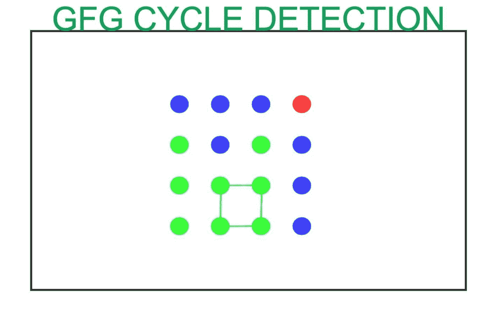

# 检测 2D 电网中的周期

> 原文:[https://www.geeksforgeeks.org/detect-cycle-in-a-2d-grid/](https://www.geeksforgeeks.org/detect-cycle-in-a-2d-grid/)

给定一个具有不同字符的 2D 网格 **arr[][]** ，任务是检测它是否包含一个周期。

> 字符或整数序列 c <sub>1</sub> ，c <sub>2</sub> ，…。c <sub>M</sub> 当且仅当满足以下条件时称为循环:
> 
> *   m 至少应该是 4。
> *   所有字符都属于同一个字符或整数。对于所有 0 <= i <= M -1 : c <sub>i</sub> 和 c <sub>i + 1</sub> 都是相邻的。
> *   同样，c <sub>M</sub> 和 c <sub>1</sub> 也应该是相邻的，也就是说，如果它们共享一个公共边。

[](https://media.geeksforgeeks.org/wp-content/uploads/20200705012757/gfg-cycle-detection.jpg)

**示例:**

> **输入:** arr[][] = {{'A '，' A '，' A '，' A'}，
> 
> {'A '，' B '，' C '，' A'}，
> 
> {'A '，' D '，' D '，' A ' } }
> **输出:**否
> **说明:**
> 以上矩阵中没有循环，因为不存在符合循环要求的成分。
> 
> **输入:** arr[N][M] = {{'A '，' A '，' A '，' A'}，
> 
> {'A '，' B '，' C '，' A'}，
> 
> {'A '，' A '，' A '，' A ' } }
> 
> **输出:**是
> **说明:**
> 下面提到的细胞形成一个循环，因为所有的要求都满足了。
> {(0，0)，(0，1)，(0，2)，(0，3)，(1，0)，(1，3)，(2，0)，(2，1)，(2，2)，(2，3)}。

**方法:**思路是在网格上使用 [DFS 遍历](https://www.geeksforgeeks.org/depth-first-search-or-dfs-for-a-graph/)检测其中的一个循环。以下是步骤:

*   选择给定矩阵的每个单元格 **((0，0)到(N–1，M–1))**，因为没有确定的循环位置。
*   如果存在一个循环，那么该循环的所有单元应该具有相同的值，并且它们应该被连接并且还检查最后一个和第一个元素应该形成循环(它们应该具有不同的父元素)。
*   取一个**布尔变量**，存储函数 **isCycle()** 的结果，分别为 **1** 或 **0** ，表示是否有周期。如果函数返回 1，则将*和*变量切换为真，断开循环，否则继续。
*   如果*和*保持未标记状态直到最后一个，则打印**否**否则打印**是**。

下面是上述方法的实现:

## C++

```
// C++ program for the above approach
#include <bits/stdc++.h>
using namespace std;

// Define size of grid
#define N 3
#define M 4

// To store direction of all the four
// adjacent cells
const int directionInX[4] = { -1, 0, 1, 0 };
const int directionInY[4] = { 0, 1, 0, -1 };

// Boolean function for checking
// if a cell is valid or not
bool isValid(int x, int y)
{
    if (x < N && x >= 0
        && y < M && y >= 0)
        return 1;

    return 0;
}

// Boolean function which will check
// whether the given array consist
// of a cycle or not
bool isCycle(int x, int y, char arr[N][M],
            bool visited[N][M],
            int parentX, int parentY)
{
    // Mark the current vertex true
    visited[x][y] = true;

    // Loop for generate all possibilities
    // of adjacent cells and checking them
    for (int k = 0; k < 4; k++) {

        int newX = x + directionInX[k];
        int newY = y + directionInY[k];

        if (isValid(newX, newY) == 1
            && arr[newX][newY] == arr[x][y]
            && !(parentX == newX
                and parentY == newY)) {

            // Check if there exist
            // cycle then return true
            if (visited[newX][newY] == 1) {

                // Return 1 because the
                // cycle exists
                return true;
            }

            // Check if not found,
            // keep checking recursively
            else {
                bool check
                    = isCycle(newX, newY, arr,
                            visited, x, y);

                // Now, if check comes out
                // to be true then return 1
                // indicating there exist cycle
                if (check == 1)
                    return true;
            }
        }
    }

    // If there was no cycle,
    // taking x and y as source
    // then return false
    return false;
}

// Function to detect Cycle in a grid
void detectCycle(char arr[N][M])
{

    // To store the visited cell
    bool visited[N][M];

    // Initially marking all
    // the cells as unvisited
    for (int i = 0; i < N; i++)
        for (int j = 0; j < M; j++)
            visited[i][j] = false;

    // Boolean variable for
    // storing the result
    bool cycle = 0;

    // As there is no fix position
    // of Cycle we will have to
    // check for every arr[i][j]
    for (int i = 0; i < N; i++) {

        // If cycle is present and
        // we have already detected
        // it, then break this loop
        if (cycle == true)
            break;

        for (int j = 0; j < M; j++) {

            // Taking (-1, -1) as
            // source node's parent
            if (visited[i][j] == 0) {
                cycle = isCycle(i, j, arr,
                                visited, -1, -1);
            }

            // If we have encountered a
            // cycle then break this loop
            if (cycle == true)
                break;
        }
    }

    // Cycle was encountered
    if (cycle == true) {
        cout << "Yes";
    }

    // Cycle was not encountered
    else {
        cout << "No";
    }
}

// Driver code
int main()
{
    // Given grid arr[][]
    char arr[N][M] = { { 'A', 'A', 'A', 'A' },
                    { 'A', 'B', 'C', 'A' },
                    { 'A', 'D', 'D', 'A' } };

    // Function Call
    detectCycle(arr);
    return 0;
}
```

## Java 语言(一种计算机语言，尤用于创建网站)

```
// Java program for the above approach
import java.util.*;

class GFG{

// Define size of grid
static final int N = 3;
static final int M = 4;

// To store direction of all the four
// adjacent cells
static int directionInX[] = new int[]{ -1, 0, 1, 0 };
static int directionInY[] = new int[]{ 0, 1, 0, -1 };

// Boolean function for checking
// if a cell is valid or not
static boolean isValid(int x, int y)
{
    if (x < N && x >= 0 &&
        y < M && y >= 0)
        return true;
    else
        return false;
}

// Boolean function which will check
// whether the given array consist
// of a cycle or not
static boolean isCycle(int x, int y, char arr[][],
                    boolean visited[][],
                    int parentX, int parentY)
{

    // Mark the current vertex true
    visited[x][y] = true;

    // Loop for generate all possibilities
    // of adjacent cells and checking them
    for(int k = 0; k < 4; k++)
    {
        int newX = x + directionInX[k];
        int newY = y + directionInY[k];

        if (isValid(newX, newY) == true &&
            arr[newX][newY] == arr[x][y] &&
            !(parentX == newX && parentY == newY))
        {

            // Check if there exist
            // cycle then return true
            if (visited[newX][newY] == true)
            {

                // Return 1 because the
                // cycle exists
                return true;
            }

            // Check if not found,
            // keep checking recursively
            else
            {
                boolean check = isCycle(newX, newY,
                                        arr, visited,
                                        x, y);

                // Now, if check comes out
                // to be true then return 1
                // indicating there exist cycle
                if (check == true)
                    return true;
            }
        }
    }

    // If there was no cycle,
    // taking x and y as source
    // then return false
    return false;
}

// Function to detect Cycle in a grid
static void detectCycle(char arr[][])
{

    // To store the visited cell
    boolean [][]visited = new boolean[N][M];

    // Initially marking all
    // the cells as unvisited
    for(int i = 0; i < N; i++)
        for(int j = 0; j < M; j++)
            visited[i][j] = false;

    // Boolean variable for
    // storing the result
    boolean cycle = false;

    // As there is no fix position
    // of Cycle we will have to
    // check for every arr[i][j]
    for(int i = 0; i < N; i++)
    {

        // If cycle is present and
        // we have already detected
        // it, then break this loop
        if (cycle == true)
            break;

        for(int j = 0; j < M; j++)
        {

            // Taking (-1, -1) as
            // source node's parent
            if (visited[i][j] == false)
            {
                cycle = isCycle(i, j, arr,
                                visited, -1, -1);
            }

            // If we have encountered a
            // cycle then break this loop
            if (cycle == true)
                break;
        }
    }

    // Cycle was encountered
    if (cycle == true)
    {
        System.out.print("Yes");
    }

    // Cycle was not encountered
    else
    {
        System.out.print("No");
    }
}

// Driver code
public static void main(String[] args)
{

    // Given grid arr[][]
    char arr[][] = { { 'A', 'A', 'A', 'A' },
                    { 'A', 'B', 'C', 'A' },
                    { 'A', 'D', 'D', 'A' } };

    // Function call
    detectCycle(arr);
}
}

// This code is contributed by amal kumar choubey
```

## 蟒蛇 3

```
# Python3 program for the above approach

# Store direction of all the four
# adjacent cells. We'll move along
# the grid using pairs of values
directionInX = [ -1, 0, 1, 0 ]
directionInY = [ 0, 1, 0, -1 ]

# Function for checking
# if a cell is valid or not
def isValid(x, y, N, M):

    if (x < N and x >= 0 and
        y < M and y >= 0):
        return True

    return False

# Function which will check whether
# the given array consist of a cycle or not
def isCycle(x, y, arr, visited, parentX, parentY):

    # Mark the current vertex as visited
    visited[x][y] = True

    N, M = 3, 4

    # Loop for generate all possibilities
    # of adjacent cells and checking them
    for k in range(4):
        newX = x + directionInX[k]
        newY = y + directionInY[k]

        if (isValid(newX, newY, N, M) and
            arr[newX][newY] == arr[x][y] and
               not (parentX == newX and
                    parentY == newY)):

            # Check if there exist
            # cycle then return true
            if visited[newX][newY]:

                # Return True as the
                # cycle exists
                return True

            # If the cycle is not found
            # then keep checking recursively
            else:
                check = isCycle(newX, newY, arr,
                                visited, x, y)
                if check:
                    return True

    # If there was no cycle, taking
    # x and y as source then return false
    return False

# Function to detect Cycle in a grid
def detectCycle(arr):

    N, M = 3, 4

    # Initially all the cells are unvisited
    visited = [[False] * M for _ in range(N)]

    # Variable to store the result
    cycle = False

    # As there is no fixed position
    # of the cycle we have to loop
    # through all the elements
    for i in range(N):

        # If cycle is present and
        # we have already detected
        # it, then break this loop
        if cycle == True:
            break

        for j in range(M):

            # Taking (-1, -1) as source
            # node's parent
            if visited[i][j] == False:
                cycle = isCycle(i, j, arr,
                                visited, -1, -1)

            # If we have encountered a
            # cycle then break this loop
            if cycle == True:
                break

    # Cycle was encountered
    if cycle == True:
        print("Yes")

    # Cycle was not encountered
    else:
        print("No")

# Driver code
arr = [ [ 'A', 'A', 'A', 'A' ],
        [ 'A', 'B', 'C', 'A' ],
        [ 'A', 'D', 'D', 'A' ] ]

# Function call
detectCycle(arr)

# This code is contributed by soum1071
```

## C#

```
// C# program for the above approach
using System;

class GFG{

// Define size of grid
static readonly int N = 3;
static readonly int M = 4;

// To store direction of all the four
// adjacent cells
static int []directionInX = new int[]{ -1, 0, 1, 0 };
static int []directionInY = new int[]{ 0, 1, 0, -1 };

// Boolean function for checking
// if a cell is valid or not
static bool isValid(int x, int y)
{
    if (x < N && x >= 0 &&
        y < M && y >= 0)
        return true;
    else
        return false;
}

// Boolean function which will check
// whether the given array consist
// of a cycle or not
static bool isCycle(int x, int y, char [,]arr,
                    bool [,]visited,
                    int parentX, int parentY)
{

    // Mark the current vertex true
    visited[x, y] = true;

    // Loop for generate all possibilities
    // of adjacent cells and checking them
    for(int k = 0; k < 4; k++)
    {
        int newX = x + directionInX[k];
        int newY = y + directionInY[k];

        if (isValid(newX, newY) == true &&
            arr[newX, newY] == arr[x, y] &&
            !(parentX == newX && parentY == newY))
        {

            // Check if there exist
            // cycle then return true
            if (visited[newX, newY] == true)
            {

                // Return 1 because the
                // cycle exists
                return true;
            }

            // Check if not found,
            // keep checking recursively
            else
            {
                bool check = isCycle(newX, newY,
                                    arr, visited,
                                    x, y);

                // Now, if check comes out
                // to be true then return 1
                // indicating there exist cycle
                if (check == true)
                    return true;
            }
        }
    }

    // If there was no cycle,
    // taking x and y as source
    // then return false
    return false;
}

// Function to detect Cycle in a grid
static void detectCycle(char [,]arr)
{

    // To store the visited cell
    bool [,]visited = new bool[N, M];

    // Initially marking all
    // the cells as unvisited
    for(int i = 0; i < N; i++)
        for(int j = 0; j < M; j++)
            visited[i, j] = false;

    // Boolean variable for
    // storing the result
    bool cycle = false;

    // As there is no fix position
    // of Cycle we will have to
    // check for every arr[i,j]
    for(int i = 0; i < N; i++)
    {

        // If cycle is present and
        // we have already detected
        // it, then break this loop
        if (cycle == true)
            break;

        for(int j = 0; j < M; j++)
        {

            // Taking (-1, -1) as
            // source node's parent
            if (visited[i, j] == false)
            {
                cycle = isCycle(i, j, arr,
                                visited, -1, -1);
            }

            // If we have encountered a
            // cycle then break this loop
            if (cycle == true)
                break;
        }
    }

    // Cycle was encountered
    if (cycle == true)
    {
        Console.Write("Yes");
    }

    // Cycle was not encountered
    else
    {
        Console.Write("No");
    }
}

// Driver code
public static void Main(String[] args)
{

    // Given grid [,]arr
    char [,]arr = { { 'A', 'A', 'A', 'A' },
                    { 'A', 'B', 'C', 'A' },
                    { 'A', 'D', 'D', 'A' } };

    // Function call
    detectCycle(arr);
}
}

// This code is contributed by amal kumar choubey
```

## java 描述语言

```
<script>
    // Javascript program for the above approach

    // Define size of grid
    let N = 3;
    let M = 4;

    // To store direction of all the four
    // adjacent cells
    let directionInX = [ -1, 0, 1, 0 ];
    let directionInY = [ 0, 1, 0, -1 ];

    // Boolean function for checking
    // if a cell is valid or not
    function isValid(x, y)
    {
        if (x < N && x >= 0 &&
            y < M && y >= 0)
            return true;
        else
            return false;
    }

    // Boolean function which will check
    // whether the given array consist
    // of a cycle or not
    function isCycle(x, y, arr, visited, parentX, parentY)
    {

        // Mark the current vertex true
        visited[x][y] = true;

        // Loop for generate all possibilities
        // of adjacent cells and checking them
        for(let k = 0; k < 4; k++)
        {
            let newX = x + directionInX[k];
            let newY = y + directionInY[k];

            if (isValid(newX, newY) == true &&
                arr[newX][newY] == arr[x][y] &&
                !(parentX == newX && parentY == newY))
            {

                // Check if there exist
                // cycle then return true
                if (visited[newX][newY] == true)
                {

                    // Return 1 because the
                    // cycle exists
                    return true;
                }

                // Check if not found,
                // keep checking recursively
                else
                {
                    let check = isCycle(newX, newY,
                                            arr, visited,
                                            x, y);

                    // Now, if check comes out
                    // to be true then return 1
                    // indicating there exist cycle
                    if (check == true)
                        return true;
                }
            }
        }

        // If there was no cycle,
        // taking x and y as source
        // then return false
        return false;
    }

    // Function to detect Cycle in a grid
    function detectCycle(arr)
    {

        // To store the visited cell
        let visited = new Array(N);

        // Initially marking all
        // the cells as unvisited
        for(let i = 0; i < N; i++)
        {
            visited[i] = new Array(M);
            for(let j = 0; j < M; j++)
            {
                visited[i][j] = false;
            }
        }

        // Boolean variable for
        // storing the result
        let cycle = false;

        // As there is no fix position
        // of Cycle we will have to
        // check for every arr[i][j]
        for(let i = 0; i < N; i++)
        {

            // If cycle is present and
            // we have already detected
            // it, then break this loop
            if (cycle == true)
                break;

            for(let j = 0; j < M; j++)
            {

                // Taking (-1, -1) as
                // source node's parent
                if (visited[i][j] == false)
                {
                    cycle = isCycle(i, j, arr,
                                    visited, -1, -1);
                }

                // If we have encountered a
                // cycle then break this loop
                if (cycle == true)
                    break;
            }
        }

        // Cycle was encountered
        if (cycle == true)
        {
            document.write("Yes");
        }

        // Cycle was not encountered
        else
        {
            document.write("No");
        }
    }

    // Given grid arr[][]
    let arr = [ [ 'A', 'A', 'A', 'A' ],
                 [ 'A', 'B', 'C', 'A' ],
                 [ 'A', 'D', 'D', 'A' ] ];

    // Function call
    detectCycle(arr);

// This code is contributed by divyeshrabadiy07.
</script>
```

**Output:** 

```
No
```

***时间复杂度** : O(N * M)*
***辅助空间:** O(N * M)*