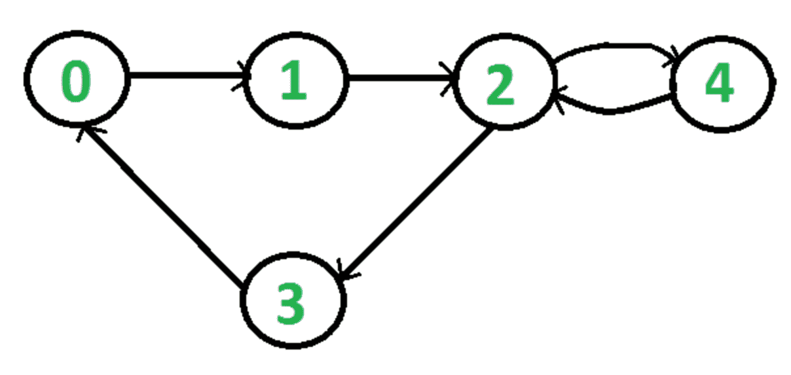

# 使用 BFS 检测有向图中的循环

> 原文:[https://www . geesforgeks . org/detect-cycle-in-a-directed-graph-use-bfs/](https://www.geeksforgeeks.org/detect-cycle-in-a-directed-graph-using-bfs/)

给定一个有向图，检查该图是否包含循环。如果给定的图形至少包含一个循环，则函数应该返回 true，否则返回 false。例如，下图包含两个循环 0->1->2->3->0 和 2->4->2，因此您的函数必须返回 true。



我们已经讨论了一个基于 [DFS 的解决方案来检测有向图](https://www.geeksforgeeks.org/detect-cycle-in-a-graph/)中的循环。本文讨论了基于 [BFS](https://www.geeksforgeeks.org/breadth-first-search-or-bfs-for-a-graph/) 的解决方案。
想法是简单地使用[卡恩算法进行拓扑排序](https://www.geeksforgeeks.org/topological-sorting-indegree-based-solution/)

使用 BFS 检测有向图中的循环所涉及的步骤。
**步骤-1:** 计算图中每个顶点的入度(引入边的数量)，并将访问节点的数量初始化为 0。
**步骤-2:** 拾取所有入度为 0 的顶点，并将其添加到队列中(入队操作)
**步骤-3:** 从队列中移除一个顶点(出队操作)，然后。

1.  将访问节点的计数增加 1。
2.  所有相邻节点的度数减少 1 度。
3.  如果相邻节点的入度降低到零，则将其添加到队列中。

**步骤 4:** 重复步骤 3，直到队列为空。
**第五步:**如果访问节点数是**而不是**等于图中有循环的节点数，否则不是。

**如何求各节点的入度？**
计算每个顶点的入度有 2 种方法:
取一个将跟踪
**1)** 的入度数组遍历边数组，只需将目的节点的计数器增加 1。

```
for each node in Nodes
    indegree[node] = 0;
for each edge(src,dest) in Edges
    indegree[dest]++
```

时间复杂度:O(V+E)

**2)** 遍历每个节点的列表，然后将与其连接的所有节点的入度增加 1。

```
    for each node in Nodes
        If (list[node].size()!=0) then
        for each dest in list
            indegree[dest]++;
```

时间复杂度:外 for 循环执行 V 次，内 for 循环执行 E 次，因此整体时间复杂度为 O(V+E)。

算法的整体时间复杂度为 O(V+E)

## C++

```
// A C++ program to check if there is a cycle in
// directed graph using BFS.
#include <bits/stdc++.h>
using namespace std;

// Class to represent a graph
class Graph {
    int V; // No. of vertices'

    // Pointer to an array containing adjacency list
    list<int>* adj;

public:
    Graph(int V); // Constructor

    // function to add an edge to graph
    void addEdge(int u, int v);

    // Returns true if there is a cycle in the graph
    // else false.
    bool isCycle();
};

Graph::Graph(int V)
{
    this->V = V;
    adj = new list<int>[V];
}

void Graph::addEdge(int u, int v)
{
    adj[u].push_back(v);
}

// This function returns true if there is a cycle
// in directed graph, else returns false.
bool Graph::isCycle()
{
    // Create a vector to store indegrees of all
    // vertices. Initialize all indegrees as 0.
    vector<int> in_degree(V, 0);

    // Traverse adjacency lists to fill indegrees of
    // vertices. This step takes O(V+E) time
    for (int u = 0; u < V; u++) {
        for (auto v : adj[u])
            in_degree[v]++;
    }

    // Create an queue and enqueue all vertices with
    // indegree 0
    queue<int> q;
    for (int i = 0; i < V; i++)
        if (in_degree[i] == 0)
            q.push(i);

    // Initialize count of visited vertices
    // 1 For src Node
    int cnt = 1;

    // Create a vector to store result (A topological
    // ordering of the vertices)
    vector<int> top_order;

    // One by one dequeue vertices from queue and enqueue
    // adjacents if indegree of adjacent becomes 0
    while (!q.empty()) {

        // Extract front of queue (or perform dequeue)
        // and add it to topological order
        int u = q.front();
        q.pop();
        top_order.push_back(u);

        // Iterate through all its neighbouring nodes
        // of dequeued node u and decrease their in-degree
        // by 1
        list<int>::iterator itr;
        for (itr = adj[u].begin(); itr != adj[u].end(); itr++)

            // If in-degree becomes zero, add it to queue
            if (--in_degree[*itr] == 0)
            {
              q.push(*itr);
              //while we are pushing elements to the queue we will incrementing the cnt
              cnt++;
            }

    }

    // Check if there was a cycle
    if (cnt != V)
        return true;
    else
        return false;
}

// Driver program to test above functions
int main()
{
    // Create a graph given in the above diagram
    Graph g(6);
    g.addEdge(0, 1);
    g.addEdge(1, 2);
    g.addEdge(2, 0);
    g.addEdge(3, 4);
    g.addEdge(4, 5);

    if (g.isCycle())
        cout << "Yes";
    else
        cout << "No";

    return 0;
}
```

## Java 语言(一种计算机语言，尤用于创建网站)

```
// Java program to check if there is a cycle in
// directed graph using BFS.
import java.io.*;
import java.util.*;

class GFG
{

    // Class to represent a graph
    static class Graph
    {
        int V; // No. of vertices'

        // Pointer to an array containing adjacency list
        Vector<Integer>[] adj;

        @SuppressWarnings("unchecked")
        Graph(int V)
        {
            // Constructor
            this.V = V;
            this.adj = new Vector[V];
            for (int i = 0; i < V; i++)
                adj[i] = new Vector<>();
        }

        // function to add an edge to graph
        void addEdge(int u, int v)
        {
            adj[u].add(v);
        }

        // Returns true if there is a cycle in the graph
        // else false.

        // This function returns true if there is a cycle
        // in directed graph, else returns false.
        boolean isCycle()
        {

            // Create a vector to store indegrees of all
            // vertices. Initialize all indegrees as 0.
            int[] in_degree = new int[this.V];
            Arrays.fill(in_degree, 0);

            // Traverse adjacency lists to fill indegrees of
            // vertices. This step takes O(V+E) time
            for (int u = 0; u < V; u++)
            {
                for (int v : adj[u])
                    in_degree[v]++;
            }

            // Create an queue and enqueue all vertices with
            // indegree 0
            Queue<Integer> q = new LinkedList<Integer>();
            for (int i = 0; i < V; i++)
                if (in_degree[i] == 0)
                    q.add(i);

            // Initialize count of visited vertices
            int cnt = 0;

            // Create a vector to store result (A topological
            // ordering of the vertices)
            Vector<Integer> top_order = new Vector<>();

            // One by one dequeue vertices from queue and enqueue
            // adjacents if indegree of adjacent becomes 0
            while (!q.isEmpty())
            {

                // Extract front of queue (or perform dequeue)
                // and add it to topological order
                int u = q.poll();
                top_order.add(u);

                // Iterate through all its neighbouring nodes
                // of dequeued node u and decrease their in-degree
                // by 1
                for (int itr : adj[u])
                    if (--in_degree[itr] == 0)
                        q.add(itr);
                cnt++;
            }

            // Check if there was a cycle
            if (cnt != this.V)
                return true;
            else
                return false;
        }
    }

    // Driver Code
    public static void main(String[] args)
    {

        // Create a graph given in the above diagram
        Graph g = new Graph(6);
        g.addEdge(0, 1);
        g.addEdge(1, 2);
        g.addEdge(2, 0);
        g.addEdge(3, 4);
        g.addEdge(4, 5);

        if (g.isCycle())
            System.out.println("Yes");
        else
            System.out.println("No");
    }
}

// This code is contributed by
// sanjeev2552
```

## 蟒蛇 3

```
# A Python3 program to check if there is a cycle in 
# directed graph using BFS.
import math
import sys
from collections import defaultdict

# Class to represent a graph
class Graph:
    def __init__(self,vertices):
        self.graph=defaultdict(list)
        self.V=vertices # No. of vertices'

    # function to add an edge to graph
    def addEdge(self,u,v):
        self.graph[u].append(v)

# This function returns true if there is a cycle
# in directed graph, else returns false.
def isCycleExist(n,graph):

    # Create a vector to store indegrees of all
    # vertices. Initialize all indegrees as 0.
    in_degree=[0]*n

    # Traverse adjacency lists to fill indegrees of
    # vertices. This step takes O(V+E) time
    for i in range(n):
        for j in graph[i]:
            in_degree[j]+=1

    # Create an queue and enqueue all vertices with
    # indegree 0
    queue=[]
    for i in range(len(in_degree)):
        if in_degree[i]==0:
            queue.append(i)

    # Initialize count of visited vertices
    cnt=0

    # One by one dequeue vertices from queue and enqueue
    # adjacents if indegree of adjacent becomes 0
    while(queue):

        # Extract front of queue (or perform dequeue)
        # and add it to topological order
        nu=queue.pop(0)

        # Iterate through all its neighbouring nodes
        # of dequeued node u and decrease their in-degree
        # by 1
        for v in graph[nu]:
            in_degree[v]-=1

            # If in-degree becomes zero, add it to queue
            if in_degree[v]==0:
                queue.append(v)
        cnt+=1

    # Check if there was a cycle
    if cnt==n:
        return False
    else:
        return True

# Driver program to test above functions
if __name__=='__main__':

    # Create a graph given in the above diagram
    g=Graph(6)
    g.addEdge(0,1)
    g.addEdge(1,2)
    g.addEdge(2,0)
    g.addEdge(3,4)
    g.addEdge(4,5)

    if isCycleExist(g.V,g.graph):
        print("Yes")
    else:
        print("No")

# This Code is Contributed by Vikash Kumar 37
```

## C#

```
// C# program to check if there is a cycle in
// directed graph using BFS.
using System;
using System.Collections.Generic;

class GFG{

// Class to represent a graph
public class Graph
{

    // No. of vertices'
    public int V;

    // Pointer to an array containing
    // adjacency list
    public List<int>[] adj;

    public Graph(int V)
    {

        // Constructor
        this.V = V;
        this.adj = new List<int>[V];
        for (int i = 0; i < V; i++)
        adj[i] = new List<int>();
    }

    // Function to add an edge to graph
    public void addEdge(int u, int v)
    {
        adj[u].Add(v);
    }

    // Returns true if there is a cycle in the
    // graph else false.

    // This function returns true if there is
    // a cycle in directed graph, else returns
    // false.
    public bool isCycle()
    {

        // Create a vector to store indegrees of all
        // vertices. Initialize all indegrees as 0.
        int[] in_degree = new int[this.V];

        // Traverse adjacency lists to fill indegrees
        // of vertices. This step takes O(V+E) time
        for(int u = 0; u < V; u++)
        {
            foreach(int v in adj[u])
                in_degree[v]++;
        }

        // Create an queue and enqueue all
        // vertices with indegree 0
        Queue<int> q = new Queue<int>();
        for(int i = 0; i < V; i++)
            if (in_degree[i] == 0)
                q.Enqueue(i);

        // Initialize count of visited vertices
        int cnt = 0;

        // Create a vector to store result
        // (A topological ordering of the
        // vertices)
        List<int> top_order = new List<int>();

        // One by one dequeue vertices from
        // queue and enqueue adjacents if
        // indegree of adjacent becomes 0
        while (q.Count != 0)
        {

            // Extract front of queue (or perform
            // dequeue) and add it to topological
            // order
            int u = q.Peek();
            q.Dequeue();
            top_order.Add(u);

            // Iterate through all its neighbouring
            // nodes of dequeued node u and decrease
            // their in-degree by 1
            foreach(int itr in adj[u])
                if (--in_degree[itr] == 0)
                    q.Enqueue(itr);

            cnt++;
        }

        // Check if there was a cycle
        if (cnt != this.V)
            return true;
        else
            return false;
    }
}

// Driver Code
public static void Main(String[] args)
{

    // Create a graph given in the above diagram
    Graph g = new Graph(6);
    g.addEdge(0, 1);
    g.addEdge(1, 2);
    g.addEdge(2, 0);
    g.addEdge(3, 4);
    g.addEdge(4, 5);

    if (g.isCycle())
        Console.WriteLine("Yes");
    else
        Console.WriteLine("No");
}
}

// This code is contributed by Princi Singh
```

## java 描述语言

```
<script>

// JavaScript program to check if there is a cycle in
// directed graph using BFS.

// Class to represent a graph
// No. of vertices'
var V = 0;

// Pointer to an array containing
// adjacency list
var adj ;

function initialize(v)
{

    // Constructor
    V = v;
    adj = Array.from(Array(V), ()=>Array(V));
}

// Function to add an edge to graph
function addEdge(u, v)
{
    adj[u].push(v);
}

// Returns true if there is a cycle in the
// graph else false.

// This function returns true if there is
// a cycle in directed graph, else returns
// false.
function isCycle()
{

    // Create a vector to store indegrees of all
    // vertices. Initialize all indegrees as 0.
    var in_degree = Array(V).fill(0);

    // Traverse adjacency lists to fill indegrees
    // of vertices. This step takes O(V+E) time
    for(var u = 0; u < V; u++)
    {
        for(var v of adj[u])
            in_degree[v]++;
    }

    // Create an queue and enqueue all
    // vertices with indegree 0
    var q = [];
    for(var i = 0; i < V; i++)
        if (in_degree[i] == 0)
            q.push(i);

    // Initialize count of visited vertices
    var cnt = 0;

    // Create a vector to store result
    // (A topological ordering of the
    // vertices)
    var top_order = [];

    // One by one dequeue vertices from
    // queue and enqueue adjacents if
    // indegree of adjacent becomes 0
    while (q.length != 0)
    {

        // Extract front of queue (or perform
        // dequeue) and add it to topological
        // order
        var u = q[0];
        q.shift();
        top_order.push(u);

        // Iterate through all its neighbouring
        // nodes of dequeued node u and decrease
        // their in-degree by 1
        for(var itr of adj[u])
            if (--in_degree[itr] == 0)
                q.push(itr);

        cnt++;
    }

    // Check if there was a cycle
    if (cnt != V)
        return true;
    else
        return false;
}

// Create a graph given in the above diagram
initialize(6)
addEdge(0, 1);
addEdge(1, 2);
addEdge(2, 0);
addEdge(3, 4);
addEdge(4, 5);
if (isCycle())
    document.write("Yes");
else
    document.write("No");

</script>
```

**Output:** 

```
Yes
```

**时间复杂度:** O(V+E)