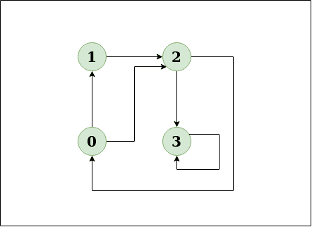
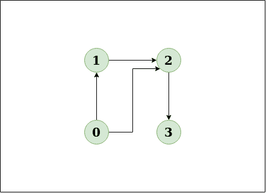
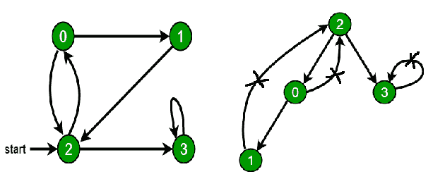
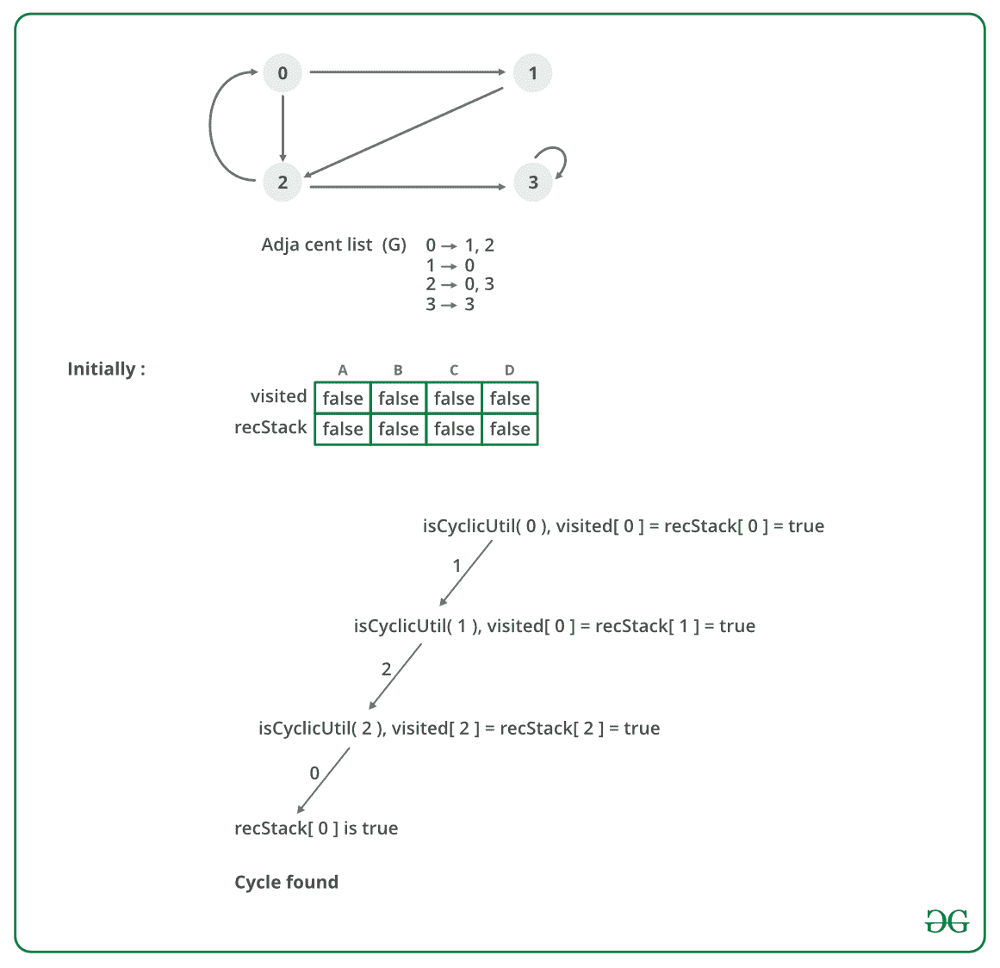

# 检测有向图中的周期

> 原文:[https://www.geeksforgeeks.org/detect-cycle-in-a-graph/](https://www.geeksforgeeks.org/detect-cycle-in-a-graph/)

给定一个有向图，检查该图是否包含循环。如果给定的图形至少包含一个循环，则函数应该返回 true，否则返回 false。
**例，**

```
Input: n = 4, e = 6
0 -> 1, 0 -> 2, 1 -> 2, 2 -> 0, 2 -> 3, 3 -> 3
Output: Yes
Explanation:
Diagram:
```



```
The diagram clearly shows a cycle 0 -> 2 -> 0

Input:n = 4, e = 4
0 -> 1, 0 -> 2, 1 -> 2, 2 -> 3
Output:No
Explanation:
Diagram:
```



```
The diagram clearly shows no cycle
```

**<u>解使用</u>** [**<u>深度优先搜索或 DFS</u>**](https://www.geeksforgeeks.org/depth-first-search-or-dfs-for-a-graph/)

*   **方法:**深度优先遍历可用于检测图形中的循环。连通图的 DFS 生成一棵树。只有当图中存在[后沿](http://en.wikipedia.org/wiki/Depth-first_search#Output_of_a_depth-first_search)时，图中才有循环。后边缘是从一个节点到其自身(自循环)或其在由 DFS 产生的树中的祖先之一的边缘。在下图中，有 3 条后边缘，用十字符号标记。我们可以观察到，这 3 条后边缘表示图中存在 3 个循环。



*   对于断开的图，获取 DFS 林作为输出。要检测循环，请通过检查后边缘来检查各个树中的循环。
    为了检测后边缘，跟踪当前在函数递归栈中的顶点，用于 DFS 遍历。如果到达的顶点已经在递归堆栈中，那么树中就有一个循环。将当前顶点连接到递归堆栈中顶点的边是后边。使用**递归堆栈[]** 数组来跟踪递归堆栈中的顶点。
    **上述方法的试运行:**



*   **算法:**
    1.  使用给定数量的边和顶点创建图形。
    2.  创建一个递归函数，初始化当前索引或顶点、访问和递归堆栈。
    3.  将当前节点标记为已访问，并在递归堆栈中标记索引。
    4.  找出所有没有被访问过并且与当前节点相邻的顶点。递归调用这些顶点的函数，如果递归函数返回真，则返回真。
    5.  如果相邻顶点已经在递归堆栈中标记，则返回 true。
    6.  创建一个包装类，为所有顶点调用递归函数，如果任何函数返回 true，则返回 true。否则，如果对于所有顶点，函数返回 false，则返回 false。

**执行:**

## C++

```
// A C++ Program to detect cycle in a graph
#include<bits/stdc++.h>

using namespace std;

class Graph
{
    int V;    // No. of vertices
    list<int> *adj;    // Pointer to an array containing adjacency lists
    bool isCyclicUtil(int v, bool visited[], bool *rs);  // used by isCyclic()
public:
    Graph(int V);   // Constructor
    void addEdge(int v, int w);   // to add an edge to graph
    bool isCyclic();    // returns true if there is a cycle in this graph
};

Graph::Graph(int V)
{
    this->V = V;
    adj = new list<int>[V];
}

void Graph::addEdge(int v, int w)
{
    adj[v].push_back(w); // Add w to v’s list.
}

// This function is a variation of DFSUtil() in https://www.geeksforgeeks.org/archives/18212
bool Graph::isCyclicUtil(int v, bool visited[], bool *recStack)
{
    if(visited[v] == false)
    {
        // Mark the current node as visited and part of recursion stack
        visited[v] = true;
        recStack[v] = true;

        // Recur for all the vertices adjacent to this vertex
        list<int>::iterator i;
        for(i = adj[v].begin(); i != adj[v].end(); ++i)
        {
            if ( !visited[*i] && isCyclicUtil(*i, visited, recStack) )
                return true;
            else if (recStack[*i])
                return true;
        }

    }
    recStack[v] = false;  // remove the vertex from recursion stack
    return false;
}

// Returns true if the graph contains a cycle, else false.
// This function is a variation of DFS() in https://www.geeksforgeeks.org/archives/18212
bool Graph::isCyclic()
{
    // Mark all the vertices as not visited and not part of recursion
    // stack
    bool *visited = new bool[V];
    bool *recStack = new bool[V];
    for(int i = 0; i < V; i++)
    {
        visited[i] = false;
        recStack[i] = false;
    }

    // Call the recursive helper function to detect cycle in different
    // DFS trees
    for(int i = 0; i < V; i++)
        if (isCyclicUtil(i, visited, recStack))
            return true;

    return false;
}

int main()
{
    // Create a graph given in the above diagram
    Graph g(4);
    g.addEdge(0, 1);
    g.addEdge(0, 2);
    g.addEdge(1, 2);
    g.addEdge(2, 0);
    g.addEdge(2, 3);
    g.addEdge(3, 3);

    if(g.isCyclic())
        cout << "Graph contains cycle";
    else
        cout << "Graph doesn't contain cycle";
    return 0;
}
```

## Java 语言(一种计算机语言，尤用于创建网站)

```
// A Java Program to detect cycle in a graph
import java.util.ArrayList;
import java.util.LinkedList;
import java.util.List;

class Graph {

    private final int V;
    private final List<List<Integer>> adj;

    public Graph(int V) 
    {
        this.V = V;
        adj = new ArrayList<>(V);

        for (int i = 0; i < V; i++)
            adj.add(new LinkedList<>());
    }

    // This function is a variation of DFSUtil() in 
    // https://www.geeksforgeeks.org/archives/18212
    private boolean isCyclicUtil(int i, boolean[] visited,
                                      boolean[] recStack) 
    {

        // Mark the current node as visited and
        // part of recursion stack
        if (recStack[i])
            return true;

        if (visited[i])
            return false;

        visited[i] = true;

        recStack[i] = true;
        List<Integer> children = adj.get(i);

        for (Integer c: children)
            if (isCyclicUtil(c, visited, recStack))
                return true;

        recStack[i] = false;

        return false;
    }

    private void addEdge(int source, int dest) {
        adj.get(source).add(dest);
    }

    // Returns true if the graph contains a 
    // cycle, else false.
    // This function is a variation of DFS() in 
    // https://www.geeksforgeeks.org/archives/18212
    private boolean isCyclic() 
    {

        // Mark all the vertices as not visited and
        // not part of recursion stack
        boolean[] visited = new boolean[V];
        boolean[] recStack = new boolean[V];

        // Call the recursive helper function to
        // detect cycle in different DFS trees
        for (int i = 0; i < V; i++)
            if (isCyclicUtil(i, visited, recStack))
                return true;

        return false;
    }

    // Driver code
    public static void main(String[] args)
    {
        Graph graph = new Graph(4);
        graph.addEdge(0, 1);
        graph.addEdge(0, 2);
        graph.addEdge(1, 2);
        graph.addEdge(2, 0);
        graph.addEdge(2, 3);
        graph.addEdge(3, 3);

        if(graph.isCyclic())
            System.out.println("Graph contains cycle");
        else
            System.out.println("Graph doesn't "
                                    + "contain cycle");
    }
}

// This code is contributed by Sagar Shah.
```

## 计算机编程语言

```
# Python program to detect cycle 
# in a graph

from collections import defaultdict

class Graph():
    def __init__(self,vertices):
        self.graph = defaultdict(list)
        self.V = vertices

    def addEdge(self,u,v):
        self.graph[u].append(v)

    def isCyclicUtil(self, v, visited, recStack):

        # Mark current node as visited and 
        # adds to recursion stack
        visited[v] = True
        recStack[v] = True

        # Recur for all neighbours
        # if any neighbour is visited and in 
        # recStack then graph is cyclic
        for neighbour in self.graph[v]:
            if visited[neighbour] == False:
                if self.isCyclicUtil(neighbour, visited, recStack) == True:
                    return True
            elif recStack[neighbour] == True:
                return True

        # The node needs to be poped from 
        # recursion stack before function ends
        recStack[v] = False
        return False

    # Returns true if graph is cyclic else false
    def isCyclic(self):
        visited = [False] * (self.V + 1)
        recStack = [False] * (self.V + 1)
        for node in range(self.V):
            if visited[node] == False:
                if self.isCyclicUtil(node,visited,recStack) == True:
                    return True
        return False

g = Graph(4)
g.addEdge(0, 1)
g.addEdge(0, 2)
g.addEdge(1, 2)
g.addEdge(2, 0)
g.addEdge(2, 3)
g.addEdge(3, 3)
if g.isCyclic() == 1:
    print "Graph has a cycle"
else:
    print "Graph has no cycle"

# Thanks to Divyanshu Mehta for contributing this code
```

## C#

```
// A C# Program to detect cycle in a graph 
using System;
using System.Collections.Generic;

public class Graph { 

    private readonly int V; 
    private readonly List<List<int>> adj; 

    public Graph(int V) 
    { 
        this.V = V; 
        adj = new List<List<int>>(V); 

        for (int i = 0; i < V; i++) 
            adj.Add(new List<int>()); 
    } 

    // This function is a variation of DFSUtil() in 
    // https://www.geeksforgeeks.org/archives/18212 
    private bool isCyclicUtil(int i, bool[] visited, 
                                    bool[] recStack) 
    { 

        // Mark the current node as visited and 
        // part of recursion stack 
        if (recStack[i]) 
            return true; 

        if (visited[i]) 
            return false; 

        visited[i] = true; 

        recStack[i] = true; 
        List<int> children = adj[i]; 

        foreach (int c in children) 
            if (isCyclicUtil(c, visited, recStack)) 
                return true; 

        recStack[i] = false; 

        return false; 
    } 

    private void addEdge(int sou, int dest) { 
        adj[sou].Add(dest); 
    } 

    // Returns true if the graph contains a 
    // cycle, else false. 
    // This function is a variation of DFS() in 
    // https://www.geeksforgeeks.org/archives/18212 
    private bool isCyclic() 
    { 

        // Mark all the vertices as not visited and 
        // not part of recursion stack 
        bool[] visited = new bool[V]; 
        bool[] recStack = new bool[V]; 

        // Call the recursive helper function to 
        // detect cycle in different DFS trees 
        for (int i = 0; i < V; i++) 
            if (isCyclicUtil(i, visited, recStack)) 
                return true; 

        return false; 
    } 

    // Driver code 
    public static void Main(String[] args) 
    { 
        Graph graph = new Graph(4); 
        graph.addEdge(0, 1); 
        graph.addEdge(0, 2); 
        graph.addEdge(1, 2); 
        graph.addEdge(2, 0); 
        graph.addEdge(2, 3); 
        graph.addEdge(3, 3); 

        if(graph.isCyclic()) 
            Console.WriteLine("Graph contains cycle"); 
        else
            Console.WriteLine("Graph doesn't "
                                    + "contain cycle"); 
    } 
} 

// This code contributed by Rajput-Ji
```

## java 描述语言

```
<script>

// A JavaScript Program to detect cycle in a graph

let V;
let adj=[];
function Graph(v)
{
    V=v;
    for (let i = 0; i < V; i++)
        adj.push([]);
}

// This function is a variation of DFSUtil() in
    // https://www.geeksforgeeks.org/archives/18212
function isCyclicUtil(i,visited,recStack)
{
    // Mark the current node as visited and
        // part of recursion stack
        if (recStack[i])
            return true;

        if (visited[i])
            return false;

        visited[i] = true;

        recStack[i] = true;
        let children = adj[i];

        for (let c=0;c< children.length;c++)
            if (isCyclicUtil(children, visited, recStack))
                return true;

        recStack[i] = false;

        return false;
}

function addEdge(source,dest)
{
    adj.push(dest);
}

// Returns true if the graph contains a
    // cycle, else false.
    // This function is a variation of DFS() in
    // https://www.geeksforgeeks.org/archives/18212
function isCyclic()
{
    // Mark all the vertices as not visited and
        // not part of recursion stack
        let visited = new Array(V);
        let recStack = new Array(V);
        for(let i=0;i<V;i++)
        {
            visited[i]=false;
            recStack[i]=false;
        }

        // Call the recursive helper function to
        // detect cycle in different DFS trees
        for (let i = 0; i < V; i++)
            if (isCyclicUtil(i, visited, recStack))
                return true;

        return false;
}

// Driver code
Graph(4);
addEdge(0, 1);
addEdge(0, 2);
addEdge(1, 2);
addEdge(2, 0);
addEdge(2, 3);
addEdge(3, 3);

if(isCyclic())
    document.write("Graph contains cycle");
else
    document.write("Graph doesn't "
                   + "contain cycle");

// This code is contributed by patel2127

</script>
```

**输出:**

```
Graph contains cycle
```

*   **复杂度分析:**
    *   **时间复杂度:** O(V+E)。
        该方法的时间复杂度与 [DFS 遍历](https://www.geeksforgeeks.org/archives/18212)的时间复杂度相同，为 O(V+E)。
    *   **空间复杂度:** O(V)。
        要存储访问和递归堆栈，需要 O(V)空间。

在下面的文章中，讨论了另一种 O(V + E)方法:
[使用颜色在直接图中检测周期](https://www.geeksforgeeks.org/detect-cycle-direct-graph-using-colors/)
如果您发现任何不正确的地方，或者您想分享更多关于上面讨论的主题的信息，请写评论。