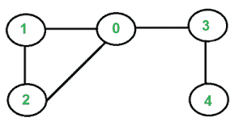

# 使用 BFS 检测无向图中的循环

> 原文:[https://www . geesforgeks . org/detect-in-cycle-in-an-directed-graph-use-bfs/](https://www.geeksforgeeks.org/detect-cycle-in-an-undirected-graph-using-bfs/)

给定一个无向图，如何检查图中是否有循环？例如，下图有一个循环 1-0-2-1。



我们已经讨论了[有向图](https://www.geeksforgeeks.org/detect-cycle-in-a-graph/)的[周期检测。我们还讨论了无向图中循环检测的](https://www.geeksforgeeks.org/detect-cycle-in-a-graph/)[联合查找算法。](https://www.geeksforgeeks.org/union-find/)。联合查找算法的时间复杂度为 0。像有向图一样，我们可以使用 [DFS](https://www.geeksforgeeks.org/depth-first-traversal-for-a-graph/) 来检测 O(V+E)时间内无向图中的一个循环。我们已经在和[无向图](https://www.geeksforgeeks.org/detect-cycle-undirected-graph/)中讨论了基于 [DFS 的循环检测解决方案。
本文讨论的是基于](https://www.geeksforgeeks.org/detect-cycle-undirected-graph/) [BFS](https://www.geeksforgeeks.org/breadth-first-traversal-for-a-graph/) 的解决方案。我们对给定的图进行 BFS 遍历。对于每个访问过的顶点“v”，如果有一个相邻的“u”，使得 u 已经被访问过，并且 u 不是 v 的父顶点，那么图中就有一个循环。如果我们没有为任何顶点找到这样的邻点，我们就说没有循环。
我们使用一个父数组来跟踪一个顶点的父顶点，这样我们就不会把被访问的父顶点看作一个循环。

## C++

```
// C++ program to detect cycle
// in an undirected graph
// using BFS.
#include <bits/stdc++.h>
using namespace std;

void addEdge(vector<int> adj[], int u, int v)
{
    adj[u].push_back(v);
    adj[v].push_back(u);
}

bool isCyclicConntected(vector<int> adj[], int s,
                        int V, vector<bool>& visited)
{
    // Set parent vertex for every vertex as -1.
    vector<int> parent(V, -1);

    // Create a queue for BFS
    queue<int> q;

    // Mark the current node as
    // visited and enqueue it
    visited[s] = true;
    q.push(s);

    while (!q.empty()) {

        // Dequeue a vertex from queue and print it
        int u = q.front();
        q.pop();

        // Get all adjacent vertices of the dequeued
        // vertex u. If a adjacent has not been visited,
        // then mark it visited and enqueue it. We also
        // mark parent so that parent is not considered
        // for cycle.
        for (auto v : adj[u]) {
            if (!visited[v]) {
                visited[v] = true;
                q.push(v);
                parent[v] = u;
            }
            else if (parent[u] != v)
                return true;
        }
    }
    return false;
}

bool isCyclicDisconntected(vector<int> adj[], int V)
{
    // Mark all the vertices as not visited
    vector<bool> visited(V, false);

    for (int i = 0; i < V; i++)
        if (!visited[i] && isCyclicConntected(adj, i,
                                         V, visited))
            return true;
    return false;
}

// Driver program to test methods of graph class
int main()
{
    int V = 4;
    vector<int> adj[V];
    addEdge(adj, 0, 1);
    addEdge(adj, 1, 2);
    addEdge(adj, 2, 0);
    addEdge(adj, 2, 3);

    if (isCyclicDisconntected(adj, V))
        cout << "Yes";
    else
        cout << "No";

    return 0;
}
```

## Java 语言(一种计算机语言，尤用于创建网站)

```
// Java program to detect cycle in
//  an undirected graph using BFS.
import java.util.ArrayList;
import java.util.Arrays;
import java.util.LinkedList;
import java.util.Queue;

class cycle
{

  public static void main(String arg[])
  {

    int V = 4;
    @SuppressWarnings("unchecked")
    ArrayList <Integer> adj[] = new ArrayList[V];
    for(int i = 0; i < 4; i++)
      adj[i] = new ArrayList<Integer>();

    addEdge(adj, 0, 1);
    addEdge(adj, 1, 2);
    addEdge(adj, 2, 0);
    addEdge(adj, 2, 3);

    if (isCyclicDisconntected(adj, V))
      System.out.println("Yes");
    else
      System.out.println("No");
  }

  static void addEdge(ArrayList<Integer> adj[], int u, int v)
  {
    adj[u].add(v);
    adj[v].add(u);
  }

  static boolean isCyclicConntected(
                             ArrayList<Integer> adj[], int s,
                                    int V, boolean visited[])
  {

    // Set parent vertex for every vertex as -1.
    int parent[] = new int[V];
    Arrays.fill(parent, -1);

    // Create a queue for BFS
    Queue<Integer> q = new LinkedList<>();

    // Mark the current node as
    // visited and enqueue it
    visited[s] = true;
    q.add(s);

    while (!q.isEmpty())
    {

      // Dequeue a vertex from
      // queue and print it
      int u = q.poll();

      // Get all adjacent vertices
      // of the dequeued vertex u.
      // If a adjacent has not been
      // visited, then mark it visited
      // and enqueue it. We also mark parent
      // so that parent is not considered
      // for cycle.
      for (int i = 0; i < adj[u].size(); i++)
      {
        int v = adj[u].get(i);
        if (!visited[v])
        {
          visited[v] = true;
          q.add(v);
          parent[v] = u;
        }
        else if (parent[u] != v)
          return true;
      }
    }
    return false;
  }

  static boolean isCyclicDisconntected(
                       ArrayList<Integer> adj[], int V)
  {

    // Mark all the vertices as not visited
    boolean visited[] = new boolean[V];
    Arrays.fill(visited,false);

    for (int i = 0; i < V; i++)
      if (!visited[i] &&
          isCyclicConntected(adj, i, V, visited))
        return true;
    return false;
  }
}

// This code is contributed by mayukh Sengupta
```

## 蟒蛇 3

```
# Python3 program to detect cycle in
# an undirected graph using BFS.
from collections import deque

def addEdge(adj: list, u, v):
    adj[u].append(v)
    adj[v].append(u)

def isCyclicConnected(adj: list, s, V,
                      visited: list):

    # Set parent vertex for every vertex as -1.
    parent = [-1] * V

    # Create a queue for BFS
    q = deque()

    # Mark the current node as
    # visited and enqueue it
    visited[s] = True
    q.append(s)

    while q != []:

        # Dequeue a vertex from queue and print it
        u = q.pop()

        # Get all adjacent vertices of the dequeued
        # vertex u. If a adjacent has not been visited,
        # then mark it visited and enqueue it. We also
        # mark parent so that parent is not considered
        # for cycle.
        for v in adj[u]:
            if not visited[v]:
                visited[v] = True
                q.append(v)
                parent[v] = u
            elif parent[u] != v:
                return True

    return False

def isCyclicDisconnected(adj: list, V):

    # Mark all the vertices as not visited
    visited = [False] * V

    for i in range(V):
        if not visited[i] and \
               isCyclicConnected(adj, i, V, visited):
            return True
    return False

# Driver Code
if __name__ == "__main__":
    V = 4
    adj = [[] for i in range(V)]
    addEdge(adj, 0, 1)
    addEdge(adj, 1, 2)
    addEdge(adj, 2, 0)
    addEdge(adj, 2, 3)

    if isCyclicDisconnected(adj, V):
        print("Yes")
    else:
        print("No")

# This code is contributed by
# sanjeev2552
```

## C#

```
// A C# program to detect cycle in
// an undirected graph using BFS.
using System;
using System.Collections.Generic;

class GFG
{
    public static void Main(String []arg)
    {
        int V = 4;
        List<int> []adj = new List<int>[V];
        for (int i = 0; i < 4; i++)
        {
            adj[i] = new List<int>();
        }

        addEdge(adj, 0, 1);
        addEdge(adj, 1, 2);
        addEdge(adj, 2, 0);
        addEdge(adj, 2, 3);

        if (isCyclicDisconntected(adj, V))
        {
            Console.WriteLine("Yes");
        }
        else
        {
            Console.WriteLine("No");
        }
    }

    static void addEdge(List<int> []adj, int u, int v)
    {
        adj[u].Add(v);
        adj[v].Add(u);
    }

    static bool isCyclicConntected(List<int> []adj, int s,
                                    int V, bool []visited)
    {

        // Set parent vertex for every vertex as -1.
        int []parent = new int[V];
        for (int i = 0; i < V; i++)
        parent[i] = -1;

        // Create a queue for BFS
        Queue<int> q = new Queue<int>();

        // Mark the current node as
        // visited and enqueue it
        visited[s] = true;
        q.Enqueue(s);

        while (q.Count != 0)
        {

            // Dequeue a vertex from
            // queue and print it
            int u = q.Dequeue();

            // Get all adjacent vertices
            // of the dequeued vertex u.
            // If a adjacent has not been
            // visited, then mark it visited
            // and enqueue it. We also mark parent
            // so that parent is not considered
            // for cycle.
            for (int i = 0; i < adj[u].Count; i++)
            {
                int v = adj[u][i];
                if (!visited[v])
                {
                    visited[v] = true;
                    q.Enqueue(v);
                    parent[v] = u;
                }
                else if (parent[u] != v)
                {
                    return true;
                }
            }
        }
        return false;
    }

    static bool isCyclicDisconntected(List<int> []adj, int V)
    {

        // Mark all the vertices as not visited
        bool []visited = new bool[V];

        for (int i = 0; i < V; i++)
        {
            if (!visited[i] &&
                isCyclicConntected(adj, i, V, visited))
            {
                return true;
            }
        }
        return false;
    }
}

// This code is contributed by PrinciRaj1992
```

## java 描述语言

```
<script>

// A JavaScript program to detect cycle in
// an undirected graph using BFS.
var V = 4;
var adj = Array.from(Array(V), ()=>Array());

addEdge(adj, 0, 1);
addEdge(adj, 1, 2);
addEdge(adj, 2, 0);
addEdge(adj, 2, 3);
if (isCyclicDisconntected(adj, V))
{
    document.write("Yes");
}
else
{
    document.write("No");
}

function addEdge(adj, u, v)
{
    adj[u].push(v);
    adj[v].push(u);
}
function isCyclicConntected(adj, s, V, visited)
{
    // Set parent vertex for every vertex as -1.
    var parent = Array(V).fill(-1);

    // Create a queue for BFS
    var q = [];
    // Mark the current node as
    // visited and enqueue it
    visited[s] = true;
    q.push(s);
    while (q.length != 0)
    {
        // Dequeue a vertex from
        // queue and print it
        var u = q.shift();
        // Get all adjacent vertices
        // of the dequeued vertex u.
        // If a adjacent has not been
        // visited, then mark it visited
        // and enqueue it. We also mark parent
        // so that parent is not considered
        // for cycle.
        for (var i = 0; i < adj[u].length; i++)
        {
            var v = adj[u][i];
            if (!visited[v])
            {
                visited[v] = true;
                q.push(v);
                parent[v] = u;
            }
            else if (parent[u] != v)
            {
                return true;
            }
        }
    }
    return false;
}
function isCyclicDisconntected(adj, V)
{
    // Mark all the vertices as not visited
    var visited = Array(V).fill(false);
    for (var i = 0; i < V; i++)
    {
        if (!visited[i] &&
            isCyclicConntected(adj, i, V, visited))
        {
            return true;
        }
    }
    return false;
}

</script>
```

**输出:**

```
Yes
```

**时间复杂度:**程序对图进行简单的 BFS 遍历，图用邻接表表示。所以时间复杂度是 O(V+E)