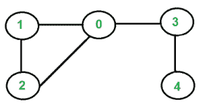

# 使用图的节点度检测图中的循环

> 原文:[https://www . geeksforgeeks . org/使用图节点度检测图中周期/](https://www.geeksforgeeks.org/detect-cycle-in-the-graph-using-degrees-of-nodes-of-graph/)

给定一个图，任务是使用图中节点的度来检测图中的循环，并打印任何循环中涉及的所有节点。如果图表中没有循环，则打印 **-1** 。

**示例:**

> **输入:**
> 
> 
> 
> **输出:** 0 1 2

**逼近:**递归移除所有 1 度的顶点。这可以通过存储顶点度数的[图](https://www.geeksforgeeks.org/map-associative-containers-the-c-standard-template-library-stl/)来有效地完成。
最初，遍历地图并将所有度数为 1 的顶点存储在队列中。只要队列不为空，就遍历它。对于队列中的每个节点，将其标记为已访问，并遍历所有与其连接的节点(使用邻接表)，然后在地图中将每个节点的度递减一。将度数等于 1 的所有节点添加到队列中。在这个算法的最后，所有未访问的节点都是循环的一部分。

下面是上述方法的实现:

## C++14

```
// C++ implementation of the approach
#include <bits/stdc++.h>
using namespace std;

// Graph class
class Graph
{
public:

    // No. of vertices of graph
    int v;

    // Adjacency List
    vector<int> *l;

    Graph(int v)
    {
        this->v = v;
        this->l = new vector<int>[v];
    }

    void addedge(int i, int j)
    {
        l[i].push_back(j);
        l[j].push_back(i);
    }
};

// Function to find a cycle in the given graph if exists
void findCycle(int n, int r, Graph g)
{
    // HashMap to store the degree of each node
    unordered_map<int, int> degree;

    for (int i = 0; i < g.v; i++)
        degree[i] = g.l[i].size();

    // Array to track visited nodes
    int visited[g.v] = {0};

    // Queue to store the nodes of degree 1
    queue<int> q;

    // Continuously adding those nodes whose
    // degree is 1 to the queue
    while (true)
    {
        // Adding nodes to queue whose degree is 1
        // and is not visited
        for (int i = 0; i < degree.size(); i++)
            if (degree.at(i) == 1 and !visited[i])
                q.push(i);

        // If queue becomes empty then get out
        // of the continuous loop
        if (q.empty())
            break;

        while (!q.empty())
        {
            // Remove the front element from the queue
            int temp = q.front();
            q.pop();

            // Mark the removed element visited
            visited[temp] = 1;

            // Decrement the degree of all those nodes
            // adjacent to removed node
            for (int i = 0; i < g.l[temp].size(); i++)
            {
                int value = degree[g.l[temp][i]];
                degree[g.l[temp][i]] = --value;
            }
        }
    }
    int flag = 0;

    // Checking all the nodes which are not visited
    // i.e. they are part of the cycle
    for (int i = 0; i < g.v; i++)
        if (visited[i] == 0)
            flag = 1;

    if (flag == 0)
        cout << "-1";
    else
    {
        for (int i = 0; i < g.v; i++)
            if (visited[i] == 0)
                cout << i << " ";
    }
}

// Driver Code
int main()
{
    // No of nodes
    int n = 5;

    // No of edges
    int e = 5;
    Graph g(n);

    g.addedge(0, 1);
    g.addedge(0, 2);
    g.addedge(0, 3);
    g.addedge(1, 2);
    g.addedge(3, 4);

    findCycle(n, e, g);
    return 0;
}

// This code is contributed by
// sanjeev2552
```

## Java 语言(一种计算机语言，尤用于创建网站)

```
// Java implementation of the approach
import java.util.*;

// Graph class
class Graph {

    // No. of vertices of graph
    int v;

    // Adjacency List
    @SuppressWarnings("unchecked")
    ArrayList<ArrayList<Integer>> l;

    Graph(int v)
    {
        this.v = v;
        this.l = new ArrayList<>();

        for (int i = 0; i < v; i++) {
         l.add(new ArrayList<>());
        }
    }
    void addedge(int i, int j)
    {
        l.get(i).add(j);
        l.get(j).add(i);
    }
}

class GFG {

    // Function to find a cycle in the given graph if exists
    static void findCycle(int n, int e, Graph g)
    {

        // HashMap to store the degree of each node
        HashMap<Integer, Integer> degree = new HashMap<>();

        for (int i = 0; i < n; i++)
            degree.put(i, g.l.get(i).size());

        // Array to track visited nodes
        int visited[] = new int[g.v];

        // Initially all nodes are not visited
        for (int i = 0; i < visited.length; i++)
            visited[i] = 0;

        // Queue to store the nodes of degree 1
        Queue<Integer> q = new LinkedList<>();

        // Continuously adding those nodes whose
        // degree is 1 to the queue
        while (true) {

            // Adding nodes to queue whose degree is 1
            // and is not visited

            for (int i = 0; i < degree.size(); i++){

                if ((int)degree.get(i) == 1 && visited[i] == 0)
                    q.add(i);
            }
            // If queue becomes empty then get out
            // of the continuous loop
            if (q.isEmpty())
                break;

            while (!q.isEmpty()) {

                // Remove the front element from the queue
                int temp = (int)q.poll();

                // Mark the removed element visited
                visited[temp] = 1;

                // Decrement the degree of all those nodes
                // adjacent to removed node
                for (int i = 0; i < g.l.get(temp).size(); i++) {
                    int value = (int)degree.get((int)g.l.get(temp).get(i));
                    degree.replace(g.l.get(temp).get(i), --value);
                }
            }
        }

        int flag = 0;

        // Checking all the nodes which are not visited
        // i.e. they are part of the cycle
        for (int i = 0; i < visited.length; i++)
            if (visited[i] == 0)
                flag = 1;

        if (flag == 0)
            System.out.print("-1");
        else {
            for (int i = 0; i < visited.length; i++)
                if (visited[i] == 0)
                    System.out.print(i + " ");
        }
    }

    // Driver code
    public static void main(String[] args)
    {

        // No of nodes
        int n = 5;

        // No of edges
        int e = 5;
        Graph g = new Graph(n);

        g.addedge(0, 1);
        g.addedge(0, 2);
        g.addedge(0, 3);
        g.addedge(1, 2);
        g.addedge(3, 4);

        findCycle(n, e, g);
    }
}
// This Code has been contributed by Mukul Sharma
```

## 蟒蛇 3

```
# Python3 implementation of the approach

# Graph class
class Graph:
    def __init__(self, v):

        # No. of vertices of graph
        self.v = v

        # Adjacency List
        self.l = [0] * v
        for i in range(self.v):
            self.l[i] = []

    def addedge(self, i: int, j: int):
        self.l[i].append(j)
        self.l[j].append(i)

# Function to find a cycle in the given graph if exists
def findCycle(n: int, e: int, g: Graph) -> None:

    # HashMap to store the degree of each node
    degree = dict()

    for i in range(len(g.l)):
        degree[i] = len(g.l[i])

    # Array to track visited nodes
    visited = [0] * g.v

    # Initially all nodes are not visited
    for i in range(len(visited)):
        visited[i] = 0

    # Queue to store the nodes of degree 1
    q = list()

    # Continuously adding those nodes whose
    # degree is 1 to the queue
    while True:

        # Adding nodes to queue whose degree is 1
        # and is not visited
        for i in range(len(degree)):
            if degree[i] == 1 and visited[i] == 0:
                q.append(i)

        # If queue becomes empty then get out
        # of the continuous loop
        if len(q) == 0:
            break

        while q:

            # Remove the front element from the queue
            temp = q.pop()

            # Mark the removed element visited
            visited[temp] = 1

            # Decrement the degree of all those nodes
            # adjacent to removed node
            for i in range(len(g.l[temp])):
                value = degree[g.l[temp][i]]
                degree[g.l[temp][i]] = value - 1

    flag = 0

    # Checking all the nodes which are not visited
    # i.e. they are part of the cycle
    for i in range(len(visited)):
        if visited[i] == 0:
            flag = 1

    if flag == 0:
        print("-1")
    else:
        for i in range(len(visited)):
            if visited[i] == 0:
                print(i, end = " ")

# Driver Code
if __name__ == "__main__":

    # No of nodes
    n = 5

    # No of edges
    e = 5
    g = Graph(n)

    g.addedge(0, 1)
    g.addedge(0, 2)
    g.addedge(0, 3)
    g.addedge(1, 2)
    g.addedge(3, 4)

    findCycle(n, e, g)

# This code is contributed by
# sanjeev2552
```

## C#

```
// C# implementation of the approach
using System;
using System.Collections.Generic;

// Graph class
public class Graph
{

    // No. of vertices of graph
    public int v;

    // Adjacency List
    public  List<int> []l;

    public Graph(int v)
    {
        this.v = v;
        this.l = new List<int>[v];
        for(int i = 0; i < v; i++)
        {
            l[i] = new List<int>();
        }
    }
    public void addedge(int i, int j)
    {
        l[i].Add(j);
        l[j].Add(i);
    }
}

class GFG{

// Function to find a cycle in the
// given graph if exists
static void findCycle(int n, int e, Graph g)
{

    // Dictionary to store the degree of each node
    Dictionary<int,
               int> degree = new Dictionary<int,
                                            int>();

    for(int i = 0; i < g.l.Length; i++)
        degree.Add(i, g.l[i].Count);

    // Array to track visited nodes
    int []visited = new int[g.v];

    // Initially all nodes are not visited
    for(int i = 0; i < visited.Length; i++)
        visited[i] = 0;

    // Queue to store the nodes of degree 1
    List<int> q = new List<int>();

    // Continuously adding those nodes whose
    // degree is 1 to the queue
    while (true)
    {

        // Adding nodes to queue whose degree is 1
        // and is not visited
        for(int i = 0; i < degree.Count; i++)
            if ((int)degree[i] == 1 && visited[i] == 0)
                q.Add(i);

        // If queue becomes empty then get out
        // of the continuous loop
        if (q.Count!=0)
            break;

        while (q.Count != 0)
        {

            // Remove the front element from the queue
            int temp = q[0];   
            q.RemoveAt(0);

            // Mark the removed element visited
            visited[temp] = 1;

            // Decrement the degree of all those nodes
            // adjacent to removed node
            for(int i = 0; i < g.l[temp].Count; i++)
            {
                int value = (int)degree[(int)g.l[temp][i]];
                degree[g.l[temp][i]] = value -= 1;
            }
        }
    }

    int flag = 0;

    // Checking all the nodes which are not visited
    // i.e. they are part of the cycle
    for(int i = 0; i < visited.Length; i++)
        if (visited[i] == 0)
            flag = 1;

    if (flag == 0)
        Console.Write("-1");
    else
    {
        for(int i = 0; i < visited.Length-2; i++)
            if (visited[i] == 0)
                Console.Write(i + " ");
    }
}

// Driver code
public static void Main(String[] args)
{

    // No of nodes
    int n = 5;

    // No of edges
    int e = 5;
    Graph g = new Graph(n);

    g.addedge(0, 1);
    g.addedge(0, 2);
    g.addedge(0, 3);
    g.addedge(1, 2);
    g.addedge(3, 4);

    findCycle(n, e, g);
}
}

// This code is contributed by Princi Singh
```

## java 描述语言

```
<script>

// Javascript implementation of the approach

// Graph class
class Graph
{
    constructor(v)
    {

        // No. of vertices of graph
        this.v = v;

        // Adjacency List
        this.l = Array.from(
            Array(this.v), () => Array());
    }

    addedge(i, j)
    {
        this.l[i].push(j);
        this.l[j].push(i);
    }
}

// Function to find a cycle in the
// given graph if exists
function findCycle(n, e, g)
{

    // Dictionary to store the degree of each node
    var degree = new Map();

    for(var i = 0; i < g.l.length; i++)
        degree.set(i, g.l[i].length);

    // Array to track visited nodes
    var visited = Array(g.v).fill(0);

    // Initially all nodes are not visited
    for(var i = 0; i < visited.length; i++)
        visited[i] = 0;

    // Queue to store the nodes of degree 1
    var q = [];

    // Continuously adding those nodes whose
    // degree is 1 to the queue
    while (true)
    {

        // Adding nodes to queue whose degree is 1
        // and is not visited
        for(var i = 0; i < degree.size; i++)
            if (degree.has(i) && visited[i] == 0)
                q.push(i);

        // If queue becomes empty then get out
        // of the continuous loop
        if (q.length != 0)
            break;

        while (q.length != 0)
        {

            // Remove the front element from the queue
            var temp = q[0];   
            q.shift();

            // Mark the removed element visited
            visited[temp] = 1;

            // Decrement the degree of all those nodes
            // adjacent to removed node
            for(var i = 0; i < g.l[temp].length; i++)
            {
                var value = degree.get(g.l[temp][i]);
                degree.set(g.l[temp][i], value - 1);
            }
        }
    }

    var flag = 0;

    // Checking all the nodes which are not visited
    // i.e. they are part of the cycle
    for(var i = 0; i < visited.length; i++)
        if (visited[i] == 0)
            flag = 1;

    if (flag == 0)
        document.write("-1");
    else
    {
        for(var i = 0; i < visited.length - 2; i++)
            if (visited[i] == 0)
                document.write(i + " ");
    }
}

// Driver code

// No of nodes
var n = 5;

// No of edges
var e = 5;
var g = new Graph(n);

g.addedge(0, 1);
g.addedge(0, 2);
g.addedge(0, 3);
g.addedge(1, 2);
g.addedge(3, 4);

findCycle(n, e, g);

// This code is contributed by noob2000

</script>
```

**Output:** 

```
0 1 2
```