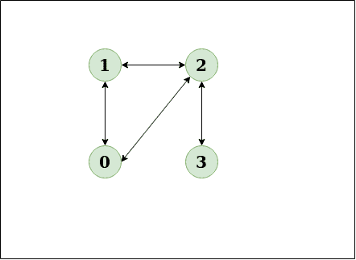
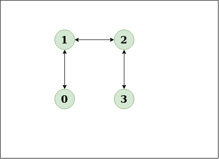
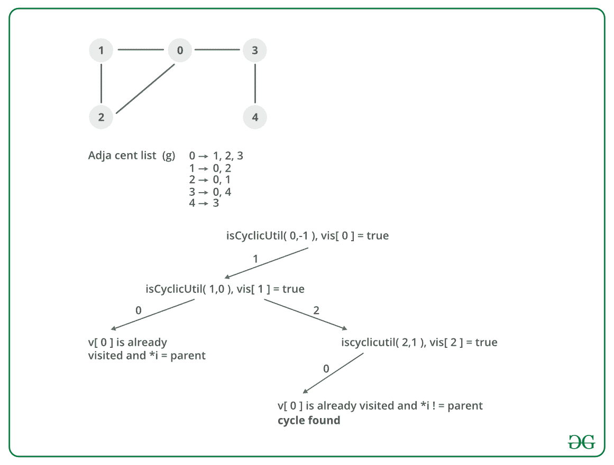

# 检测无向图中的周期

> 原文:[https://www . geesforgeks . org/detect-cycle-undirected-graph/](https://www.geeksforgeeks.org/detect-cycle-undirected-graph/)

给定一个无向图，如何检查图中是否有循环？
**例，**

> **输入:** n = 4，e = 4
> **输出:**是
> **解释:**
> 0 1，1 2，2 3，0 2
> 图解:
> 
> 
> 
> 该图清楚地显示了一个周期 0 到 2 到 1 到 0
> **输入:** n = 4，e = 3
> 0 1，1 2，2 3
> T5】输出:否
> T8】说明:T10】图:
> 
> 
> 
> 图表清楚地显示没有周期

**关于周期检测的文章:**

*   [有向图的循环检测](https://www.geeksforgeeks.org/detect-cycle-in-a-graph/)。
*   [无向图中循环检测的并集发现算法。](https://www.geeksforgeeks.org/union-find/)

**方法:**从每个未访问的节点运行一个 DFS。[深度优先遍历](https://www.geeksforgeeks.org/depth-first-search-or-dfs-for-a-graph/)可用于检测图形中的循环。连通图的 DFS 生成一棵树。只有当图中存在后边缘时，图中才有循环。后边缘是将节点连接到自身(自循环)或其在 DFS 生成的树中的祖先的边缘。
为了找到它的任何祖先的后边缘，保留一个被访问的数组，如果有任何被访问的节点的后边缘，则有一个循环并返回 true。
**算法:**

1.  使用给定数量的边和顶点创建图形。
2.  创建一个递归函数，该函数具有当前索引或顶点、访问过的数组和父节点。
3.  将当前节点标记为已访问。
4.  找出所有没有被访问过并且与当前节点相邻的顶点。递归调用这些顶点的函数，如果递归函数返回真，则返回真。
5.  如果相邻节点不是父节点并且已经被访问过，则返回 true。
6.  创建一个包装类，为所有顶点调用递归函数，如果任何函数返回 true，则返回 true。
7.  否则，如果对于所有顶点，函数返回 false，则返回 false。

**试运行:**



**实施:**

## C++

```
// A C++ Program to detect 
// cycle in an undirected graph
#include<iostream>
#include <list>
#include <limits.h>
using namespace std;

// Class for an undirected graph
class Graph
{

    // No. of vertices
    int V;   

    // Pointer to an array 
    // containing adjacency lists
    list<int> *adj;  
    bool isCyclicUtil(int v, bool visited[], 
                              int parent);
public:

    // Constructor
    Graph(int V);   

    // To add an edge to graph
    void addEdge(int v, int w); 

    // Returns true if there is a cycle
    bool isCyclic();  
};

Graph::Graph(int V)
{
    this->V = V;
    adj = new list<int>[V];
}

void Graph::addEdge(int v, int w)
{

    // Add w to v’s list.
    adj[v].push_back(w); 

    // Add v to w’s list.
    adj[w].push_back(v);
}

// A recursive function that 
// uses visited[] and parent to detect
// cycle in subgraph reachable 
// from vertex v.
bool Graph::isCyclicUtil(int v, 
                bool visited[], int parent)
{

    // Mark the current node as visited
    visited[v] = true;

    // Recur for all the vertices 
    // adjacent to this vertex
    list<int>::iterator i;
    for (i = adj[v].begin(); i !=
                       adj[v].end(); ++i)
    {

        // If an adjacent vertex is not visited, 
        //then recur for that adjacent
        if (!visited[*i])
        {
           if (isCyclicUtil(*i, visited, v))
              return true;
        }

        // If an adjacent vertex is visited and 
        // is not parent of current vertex,
        // then there exists a cycle in the graph.
        else if (*i != parent)
           return true;
    }
    return false;
}

// Returns true if the graph contains 
// a cycle, else false.
bool Graph::isCyclic()
{

    // Mark all the vertices as not 
    // visited and not part of recursion
    // stack
    bool *visited = new bool[V];
    for (int i = 0; i < V; i++)
        visited[i] = false;

    // Call the recursive helper 
    // function to detect cycle in different
    // DFS trees
    for (int u = 0; u < V; u++)
    {

        // Don't recur for u if 
        // it is already visited
        if (!visited[u]) 
          if (isCyclicUtil(u, visited, -1))
             return true;
    }
    return false;
}

// Driver program to test above functions
int main()
{
    Graph g1(5);
    g1.addEdge(1, 0);
    g1.addEdge(0, 2);
    g1.addEdge(2, 1);
    g1.addEdge(0, 3);
    g1.addEdge(3, 4);
    g1.isCyclic()? 
       cout << "Graph contains cycle\n":
       cout << "Graph doesn't contain cycle\n";

    Graph g2(3);
    g2.addEdge(0, 1);
    g2.addEdge(1, 2);
    g2.isCyclic()? 
       cout << "Graph contains cycle\n":
       cout << "Graph doesn't contain cycle\n";

    return 0;
}
```

## Java 语言(一种计算机语言，尤用于创建网站)

```
// A Java Program to detect cycle in an undirected graph
import java.io.*;
import java.util.*;
// This class represents a 
// directed graph using adjacency list
// representation
class Graph
{

    // No. of vertices
    private int V;   

    // Adjacency List Representation
    private LinkedList<Integer> adj[]; 

    // Constructor
    Graph(int v) 
    {
        V = v;
        adj = new LinkedList[v];
        for(int i=0; i<v; ++i)
            adj[i] = new LinkedList();
    }

    // Function to add an edge 
    // into the graph
    void addEdge(int v,int w) 
    {
        adj[v].add(w);
        adj[w].add(v);
    }

    // A recursive function that 
    // uses visited[] and parent to detect
    // cycle in subgraph reachable 
    // from vertex v.
    Boolean isCyclicUtil(int v, 
                 Boolean visited[], int parent)
    {
        // Mark the current node as visited
        visited[v] = true;
        Integer i;

        // Recur for all the vertices 
        // adjacent to this vertex
        Iterator<Integer> it = 
                adj[v].iterator();
        while (it.hasNext())
        {
            i = it.next();

            // If an adjacent is not 
            // visited, then recur for that
            // adjacent
            if (!visited[i])
            {
                if (isCyclicUtil(i, visited, v))
                    return true;
            }

            // If an adjacent is visited 
            // and not parent of current
            // vertex, then there is a cycle.
            else if (i != parent)
                return true;
        }
        return false;
    }

    // Returns true if the graph 
    // contains a cycle, else false.
    Boolean isCyclic()
    {

        // Mark all the vertices as 
        // not visited and not part of
        // recursion stack
        Boolean visited[] = new Boolean[V];
        for (int i = 0; i < V; i++)
            visited[i] = false;

        // Call the recursive helper 
        // function to detect cycle in
        // different DFS trees
        for (int u = 0; u < V; u++)
        {  

            // Don't recur for u if already visited
            if (!visited[u]) 
                if (isCyclicUtil(u, visited, -1))
                    return true;
        }

        return false;
    }

    // Driver method to test above methods
    public static void main(String args[])
    {

        // Create a graph given 
        // in the above diagram
        Graph g1 = new Graph(5);
        g1.addEdge(1, 0);
        g1.addEdge(0, 2);
        g1.addEdge(2, 1);
        g1.addEdge(0, 3);
        g1.addEdge(3, 4);
        if (g1.isCyclic())
            System.out.println("Graph 
                             contains cycle");
        else
            System.out.println("Graph 
                        doesn't contains cycle");

        Graph g2 = new Graph(3);
        g2.addEdge(0, 1);
        g2.addEdge(1, 2);
        if (g2.isCyclic())
            System.out.println("Graph 
                             contains cycle");
        else
            System.out.println("Graph 
                        doesn't contains cycle");
    }
}
// This code is contributed by Aakash Hasija
```

## 计算机编程语言

```
# Python Program to detect cycle in an undirected graph
from collections import defaultdict

# This class represents a undirected 
# graph using adjacency list representation
class Graph:

    def __init__(self,vertices):

        # No. of vertices
        self.V= vertices #No. of vertices

        # Default dictionary to store graph
        self.graph = defaultdict(list)

    # Function to add an edge to graph
    def addEdge(self,v,w):

        #Add w to v_s list
        self.graph[v].append(w)

         #Add v to w_s list
        self.graph[w].append(v)

    # A recursive function that uses 
    # visited[] and parent to detect
    # cycle in subgraph reachable from vertex v.
    def isCyclicUtil(self,v,visited,parent):

        # Mark the current node as visited 
        visited[v]= True

        # Recur for all the vertices 
        # adjacent to this vertex
        for i in self.graph[v]:

            # If the node is not 
            # visited then recurse on it
            if  visited[i]==False : 
                if(self.isCyclicUtil(i,visited,v)):
                    return True
            # If an adjacent vertex is 
            # visited and not parent 
            # of current vertex,
            # then there is a cycle
            elif  parent!=i:
                return True

        return False

    # Returns true if the graph 
    # contains a cycle, else false.
    def isCyclic(self):

        # Mark all the vertices 
        # as not visited
        visited =[False]*(self.V)

        # Call the recursive helper 
        # function to detect cycle in different
        # DFS trees
        for i in range(self.V):

            # Don't recur for u if it 
            # is already visited
            if visited[i] ==False: 
                if(self.isCyclicUtil
                       (i,visited,-1)) == True:
                    return True

        return False

# Create a graph given in the above diagram
g = Graph(5)
g.addEdge(1, 0)
g.addEdge(1, 2)
g.addEdge(2, 0)
g.addEdge(0, 3)
g.addEdge(3, 4)

if g.isCyclic():
    print "Graph contains cycle"
else :
    print "Graph does not contain cycle "
g1 = Graph(3)
g1.addEdge(0,1)
g1.addEdge(1,2)

if g1.isCyclic():
    print "Graph contains cycle"
else :
    print "Graph does not contain cycle "

#This code is contributed by Neelam Yadav
```

## C#

```
// C# Program to detect cycle in an undirected graph
using System;
using System.Collections.Generic;

// This class represents a directed graph 
// using adjacency list representation
class Graph
{
    private int V; // No. of vertices

    // Adjacency List Representation
    private List<int> []adj; 

    // Constructor
    Graph(int v) 
    {
        V = v;
        adj = new List<int>[v];
        for(int i = 0; i < v; ++i)
            adj[i] = new List<int>();
    }

    // Function to add an edge into the graph
    void addEdge(int v, int w) 
    {
        adj[v].Add(w);
        adj[w].Add(v);
    }

    // A recursive function that uses visited[] 
    // and parent to detect cycle in subgraph
    // reachable from vertex v.
    Boolean isCyclicUtil(int v, Boolean []visited,
                         int parent)
    {
        // Mark the current node as visited
        visited[v] = true;

        // Recur for all the vertices 
        // adjacent to this vertex
        foreach(int i in adj[v])
        {
            // If an adjacent is not visited, 
            // then recur for that adjacent
            if (!visited[i])
            {
                if (isCyclicUtil(i, visited, v))
                    return true;
            }

            // If an adjacent is visited and 
            // not parent of current vertex,
            // then there is a cycle.
            else if (i != parent)
                return true;
        }
        return false;
    }

    // Returns true if the graph contains 
    // a cycle, else false.
    Boolean isCyclic()
    {
        // Mark all the vertices as not visited 
        // and not part of recursion stack
        Boolean []visited = new Boolean[V];
        for (int i = 0; i < V; i++)
            visited[i] = false;

        // Call the recursive helper function 
        // to detect cycle in different DFS trees
        for (int u = 0; u < V; u++)

            // Don't recur for u if already visited
            if (!visited[u]) 
                if (isCyclicUtil(u, visited, -1))
                    return true;

        return false;
    }

    // Driver Code
    public static void Main(String []args)
    {
        // Create a graph given in the above diagram
        Graph g1 = new Graph(5);
        g1.addEdge(1, 0);
        g1.addEdge(0, 2);
        g1.addEdge(2, 1);
        g1.addEdge(0, 3);
        g1.addEdge(3, 4);
        if (g1.isCyclic())
            Console.WriteLine("Graph contains cycle");
        else
            Console.WriteLine("Graph doesn't contains cycle");

        Graph g2 = new Graph(3);
        g2.addEdge(0, 1);
        g2.addEdge(1, 2);
        if (g2.isCyclic())
            Console.WriteLine("Graph contains cycle");
        else
            Console.WriteLine("Graph doesn't contains cycle");
    }
}

// This code is contributed by PrinciRaj1992
```

**输出:**

```
Graph contains cycle
Graph doesn't contain cycle
```

**复杂度分析:**

*   **时间复杂度:** O(V+E)。
    该程序对使用邻接表表示的图进行简单的 DFS 遍历。所以时间复杂度为 O(V+E)。
*   **空间复杂度:** O(V)。
    存储访问过的阵列需要 O(V)空间。

**练习:**我们能用 BFS 检测 O(V+E)时间内无向图中的周期吗？有向图呢？
如果你发现任何不正确的地方，或者你想分享更多关于上述话题的信息，请写评论