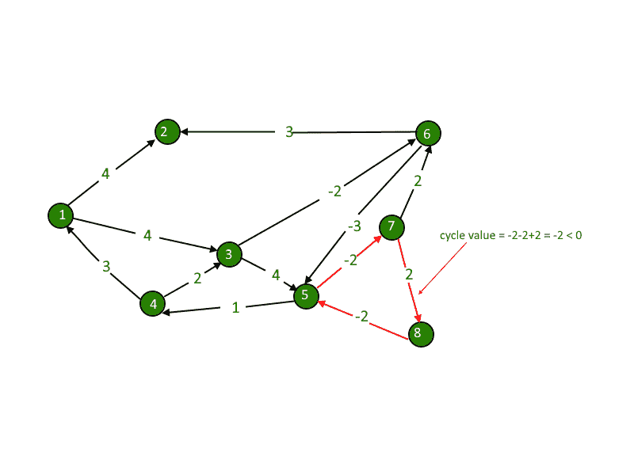
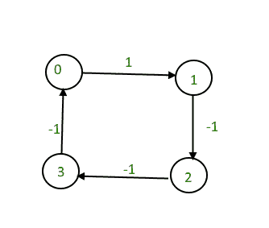
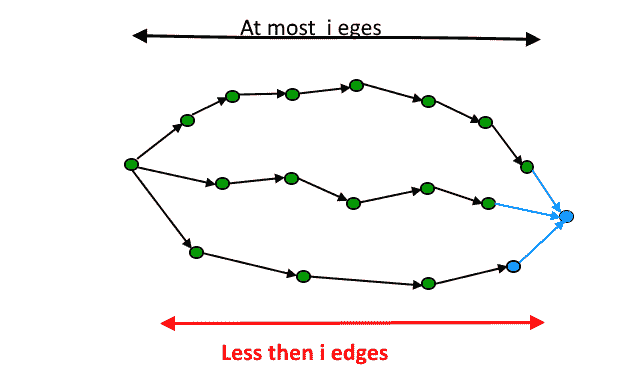

# 检测图表中的负循环|(贝尔曼·福特)

> 原文:[https://www . geesforgeks . org/detect-negative-cycle-graph-bellman-Ford/](https://www.geeksforgeeks.org/detect-negative-cycle-graph-bellman-ford/)

给我们一个有向图。我们需要计算这个图是否有负循环。负周期是指周期的总和为负。



负权重存在于图的各种应用中。例如，如果我们沿着这条路走，我们可能会获得一些优势，而不是为一条路付出成本。

**示例:**

```
Input : 4 4
        0 1 1
        1 2 -1
        2 3 -1
        3 0 -1

Output : Yes
The graph contains a negative cycle.
```



[推荐:请先在“PRACTICE”上解决，再进行解决。](https://practice.geeksforgeeks.org/problems/negative-weight-cycle3504/1#)

想法是使用[贝尔曼-福特算法](https://www.geeksforgeeks.org/dynamic-programming-set-23-bellman-ford-algorithm/)。

下面是一个算法，用于查找是否存在从给定源可到达的负权重循环。
**1)** 将从源到所有顶点的距离初始化为无穷大，到源本身的距离初始化为 0。创建一个大小为|V|的数组 dist[]，除了 dist[src]以外，所有值都为无穷大，其中 src 是源顶点。
**2)** 此步骤计算最短距离。执行以下|V|-1 次，其中|V|是给定图中的顶点数。
**a)** 对每个边缘 u-v 执行以下操作。
**b)** 如果 dist[v] > dist[u] +边缘 uv 的权重，则更新 dist[v]。
**c)**dist[v]= dist[u]+边缘 uv 的权重。
**3)** 此步骤报告图表中是否存在负权重循环。对每个边 u-v 执行以下操作
**a)** 如果 dist[v] > dist[u] +边 uv 的权重，则“图形具有负权重循环”

步骤 3 的思想是，如果图不包含负权重循环，步骤 2 保证最短距离。如果我们再一次迭代所有的边，得到任意顶点的更短的路径，那么就有一个负的权重循环。

## C++

```
// A C++ program to check if a graph contains negative
// weight cycle using Bellman-Ford algorithm. This program
// works only if all vertices are reachable from a source
// vertex 0.
#include <bits/stdc++.h>
using namespace std;

// a structure to represent a weighted edge in graph
struct Edge {
    int src, dest, weight;
};

// a structure to represent a connected, directed and
// weighted graph
struct Graph {
    // V-> Number of vertices, E-> Number of edges
    int V, E;

    // graph is represented as an array of edges.
    struct Edge* edge;
};

// Creates a graph with V vertices and E edges
struct Graph* createGraph(int V, int E)
{
    struct Graph* graph = new Graph;
    graph->V = V;
    graph->E = E;
    graph->edge = new Edge[graph->E];
    return graph;
}

// The main function that finds shortest distances
// from src to all other vertices using Bellman-
// Ford algorithm.  The function also detects
// negative weight cycle
bool isNegCycleBellmanFord(struct Graph* graph,
                           int src)
{
    int V = graph->V;
    int E = graph->E;
    int dist[V];

    // Step 1: Initialize distances from src
    // to all other vertices as INFINITE
    for (int i = 0; i < V; i++)
        dist[i] = INT_MAX;
    dist[src] = 0;

    // Step 2: Relax all edges |V| - 1 times.
    // A simple shortest path from src to any
    // other vertex can have at-most |V| - 1
    // edges
    for (int i = 1; i <= V - 1; i++) {
        for (int j = 0; j < E; j++) {
            int u = graph->edge[j].src;
            int v = graph->edge[j].dest;
            int weight = graph->edge[j].weight;
            if (dist[u] != INT_MAX && dist[u] + weight < dist[v])
                dist[v] = dist[u] + weight;
        }
    }

    // Step 3: check for negative-weight cycles.
    // The above step guarantees shortest distances
    // if graph doesn't contain negative weight cycle.
    // If we get a shorter path, then there
    // is a cycle.
    for (int i = 0; i < E; i++) {
        int u = graph->edge[i].src;
        int v = graph->edge[i].dest;
        int weight = graph->edge[i].weight;
        if (dist[u] != INT_MAX && dist[u] + weight < dist[v])
            return true;
    }

    return false;
}

// Driver program to test above functions
int main()
{
    /* Let us create the graph given in above example */
    int V = 5; // Number of vertices in graph
    int E = 8; // Number of edges in graph
    struct Graph* graph = createGraph(V, E);

    // add edge 0-1 (or A-B in above figure)
    graph->edge[0].src = 0;
    graph->edge[0].dest = 1;
    graph->edge[0].weight = -1;

    // add edge 0-2 (or A-C in above figure)
    graph->edge[1].src = 0;
    graph->edge[1].dest = 2;
    graph->edge[1].weight = 4;

    // add edge 1-2 (or B-C in above figure)
    graph->edge[2].src = 1;
    graph->edge[2].dest = 2;
    graph->edge[2].weight = 3;

    // add edge 1-3 (or B-D in above figure)
    graph->edge[3].src = 1;
    graph->edge[3].dest = 3;
    graph->edge[3].weight = 2;

    // add edge 1-4 (or A-E in above figure)
    graph->edge[4].src = 1;
    graph->edge[4].dest = 4;
    graph->edge[4].weight = 2;

    // add edge 3-2 (or D-C in above figure)
    graph->edge[5].src = 3;
    graph->edge[5].dest = 2;
    graph->edge[5].weight = 5;

    // add edge 3-1 (or D-B in above figure)
    graph->edge[6].src = 3;
    graph->edge[6].dest = 1;
    graph->edge[6].weight = 1;

    // add edge 4-3 (or E-D in above figure)
    graph->edge[7].src = 4;
    graph->edge[7].dest = 3;
    graph->edge[7].weight = -3;

    if (isNegCycleBellmanFord(graph, 0))
        cout << "Yes";
    else
        cout << "No";

    return 0;
}
```

## Java 语言(一种计算机语言，尤用于创建网站)

```
// Java program to check if a graph contains negative 
// weight cycle using Bellman-Ford algorithm. This program 
// works only if all vertices are reachable from a source 
// vertex 0. 
import java.util.*;

class GFG {

    // a structure to represent a weighted edge in graph
    static class Edge {
        int src, dest, weight;
    }

    // a structure to represent a connected, directed and
    // weighted graph
    static class Graph {

        // V-> Number of vertices, E-> Number of edges
        int V, E;

        // graph is represented as an array of edges.
        Edge edge[];

    }

    // Creates a graph with V vertices and E edges
    static Graph createGraph(int V, int E) {
        Graph graph = new Graph();
        graph.V = V;
        graph.E = E;
        graph.edge = new Edge[graph.E];

        for (int i = 0; i < graph.E; i++) {
            graph.edge[i] = new Edge();
        }

        return graph;
    }

    // The main function that finds shortest distances
    // from src to all other vertices using Bellman-
    // Ford algorithm. The function also detects
    // negative weight cycle
    static boolean isNegCycleBellmanFord(Graph graph, int src) {
        int V = graph.V;
        int E = graph.E;
        int[] dist = new int[V];

        // Step 1: Initialize distances from src
        // to all other vertices as INFINITE
        for (int i = 0; i < V; i++)
            dist[i] = Integer.MAX_VALUE;
        dist[src] = 0;

        // Step 2: Relax all edges |V| - 1 times.
        // A simple shortest path from src to any
        // other vertex can have at-most |V| - 1
        // edges
        for (int i = 1; i <= V - 1; i++) {
            for (int j = 0; j < E; j++) {
                int u = graph.edge[j].src;
                int v = graph.edge[j].dest;
                int weight = graph.edge[j].weight;
                if (dist[u] != Integer.MAX_VALUE && dist[u] + weight < dist[v])
                    dist[v] = dist[u] + weight;
            }
        }

        // Step 3: check for negative-weight cycles.
        // The above step guarantees shortest distances
        // if graph doesn't contain negative weight cycle.
        // If we get a shorter path, then there
        // is a cycle.
        for (int i = 0; i < E; i++) {
            int u = graph.edge[i].src;
            int v = graph.edge[i].dest;
            int weight = graph.edge[i].weight;
            if (dist[u] != Integer.MAX_VALUE && dist[u] + weight < dist[v])
                return true;
        }

        return false;
    }

    // Driver Code
    public static void main(String[] args) {
        int V = 5, E = 8;
        Graph graph = createGraph(V, E);

        // add edge 0-1 (or A-B in above figure)
        graph.edge[0].src = 0;
        graph.edge[0].dest = 1;
        graph.edge[0].weight = -1;

        // add edge 0-2 (or A-C in above figure)
        graph.edge[1].src = 0;
        graph.edge[1].dest = 2;
        graph.edge[1].weight = 4;

        // add edge 1-2 (or B-C in above figure)
        graph.edge[2].src = 1;
        graph.edge[2].dest = 2;
        graph.edge[2].weight = 3;

        // add edge 1-3 (or B-D in above figure)
        graph.edge[3].src = 1;
        graph.edge[3].dest = 3;
        graph.edge[3].weight = 2;

        // add edge 1-4 (or A-E in above figure)
        graph.edge[4].src = 1;
        graph.edge[4].dest = 4;
        graph.edge[4].weight = 2;

        // add edge 3-2 (or D-C in above figure)
        graph.edge[5].src = 3;
        graph.edge[5].dest = 2;
        graph.edge[5].weight = 5;

        // add edge 3-1 (or D-B in above figure)
        graph.edge[6].src = 3;
        graph.edge[6].dest = 1;
        graph.edge[6].weight = 1;

        // add edge 4-3 (or E-D in above figure)
        graph.edge[7].src = 4;
        graph.edge[7].dest = 3;
        graph.edge[7].weight = -3;

        if (isNegCycleBellmanFord(graph, 0))
            System.out.println("Yes");
        else
            System.out.println("No");
    }
}

// This code is contributed by
// sanjeev2552
```

## 蟒蛇 3

```
# A Python3 program to check if a graph contains negative
# weight cycle using Bellman-Ford algorithm. This program
# works only if all vertices are reachable from a source
# vertex 0.

# a structure to represent a weighted edge in graph
class Edge:

    def __init__(self):
        self.src = 0
        self.dest = 0
        self.weight = 0

# a structure to represent a connected, directed and
# weighted graph
class Graph:

    def __init__(self):

        # V. Number of vertices, E. Number of edges
        self.V = 0
        self.E = 0

        # graph is represented as an array of edges.
        self.edge = None

# Creates a graph with V vertices and E edges
def createGraph(V, E):

    graph = Graph()
    graph.V = V;
    graph.E = E;
    graph.edge =[Edge() for i in range(graph.E)]
    return graph;

# The main function that finds shortest distances
# from src to all other vertices using Bellman-
# Ford algorithm.  The function also detects
# negative weight cycle
def isNegCycleBellmanFord(graph, src):

    V = graph.V;
    E = graph.E;
    dist = [1000000 for i in range(V)];
    dist[src] = 0;

    # Step 2: Relax all edges |V| - 1 times.
    # A simple shortest path from src to any
    # other vertex can have at-most |V| - 1
    # edges
    for i in range(1, V):
        for j in range(E):

            u = graph.edge[j].src;
            v = graph.edge[j].dest;
            weight = graph.edge[j].weight;
            if (dist[u] != 1000000 and dist[u] + weight < dist[v]):
                dist[v] = dist[u] + weight;

    # Step 3: check for negative-weight cycles.
    # The above step guarantees shortest distances
    # if graph doesn't contain negative weight cycle.
    # If we get a shorter path, then there
    # is a cycle.
    for i in range(E):

        u = graph.edge[i].src;
        v = graph.edge[i].dest;
        weight = graph.edge[i].weight;
        if (dist[u] != 1000000 and dist[u] + weight < dist[v]):
            return True;

    return False;

# Driver program to test above functions
if __name__=='__main__':

    # Let us create the graph given in above example 
    V = 5; # Number of vertices in graph
    E = 8; # Number of edges in graph
    graph = createGraph(V, E);

    # add edge 0-1 (or A-B in above figure)
    graph.edge[0].src = 0;
    graph.edge[0].dest = 1;
    graph.edge[0].weight = -1;

    # add edge 0-2 (or A-C in above figure)
    graph.edge[1].src = 0;
    graph.edge[1].dest = 2;
    graph.edge[1].weight = 4;

    # add edge 1-2 (or B-C in above figure)
    graph.edge[2].src = 1;
    graph.edge[2].dest = 2;
    graph.edge[2].weight = 3;

    # add edge 1-3 (or B-D in above figure)
    graph.edge[3].src = 1;
    graph.edge[3].dest = 3;
    graph.edge[3].weight = 2;

    # add edge 1-4 (or A-E in above figure)
    graph.edge[4].src = 1;
    graph.edge[4].dest = 4;
    graph.edge[4].weight = 2;

    # add edge 3-2 (or D-C in above figure)
    graph.edge[5].src = 3;
    graph.edge[5].dest = 2;
    graph.edge[5].weight = 5;

    # add edge 3-1 (or D-B in above figure)
    graph.edge[6].src = 3;
    graph.edge[6].dest = 1;
    graph.edge[6].weight = 1;

    # add edge 4-3 (or E-D in above figure)
    graph.edge[7].src = 4;
    graph.edge[7].dest = 3;
    graph.edge[7].weight = -3;

    if (isNegCycleBellmanFord(graph, 0)):
        print("Yes")
    else:
        print("No")

        # This code is contributed by pratham76
```

## C#

```
// C# program to check if a graph contains negative 
// weight cycle using Bellman-Ford algorithm. This program 
// works only if all vertices are reachable from a source 
// vertex 0. 
using System;
using System.Collections;
using System.Collections.Generic;

class GFG {

    // a structure to represent a weighted edge in graph
    class Edge {
        public int src, dest, weight;
    }

    // a structure to represent a connected, directed and
    // weighted graph
    class Graph {

        // V-> Number of vertices, E-> Number of edges
        public int V, E;

        // graph is represented as an array of edges.
        public Edge []edge;

    }

    // Creates a graph with V vertices and E edges
    static Graph createGraph(int V, int E) {
        Graph graph = new Graph();
        graph.V = V;
        graph.E = E;
        graph.edge = new Edge[graph.E];

        for (int i = 0; i < graph.E; i++) {
            graph.edge[i] = new Edge();
        }

        return graph;
    }

    // The main function that finds shortest distances
    // from src to all other vertices using Bellman-
    // Ford algorithm. The function also detects
    // negative weight cycle
    static bool isNegCycleBellmanFord(Graph graph, int src) {
        int V = graph.V;
        int E = graph.E;
        int[] dist = new int[V];

        // Step 1: Initialize distances from src
        // to all other vertices as INFINITE
        for (int i = 0; i < V; i++)
            dist[i] = 1000000;
        dist[src] = 0;

        // Step 2: Relax all edges |V| - 1 times.
        // A simple shortest path from src to any
        // other vertex can have at-most |V| - 1
        // edges
        for (int i = 1; i <= V - 1; i++) {
            for (int j = 0; j < E; j++) {
                int u = graph.edge[j].src;
                int v = graph.edge[j].dest;
                int weight = graph.edge[j].weight;
                if (dist[u] != 1000000 && dist[u] + weight < dist[v])
                    dist[v] = dist[u] + weight;
            }
        }

        // Step 3: check for negative-weight cycles.
        // The above step guarantees shortest distances
        // if graph doesn't contain negative weight cycle.
        // If we get a shorter path, then there
        // is a cycle.
        for (int i = 0; i < E; i++) {
            int u = graph.edge[i].src;
            int v = graph.edge[i].dest;
            int weight = graph.edge[i].weight;
            if (dist[u] != 1000000 && dist[u] + weight < dist[v])
                return true;
        }

        return false;
    }

    // Driver Code
    public static void Main(string[] args) {
        int V = 5, E = 8;
        Graph graph = createGraph(V, E);

        // add edge 0-1 (or A-B in above figure)
        graph.edge[0].src = 0;
        graph.edge[0].dest = 1;
        graph.edge[0].weight = -1;

        // add edge 0-2 (or A-C in above figure)
        graph.edge[1].src = 0;
        graph.edge[1].dest = 2;
        graph.edge[1].weight = 4;

        // add edge 1-2 (or B-C in above figure)
        graph.edge[2].src = 1;
        graph.edge[2].dest = 2;
        graph.edge[2].weight = 3;

        // add edge 1-3 (or B-D in above figure)
        graph.edge[3].src = 1;
        graph.edge[3].dest = 3;
        graph.edge[3].weight = 2;

        // add edge 1-4 (or A-E in above figure)
        graph.edge[4].src = 1;
        graph.edge[4].dest = 4;
        graph.edge[4].weight = 2;

        // add edge 3-2 (or D-C in above figure)
        graph.edge[5].src = 3;
        graph.edge[5].dest = 2;
        graph.edge[5].weight = 5;

        // add edge 3-1 (or D-B in above figure)
        graph.edge[6].src = 3;
        graph.edge[6].dest = 1;
        graph.edge[6].weight = 1;

        // add edge 4-3 (or E-D in above figure)
        graph.edge[7].src = 4;
        graph.edge[7].dest = 3;
        graph.edge[7].weight = -3;

        if (isNegCycleBellmanFord(graph, 0))
            Console.Write("Yes");
        else
            Console.Write("No");
    }
}

// This code is contributed by rutvik_56
```

## java 描述语言

```
<script>

// Javascript program to check if a graph contains negative
// weight cycle using Bellman-Ford algorithm. This program
// works only if all vertices are reachable from a source
// vertex 0.

// A structure to represent a weighted edge in graph
class Edge 
{
    constructor()
    {
        let src, dest, weight;
    }
}

// A structure to represent a connected, directed and
// weighted graph
class Graph
{    
    constructor()
    {

        // V-> Number of vertices, E-> Number of edges
        let V, E;

        // graph is represented as an array of edges.
        let edge = [];
    }
}

// Creates a graph with V vertices and E edges
function createGraph(V,E)
{
    let graph = new Graph();
    graph.V = V;
    graph.E = E;
    graph.edge = new Array(graph.E);

    for(let i = 0; i < graph.E; i++)
    {
        graph.edge[i] = new Edge();
    }
    return graph;
}

// The main function that finds shortest distances
// from src to all other vertices using Bellman-
// Ford algorithm. The function also detects
// negative weight cycle
function isNegCycleBellmanFord(graph, src)
{
    let V = graph.V;
    let E = graph.E;
    let dist = new Array(V);

    // Step 1: Initialize distances from src
    // to all other vertices as INFINITE
    for(let i = 0; i < V; i++)
        dist[i] = Number.MAX_VALUE;

    dist[src] = 0;

    // Step 2: Relax all edges |V| - 1 times.
    // A simple shortest path from src to any
    // other vertex can have at-most |V| - 1
    // edges
    for(let i = 1; i <= V - 1; i++) 
    {
        for(let j = 0; j < E; j++) 
        {
            let u = graph.edge[j].src;
            let v = graph.edge[j].dest;
            let weight = graph.edge[j].weight;

            if (dist[u] != Number.MAX_VALUE && dist[u] + 
                           weight < dist[v])
                dist[v] = dist[u] + weight;
        }
    }

    // Step 3: check for negative-weight cycles.
    // The above step guarantees shortest distances
    // if graph doesn't contain negative weight cycle.
    // If we get a shorter path, then there
    // is a cycle.
    for(let i = 0; i < E; i++)
    {
        let u = graph.edge[i].src;
        let v = graph.edge[i].dest;
        let weight = graph.edge[i].weight;

        if (dist[u] != Number.MAX_VALUE && 
            dist[u] + weight < dist[v])
            return true;
    }
    return false;
}

// Driver Code
let V = 5, E = 8;
let graph = createGraph(V, E);

// Add edge 0-1 (or A-B in above figure)
graph.edge[0].src = 0;
graph.edge[0].dest = 1;
graph.edge[0].weight = -1;

// Add edge 0-2 (or A-C in above figure)
graph.edge[1].src = 0;
graph.edge[1].dest = 2;
graph.edge[1].weight = 4;

// add edge 1-2 (or B-C in above figure)
graph.edge[2].src = 1;
graph.edge[2].dest = 2;
graph.edge[2].weight = 3;

// Add edge 1-3 (or B-D in above figure)
graph.edge[3].src = 1;
graph.edge[3].dest = 3;
graph.edge[3].weight = 2;

// Add edge 1-4 (or A-E in above figure)
graph.edge[4].src = 1;
graph.edge[4].dest = 4;
graph.edge[4].weight = 2;

// Add edge 3-2 (or D-C in above figure)
graph.edge[5].src = 3;
graph.edge[5].dest = 2;
graph.edge[5].weight = 5;

// Add edge 3-1 (or D-B in above figure)
graph.edge[6].src = 3;
graph.edge[6].dest = 1;
graph.edge[6].weight = 1;

// add edge 4-3 (or E-D in above figure)
graph.edge[7].src = 4;
graph.edge[7].dest = 3;
graph.edge[7].weight = -3;

if (isNegCycleBellmanFord(graph, 0))
    document.write("Yes");
else
    document.write("No");

// This code is contributed by unknown2108

</script>
```

**输出:**

```
No
```

**它是如何工作的？**
如上所述，[贝尔曼-福特算法](https://www.geeksforgeeks.org/dynamic-programming-set-23-bellman-ford-algorithm/)对于给定的源，首先计算路径中最多有一条边的最短距离。然后，它计算最多有 2 条边的最短路径，依此类推。在外环的第 I 次迭代之后，计算最多具有 I 条边的最短路径。在任何简单路径上都可以有最大| V |–1 条边，这就是为什么外循环运行| V |–1 次。如果有一个负的权重循环，那么多一次迭代将给出一个短路线。



**如何处理断开的图(如果从源不能到达循环)？**
如果给定的图形断开，上述算法和程序可能无法工作。当所有顶点都可以从源顶点 0 到达时，它工作。
为了处理断开的图，我们可以对距离无限的顶点重复这个过程。

## C++

```
// A C++ program for Bellman-Ford's single source
// shortest path algorithm.
#include <bits/stdc++.h>
using namespace std;

// a structure to represent a weighted edge in graph
struct Edge {
    int src, dest, weight;
};

// a structure to represent a connected, directed and
// weighted graph
struct Graph {
    // V-> Number of vertices, E-> Number of edges
    int V, E;

    // graph is represented as an array of edges.
    struct Edge* edge;
};

// Creates a graph with V vertices and E edges
struct Graph* createGraph(int V, int E)
{
    struct Graph* graph = new Graph;
    graph->V = V;
    graph->E = E;
    graph->edge = new Edge[graph->E];
    return graph;
}

// The main function that finds shortest distances
// from src to all other vertices using Bellman-
// Ford algorithm. The function also detects
// negative weight cycle
bool isNegCycleBellmanFord(struct Graph* graph,
                           int src, int dist[])
{
    int V = graph->V;
    int E = graph->E;

    // Step 1: Initialize distances from src
    // to all other vertices as INFINITE
    for (int i = 0; i < V; i++)
        dist[i] = INT_MAX;
    dist[src] = 0;

    // Step 2: Relax all edges |V| - 1 times.
    // A simple shortest path from src to any
    // other vertex can have at-most |V| - 1
    // edges
    for (int i = 1; i <= V - 1; i++) {
        for (int j = 0; j < E; j++) {
            int u = graph->edge[j].src;
            int v = graph->edge[j].dest;
            int weight = graph->edge[j].weight;
            if (dist[u] != INT_MAX && dist[u] + weight < dist[v])
                dist[v] = dist[u] + weight;
        }
    }

    // Step 3: check for negative-weight cycles.
    // The above step guarantees shortest distances
    // if graph doesn't contain negative weight cycle.
    // If we get a shorter path, then there
    // is a cycle.
    for (int i = 0; i < E; i++) {
        int u = graph->edge[i].src;
        int v = graph->edge[i].dest;
        int weight = graph->edge[i].weight;
        if (dist[u] != INT_MAX && dist[u] + weight < dist[v])
            return true;
    }

    return false;
}

// Returns true if given graph has negative weight
// cycle.
bool isNegCycleDisconnected(struct Graph* graph)
{

    int V = graph->V;
    // To keep track of visited vertices to avoid
    // recomputations.
    bool visited[V];
    memset(visited, 0, sizeof(visited));

    // This array is filled by Bellman-Ford
    int dist[V];

    // Call Bellman-Ford for all those vertices
    // that are not visited
    for (int i = 0; i < V; i++) {
        if (visited[i] == false) {
            // If cycle found
            if (isNegCycleBellmanFord(graph, i, dist))
                return true;

            // Mark all vertices that are visited
            // in above call.
            for (int i = 0; i < V; i++)
                if (dist[i] != INT_MAX)
                    visited[i] = true;
        }
    }

    return false;
}

// Driver program to test above functions
int main()
{
    /* Let us create the graph given in above example */
    int V = 5; // Number of vertices in graph
    int E = 8; // Number of edges in graph
    struct Graph* graph = createGraph(V, E);

    // add edge 0-1 (or A-B in above figure)
    graph->edge[0].src = 0;
    graph->edge[0].dest = 1;
    graph->edge[0].weight = -1;

    // add edge 0-2 (or A-C in above figure)
    graph->edge[1].src = 0;
    graph->edge[1].dest = 2;
    graph->edge[1].weight = 4;

    // add edge 1-2 (or B-C in above figure)
    graph->edge[2].src = 1;
    graph->edge[2].dest = 2;
    graph->edge[2].weight = 3;

    // add edge 1-3 (or B-D in above figure)
    graph->edge[3].src = 1;
    graph->edge[3].dest = 3;
    graph->edge[3].weight = 2;

    // add edge 1-4 (or A-E in above figure)
    graph->edge[4].src = 1;
    graph->edge[4].dest = 4;
    graph->edge[4].weight = 2;

    // add edge 3-2 (or D-C in above figure)
    graph->edge[5].src = 3;
    graph->edge[5].dest = 2;
    graph->edge[5].weight = 5;

    // add edge 3-1 (or D-B in above figure)
    graph->edge[6].src = 3;
    graph->edge[6].dest = 1;
    graph->edge[6].weight = 1;

    // add edge 4-3 (or E-D in above figure)
    graph->edge[7].src = 4;
    graph->edge[7].dest = 3;
    graph->edge[7].weight = -3;

    if (isNegCycleDisconnected(graph))
        cout << "Yes";
    else
        cout << "No";

    return 0;
}
```

## Java 语言(一种计算机语言，尤用于创建网站)

```
// A Java program for Bellman-Ford's single source 
// shortest path algorithm. 
import java.util.*; 

class GFG{ 

// A structure to represent a weighted 
// edge in graph 
static class Edge
{ 
    int src, dest, weight; 
} 

// A structure to represent a connected, 
// directed and weighted graph 
static class Graph 
{ 

    // V-> Number of vertices, 
    // E-> Number of edges 
    int V, E; 

    // Graph is represented as
    // an array of edges. 
    Edge edge[]; 
} 

// Creates a graph with V vertices and E edges 
static Graph createGraph(int V, int E)
{ 
    Graph graph = new Graph(); 
    graph.V = V; 
    graph.E = E; 
    graph.edge = new Edge[graph.E]; 

    for(int i = 0; i < graph.E; i++) 
    { 
        graph.edge[i] = new Edge(); 
    } 

    return graph; 
} 

// The main function that finds shortest distances 
// from src to all other vertices using Bellman- 
// Ford algorithm. The function also detects 
// negative weight cycle 
static boolean isNegCycleBellmanFord(Graph graph, 
                                     int src,
                                     int dist[]) 
{ 
    int V = graph.V; 
    int E = graph.E; 

    // Step 1: Initialize distances from src 
    // to all other vertices as INFINITE 
    for(int i = 0; i < V; i++) 
        dist[i] = Integer.MAX_VALUE; 

    dist[src] = 0; 

    // Step 2: Relax all edges |V| - 1 times. 
    // A simple shortest path from src to any 
    // other vertex can have at-most |V| - 1 
    // edges 
    for(int i = 1; i <= V - 1; i++)
    { 
        for(int j = 0; j < E; j++) 
        { 
            int u = graph.edge[j].src; 
            int v = graph.edge[j].dest; 
            int weight = graph.edge[j].weight;

            if (dist[u] != Integer.MAX_VALUE &&
                dist[u] + weight < dist[v]) 
                dist[v] = dist[u] + weight; 
        } 
    } 

    // Step 3: check for negative-weight cycles. 
    // The above step guarantees shortest distances 
    // if graph doesn't contain negative weight cycle. 
    // If we get a shorter path, then there 
    // is a cycle. 
    for(int i = 0; i < E; i++)
    { 
        int u = graph.edge[i].src; 
        int v = graph.edge[i].dest; 
        int weight = graph.edge[i].weight; 

        if (dist[u] != Integer.MAX_VALUE &&
            dist[u] + weight < dist[v]) 
            return true; 
    } 

    return false; 
} 

// Returns true if given graph has negative weight 
// cycle. 
static boolean isNegCycleDisconnected(Graph graph) 
{ 
    int V = graph.V; 

    // To keep track of visited vertices
    // to avoid recomputations. 
    boolean visited[] = new boolean[V]; 
    Arrays.fill(visited, false); 

    // This array is filled by Bellman-Ford 
    int dist[] = new int[V]; 

    // Call Bellman-Ford for all those vertices 
    // that are not visited 
    for(int i = 0; i < V; i++)
    { 
        if (visited[i] == false)
        {

            // If cycle found 
            if (isNegCycleBellmanFord(graph, i, dist)) 
                return true; 

            // Mark all vertices that are visited 
            // in above call. 
            for(int j = 0; j < V; j++) 
                if (dist[j] != Integer.MAX_VALUE) 
                    visited[j] = true; 
        } 
    } 
    return false; 
}

// Driver Code 
public static void main(String[] args) 
{ 
    int V = 5, E = 8; 
    Graph graph = createGraph(V, E); 

    // Add edge 0-1 (or A-B in above figure) 
    graph.edge[0].src = 0; 
    graph.edge[0].dest = 1; 
    graph.edge[0].weight = -1; 

    // Add edge 0-2 (or A-C in above figure) 
    graph.edge[1].src = 0; 
    graph.edge[1].dest = 2; 
    graph.edge[1].weight = 4; 

    // Add edge 1-2 (or B-C in above figure) 
    graph.edge[2].src = 1; 
    graph.edge[2].dest = 2; 
    graph.edge[2].weight = 3; 

    // Add edge 1-3 (or B-D in above figure) 
    graph.edge[3].src = 1; 
    graph.edge[3].dest = 3; 
    graph.edge[3].weight = 2; 

    // Add edge 1-4 (or A-E in above figure) 
    graph.edge[4].src = 1; 
    graph.edge[4].dest = 4; 
    graph.edge[4].weight = 2; 

    // Add edge 3-2 (or D-C in above figure) 
    graph.edge[5].src = 3; 
    graph.edge[5].dest = 2; 
    graph.edge[5].weight = 5; 

    // Add edge 3-1 (or D-B in above figure) 
    graph.edge[6].src = 3; 
    graph.edge[6].dest = 1; 
    graph.edge[6].weight = 1; 

    // Add edge 4-3 (or E-D in above figure) 
    graph.edge[7].src = 4; 
    graph.edge[7].dest = 3; 
    graph.edge[7].weight = -3; 

    if (isNegCycleDisconnected(graph)) 
        System.out.println("Yes"); 
    else
        System.out.println("No"); 
} 
} 

// This code is contributed by adityapande88
```

## 蟒蛇 3

```
# A Python3 program for Bellman-Ford's single source
# shortest path algorithm.

# The main function that finds shortest distances
# from src to all other vertices using Bellman-
# Ford algorithm. The function also detects
# negative weight cycle
def isNegCycleBellmanFord(src, dist):
    global graph, V, E

    # Step 1: Initialize distances from src
    # to all other vertices as INFINITE
    for i in range(V):
        dist[i] = 10**18
    dist[src] = 0

    # Step 2: Relax all edges |V| - 1 times.
    # A simple shortest path from src to any
    # other vertex can have at-most |V| - 1
    # edges
    for i in range(1,V):
        for j in range(E):
            u = graph[j][0]
            v = graph[j][1]
            weight = graph[j][2]
            if (dist[u] != 10**18 and dist[u] + weight < dist[v]):
                dist[v] = dist[u] + weight

    # Step 3: check for negative-weight cycles.
    # The above step guarantees shortest distances
    # if graph doesn't contain negative weight cycle.
    # If we get a shorter path, then there
    # is a cycle.
    for i in range(E):
        u = graph[i][0]
        v = graph[i][1]
        weight = graph[i][2]
        if (dist[u] != 10**18 and dist[u] + weight < dist[v]):
            return True

    return False
# Returns true if given graph has negative weight
# cycle.
def isNegCycleDisconnected():
    global V, E, graph

    # To keep track of visited vertices to avoid
    # recomputations.
    visited = [0]*V
    # memset(visited, 0, sizeof(visited))

    # This array is filled by Bellman-Ford
    dist = [0]*V

    # Call Bellman-Ford for all those vertices
    # that are not visited
    for i in range(V):
        if (visited[i] == 0):

            # If cycle found
            if (isNegCycleBellmanFord(i, dist)):
                return True

            # Mark all vertices that are visited
            # in above call.
            for i in range(V):
                if (dist[i] != 10**18):
                    visited[i] = True
    return False

# Driver code
if __name__ == '__main__':

    # /* Let us create the graph given in above example */
    V = 5 # Number of vertices in graph
    E = 8 # Number of edges in graph
    graph = [[0, 0, 0] for i in range(8)]

    # add edge 0-1 (or A-B in above figure)
    graph[0][0] = 0
    graph[0][1] = 1
    graph[0][2] = -1

    # add edge 0-2 (or A-C in above figure)
    graph[1][0] = 0
    graph[1][1] = 2
    graph[1][2] = 4

    # add edge 1-2 (or B-C in above figure)
    graph[2][0] = 1
    graph[2][1] = 2
    graph[2][2] = 3

    # add edge 1-3 (or B-D in above figure)
    graph[3][0] = 1
    graph[3][1] = 3
    graph[3][2] = 2

    # add edge 1-4 (or A-E in above figure)
    graph[4][0] = 1
    graph[4][1] = 4
    graph[4][2] = 2

    # add edge 3-2 (or D-C in above figure)
    graph[5][0] = 3
    graph[5][1] = 2
    graph[5][2] = 5

    # add edge 3-1 (or D-B in above figure)
    graph[6][0] = 3
    graph[6][1] = 1
    graph[6][2] = 1

    # add edge 4-3 (or E-D in above figure)
    graph[7][0] = 4
    graph[7][1] = 3
    graph[7][2] = -3

    if (isNegCycleDisconnected()):
        print("Yes")
    else:
        print("No")

# This code is contributed by mohit kumar 29
```

## C#

```
// A C# program for Bellman-Ford's single source 
// shortest path algorithm. 
using System;
using System.Collections.Generic;
public class GFG
{ 

  // A structure to represent a weighted 
  // edge in graph 
  public
    class Edge
    { 
      public
        int src, dest, weight; 
    } 

  // A structure to represent a connected, 
  // directed and weighted graph 
  public
    class Graph 
    { 

      // V-> Number of vertices, 
      // E-> Number of edges 
      public
        int V, E; 

      // Graph is represented as
      // an array of edges. 
      public
        Edge []edge; 
    } 

  // Creates a graph with V vertices and E edges 
  static Graph createGraph(int V, int E)
  { 
    Graph graph = new Graph(); 
    graph.V = V; 
    graph.E = E; 
    graph.edge = new Edge[graph.E]; 
    for(int i = 0; i < graph.E; i++) 
    { 
      graph.edge[i] = new Edge(); 
    } 

    return graph; 
  } 

  // The main function that finds shortest distances 
  // from src to all other vertices using Bellman- 
  // Ford algorithm. The function also detects 
  // negative weight cycle 
  static bool isNegCycleBellmanFord(Graph graph, 
                                    int src,
                                    int []dist) 
  { 
    int V = graph.V; 
    int E = graph.E; 

    // Step 1: Initialize distances from src 
    // to all other vertices as INFINITE 
    for(int i = 0; i < V; i++) 
      dist[i] = int.MaxValue; 

    dist[src] = 0; 

    // Step 2: Relax all edges |V| - 1 times. 
    // A simple shortest path from src to any 
    // other vertex can have at-most |V| - 1 
    // edges 
    for(int i = 1; i <= V - 1; i++)
    { 
      for(int j = 0; j < E; j++) 
      { 
        int u = graph.edge[j].src; 
        int v = graph.edge[j].dest; 
        int weight = graph.edge[j].weight;

        if (dist[u] != int.MaxValue &&
            dist[u] + weight < dist[v]) 
          dist[v] = dist[u] + weight; 
      } 
    } 

    // Step 3: check for negative-weight cycles. 
    // The above step guarantees shortest distances 
    // if graph doesn't contain negative weight cycle. 
    // If we get a shorter path, then there 
    // is a cycle. 
    for(int i = 0; i < E; i++)
    { 
      int u = graph.edge[i].src; 
      int v = graph.edge[i].dest; 
      int weight = graph.edge[i].weight; 

      if (dist[u] != int.MaxValue &&
          dist[u] + weight < dist[v]) 
        return true; 
    } 

    return false; 
  } 

  // Returns true if given graph has negative weight 
  // cycle. 
  static bool isNegCycleDisconnected(Graph graph) 
  { 
    int V = graph.V; 

    // To keep track of visited vertices
    // to avoid recomputations. 
    bool []visited = new bool[V]; 

    // This array is filled by Bellman-Ford 
    int []dist = new int[V]; 

    // Call Bellman-Ford for all those vertices 
    // that are not visited 
    for(int i = 0; i < V; i++)
    { 
      if (visited[i] == false)
      {

        // If cycle found 
        if (isNegCycleBellmanFord(graph, i, dist)) 
          return true; 

        // Mark all vertices that are visited 
        // in above call. 
        for(int j = 0; j < V; j++) 
          if (dist[j] != int.MaxValue) 
            visited[j] = true; 
      } 
    } 
    return false; 
  }

  // Driver Code 
  public static void Main(String[] args) 
  { 
    int V = 5, E = 8; 
    Graph graph = createGraph(V, E); 

    // Add edge 0-1 (or A-B in above figure) 
    graph.edge[0].src = 0; 
    graph.edge[0].dest = 1; 
    graph.edge[0].weight = -1; 

    // Add edge 0-2 (or A-C in above figure) 
    graph.edge[1].src = 0; 
    graph.edge[1].dest = 2; 
    graph.edge[1].weight = 4; 

    // Add edge 1-2 (or B-C in above figure) 
    graph.edge[2].src = 1; 
    graph.edge[2].dest = 2; 
    graph.edge[2].weight = 3; 

    // Add edge 1-3 (or B-D in above figure) 
    graph.edge[3].src = 1; 
    graph.edge[3].dest = 3; 
    graph.edge[3].weight = 2; 

    // Add edge 1-4 (or A-E in above figure) 
    graph.edge[4].src = 1; 
    graph.edge[4].dest = 4; 
    graph.edge[4].weight = 2; 

    // Add edge 3-2 (or D-C in above figure) 
    graph.edge[5].src = 3; 
    graph.edge[5].dest = 2; 
    graph.edge[5].weight = 5; 

    // Add edge 3-1 (or D-B in above figure) 
    graph.edge[6].src = 3; 
    graph.edge[6].dest = 1; 
    graph.edge[6].weight = 1; 

    // Add edge 4-3 (or E-D in above figure) 
    graph.edge[7].src = 4; 
    graph.edge[7].dest = 3; 
    graph.edge[7].weight = -3; 

    if (isNegCycleDisconnected(graph)) 
      Console.WriteLine("Yes"); 
    else
      Console.WriteLine("No"); 
  } 
} 

// This code is contributed by aashish1995 
```

## java 描述语言

```
<script>
// A Javascript program for Bellman-Ford's single source
// shortest path algorithm.

    // A structure to represent a weighted
    // edge in graph
    class Edge
    {
        constructor()
        {
            let src, dest, weight;
        }
    }

    // A structure to represent a connected,
    // directed and weighted graph
    class Graph
    {
        constructor()
        {
            // V-> Number of vertices,
            // E-> Number of edges
            let V, E;

            // Graph is represented as
            // an array of edges.
            let edge=[];
        }
    }

    // Creates a graph with V vertices and E edges
    function createGraph(V,E)
    {
        let graph = new Graph();
        graph.V = V;
           graph.E = E;
        graph.edge = new Array(graph.E);

    for(let i = 0; i < graph.E; i++)
    {
        graph.edge[i] = new Edge();
    }

    return graph;
    }

// The main function that finds shortest distances
// from src to all other vertices using Bellman-
// Ford algorithm. The function also detects
// negative weight cycle
function isNegCycleBellmanFord(graph,src,dist)
{
    let V = graph.V;
    let E = graph.E;

    // Step 1: Initialize distances from src
    // to all other vertices as INFINITE
    for(let i = 0; i < V; i++)
        dist[i] = Number.MAX_VALUE;

    dist[src] = 0;

    // Step 2: Relax all edges |V| - 1 times.
    // A simple shortest path from src to any
    // other vertex can have at-most |V| - 1
    // edges
    for(let i = 1; i <= V - 1; i++)
    {
        for(let j = 0; j < E; j++)
        {
            let u = graph.edge[j].src;
            let v = graph.edge[j].dest;
            let weight = graph.edge[j].weight;

            if (dist[u] != Number.MAX_VALUE &&
                dist[u] + weight < dist[v])
                dist[v] = dist[u] + weight;
        }
    }

    // Step 3: check for negative-weight cycles.
    // The above step guarantees shortest distances
    // if graph doesn't contain negative weight cycle.
    // If we get a shorter path, then there
    // is a cycle.
    for(let i = 0; i < E; i++)
    {
        let u = graph.edge[i].src;
        let v = graph.edge[i].dest;
        let weight = graph.edge[i].weight;

        if (dist[u] != Number.MAX_VALUE &&
            dist[u] + weight < dist[v])
            return true;
    }

    return false;
}

// Returns true if given graph has negative weight
// cycle.
function isNegCycleDisconnected(graph)
{
    let V = graph.V;

    // To keep track of visited vertices
    // to avoid recomputations.
    let visited = new Array(V);
    for(let i=0;i<V;i++)
    {
        visited[i]=false;
    }

    // This array is filled by Bellman-Ford
    let dist = new Array(V);

    // Call Bellman-Ford for all those vertices
    // that are not visited
    for(let i = 0; i < V; i++)
    {
        if (visited[i] == false)
        {

            // If cycle found
            if (isNegCycleBellmanFord(graph, i, dist))
                return true;

            // Mark all vertices that are visited
            // in above call.
            for(let j = 0; j < V; j++)
                if (dist[j] != Number.MAX_VALUE)
                    visited[j] = true;
        }
    }
    return false;
}

// Driver Code

let V = 5, E = 8;
let graph = createGraph(V, E);

// Add edge 0-1 (or A-B in above figure)
graph.edge[0].src = 0;
graph.edge[0].dest = 1;
graph.edge[0].weight = -1;

// Add edge 0-2 (or A-C in above figure)
graph.edge[1].src = 0;
graph.edge[1].dest = 2;
graph.edge[1].weight = 4;

// Add edge 1-2 (or B-C in above figure)
graph.edge[2].src = 1;
graph.edge[2].dest = 2;
graph.edge[2].weight = 3;

// Add edge 1-3 (or B-D in above figure)
graph.edge[3].src = 1;
graph.edge[3].dest = 3;
graph.edge[3].weight = 2;

// Add edge 1-4 (or A-E in above figure)
graph.edge[4].src = 1;
graph.edge[4].dest = 4;
graph.edge[4].weight = 2;

// Add edge 3-2 (or D-C in above figure)
graph.edge[5].src = 3;
graph.edge[5].dest = 2;
graph.edge[5].weight = 5;

// Add edge 3-1 (or D-B in above figure)
graph.edge[6].src = 3;
graph.edge[6].dest = 1;
graph.edge[6].weight = 1;

// Add edge 4-3 (or E-D in above figure)
graph.edge[7].src = 4;
graph.edge[7].dest = 3;
graph.edge[7].weight = -3;

if (isNegCycleDisconnected(graph))
    document.write("Yes");
else
    document.write("No");

// This code is contributed by patel2127
</script>
```

**输出:**

```
No
```

[**使用弗洛伊德·沃肖尔**](https://www.geeksforgeeks.org/detecting-negative-cycle-using-floyd-warshall/) 检测负循环

本文由 **kartik** 供稿。如果你喜欢 GeeksforGeeks 并想投稿，你也可以使用[write.geeksforgeeks.org](http://www.write.geeksforgeeks.org)写一篇文章或者把你的文章邮寄到 review-team@geeksforgeeks.org。看到你的文章出现在极客博客主页上，帮助其他极客。
如果你发现任何不正确的地方，或者你想分享更多关于上面讨论的话题的信息，请写评论。