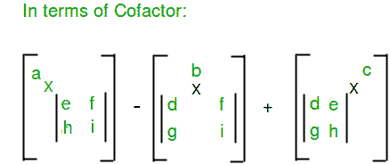

# 矩阵的行列式

> 原文:[https://www.geeksforgeeks.org/determinant-of-a-matrix/](https://www.geeksforgeeks.org/determinant-of-a-matrix/)

**什么是矩阵的行列式？**
矩阵的行列式是一个特殊的数，只为方阵(行列数相同的矩阵)定义。行列式在微积分和其他矩阵相关代数中有很多应用，它实际上是用实数来表示矩阵，可以用来求解线性方程组和求矩阵的逆。

**怎么算？**
矩阵行列式的值可以通过以下步骤计算–
对于第一行或第一列的每个元素，获取这些元素的辅因子，然后将该元素与相应辅因子的行列式相乘，最后用交替符号相加。作为基本情况，1*1 矩阵的行列式的值就是单个值本身。

**一个元素的辅因子**是一个矩阵，我们可以通过从该矩阵中移除该元素的行和列来得到它。

**2×2 矩阵的行列式:**


**3×3 矩阵的行列式:**




## C++

```
// C++ program to find Determinant of a matrix
#include <iostream>
using namespace std;

// Dimension of input square matrix
#define N 4

// Function to get cofactor of mat[p][q] in temp[][]. n is
// current dimension of mat[][]
void getCofactor(int mat[N][N], int temp[N][N], int p,
                 int q, int n)
{
    int i = 0, j = 0;

    // Looping for each element of the matrix
    for (int row = 0; row < n; row++)
    {
        for (int col = 0; col < n; col++)
        {
            //  Copying into temporary matrix only those
            //  element which are not in given row and
            //  column
            if (row != p && col != q)
            {
                temp[i][j++] = mat[row][col];

                // Row is filled, so increase row index and
                // reset col index
                if (j == n - 1)
                {
                    j = 0;
                    i++;
                }
            }
        }
    }
}

/* Recursive function for finding determinant of matrix.
   n is current dimension of mat[][]. */
int determinantOfMatrix(int mat[N][N], int n)
{
    int D = 0; // Initialize result

    //  Base case : if matrix contains single element
    if (n == 1)
        return mat[0][0];

    int temp[N][N]; // To store cofactors

    int sign = 1; // To store sign multiplier

    // Iterate for each element of first row
    for (int f = 0; f < n; f++)
    {
        // Getting Cofactor of mat[0][f]
        getCofactor(mat, temp, 0, f, n);
        D += sign * mat[0][f]
             * determinantOfMatrix(temp, n - 1);

        // terms are to be added with alternate sign
        sign = -sign;
    }

    return D;
}

/* function for displaying the matrix */
void display(int mat[N][N], int row, int col)
{
    for (int i = 0; i < row; i++)
    {
        for (int j = 0; j < col; j++)
            cout <<"  " <<  mat[i][j];
        cout <<"n";
    }
}

// Driver program to test above functions
int main()
{
    /* int mat[N][N] = {{6, 1, 1},
                     {4, -2, 5},
                     {2, 8, 7}}; */

    int mat[N][N] = { { 1, 0, 2, -1 },
                      { 3, 0, 0, 5 },
                      { 2, 1, 4, -3 },
                      { 1, 0, 5, 0 } };

    // Function call
    cout <<"Determinant of the matrix is : " << determinantOfMatrix(mat, N);
    return 0;
}

// this code is contributed by shivanisinghss2110
```

## C

```
// C program to find Determinant of a matrix
#include <stdio.h>

// Dimension of input square matrix
#define N 4

// Function to get cofactor of mat[p][q] in temp[][]. n is
// current dimension of mat[][]
void getCofactor(int mat[N][N], int temp[N][N], int p,
                 int q, int n)
{
    int i = 0, j = 0;

    // Looping for each element of the matrix
    for (int row = 0; row < n; row++)
    {
        for (int col = 0; col < n; col++)
        {
            //  Copying into temporary matrix only those
            //  element which are not in given row and
            //  column
            if (row != p && col != q)
            {
                temp[i][j++] = mat[row][col];

                // Row is filled, so increase row index and
                // reset col index
                if (j == n - 1)
                {
                    j = 0;
                    i++;
                }
            }
        }
    }
}

/* Recursive function for finding determinant of matrix.
   n is current dimension of mat[][]. */
int determinantOfMatrix(int mat[N][N], int n)
{
    int D = 0; // Initialize result

    //  Base case : if matrix contains single element
    if (n == 1)
        return mat[0][0];

    int temp[N][N]; // To store cofactors

    int sign = 1; // To store sign multiplier

    // Iterate for each element of first row
    for (int f = 0; f < n; f++)
    {
        // Getting Cofactor of mat[0][f]
        getCofactor(mat, temp, 0, f, n);
        D += sign * mat[0][f]
             * determinantOfMatrix(temp, n - 1);

        // terms are to be added with alternate sign
        sign = -sign;
    }

    return D;
}

/* function for displaying the matrix */
void display(int mat[N][N], int row, int col)
{
    for (int i = 0; i < row; i++)
    {
        for (int j = 0; j < col; j++)
            printf("  %d", mat[i][j]);
        printf("n");
    }
}

// Driver program to test above functions
int main()
{
    /* int mat[N][N] = {{6, 1, 1},
                     {4, -2, 5},
                     {2, 8, 7}}; */

    int mat[N][N] = { { 1, 0, 2, -1 },
                      { 3, 0, 0, 5 },
                      { 2, 1, 4, -3 },
                      { 1, 0, 5, 0 } };

    // Function call
    printf("Determinant of the matrix is : %d",
           determinantOfMatrix(mat, N));
    return 0;
}
```

## Java 语言(一种计算机语言，尤用于创建网站)

```
// Java program to find Determinant of
// a matrix
class GFG {

    // Dimension of input square matrix
    static final int N = 4;

    // Function to get cofactor of
    // mat[p][q] in temp[][]. n is
    // current dimension of mat[][]
    static void getCofactor(int mat[][], int temp[][],
                            int p, int q, int n)
    {
        int i = 0, j = 0;

        // Looping for each element of
        // the matrix
        for (int row = 0; row < n; row++)
        {
            for (int col = 0; col < n; col++)
            {
                // Copying into temporary matrix
                // only those element which are
                // not in given row and column
                if (row != p && col != q)
                {
                    temp[i][j++] = mat[row][col];
                    // Row is filled, so increase
                    // row index and reset col
                    // index
                    if (j == n - 1)
                    {
                        j = 0;
                        i++;
                    }
                }
            }
        }
    }

    /* Recursive function for finding determinant
    of matrix. n is current dimension of mat[][]. */
    static int determinantOfMatrix(int mat[][], int n)
    {
        int D = 0; // Initialize result

        // Base case : if matrix contains single
        // element
        if (n == 1)
            return mat[0][0];

        // To store cofactors
        int temp[][] = new int[N][N];

        // To store sign multiplier
        int sign = 1;

        // Iterate for each element of first row
        for (int f = 0; f < n; f++)
        {
            // Getting Cofactor of mat[0][f]
            getCofactor(mat, temp, 0, f, n);
            D += sign * mat[0][f]
                 * determinantOfMatrix(temp, n - 1);

            // terms are to be added with
            // alternate sign
            sign = -sign;
        }

        return D;
    }

    /* function for displaying the matrix */
    static void display(int mat[][], int row, int col)
    {
        for (int i = 0; i < row; i++)
        {
            for (int j = 0; j < col; j++)
                System.out.print(mat[i][j]);

            System.out.print("\n");
        }
    }

    // Driver code
    public static void main(String[] args)
    {

        int mat[][] = { { 1, 0, 2, -1 },
                        { 3, 0, 0, 5 },
                        { 2, 1, 4, -3 },
                        { 1, 0, 5, 0 } };

        System.out.print("Determinant "
                         + "of the matrix is : "
                         + determinantOfMatrix(mat, N));
    }
}

// This code is contributed by Anant Agarwal.
```

## 蟒蛇 3

```
# python program to find
# determinant of matrix.

# defining a function to get the
# minor matrix after excluding
# i-th row and j-th column.

def getcofactor(m, i, j):
    return [row[: j] + row[j+1:] for row in (m[: i] + m[i+1:])]

# defining the function to
# calculate determinant value
# of given matrix a.

def determinantOfMatrix(mat):

    # if given matrix is of order
    # 2*2 then simply return det
    # value by cross multiplying
    # elements of matrix.
    if(len(mat) == 2):
        value = mat[0][0] * mat[1][1] - mat[1][0] * mat[0][1]
        return value

    # initialize Sum to zero
    Sum = 0

    # loop to traverse each column
    # of matrix a.
    for current_column in range(len(mat)):

        # calculating the sign corresponding
        # to co-factor of that sub matrix.
        sign = (-1) ** (current_column)

        # calling the function recursily to
        # get determinant value of
        # sub matrix obtained.
        sub_det = determinantOfMatrix(getcofactor(mat, 0, current_column))

        # adding the calculated determinant
        # value of particular column
        # matrix to total Sum.
        Sum += (sign * mat[0][current_column] * sub_det)

    # returning the final Sum
    return Sum

# Driver code
if __name__ == '__main__':

    # declaring the matrix.
    mat = [[1, 0, 2, -1],
           [3, 0, 0, 5],
           [2, 1, 4, -3],
           [1, 0, 5, 0]]

    # printing determinant value
    # by function call
    print('Determinant of the matrix is :', determinantOfMatrix(mat))

# This code is contributed by Amit Mangal.
```

## C#

```
// C# program to find Determinant of
// a matrix
using System;
class GFG {

    // Dimension of input square matrix
    static int N = 4;

    // Function to get cofactor of
    // mat[p][q] in temp[][]. n is
    // current dimension of mat[][]
    static void getCofactor(int[, ] mat, int[, ] temp,
                            int p, int q, int n)
    {
        int i = 0, j = 0;

        // Looping for each element of
        // the matrix
        for (int row = 0; row < n; row++)
        {
            for (int col = 0; col < n; col++)
            {

                // Copying into temporary matrix
                // only those element which are
                // not in given row and column
                if (row != p && col != q) {
                    temp[i, j++] = mat[row, col];

                    // Row is filled, so increase
                    // row index and reset col
                    // index
                    if (j == n - 1) {
                        j = 0;
                        i++;
                    }
                }
            }
        }
    }

    /* Recursive function for
       finding determinant
       of matrix. n is current
       dimension of mat[][]. */
    static int determinantOfMatrix(int[, ] mat, int n)
    {
        int D = 0; // Initialize result

        // Base case : if matrix
        // contains single
        // element
        if (n == 1)
            return mat[0, 0];

        // To store cofactors
        int[, ] temp = new int[N, N];

        // To store sign multiplier
        int sign = 1;

        // Iterate for each element
        // of first row
        for (int f = 0; f < n; f++)
        {
            // Getting Cofactor of mat[0][f]
            getCofactor(mat, temp, 0, f, n);
            D += sign * mat[0, f]
                 * determinantOfMatrix(temp, n - 1);

            // terms are to be added with
            // alternate sign
            sign = -sign;
        }

        return D;
    }

    /* function for displaying
       the matrix */
    static void display(int[, ] mat, int row, int col)
    {
        for (int i = 0; i < row; i++)
        {
            for (int j = 0; j < col; j++)
                Console.Write(mat[i, j]);

            Console.Write("\n");
        }
    }

    // Driver code
    public static void Main()
    {

        int[, ] mat = { { 1, 0, 2, -1 },
                        { 3, 0, 0, 5 },
                        { 2, 1, 4, -3 },
                        { 1, 0, 5, 0 } };

        Console.Write("Determinant "
                      + "of the matrix is : "
                      + determinantOfMatrix(mat, N));
    }
}

// This code is contributed by nitin mittal.
```

## java 描述语言

```
<script>

// JavaScript program to find Determinant of
// a matrix

// Dimension of input square matrix
let N = 4;

// Function to get cofactor of
    // mat[p][q] in temp[][]. n is
    // current dimension of mat[][]
function getCofactor(mat,temp,p,q,n)
{
    let i = 0, j = 0;

        // Looping for each element of
        // the matrix
        for (let row = 0; row < n; row++)
        {
            for (let col = 0; col < n; col++)
            {
                // Copying into temporary matrix
                // only those element which are
                // not in given row and column
                if (row != p && col != q)
                {
                    temp[i][j++] = mat[row][col];
                    // Row is filled, so increase
                    // row index and reset col
                    // index
                    if (j == n - 1)
                    {
                        j = 0;
                        i++;
                    }
                }
            }
        }
}

/* Recursive function for finding determinant
    of matrix. n is current dimension of mat[][]. */
function determinantOfMatrix(mat,n)
{
    let D = 0; // Initialize result

        // Base case : if matrix contains single
        // element
        if (n == 1)
            return mat[0][0];

        // To store cofactors
        let temp = new Array(N);
        for(let i=0;i<N;i++)
        {
            temp[i]=new Array(N);
        }

        // To store sign multiplier
        let sign = 1;

        // Iterate for each element of first row
        for (let f = 0; f < n; f++)
        {
            // Getting Cofactor of mat[0][f]
            getCofactor(mat, temp, 0, f, n);
            D += sign * mat[0][f]
                 * determinantOfMatrix(temp, n - 1);

            // terms are to be added with
            // alternate sign
            sign = -sign;
        }

        return D;
}

/* function for displaying the matrix */
function display(mat,row,col)
{
    for (let i = 0; i < row; i++)
        {
            for (let j = 0; j < col; j++)
                document.write(mat[i][j]);

            document.write("<br>");
        }
}

// Driver code
let mat=[[ 1, 0, 2, -1 ],
         [ 3, 0, 0, 5 ],
         [ 2, 1, 4, -3 ],
         [ 1, 0, 5, 0 ]];

document.write("Determinant "
                         + "of the matrix is : "
                         + determinantOfMatrix(mat, N));

// This code is contributed by rag2127

</script>
```

**Output**

```
Determinant of the matrix is : 30
```

[矩阵的伴随与逆](https://www.geeksforgeeks.org/adjoint-inverse-matrix/)
行列式的各种性质有助于解决与矩阵相关的问题，
本文由乌卡什·特里维迪供稿。如果您发现任何不正确的地方，或者您想分享关于上面讨论的主题的更多信息，请写评论

**在上述方法中，讨论了递归方法。** **当矩阵的大小较大时，它消耗更多的堆栈大小**
在这个方法中，我们使用行列式的性质。在这种方法中，我们使用行列式的性质将给定的矩阵转换成上三角矩阵上三角矩阵的行列式是所有对角元素的乘积有关行列式的性质，请访问

在这种方法中，我们迭代每一个对角元素，并使用行列式的性质使所有对角元素为零

如果对角线元素为零，那么我们将在同一列中搜索下一个非零元素

存在两种情况
**情况 1:**
如果没有非零元素。在这种情况下，矩阵的行列式为零
**情况 2:**
如果存在非零元素，则存在两种情况
**情况 a:**
如果索引具有相应的对角行元素。利用行列式的性质，我们把所有的列元素都降为零
**情况 b:**
这里我们需要把相应的行换成对角元素列，继续情况 a；操作

下面是上述方法的实现:

## C++

```
// C++ program to find Determinant of a matrix
#include <bits/stdc++.h>
using namespace std;

// Dimension of input square matrix
#define N 4
// Function to get determinant of matrix
int determinantOfMatrix(int mat[N][N], int n)
{
    int num1, num2, det = 1, index,
                    total = 1; // Initialize result

    // temporary array for storing row
    int temp[n + 1];

    // loop for traversing the diagonal elements
    for (int i = 0; i < n; i++)
    {
        index = i; // initialize the index

        // finding the index which has non zero value
        while (mat[index][i] == 0 && index < n)
        {
            index++;
        }
        if (index == n) // if there is non zero element
        {
            // the determinant of matrix as zero
            continue;
        }
        if (index != i)
        {
            // loop for swaping the diagonal element row and
            // index row
            for (int j = 0; j < n; j++)
            {
                swap(mat[index][j], mat[i][j]);
            }
            // determinant sign changes when we shift rows
            // go through determinant properties
            det = det * pow(-1, index - i);
        }

        // storing the values of diagonal row elements
        for (int j = 0; j < n; j++)
        {
            temp[j] = mat[i][j];
        }
        // traversing every row below the diagonal element
        for (int j = i + 1; j < n; j++)
        {
            num1 = temp[i]; // value of diagonal element
            num2 = mat[j][i]; // value of next row element

            // traversing every column of row
            // and multiplying to every row
            for (int k = 0; k < n; k++)
            {
                // multiplying to make the diagonal
                // element and next row element equal
                mat[j][k]
                    = (num1 * mat[j][k]) - (num2 * temp[k]);
            }
            total = total * num1; // Det(kA)=kDet(A);
        }
    }

    // multiplying the diagonal elements to get determinant
    for (int i = 0; i < n; i++)
    {
        det = det * mat[i][i];
    }
    return (det / total); // Det(kA)/k=Det(A);
}

// Driver code
int main()
{
    /*int mat[N][N] = {{6, 1, 1},
                        {4, -2, 5},
                        {2, 8, 7}}; */

    int mat[N][N] = { { 1, 0, 2, -1 },
                      { 3, 0, 0, 5 },
                      { 2, 1, 4, -3 },
                      { 1, 0, 5, 0 } };

    // Function call
    printf("Determinant of the matrix is : %d",
           determinantOfMatrix(mat, N));
    return 0;
}
```

## Java 语言(一种计算机语言，尤用于创建网站)

```
// Java program to find Determinant of a matrix
class GFG
{

    // Dimension of input square matrix
    static final int N = 4;

    // Function to get determinant of matrix
    static int determinantOfMatrix(int mat[][], int n)
    {
        int num1, num2, det = 1, index,
                        total = 1; // Initialize result

        // temporary array for storing row
        int[] temp = new int[n + 1];

        // loop for traversing the diagonal elements
        for (int i = 0; i < n; i++)
        {
            index = i; // initialize the index

            // finding the index which has non zero value
            while (mat[index][i] == 0 && index < n)
            {
                index++;
            }
            if (index == n) // if there is non zero element
            {
                // the determinant of matrix as zero
                continue;
            }
            if (index != i)
            {
                // loop for swaping the diagonal element row
                // and index row
                for (int j = 0; j < n; j++)
                {
                    swap(mat, index, j, i, j);
                }
                // determinant sign changes when we shift
                // rows go through determinant properties
                det = (int)(det * Math.pow(-1, index - i));
            }

            // storing the values of diagonal row elements
            for (int j = 0; j < n; j++)
            {
                temp[j] = mat[i][j];
            }

            // traversing every row below the diagonal
            // element
            for (int j = i + 1; j < n; j++)
            {
                num1 = temp[i]; // value of diagonal element
                num2 = mat[j]
                          [i]; // value of next row element

                // traversing every column of row
                // and multiplying to every row
                for (int k = 0; k < n; k++)
                {
                    // multiplying to make the diagonal
                    // element and next row element equal
                    mat[j][k] = (num1 * mat[j][k])
                                - (num2 * temp[k]);
                }
                total = total * num1; // Det(kA)=kDet(A);
            }
        }

        // multiplying the diagonal elements to get
        // determinant
        for (int i = 0; i < n; i++)
        {
            det = det * mat[i][i];
        }
        return (det / total); // Det(kA)/k=Det(A);
    }

    static int[][] swap(int[][] arr, int i1, int j1, int i2,
                        int j2)
    {
        int temp = arr[i1][j1];
        arr[i1][j1] = arr[i2][j2];
        arr[i2][j2] = temp;
        return arr;
    }

    // Driver code
    public static void main(String[] args)
    {
        /*int mat[N][N] = {{6, 1, 1},
                        {4, -2, 5},
                        {2, 8, 7}}; */

        int mat[][] = { { 1, 0, 2, -1 },
                        { 3, 0, 0, 5 },
                        { 2, 1, 4, -3 },
                        { 1, 0, 5, 0 } };

        // Function call
        System.out.printf(
            "Determinant of the matrix is : %d",
            determinantOfMatrix(mat, N));
    }
}

// This code is contributed by Rajput-Ji
```

## 蟒蛇 3

```
# Python program to find Determinant of a matrix

def determinantOfMatrix(mat, n):

    temp = [0]*n  # temporary array for storing row
    total = 1
    det = 1  # initialize result

    # loop for traversing the diagonal elements
    for i in range(0, n):
        index = i  # initialize the index

        # finding the index which has non zero value
        while(mat[index][i] == 0 and index < n):
            index += 1

        if(index == n):  # if there is non zero element
            # the determinant of matrix as zero
            continue

        if(index != i):
            # loop for swaping the diagonal element row and index row
            for j in range(0, n):
                mat[index][j], mat[i][j] = mat[i][j], mat[index][j]

            # determinant sign changes when we shift rows
            # go through determinant properties
            det = det*int(pow(-1, index-i))

        # storing the values of diagonal row elements
        for j in range(0, n):
            temp[j] = mat[i][j]

        # traversing every row below the diagonal element
        for j in range(i+1, n):
            num1 = temp[i]     # value of diagonal element
            num2 = mat[j][i]   # value of next row element

            # traversing every column of row
            # and multiplying to every row
            for k in range(0, n):
                # multiplying to make the diagonal
                # element and next row element equal

                mat[j][k] = (num1*mat[j][k]) - (num2*temp[k])

            total = total * num1  # Det(kA)=kDet(A);

    # multiplying the diagonal elements to get determinant
    for i in range(0, n):
        det = det*mat[i][i]

    return int(det/total)  # Det(kA)/k=Det(A);

# Drivers code
if __name__ == "__main__":
    # mat=[[6 1 1][4 -2 5][2 8 7]]

    mat = [[1, 0, 2, -1], [3, 0, 0, 5], [2, 1, 4, -3], [1, 0, 5, 0]]
    N = len(mat)

    # Function call
    print("Determinant of the matrix is : ", determinantOfMatrix(mat, N))
```

## C#

```
// C# program to find Determinant of a matrix
using System;

class GFG {

    // Dimension of input square matrix
    static readonly int N = 4;

    // Function to get determinant of matrix
    static int determinantOfMatrix(int[, ] mat, int n)
    {
        int num1, num2, det = 1, index,
                        total = 1; // Initialize result

        // temporary array for storing row
        int[] temp = new int[n + 1];

        // loop for traversing the diagonal elements
        for (int i = 0; i < n; i++)
        {
            index = i; // initialize the index

            // finding the index which has non zero value
            while (mat[index, i] == 0 && index < n)
            {
                index++;
            }
            if (index == n) // if there is non zero element
            {
                // the determinant of matrix as zero
                continue;
            }
            if (index != i)
            {
                // loop for swaping the diagonal element row
                // and index row
                for (int j = 0; j < n; j++)
                {
                    swap(mat, index, j, i, j);
                }
                // determinant sign changes when we shift
                // rows go through determinant properties
                det = (int)(det * Math.Pow(-1, index - i));
            }

            // storing the values of diagonal row elements
            for (int j = 0; j < n; j++)
            {
                temp[j] = mat[i, j];
            }

            // traversing every row below the diagonal
            // element
            for (int j = i + 1; j < n; j++)
            {
                num1 = temp[i]; // value of diagonal element
                num2 = mat[j,
                           i]; // value of next row element

                // traversing every column of row
                // and multiplying to every row
                for (int k = 0; k < n; k++)
                {

                    // multiplying to make the diagonal
                    // element and next row element equal
                    mat[j, k] = (num1 * mat[j, k])
                                - (num2 * temp[k]);
                }
                total = total * num1; // Det(kA)=kDet(A);
            }
        }

        // multiplying the diagonal elements to get
        // determinant
        for (int i = 0; i < n; i++)
        {
            det = det * mat[i, i];
        }
        return (det / total); // Det(kA)/k=Det(A);
    }

    static int[, ] swap(int[, ] arr, int i1, int j1, int i2,
                        int j2)
    {
        int temp = arr[i1, j1];
        arr[i1, j1] = arr[i2, j2];
        arr[i2, j2] = temp;
        return arr;
    }

    // Driver code
    public static void Main(String[] args)
    {
        /*int mat[N,N] = {{6, 1, 1},
                        {4, -2, 5},
                        {2, 8, 7}}; */

        int[, ] mat = { { 1, 0, 2, -1 },
                        { 3, 0, 0, 5 },
                        { 2, 1, 4, -3 },
                        { 1, 0, 5, 0 } };

        // Function call
        Console.Write("Determinant of the matrix is : {0}",
                      determinantOfMatrix(mat, N));
    }
}

// This code is contributed by 29AjayKumar
```

## java 描述语言

```
Javascript<script>
// javascript program to find Determinant of a matrix

    // Dimension of input square matrix
      var N = 4;

    // Function to get determinant of matrix
    function determinantOfMatrix(mat , n)
    {
        var num1, num2, det = 1, index,
                        total = 1; // Initialize result

        // temporary array for storing row
        var temp = Array(n + 1).fill(0);

        // loop for traversing the diagonal elements
        for (i = 0; i < n; i++)
        {
            index = i; // initialize the index

            // finding the index which has non zero value
            while (mat[index][i] == 0 && index < n)
            {
                index++;
            }
            if (index == n) // if there is non zero element
            {
                // the determinant of matrix as zero
                continue;
            }
            if (index != i)
            {
                // loop for swaping the diagonal element row
                // and index row
                for (j = 0; j < n; j++)
                {
                    swap(mat, index, j, i, j);
                }
                // determinant sign changes when we shift
                // rows go through determinant properties
                det = parseInt((det * Math.pow(-1, index - i)));
            }

            // storing the values of diagonal row elements
            for (j = 0; j < n; j++)
            {
                temp[j] = mat[i][j];
            }

            // traversing every row below the diagonal
            // element
            for (j = i + 1; j < n; j++)
            {
                num1 = temp[i]; // value of diagonal element
                num2 = mat[j]
                          [i]; // value of next row element

                // traversing every column of row
                // and multiplying to every row
                for (k = 0; k < n; k++)
                {
                    // multiplying to make the diagonal
                    // element and next row element equal
                    mat[j][k] = (num1 * mat[j][k])
                                - (num2 * temp[k]);
                }
                total = total * num1; // Det(kA)=kDet(A);
            }
        }

        // multiplying the diagonal elements to get
        // determinant
        for (i = 0; i < n; i++)
        {
            det = det * mat[i][i];
        }
        return (det / total); // Det(kA)/k=Det(A);
    }

     function swap(arr , i1 , j1 , i2,
                         j2)
    {
        var temp = arr[i1][j1];
        arr[i1][j1] = arr[i2][j2];
        arr[i2][j2] = temp;
        return arr;
    }

    // Driver code

        /*var mat[N][N] = [{6, 1, 1],
                        {4, -2, 5],
                        {2, 8, 7}]; */

        var mat = [ [ 1, 0, 2, -1 ],
                        [ 3, 0, 0, 5 ],
                        [ 2, 1, 4, -3 ],
                        [ 1, 0, 5, 0 ] ];

        // Function call
        document.write(
            "Determinant of the matrix is : ",
            determinantOfMatrix(mat, N));

// This code contributed by gauravrajput1
</script>
```

**Output**

```
Determinant of the matrix is : 30
```

**时间复杂度:**O(n)<sup>3</sup>)
T5】辅助空间: O(n)

**方法三:使用 python 中的 numpy 包**

python 中 numpy 包的 linalg 模块中有一个内置的函数或方法。它可以被称为 numpy.linalg.det(mat)，返回参数中传递的矩阵 mat 的行列式值。

## 蟒蛇 3

```
# importing the numpy package
# as np
import numpy as np

def determinant(mat):

    # calling the det() method
    det = np.linalg.det(mat)
    return round(det)

# Driver Code
# declaring the matrix
mat = [[1, 0, 2, -1],
       [3, 0, 0, 5],
       [2, 1, 4, -3],
       [1, 0, 5, 0]]

# Function call
print('Determinant of the matrix is:',
      determinant(mat))

# This code is contributed by Amit Mangal.
```

**输出:**

```
Determinant of the matrix is: 30.0
```