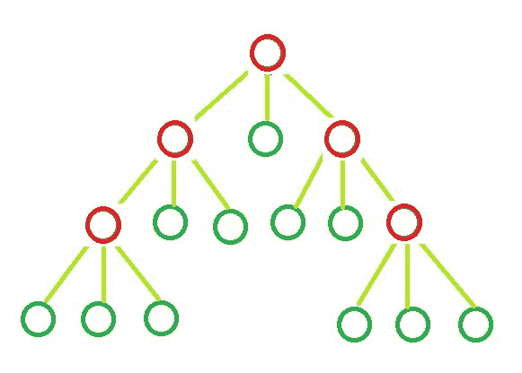

# 确定 N 元树中叶节点的数量

> 原文:[https://www . geeksforgeeks . org/确定树中叶节点的数量/](https://www.geeksforgeeks.org/determine-the-count-of-leaf-nodes-in-an-n-ary-tree/)

给定**‘N’**和**‘I’**的值。这里，表示 N 元树中存在的内部节点的数量，N 元的每个节点可以有个子节点或零个子节点。任务是确定 n 元树中**叶节点**的数量。

**示例**:

> **输入:** N = 3，I = 5
> **输出:**叶节点= 11
> 
> 
> 
> **输入:** N = 10，I = 10
> **输出:**叶节点= 91

**公式:**

> 
> 
> 其中，
> I =内部节点数。
> L =叶节点。
> 和，N =每个节点可以拥有的子节点数。

**派生:**树是 N 元树。假设它有 T 个总节点，是内部节点(I)和叶节点(L)的和。总节点数为 T 的树将有(T–1)条边或分支。
换句话说，由于树是一个 N 元树，每个内部节点将有 N 个分支贡献总共 N * 1 个内部分支。因此，根据以上解释，我们有以下关系:

*   n * I = T–1
*   L + I = T

从以上两个方程，我们可以说**L =(N–1)* I+1。**

下面是上述方法的实现:

## C++

```
// CPP program to find number
// of leaf nodes

#include <bits/stdc++.h>
using namespace std;

// Function to calculate
// leaf nodes in n-ary tree
int calcNodes(int N, int I)
{
    int result = 0;

    result = I * (N - 1) + 1;

    return result;
}

// Driver code
int main()
{
    int N = 5, I = 2;

    cout << "Leaf nodes = " << calcNodes(N, I);

    return 0;
}
```

## Java 语言(一种计算机语言，尤用于创建网站)

```
// Java program to find number
// of leaf nodes

class GfG
{

// Function to calculate
// leaf nodes in n-ary tree
static int calcNodes(int N, int I)
{
    int result = 0;

    result = I * (N - 1) + 1;

    return result;
}

// Driver code
public static void main(String[] args)
{
    int N = 5, I = 2;

    System.out.println("Leaf nodes = " +
                        calcNodes(N, I));
}
}

// This code is contributed by Prerna Saini
```

## 蟒蛇 3

```
# Python3 program to find number
# of leaf nodes

# Function to calculate
# leaf nodes in n-ary tree
def calcNodes(N, I):
    result = 0

    result = I * (N - 1) + 1

    return result

# Driver Code
if __name__ == '__main__':
    N = 5
    I = 2

    print("Leaf nodes = ",
           calcNodes(N, I))

# This code is contributed
# by SHUBHAMSINGH10
```

## C#

```
// C# program to find number
// of leaf nodes
using System;

class GFG
{

// Function to calculate
// leaf nodes in n-ary tree
static int calcNodes(int N, int I)
{
    int result = 0;

    result = I * (N - 1) + 1;

    return result;
}

// Driver code
public static void Main()
{
    int N = 5, I = 2;

    Console.Write("Leaf nodes = " +
                  calcNodes(N, I));
}
}

// This code is contributed
// by Akanksha Rai
```

## 服务器端编程语言（Professional Hypertext Preprocessor 的缩写）

```
<?php
// PHP program to find number
// of leaf nodes

// Function to calculate
// leaf nodes in n-ary tree
function calcNodes($N, $I)
{
    $result = 0;

    $result = $I * ($N - 1) + 1;

    return $result;
}

// Driver code
$N = 5; $I = 2;

echo "Leaf nodes = " .
      calcNodes($N, $I);

// This code is contributed
// by Akanksha Rai
?>
```

## java 描述语言

```
<script>

// Javascript program to find number
// of leaf nodes

// Function to calculate
// leaf nodes in n-ary tree
function calcNodes(N, I)
{
    var result = 0;

    result = I * (N - 1) + 1;

    return result;
}

// Driver code
var N = 5, I = 2;

document.write("Leaf nodes = " + calcNodes(N, I));

// This code is contributed by rutvik_56

</script>
```

**Output:** 

```
Leaf nodes = 9
```