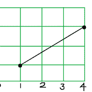

# 确定给定直线将要通过的单位面积的方块数。

> 原文:[https://www . geeksforgeeks . org/确定线路将通过的方块数/](https://www.geeksforgeeks.org/determine-the-numer-of-squares-that-line-will-pass-through/)

给定一条线的两个端点 **(x1，y1)** 和 **(x2，y2)** ，任务是确定该线将穿过的单位面积的方块数。



**例:**

> **输入:** (x1 = 1，y1 = 1)，(x2 = 4，y2 = 3)
> **输出:** 4
> 在上图中，线正穿过 4 个方块
> **输入:** (x1 = 0，y1 = 0)，(x2 = 2，y2 = 2)
> **输出:** 2

**进场** :
让，

```
Dx = (x2 - x1)
Dy = (y2 - y1)
```

因此，

```
x = x1 + Dx * t
y = y1 + Dy * t
```

我们必须在(0，1)中找到 t 的(x，y)。
对于，x 和 y 要积分，Dx 和 d y 必须能被 t 整除，而且，t 不能无理数，因为 Dx 和 Dy 都是整数。
因此让 **t = p / q** 。
Dx 和 Dy 必须能被 q 整除，所以 Dx 和 Dy 的 GCD 必须是 q.
Or，q = GCD(Dx，Dy)。
只有 GCD(Dx，Dy)最小的子问题。
以下是上述方法的实施:

## C++

```
#include<bits/stdc++.h>
using namespace std;

// Function to return the required position
int noOfSquares(int x1, int y1, int x2, int y2)
{
    int dx = abs(x2 - x1);
    int dy = abs(y2 - y1);

    int ans = dx + dy - __gcd(dx, dy);

    cout<<ans;
}

// Driver Code
int main()
{
    int x1 = 1, y1 = 1, x2 = 4, y2 = 3;

    noOfSquares(x1, y1, x2, y2);

    return 0;
}
```

## Java 语言(一种计算机语言，尤用于创建网站)

```
// Java program to determine the number
// of squares that line will pass through
class GFG
{
static int __gcd(int a, int b)
{
    if (b == 0)
        return a;
    return __gcd(b, a % b);

}

// Function to return the required position
static void noOfSquares(int x1, int y1,
                        int x2, int y2)
{
    int dx = Math.abs(x2 - x1);
    int dy = Math.abs(y2 - y1);

    int ans = dx + dy - __gcd(dx, dy);

    System.out.println(ans);
}

// Driver Code
public static void main(String []args)
{
    int x1 = 1, y1 = 1, x2 = 4, y2 = 3;

    noOfSquares(x1, y1, x2, y2);
}
}

// This code contributed by Rajput-Ji
```

## 蟒蛇 3

```
# Python3 program to determine the number
# of squares that line will pass through
from math import gcd

# Function to return the required position
def noOfSquares(x1, y1, x2, y2) :

    dx = abs(x2 - x1);
    dy = abs(y2 - y1);

    ans = dx + dy - gcd(dx, dy);

    print(ans);

# Driver Code
if __name__ == "__main__" :

    x1 = 1; y1 = 1; x2 = 4; y2 = 3;

    noOfSquares(x1, y1, x2, y2);

# This code is contributed by Ryuga
```

## C#

```
using System;

class GFG
{
static int __gcd(int a, int b)
{
    if (b == 0)
        return a;
    return __gcd(b, a % b);

}

// Function to return the required position
static void noOfSquares(int x1, int y1,
                        int x2, int y2)
{
    int dx = Math.Abs(x2 - x1);
    int dy = Math.Abs(y2 - y1);

    int ans = dx + dy - __gcd(dx, dy);

    Console.WriteLine(ans);
}

// Driver Code
static void Main()
{
    int x1 = 1, y1 = 1, x2 = 4, y2 = 3;

    noOfSquares(x1, y1, x2, y2);
}
}

// This code is contributed by mits
```

## 服务器端编程语言（Professional Hypertext Preprocessor 的缩写）

```
<?php
// PHP program to determine the number
// of squares that line will pass through

// Function to return the required position
function noOfSquares($x1, $y1, $x2, $y2)
{

    $dx = abs($x2 - $x1);
    $dy = abs($y2 - $y1);

    $ans = $dx + $dy - gcd($dx, $dy);

    echo($ans);
}

function gcd($a, $b)
{
    if ($b == 0)
        return $a;
    return gcd($b, $a % $b);

}

// Driver Code
$x1 = 1; $y1 = 1; $x2 = 4; $y2 = 3;
noOfSquares($x1, $y1, $x2, $y2);

// This code has been contributed
// by 29AjayKumar
?>
```

## java 描述语言

```
<script>

function __gcd(a, b)
{
    if (b == 0)
        return a;
    return __gcd(b, a % b);

}

// Function to return the required position
function noOfSquares(x1, y1, x2, y2)
{
    var dx = Math.abs(x2 - x1);
    var dy = Math.abs(y2 - y1);

    var ans = dx + dy - __gcd(dx, dy);

    document.write(ans);
}

// Driver Code
var x1 = 1, y1 = 1, x2 = 4, y2 = 3;
noOfSquares(x1, y1, x2, y2);

// This code is contributed by noob2000.
</script>
```

**Output:** 

```
4
```

**时间复杂度:** O(1)