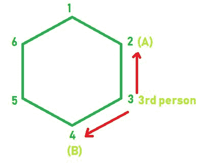

# 确定第三人在正 N 边多边形上的位置

> 原文:[https://www . geesforgeks . org/确定第三人在正多边形上的位置/](https://www.geeksforgeeks.org/determine-the-position-of-the-third-person-on-regular-n-sided-polygon/)

给定代表正 N 边多边形的**‘N’**。两个孩子站在这个正 N 边多边形的顶点**和**上。任务是确定另一个人应该站在的那个顶点的数量，使得到达 A 所需的最小跳跃和到达 B 所需的最小跳跃之和最小化。****

******注:******

1.  ****这个正多边形的顶点按顺时针方向从 1 到 N 排列。****
2.  ****如果有多个答案，输出编号最少的顶点。****

********

******示例:******

```
****Input:** N = 6, A = 2, B = 4 
**Output:** Vertex = 3
**Explanation:** 
The another person should stand on 3rd vertex. 
As from 3rd vertex,
1 jump is required to reach A 
and 1 jump is required to reach B. 
(See figure above)

**Input:** N = 4, A = 1, B = 2
**Output:** Vertex = 3
**Explanation:** 
The another person should stand on 3rd or 4th vertex. 
But, as mentioned above 
we have to print least numbered vertex
that's why the output is 3.**
```

******进场:******

*   ****简单地计算除顶点 A 和 B 之外的每个顶点的跳跃，因为在这些顶点上，孩子是站立的，并将他们的和存储在和变量中。****
*   ****最后，打印跳跃总和最小的位置。****

## ****C++****

```
**// C++ implementation of above approach

#include <bits/stdc++.h>
using namespace std;

// Function to find out the
// number of that vertices
int vertices(int N, int A, int B)
{
    int position = 0;
    int minisum = INT_MAX;
    int sum = 0;
    for (int i = 1; i <= N; i++) {

        // Another person can't stand on
        // vertex on which 2 children stand.
        if (i == A || i == B)
            continue;

        // calculating minimum jumps from
        // each vertex.
        else {

            int x = abs(i - A);
            int y = abs(i - B);

            // Calculate sum of jumps.
            sum = x + y;

            if (sum < minisum) {
                minisum = sum;
                position = i;
            }
        }
    }
    return position;
}

// Driver code
int main()
{
    int N = 3, A = 1, B = 2;

    // Calling function
    cout << "Vertex = " << vertices(N, A, B);

    return 0;
}**
```

## ****Java 语言(一种计算机语言，尤用于创建网站)****

```
**// Java implementation of above approach
class GFG
{

// Function to find out the
// number of that vertices
static int vertices(int N, int A, int B)
{
    int position = 0;
    int minisum = Integer.MAX_VALUE;
    int sum = 0;
    for (int i = 1; i <= N; i++)
    {

        // Another person can't stand on
        // vertex on which 2 children stand.
        if (i == A || i == B)
            continue;

        // calculating minimum jumps from
        // each vertex.
        else
        {

            int x = Math.abs(i - A);
            int y = Math.abs(i - B);

            // Calculate sum of jumps.
            sum = x + y;

            if (sum < minisum)
            {
                minisum = sum;
                position = i;
            }
        }
    }
    return position;
}

// Driver code
public static void main(String[] args)
{
    int N = 3, A = 1, B = 2;

    // Calling function
    System.out.println("Vertex = " + vertices(N, A, B));
}
}

// This code contributed by Rajput-Ji**
```

## ****计算机编程语言****

```
**# Python3 implementation of above approach

# Function to find out the
# number of that vertices
def vertices(N, A, B):

    position = 0
    miniSum = 10**9
    Sum = 0
    for i in range(1, N + 1):

        # Another person can't stand on
        # vertex on which 2 children stand.
        if (i == A or i == B):
            continue

        # calculating minimum jumps from
        # each vertex.
        else:

            x = abs(i - A)
            y = abs(i - B)

            # Calculate Sum of jumps.
            Sum = x + y

            if (Sum < miniSum):
                miniSum = Sum
                position = i

    return position

# Driver code
N = 3
A = 1
B = 2

# Calling function
print("Vertex = ",vertices(N, A, B))

# This code is contributed by mohit kumar**
```

## ****C#****

```
**// C# implementation of the approach
using System;
using System.Collections.Generic;

class GFG
{

// Function to find out the
// number of that vertices
static int vertices(int N, int A, int B)
{
    int position = 0;
    int minisum = int.MaxValue;
    int sum = 0;
    for (int i = 1; i <= N; i++)
    {

        // Another person can't stand on
        // vertex on which 2 children stand.
        if (i == A || i == B)
            continue;

        // calculating minimum jumps from
        // each vertex.
        else
        {

            int x = Math.Abs(i - A);
            int y = Math.Abs(i - B);

            // Calculate sum of jumps.
            sum = x + y;

            if (sum < minisum)
            {
                minisum = sum;
                position = i;
            }
        }
    }
    return position;
}

// Driver code
public static void Main(String[] args)
{
    int N = 3, A = 1, B = 2;

    // Calling function
    Console.WriteLine("Vertex = " + vertices(N, A, B));
}
}

/* This code contributed by PrinciRaj1992 */**
```

## ****服务器端编程语言（Professional Hypertext Preprocessor 的缩写）****

```
**<?php
// PHP implementation of above approach

// Function to find out the
// number of that vertices
function vertices($N, $A, $B)
{
    $position = 0;
    $minisum = PHP_INT_MAX;
    $sum = 0;
    for ($i = 1; $i <= $N; $i++) {

        // Another person can't stand on
        // vertex on which 2 children stand.
        if ($i == $A || $i == $B)
            continue;

        // calculating minimum jumps from
        // each vertex.
        else {

            $x = abs($i - $A);
            $y = abs($i - $B);

            // Calculate sum of jumps.
            $sum = $x + $y;

            if ($sum < $minisum) {
                $minisum = $sum;
                $position = $i;
            }
        }
    }
    return $position;
}

    // Driver code
    $N = 3; $A = 1; $B = 2;

    // Calling function
    echo "Vertex = ",vertices($N, $A,$B);

    // This code is contributed by Ryuga

?>**
```

## ****java 描述语言****

```
**<script>

// Javascript implementation of above approach

// Function to find out the
// number of that vertices
function vertices(N, A, B)
{
    var position = 0;
    var minisum = Number.MAX_VALUE;
    var sum = 0;

    for(var i = 1; i <= N; i++)
    {

        // Another person can't stand on
        // vertex on which 2 children stand.
        if (i == A || i == B)
            continue;

        // calculating minimum jumps from
        // each vertex.
        else
        {
            var x = Math.abs(i - A);
            var y = Math.abs(i - B);

            // Calculate sum of jumps.
            sum = x + y;

            if (sum < minisum)
            {
                minisum = sum;
                position = i;
            }
        }
    }
    return position;
}

// Driver code
var N = 3, A = 1, B = 2;

// Calling function
document.write("Vertex = " + vertices(N, A, B));

// This code is contributed by Ankita saini

</script>**
```

******Output:** 

```
Vertex = 3
```****