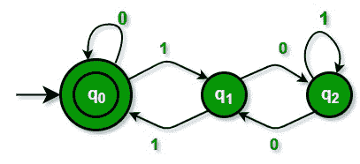

# 基于 DFA 的部门

> 原文:[https://www.geeksforgeeks.org/dfa-based-division/](https://www.geeksforgeeks.org/dfa-based-division/)

[确定性有限自动机(DFA)](http://en.wikipedia.org/wiki/Deterministic_finite_automaton) 可以用来检查一个数“num”是否能被“k”整除。如果数不能被整除，余数也可以用 DFA 得到。
我们考虑‘num’的二进制表示，构建一个具有 k 个状态的 DFA。DFA 对 0 和 1 都有转换功能。一旦建立了 DFA，我们处理 DFA 上的“数”以得到余数。
我们来走过一个例子。假设我们想检查给定的数字“num”是否能被 3 整除。任何数字都可以写成:num = 3*a + b 其中‘a’是商，‘b’是余数。
对于 3，DFA 中可以有 3 个状态，每个状态对应余数 0、1 和 2。并且每个状态可以有两个对应于 0 和 1 的转变(考虑给定‘num’的二进制表示)。
转移函数 F(p，x) = q 告诉我们，在读取字母表 x 时，我们从状态 p 移动到状态 q。让我们将状态命名为 0、1 和 2。初始状态将始终为 0。最终状态表示剩余部分。如果最终状态是 0，这个数是可分的。



在上图中，双圆圈状态是最终状态。
1。当我们处于状态 0 并读取 0 时，我们保持在状态 0。
2。当我们处于状态 0 并读取 1 时，我们移动到状态 1，为什么？这样形成的十进制数(1)给出余数 1。
3。当我们处于状态 1 并读取 0 时，我们移动到状态 2，为什么？这样形成的十进制数(10)给出余数 2。
4。当我们处于状态 1 并读取 1 时，我们移动到状态 0，为什么？这样形成的十进制数(11)给出余数 0。
5。当我们处于状态 2 并读取 0 时，我们移动到状态 1，为什么？这样形成的十进制数(100)给出余数 1。
6。当我们处于状态 2 并读取 1 时，我们仍然处于状态 2，为什么？十进制 gves 余数 2 中如此形成的数(101)。
过渡表如下所示:

```
state   0   1
_____________
 0      0   1
 1      2   0
 2      1   2
```

让我们检查一下 6 是否能被 3 整除？
6 的二进制表示为 110
状态= 0
1。状态=0，我们读 1，新状态=1
2。状态=1，我们读作 1，新状态=0
3。状态=0，我们读作 0，新状态=0
由于最终状态为 0，所以数字可被 3 整除。
我们再举一个例子，数字为 4
状态=0
1。状态=0，我们读作 1，新状态=1
2。状态=1，我们读取 0，新状态=2
3。状态=2，我们读作 0，新状态=1
既然，最终状态不是 0，这个数就不能被 3 整除。余数是 1。
*注意，最终状态给出余数。*
我们可以把上面的解推广到任何 k 值，对于 k 值，状态是 0，1，…。，k-1。如果目前看到的二进制位的十进制等效值跨越了范围 k，如何计算跃迁？如果我们在 p 状态，我们已经读到了 p(十进制)。现在我们读 0，新的读数变成 2*p，如果我们读 1，新的读数变成 2*p+1。新的状态可以通过从这些值(2p 或 2p+1)中减去 k 来获得，其中 0<= p<k
基于上述方法，下面是工作代码:

## C++

```
#include <bits/stdc++.h>
using namespace std;

// Function to build DFA for divisor k
void preprocess(int k, int Table[][2])
{
    int trans0, trans1;

    // The following loop calculates the
    // two transitions for each state,
    // starting from state 0
    for (int state = 0; state < k; ++state)
    {
        // Calculate next state for bit 0
        trans0 = state << 1;
        Table[state][0] = (trans0 < k) ?
                                trans0 : trans0 - k;

        // Calculate next state for bit 1
        trans1 = (state << 1) + 1;
        Table[state][1] = (trans1 < k) ?
                                trans1 : trans1 - k;
    }
}

// A recursive utility function that
// takes a 'num' and DFA (transition
// table) as input and process 'num'
// bit by bit over DFA
void isDivisibleUtil(int num, int* state,
                     int Table[][2])
{
    // process "num" bit by bit
    // from MSB to LSB
    if (num != 0)
    {
        isDivisibleUtil(num >> 1, state, Table);
        *state = Table[*state][num & 1];
    }
}

// The main function that divides 'num'
// by k and returns the remainder
int isDivisible (int num, int k)
{
    // Allocate memory for transition table.
    // The table will have k*2 entries
    int (*Table)[2] = (int (*)[2])malloc(k*sizeof(*Table));

    // Fill the transition table
    preprocess(k, Table);

    // Process ‘num’ over DFA and
    // get the remainder
    int state = 0;
    isDivisibleUtil(num, &state, Table);

    // Note that the final value
    // of state is the remainder
    return state;
}

// Driver Code
int main()
{
    int num = 47; // Number to be divided
    int k = 5; // Divisor

    int remainder = isDivisible (num, k);

    if (remainder == 0)
        cout << "Divisible\n";
    else
        cout << "Not Divisible: Remainder is "
             << remainder;

    return 0;
}

// This is code is contributed by rathbhupendra
```

## C

```
#include <stdio.h>
#include <stdlib.h>

// Function to build DFA for divisor k
void preprocess(int k, int Table[][2])
{
    int trans0, trans1;

    // The following loop calculates the two transitions for each state,
    // starting from state 0
    for (int state=0; state<k; ++state)
    {
        // Calculate next state for bit 0
        trans0 = state<<1;
        Table[state][0] = (trans0 < k)? trans0: trans0-k;

        // Calculate next state for bit 1
        trans1 = (state<<1) + 1;
        Table[state][1] = (trans1 < k)? trans1: trans1-k;
    }
}

// A recursive utility function that takes a 'num' and DFA (transition
// table) as input and process 'num' bit by bit over DFA
void isDivisibleUtil(int num, int* state, int Table[][2])
{
    // process "num" bit by bit from MSB to LSB
    if (num != 0)
    {
        isDivisibleUtil(num>>1, state, Table);
        *state = Table[*state][num&1];
    }
}

// The main function that divides 'num' by k and returns the remainder
int isDivisible (int num, int k)
{
    // Allocate memory for transition table. The table will have k*2 entries
    int (*Table)[2] = (int (*)[2])malloc(k*sizeof(*Table));

    // Fill the transition table
    preprocess(k, Table);

    // Process ‘num’ over DFA and get the remainder
    int state = 0;
    isDivisibleUtil(num, &state, Table);

    // Note that the final value of state is the remainder
    return state;
}

// Driver program to test above functions
int main()
{
    int num = 47; // Number to be divided
    int k = 5; // Divisor

    int remainder = isDivisible (num, k);

    if (remainder == 0)
        printf("Divisible\n");
    else
        printf("Not Divisible: Remainder is %d\n", remainder);

    return 0;
}
```

输出:

```
Not Divisible: Remainder is 2
```

***时间复杂度:** O(k)*

如果我们有一个二进制流作为输入，并且我们想随时检查流的十进制值的可除性，基于 DFA 的除法可能是有用的。
**相关文章:**
[检查二进制流中的可除性](https://www.geeksforgeeks.org/check-divisibility-binary-stream/)
[检查一个流是否为 3 的倍数](https://www.geeksforgeeks.org/write-an-efficient-method-to-check-if-a-number-is-multiple-of-3/)
本文由**aashis Barnwal**编辑，GeeksforGeeks 团队审核。如果您发现任何不正确的地方，请写评论，或者您想分享更多关于上面讨论的主题的信息