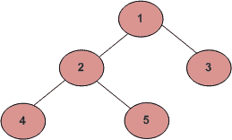

# 使用递归进行树的 DFS 遍历

> 原文:[https://www . geesforgeks . org/DFS-使用递归遍历树/](https://www.geeksforgeeks.org/dfs-traversal-of-a-tree-using-recursion/)

给定一棵二叉树，使用递归使用 DFS 遍历它。
与线性数据结构(数组、链表、队列、栈等)只有一种逻辑方式遍历不同，树可以有不同的遍历方式。一般来说，有两种广泛使用的遍历树的方法:

*   深度优先搜索
*   BFS 或广度优先搜索

本文讨论了使用 DFS 的遍历。宽度优先遍历见[本帖。](https://www.geeksforgeeks.org/level-order-tree-traversal/)

### 深度优先搜索

深度优先搜索是一种用于遍历树或图的技术。这里回溯用于遍历。在这个遍历中，首先访问最深的节点，然后如果该节点不存在兄弟节点，则回溯到它的父节点。

### 图与树的 DFS 遍历

在图中，可能存在循环和不连通。与图不同，树不包含循环且总是连通的。所以树的 DFS 相对容易一些。我们可以简单地从一个节点开始，然后遍历它的相邻节点(或子节点)，而不用考虑循环。如果我们从单个节点(根)开始，并以这种方式遍历，可以保证我们遍历整个树，因为没有不连通，

示例:

> 树:
> 
> 
> 
> 因此，此树的深度第一次遍历将是:
> (a)有序(左、根、右):4 2 5 1 3
> (b)前序(根、左、右):1 2 4 5 3
> (c)后序(左、右、根):4 5 2 3 1

下面是使用递归通过 DFS 的树遍历:

### 1.有序遍历([练习](https://practice.geeksforgeeks.org/problems/inorder-traversal/1)):

**示例:**上面给出的图的有序遍历是 4 2 5 1 3。

```
Algorithm Inorder(tree)
   1\. Traverse the left subtree, i.e., call Inorder(left-subtree)
   2\. Visit the root.
   3\. Traverse the right subtree, i.e., call Inorder(right-subtree)
```

**实施:**

## C++

```
// C program for different tree traversals
#include <iostream>
using namespace std;

/* A binary tree node has data, pointer to left child
and a pointer to right child */
struct Node {
    int data;
    struct Node *left, *right;
    Node(int data)
    {
        this->data = data;
        left = right = NULL;
    }
};

/* Given a binary tree, print its nodes in inorder*/
void printInorder(struct Node* node)
{
    if (node == NULL)
        return;

    /* first recur on left child */
    printInorder(node->left);

    /* then print the data of node */
    cout << node->data << " ";

    /* now recur on right child */
    printInorder(node->right);
}

/* Driver program to test above functions*/
int main()
{
    struct Node* root = new Node(1);
    root->left = new Node(2);
    root->right = new Node(3);
    root->left->left = new Node(4);
    root->left->right = new Node(5);

    cout << "\nInorder traversal of binary tree is \n";
    printInorder(root);

    return 0;
}
```

## C

```
// C program for different tree traversals
#include <stdio.h>
#include <stdlib.h>

/* A binary tree node has data, pointer to left child
   and a pointer to right child */
struct node {
    int data;
    struct node* left;
    struct node* right;
};

/* Helper function that allocates a new node with the
   given data and NULL left and right pointers. */
struct node* newNode(int data)
{
    struct node* node = (struct node*)
        malloc(sizeof(struct node));
    node->data = data;
    node->left = NULL;
    node->right = NULL;

    return (node);
}

/* Given a binary tree, print its nodes in inorder*/
void printInorder(struct node* node)
{
    if (node == NULL)
        return;

    /* first recur on left child */
    printInorder(node->left);

    /* then print the data of node */
    printf("%d ", node->data);

    /* now recur on right child */
    printInorder(node->right);
}

/* Driver program to test above functions*/
int main()
{
    struct node* root = newNode(1);
    root->left = newNode(2);
    root->right = newNode(3);
    root->left->left = newNode(4);
    root->left->right = newNode(5);

    printf("\nInorder traversal of binary tree is \n");
    printInorder(root);

    getchar();
    return 0;
}
```

## Java 语言(一种计算机语言，尤用于创建网站)

```
// Java program for different tree traversals

/* Class containing left and right child of current
   node and key value*/
class Node {
    int key;
    Node left, right;

    public Node(int item)
    {
        key = item;
        left = right = null;
    }
}

class BinaryTree {
    // Root of Binary Tree
    Node root;

    BinaryTree()
    {
        root = null;
    }

    /* Given a binary tree, print its nodes in inorder*/
    void printInorder(Node node)
    {
        if (node == null)
            return;

        /* first recur on left child */
        printInorder(node.left);

        /* then print the data of node */
        System.out.print(node.key + " ");

        /* now recur on right child */
        printInorder(node.right);
    }

    // Wrappers over above recursive functions
    void printInorder() { printInorder(root); }

    // Driver method
    public static void main(String[] args)
    {
        BinaryTree tree = new BinaryTree();
        tree.root = new Node(1);
        tree.root.left = new Node(2);
        tree.root.right = new Node(3);
        tree.root.left.left = new Node(4);
        tree.root.left.right = new Node(5);

        System.out.println("\nInorder traversal of binary tree is ");
        tree.printInorder();
    }
}
```

## 计算机编程语言

```
# Python program to for tree traversals

# A class that represents an individual node in a
# Binary Tree
class Node:
    def __init__(self, key):
        self.left = None
        self.right = None
        self.val = key

# A function to do inorder tree traversal
def printInorder(root):

    if root:

        # First recur on left child
        printInorder(root.left)

        # then print the data of node
        print(root.val),

        # now recur on right child
        printInorder(root.right)

# Driver code
root = Node(1)
root.left = Node(2)
root.right = Node(3)
root.left.left = Node(4)
root.left.right = Node(5)

print "\nInorder traversal of binary tree is"
printInorder(root)
```

## C#

```
// C# program for different tree traversals
using System;

/* Class containing left and right child of current
node and key value*/
class Node
{
    public int key;
    public Node left, right;

    public Node(int item)
    {
        key = item;
        left = right = null;
    }
}

public class BinaryTree
{
    // Root of Binary Tree
    Node root;

    BinaryTree()
    {
        root = null;
    }

    /* Given a binary tree, print its nodes in inorder*/
    void printInorder(Node node)
    {
        if (node == null)
            return;

        /* first recur on left child */
        printInorder(node.left);

        /* then print the data of node */
        Console.Write(node.key + " ");

        /* now recur on right child */
        printInorder(node.right);
    }

    // Wrappers over above recursive functions
    void printInorder()
    {
        printInorder(root);
    }

    // Driver code
    public static void Main(String[] args)
    {
        BinaryTree tree = new BinaryTree();
        tree.root = new Node(1);
        tree.root.left = new Node(2);
        tree.root.right = new Node(3);
        tree.root.left.left = new Node(4);
        tree.root.left.right = new Node(5);

        Console.WriteLine("\nInorder traversal of binary tree is ");
        tree.printInorder();
    }
}

// This code is contributed by PrinciRaj1992
```

## java 描述语言

```
<script>
// javascript program for different tree traversals

/* Class containing left and right child of current
   node and key value*/
class Node {
    constructor(val) {
        this.key = val;
        this.left = null;
        this.right = null;
    }
}

    /* Given a binary tree, prvar its nodes in inorder */
     function printInorder(node) {
        if (node == null)
            return;

        /* first recur on left child */
        printInorder(node.left);

        /* then prvar the data of node */
        document.write(node.key + " ");

        /* now recur on right child */
        printInorder(node.right);
    }

    // Driver method

        var root = new Node(1);
        root.left = new Node(2);
        root.right = new Node(3);
        root.left.left = new Node(4);
        root.left.right = new Node(5);

        document.write("<br/>Inorder traversal of binary tree is <br/>");
        printInorder(root);

// This code is contributed by umadevi9616
</script>
```

**Output:**

```
Inorder traversal of binary tree is 
4 2 5 1 3
```