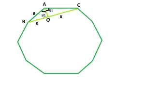

# 正十边形的对角线

> 原文:[https://www . geeksforgeeks . org/常规十边形对角线/](https://www.geeksforgeeks.org/diagonal-of-a-regular-decagon/)

给定一个整数 **a** ，它是正十边形的边，任务是找到并打印它对角线的长度。



**例:**

> **输入:** a = 5
> **输出:** 9.51
> **输入:** a = 9
> **输出:** 17.118

**逼近:**我们知道多边形内角之和=**(n–2)* 180**其中， **n** 是多边形的边数。
所以，十边形的内角之和= **8 * 180 = 1440** ，每个内角为 **144** 。
现在，我们要找到 **BC** = **2 * x** 。如果我们在 **BC** 上画一条垂线 **AO** ，我们会看到这条垂线将 **BO** 和 **OC** 中的 **BC** 一分为二，作为三角形 **AOB** 和 **AOC** 相互全等。
所以，在三角形中 **AOB** ， **sin(72) = x / a** 即 **x = 0.951 * a**
因此，对角线长度将为 **2 * x** 即 **1.902 * a** 。
以下是上述办法的实施:

## C++

```
// C++ program to find the diagonal
// of a regular decagon
#include <bits/stdc++.h>
using namespace std;

// Function to return the diagonal
// of a regular decagon
float decdiagonal(float a)
{

    // Side cannot be negative
    if (a < 0)
        return -1;

    // Length of the diagonal
    float d = 1.902 * a;
    return d;
}

// Driver code
int main()
{
    float a = 9;
    cout << decdiagonal(a) << endl;
    return 0;
}
```

## Java 语言(一种计算机语言，尤用于创建网站)

```
// Java program to find the diagonal of a regular decdiagonal
import java.util.*;
import java.lang.*;
import java.io.*;

public class GFG {

    // Function to return the diagonal of a regular decdiagonal
    static double decdiagonal(double a)
    {

//side cannot be negative
        if(a<0)
        return -1;

        // length of the diagonal
        double d=1.902*a;

        return d;
    }

    // Driver code
    public static void main(String[] args)
    {
        int a = 9;
        System.out.println(decdiagonal(a));
    }
}
```

## 蟒蛇 3

```
# Python3 program to find the diagonal
# of a regular decagon

# Function to return the diagonal
# of a regular decagon
def decdiagonal(a) :

    # Side cannot be negative
    if (a < 0) :
        return -1

    # Length of the diagonal
    d = 1.902 * a
    return d

# Driver code
if __name__ == "__main__" :

    a = 9
    print(decdiagonal(a))

# This code is contributed by Ryuga
```

## C#

```
// C# program to find the diagonal of a regular decdiagonal
using System;

public class GFG {

    // Function to return the diagonal of a regular decdiagonal
    static double decdiagonal(double a)
    {

//side cannot be negative
        if(a<0)
        return -1;

        // length of the diagonal
        double d=1.902*a;

        return d;
    }

    // Driver code
    public static void Main()
    {
        int a = 9;
        Console.WriteLine(decdiagonal(a));
    }
}
// This code is contributed by anuj_67..
```

## 服务器端编程语言（Professional Hypertext Preprocessor 的缩写）

```
<?php
// PHP program to find the diagonal
// of a regular decagon

// Function to return the diagonal
// of a regular decagon
function decdiagonal($a)
{

    // Side cannot be negative
    if ($a < 0)
        return -1;

    // Length of the diagonal
    $d = 1.902 * $a;
    return $d;
}

// Driver code
$a = 9;
echo decdiagonal($a);

// This code is contributed by ajit.
?>
```

## java 描述语言

```
<script>
// javascript program to find the diagonal of a regular decdiagonal

// Function to return the diagonal of a regular decdiagonal
function decdiagonal(a)
{

// side cannot be negative
if(a < 0)
return -1;

// length of the diagonal
var d = 1.902*a;

return d;
}

// Driver code

var a = 9;
document.write(decdiagonal(a));

// This code contributed by Princi Singh
</script>
```

**Output:** 

```
17.118
```