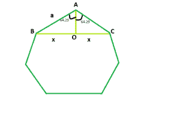

# 正七边形的对角线

> 原文:[https://www . geeksforgeeks . org/对角线规则七边形/](https://www.geeksforgeeks.org/diagonal-of-a-regular-heptagon/)

给定一个整数 **a** ，它是一个规则七边形的边，任务是找到并打印它对角线的长度。



**例:**

> **输入:** a = 6
> **输出:** 10.812
> **输入:** a = 9
> **输出:** 16.218

**逼近:**我们知道多边形内角之和=**(n–2)* 180**其中， **n** 是多边形的边数。
所以，七边形内角之和= **5 * 180 = 900** ，每个内角为 **128.58** (近似值)。
现在，我们要找到 **BC = 2 * x** 。如果我们在 **BC** 上画一条垂线 **AO** ，我们会看到该垂线将 **BO** 和 **OC** 中的 **BC** 一分为二，为三角形 **AOB** 和 **AOC** 相互全等。
所以，在三角形中 **AOB** ， **sin(64.29) = x / a** 即 **x = 0.901 * a**
因此，对角线长度将为 **2 * x** 即 **1.802 * a** 。
以下是上述方法的实施:

## C++

```
// C++ Program to find the diagonal
// of a regular heptagon
#include <bits/stdc++.h>
using namespace std;

// Function to return the diagonal
// of a regular heptagon
float heptdiagonal(float a)
{

    // Side cannot be negative
    if (a < 0)
        return -1;

    // Length of the diagonal
    float d = 1.802 * a;
    return d;
}

// Driver code
int main()
{
    float a = 6;
    cout << heptdiagonal(a) << endl;
    return 0;
}
```

## Java 语言(一种计算机语言，尤用于创建网站)

```
// Java program to find the diagonal of a regular heptagon
import java.util.*;
import java.lang.*;
import java.io.*;

public class GFG {

    // Function to return the diagonal of a regular heptagon
    static double heptdiagonal(double a)
    {

//side cannot be negative
        if(a<0)
        return -1;

        // length of the diagonal
        double d=1.802*a;

        return d;
    }

    // Driver code
    public static void main(String[] args)
    {
        int a = 6;
        System.out.println(heptdiagonal(a));
    }
}
```

## 蟒蛇 3

```
# Python3 Program to find the diagonal
# of a regular heptagon

# Function to return the diagonal
# of a regular heptagon
def heptdiagonal(a) :

    # Side cannot be negative
    if (a < 0) :
        return -1

    # Length of the diagonal
    d = 1.802 * a

    return round(d, 3)

# Driver code
if __name__ == "__main__" :

    a = 6
    print(heptdiagonal(a))

# This code is contributed by Ryuga
```

## C#

```
// C# program to find the diagonal of a regular heptagon
using System;
public class GFG {

    // Function to return the diagonal of a regular heptagon
    static double heptdiagonal(double a)
    {

//side cannot be negative
        if(a<0)
        return -1;

        // length of the diagonal
        double d=1.802*a;

        return d;
    }

    // Driver code
    public static void Main()
    {
        int a = 6;
        Console.WriteLine(heptdiagonal(a));
    }
} // This code is contributed by Mukul singh
```

## 服务器端编程语言（Professional Hypertext Preprocessor 的缩写）

```
<?php
// PHP Program to find the diagonal
// of a regular heptagon

// Function to return the diagonal
// of a regular heptagon
function heptdiagonal($a)
{

    // Side cannot be negative
    if ($a < 0)
        return -1;

    // Length of the diagonal
    $d = 1.802 * $a;
    return $d;
}

// Driver code
$a = 6;
echo heptdiagonal($a);

// This code is contributed
// by Akanksha Rai
```

## java 描述语言

```
<script>
// javascript program to find the diagonal of a regular heptagon

    // Function to return the diagonal of a regular heptagon
    function heptdiagonal(a)
    {

        // side cannot be negative
        if(a < 0)
        return -1;

        // length of the diagonal
        var d = 1.802*a;

        return d;
    }

// Driver code
var a = 6;
document.write(heptdiagonal(a).toFixed(5));

// This code contributed by Princi Singh
</script>
```

**Output:** 

```
10.812
```