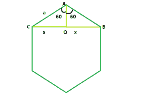

# 正六边形的对角线

> 原文:[https://www . geesforgeks . org/正六边形对角线/](https://www.geeksforgeeks.org/diagonal-of-a-regular-hexagon/)

给定一个整数 **a** ，这是一个正六边形的边，任务是找到并打印其对角线的长度。
**例:**

> **输入:** a = 6
> **输出:** 10.38
> **输入:** a = 9
> **输出:** 15.57



**逼近:**我们知道多边形内角之和=**(n–2)* 180**其中， **n** 是多边形的边数。
所以，一个六边形的内角之和= **4 * 180 = 720** ，每个内角都是 **120** 。
现在，我们要找到 **BC = 2 * x** 。如果我们在 **BC** 上画一条垂线 **AO** ，我们会看到该垂线将 **BO** 和 **OC** 中的 **BC** 一分为二，为三角形 **AOB** 和 **AOC** 相互全等。
所以，在三角形中 **AOB** ， **sin(60) = x / a** 即 **x = 0.866 * a**
因此，对角线长度将为 **2 * x** 即 **1.73 * a** 。
以下是上述方法的实施:

## C++

```
// C++ Program to find the diagonal
// of a regular hexagon
#include <bits/stdc++.h>
using namespace std;

// Function to find the diagonal
// of a regular hexagon
float hexDiagonal(float a)
{

    // Side cannot be negative
    if (a < 0)
        return -1;

    // Length of the diagonal
    float d = 1.73 * a;
    return d;
}

// Driver code
int main()
{
    float a = 9;
    cout << hexDiagonal(a) << endl;
    return 0;
}
```

## Java 语言(一种计算机语言，尤用于创建网站)

```
// Java Program to find the diagonal
// of a regular hexagon

public class GFG
{

    // Function to find the diagonal
    // of a regular hexagon
    static double hexDiagonal(float a)
    {

        // Side cannot be negative
        if (a < 0)
            return -1;

        // Length of the diagonal
        double d = (double)1.73 * a;
        return d;
    }

    // Driver code
    public static void main(String []args)
    {
        float a = 9;
        System.out.println(hexDiagonal(a)) ;
    }
    // This code is contributed by Ryuga
}
```

## 蟒蛇 3

```
# Python3 Program to find the diagonal
# of a regular hexagon

# Function to find the diagonal
# of a regular hexagon
def hexDiagonal(a):

    # Side cannot be negative
    if (a < 0):
        return -1;

    # Length of the diagonal
    d = 1.73 * a;
    return d;

# Driver code
a = 9;
print(hexDiagonal(a));

# This code is contributed
# by Akanksha Rai
```

## C#

```
// C# Program to find the diagonal 
// of a regular hexagon
using System ;
public class GFG
{

    // Function to find the diagonal 
    // of a regular hexagon 
    static double hexDiagonal(float a) 
    { 

        // Side cannot be negative 
        if (a < 0) 
            return -1; 

        // Length of the diagonal 
        double d = (double)1.73 * a; 
        return d; 
    } 

    // Driver code 
    public static void Main()
    { 
        float a = 9; 
        Console.WriteLine(hexDiagonal(a)) ; 
    } 
    // This code is contributed by Subhadeep
}
```

## 服务器端编程语言（Professional Hypertext Preprocessor 的缩写）

```
<?php
// PHP Program to find the diagonal
// of a regular hexagon

// Function to find the diagonal
// of a regular hexagon
function hexDiagonal($a)
{

    // Side cannot be negative
    if ($a < 0)
        return -1;

    // Length of the diagonal
    $d = 1.73 * $a;
    return $d;
}

// Driver code
$a = 9;
echo hexDiagonal($a), "\n";

// This code is contributed
// by akt_mit
?>
```

## java 描述语言

```
<script>
// javascript Program to find the diagonal
// of a regular hexagon

// Function to find the diagonal
// of a regular hexagon
function hexDiagonal(a)
{

    // Side cannot be negative
    if (a < 0)
        return -1;

    // Length of the diagonal
    var d = 1.73 * a;
    return d;
}

    // Driver code
var a = 9;
document.write(hexDiagonal(a)) ;

// This code contributed by Princi Singh
</script>
```

**Output:** 

```
15.57
```