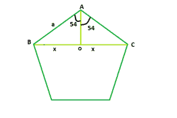

# 正五边形的对角线

> 原文:[https://www . geesforgeks . org/正五边形对角线/](https://www.geeksforgeeks.org/diagonal-of-a-regular-pentagon/)

给定一个整数 **a** ，它是正五边形的边，任务是找到并打印它对角线的长度。



**例:**

> **输入:** a = 6
> **输出:** 7.32
> **输入:** a = 9
> **输出:** 10.98

**逼近:**我们知道多边形内角之和=**(n–2)* 180**其中， **n** 是多边形的边数。
所以五边形的内角之和= **3 * 180 = 540** ，每个内角为 **108** 。
现在，我们要找到 **BC = 2 * x** 。如果我们在 **BC** 上画一条垂线 **AO** ，我们会看到该垂线将 **BO** 和 **OC** 中的 **BC** 一分为二，为三角形 **AOB** 和 **AOC** 相互全等。
所以，在三角形中 **AOB** ， **sin(54) = x / a** 即 **x = 0.61 * a**
因此，对角线长度将为 **2 * x** 即 **1.22 * a** 。
以下是上述方法的实施:

## C++

```
// C++ Program to find the diagonal
// of a regular pentagon
#include <bits/stdc++.h>
using namespace std;

// Function to find the diagonal
// of a regular pentagon
float pentdiagonal(float a)
{

    // Side cannot be negative
    if (a < 0)
        return -1;

    // Length of the diagonal
    float d = 1.22 * a;
    return d;
}

// Driver code
int main()
{
    float a = 6;
    cout << pentdiagonal(a) << endl;
    return 0;
}
```

## Java 语言(一种计算机语言，尤用于创建网站)

```
// Java Program to find the diagonal
// of a regular pentagon
class GFG
{

// Function to find the diagonal
// of a regular pentagon
static double pentdiagonal(double a)
{

    // Side cannot be negative
    if (a < 0)
        return -1;

    // Length of the diagonal
    double d = 1.22 * a;
    return d;
}

// Driver code
static public void main (String args[])
{
    double a = 6;
    System.out.println(pentdiagonal(a));
}
}

// This code is contributed
// by Akanksha Rai
```

## 蟒蛇 3

```
# Python3 Program to find the diagonal
# of a regular pentagon

# Function to find the diagonal
# of a regular pentagon
def pentdiagonal(a) :

    # Side cannot be negative
    if (a < 0) :
        return -1

    # Length of the diagonal
    d = 1.22 * a
    return d

# Driver code
if __name__ == "__main__" :

    a = 6
    print(pentdiagonal(a))

# This code is contributed by Ryuga
```

## C#

```
// C# Program to find the diagonal
// of a regular pentagon
using System;

public class GFG{

// Function to find the diagonal
// of a regular pentagon
static double pentdiagonal(double a)
{

    // Side cannot be negative
    if (a < 0)
        return -1;

    // Length of the diagonal
    double d = 1.22 * a;
    return d;
}

// Driver code
    static public void Main (){
    double a = 6;
    Console.WriteLine(pentdiagonal(a));
    }
}
```

## 服务器端编程语言（Professional Hypertext Preprocessor 的缩写）

```
<?php
// PHP Program to find the diagonal
// of a regular pentagon

// Function to find the diagonal
// of a regular pentagon
function pentdiagonal($a)
{

    // Side cannot be negative
    if ($a < 0)
        return -1;

    // Length of the diagonal
    $d = 1.22 * $a;
    return $d;
}

// Driver code
$a = 6;
echo pentdiagonal($a);

// This code is contributed
// by Sach_Code
?>
```

## java 描述语言

```
<script>
    // Javascript Program to find the diagonal
    // of a regular pentagon

    // Function to find the diagonal 
    // of a regular pentagon
    function pentdiagonal(a)
    {

        // Side cannot be negative
        if (a < 0)
            return -1;

        // Length of the diagonal
        let d = 1.22 * a;
        return d;
    }

    let a = 6;
    document.write(pentdiagonal(a));

</script>
```

**Output:** 

```
7.32
```