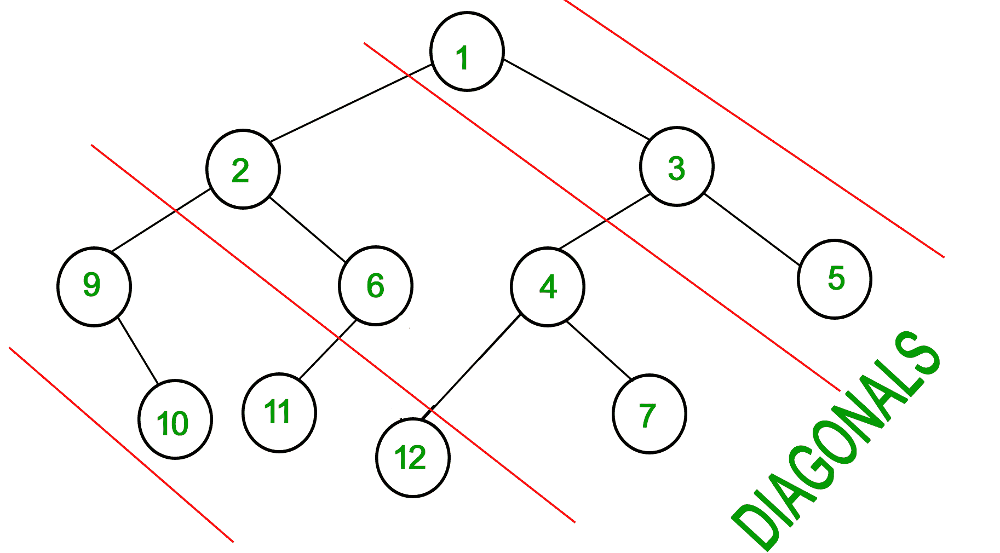

# 二叉树的对角线和

> 原文:[https://www.geeksforgeeks.org/diagonal-sum-binary-tree/](https://www.geeksforgeeks.org/diagonal-sum-binary-tree/)

考虑节点之间的斜率为 1 的线(下图中的虚线)。二叉树中的对角线和是位于这两条线之间的所有节点数据的和。给定一棵二叉树，打印所有对角线和。
对于下面的输入树，输出应该是 9、19、42。
9 是 1、3 和 5 的和。
19 是 2、6、4 和 7 的和。
42 是 9、10、11 和 12 的和。

[](https://media.geeksforgeeks.org/wp-content/uploads/diagonal-sum-in-a-tree.jpg)

### **方法 1**

**算法:**
想法是跟踪从顶部对角线穿过根部的垂直距离。我们增加垂直距离，向下到下一个对角线。

1.  将垂直距离为 0 的根添加到队列中。
2.  处理所有权利子和权利子的权利之和等等。
3.  将左边的当前子节点添加到队列中，以便以后处理。左边子节点的垂直距离是当前节点的垂直距离加 1。
4.  继续进行第二、第三和第四步，直到队列为空。

以下是上述想法的实现。

## C++

```
// C++ Program to find diagonal
// sum in a Binary Tree
#include <bits/stdc++.h>
using namespace std;

struct Node
{
    int data;
    struct Node* left;
    struct Node* right;
};

struct Node* newNode(int data)
{
    struct Node* Node =
            (struct Node*)malloc(sizeof(struct Node));

    Node->data = data;
    Node->left = Node->right = NULL;

    return Node;
}

// root - root of the binary tree
// vd - vertical distance diagonally
// diagonalSum - map to store Diagonal
// Sum(Passed by Reference)
void diagonalSumUtil(struct Node* root,
                int vd, map<int, int> &diagonalSum)
{
    if(!root)
        return;

    diagonalSum[vd] += root->data;

    // increase the vertical distance if left child
    diagonalSumUtil(root->left, vd + 1, diagonalSum);

    // vertical distance remains same for right child
    diagonalSumUtil(root->right, vd, diagonalSum);
}

// Function to calculate diagonal
// sum of given binary tree
void diagonalSum(struct Node* root)
{

    // create a map to store Diagonal Sum
    map<int, int> diagonalSum;

    diagonalSumUtil(root, 0, diagonalSum);

    map<int, int>::iterator it;
        cout << "Diagonal sum in a binary tree is - ";

    for(it = diagonalSum.begin();
                it != diagonalSum.end(); ++it)
    {
        cout << it->second << " ";
    }
}

// Driver code
int main()
{
    struct Node* root = newNode(1);
    root->left = newNode(2);
    root->right = newNode(3);
    root->left->left = newNode(9);
    root->left->right = newNode(6);
    root->right->left = newNode(4);
    root->right->right = newNode(5);
    root->right->left->right = newNode(7);
    root->right->left->left = newNode(12);
    root->left->right->left = newNode(11);
    root->left->left->right = newNode(10);

    diagonalSum(root);

    return 0;
}

// This code is contributed by Aditya Goel
```

## Java 语言(一种计算机语言，尤用于创建网站)

```
// Java Program to find diagonal sum in a Binary Tree
import java.util.*;
import java.util.Map.Entry;

//Tree node
class TreeNode
{
    int data; //node data
    int vd; //vertical distance diagonally
    TreeNode left, right; //left and right child's reference

    // Tree node constructor
    public TreeNode(int data)
    {
        this.data = data;
        vd = Integer.MAX_VALUE;
        left = right = null;
    }
}

// Tree class
class Tree
{
    TreeNode root;//Tree root

    // Tree constructor
    public Tree(TreeNode root)  {  this.root = root;  }

    // Diagonal sum method
    public void diagonalSum()
    {
        // Queue which stores tree nodes
        Queue<TreeNode> queue = new LinkedList<TreeNode>();

        // Map to store sum of node's data lying diagonally
        Map<Integer, Integer> map = new TreeMap<>();

        // Assign the root's vertical distance as 0.
        root.vd = 0;

        // Add root node to the queue
        queue.add(root);

        // Loop while the queue is not empty
        while (!queue.isEmpty())
        {
            // Remove the front tree node from queue.
            TreeNode curr = queue.remove();

            // Get the vertical distance of the dequeued node.
            int vd = curr.vd;

            // Sum over this node's right-child, right-of-right-child
            // and so on
            while (curr != null)
            {
                int prevSum = (map.get(vd) == null)? 0: map.get(vd);
                map.put(vd, prevSum + curr.data);

                // If for any node the left child is not null add
                // it to the queue for future processing.
                if (curr.left != null)
                {
                    curr.left.vd = vd+1;
                    queue.add(curr.left);
                }

                // Move to the current node's right child.
                curr = curr.right;
            }
        }

        // Make an entry set from map.
        Set<Entry<Integer, Integer>> set = map.entrySet();

        // Make an iterator
        Iterator<Entry<Integer, Integer>> iterator = set.iterator();

        // Traverse the map elements using the iterator.
         System.out.print("Diagonal sum in a binary tree is - ");
        while (iterator.hasNext())
        {
            Map.Entry<Integer, Integer> me = iterator.next();

            System.out.print(me.getValue()+" ");
        }
    }
}

//Driver class
public class DiagonalSum
{
    public static void main(String[] args)
    {
        TreeNode root = new TreeNode(1);
        root.left = new TreeNode(2);
        root.right = new TreeNode(3);
        root.left.left = new TreeNode(9);
        root.left.right = new TreeNode(6);
        root.right.left = new TreeNode(4);
        root.right.right = new TreeNode(5);
        root.right.left.left = new TreeNode(12);
        root.right.left.right = new TreeNode(7);
        root.left.right.left = new TreeNode(11);
        root.left.left.right = new TreeNode(10);
        Tree tree = new Tree(root);
        tree.diagonalSum();
    }
}
```

## 蟒蛇 3

```
# Program to find diagonal sum in a Binary Tree

class newNode:
    def __init__(self, data):
        self.data = data
        self.left = self.right = None

# Function to compute height and
# root - root of the binary tree
# vd - vertical distance diagonally
# diagonalSum - map to store Diagonal
# Sum(Passed by Reference)
def diagonalSumUtil(root, vd, diagonalSum) :

    if(not root):
        return

    if vd not in diagonalSum:
        diagonalSum[vd] = 0
    diagonalSum[vd] += root.data

    # increase the vertical distance
    # if left child
    diagonalSumUtil(root.left, vd + 1,
                          diagonalSum)

    # vertical distance remains same
    # for right child
    diagonalSumUtil(root.right, vd,
                       diagonalSum)

# Function to calculate diagonal
# sum of given binary tree
def diagonalSum(root) :

    # create a map to store Diagonal Sum
    diagonalSum = dict()

    diagonalSumUtil(root, 0, diagonalSum)

    print("Diagonal sum in a binary tree is - ",
                                       end = "")

    for it in diagonalSum:
        print(diagonalSum[it], end = " ")

# Driver Code
if __name__ == '__main__':
    root = newNode(1)
    root.left = newNode(2)
    root.right = newNode(3)
    root.left.left = newNode(9)
    root.left.right = newNode(6)
    root.right.left = newNode(4)
    root.right.right = newNode(5)
    root.right.left.right = newNode(7)
    root.right.left.left = newNode(12)
    root.left.right.left = newNode(11)
    root.left.left.right = newNode(10)

    diagonalSum(root)

# This code is contributed
# by SHUBHAMSINGH10
```

## C#

```
// C# Program to find diagonal sum in a Binary Tree
using System;
using System.Collections.Generic;

// Tree node
public

  class TreeNode
  {
    public
      int data; // node data
    public

      int vd; // vertical distance diagonally
    public
      TreeNode left, right; // left and right child's reference

    // Tree node constructor
    public TreeNode(int data)
    {
      this.data = data;
      vd = int.MaxValue;
      left = right = null;
    }
  }

// Tree class
public class Tree
{
  TreeNode root;//T ree root

  // Tree constructor
  public Tree(TreeNode root)
  {
    this.root = root;
  }

  // Diagonal sum method
  public void diagonalSum()
  {

    // Queue which stores tree nodes
    Queue<TreeNode> queue = new Queue<TreeNode>();

    // Map to store sum of node's data lying diagonally
    Dictionary<int, int> map = new Dictionary<int,int>();

    // Assign the root's vertical distance as 0.
    root.vd = 0;

    // Add root node to the queue
    queue.Enqueue(root);

    // Loop while the queue is not empty
    while (queue.Count != 0)
    {

      // Remove the front tree node from queue.
      TreeNode curr = queue.Dequeue();

      // Get the vertical distance of the dequeued node.
      int vd = curr.vd;

      // Sum over this node's right-child, right-of-right-child
      // and so on
      while (curr != null)
      {
        int prevSum;
        if(!map.ContainsKey(vd))
          prevSum = 0;
        else
          prevSum =  map[vd];

        if(map.ContainsKey(vd))
          map[vd] =  prevSum + curr.data;
        else
          map.Add(vd, prevSum + curr.data);

        // If for any node the left child is not null add
        // it to the queue for future processing.
        if (curr.left != null)
        {
          curr.left.vd = vd + 1;
          queue.Enqueue(curr.left);
        }

        // Move to the current node's right child.
        curr = curr.right;
      }
    }

    // Traverse the map elements using the iterator.
    Console.Write("Diagonal sum in a binary tree is - ");
    foreach(KeyValuePair<int, int> iterator in map)
    {

      //  Map.Entry<int, int> me = iterator.next();
      Console.Write(iterator.Value + " ");
    }
  }
}

// Driver class
public class DiagonalSum
{
  public static void Main(String[] args)
  {
    TreeNode root = new TreeNode(1);
    root.left = new TreeNode(2);
    root.right = new TreeNode(3);
    root.left.left = new TreeNode(9);
    root.left.right = new TreeNode(6);
    root.right.left = new TreeNode(4);
    root.right.right = new TreeNode(5);
    root.right.left.left = new TreeNode(12);
    root.right.left.right = new TreeNode(7);
    root.left.right.left = new TreeNode(11);
    root.left.left.right = new TreeNode(10);
    Tree tree = new Tree(root);
    tree.diagonalSum();
  }
}

// This code is contributed by gauravrajput1
```

## java 描述语言

```
<script>

      // JavaScript Program to find diagonal
      // sum in a Binary Tree
      // Tree node
      class TreeNode {
        // Tree node constructor
        constructor(data) {
          this.data = data; // node data
          this.vd = 2147483647; // vertical distance diagonally
          this.left = null; // left and right child's reference
          this.right = null;
        }
      }

      // Tree class
      class Tree {
        // Tree constructor
        constructor(root) {
          this.root = root; //T ree root
        }

        // Diagonal sum method
        diagonalSum() {
          // Queue which stores tree nodes
          var queue = [];

          // Map to store sum of node's data lying diagonally
          var map = {};

          // Assign the root's vertical distance as 0.
          this.root.vd = 0;

          // Add root node to the queue
          queue.push(this.root);

          // Loop while the queue is not empty
          while (queue.length != 0) {
            // Remove the front tree node from queue.
            var curr = queue.shift();

            // Get the vertical distance of the dequeued node.
            var vd = curr.vd;

            // Sum over this node's right-child,
            // right-of-right-child
            // and so on
            while (curr != null) {
              var prevSum;
              if (!map.hasOwnProperty(vd))
              prevSum = 0;
              else prevSum = map[vd];

              if (map.hasOwnProperty(vd))
              map[vd] = prevSum + curr.data;
              else
              map[vd] = prevSum + curr.data;

              // If for any node the left child is not null add
              // it to the queue for future processing.
              if (curr.left != null) {
                curr.left.vd = vd + 1;
                queue.push(curr.left);
              }

              // Move to the current node's right child.
              curr = curr.right;
            }
          }

          // Traverse the map elements using the iterator.
          document.write("Diagonal sum in a binary tree is - ");
          for (const [key, value] of Object.entries(map)) {
            // Map.Entry<int, int> me = iterator.next();
            document.write(value + " ");
          }
        }
      }

      // Driver class
      var root = new TreeNode(1);
      root.left = new TreeNode(2);
      root.right = new TreeNode(3);
      root.left.left = new TreeNode(9);
      root.left.right = new TreeNode(6);
      root.right.left = new TreeNode(4);
      root.right.right = new TreeNode(5);
      root.right.left.left = new TreeNode(12);
      root.right.left.right = new TreeNode(7);
      root.left.right.left = new TreeNode(11);
      root.left.left.right = new TreeNode(10);
      var tree = new Tree(root);
      tree.diagonalSum();

</script>
```

**Output**

```
Diagonal sum in a binary tree is - 9 19 42 
```

**练习:**
这个问题是针对从上到下的对角线和斜率-1 的。对斜率+1 尝试同样的问题。
本文由**库马尔·高塔姆**供稿。如果你发现任何不正确的地方，或者你想分享更多关于上面讨论的话题的信息，请写评论。

### **方法二:**

这种方法背后的思想受到矩阵中对角关系的启发。我们可以观察到，矩阵中位于同一对角线上的所有元素的行和列的差异都是相同的。例如，考虑正方形矩阵中的主对角线，我们可以观察到对角线上每个元素的行和列索引的差异是相同的，即主对角线上的每个元素具有行和列 0 的差异，例如:0-0，1-1，2-2，…n-n。

同样，每条对角线都有自己独特的行和列的区别，借助这一点，我们可以识别每一个元素，它属于哪一条对角线。

**同样的思路应用于解决这个问题-**

*   我们将把树节点的级别作为它们的行索引，把树节点的宽度作为它们的列索引。
*   我们将每个节点的单元格表示为**(级别，宽度)**

**例- (** 同树取上**)**T4】

| **节点** | **等级指数** | **宽度指数** |
| one

 | Zero | Zero |
| Two | one | -1 |
| three | one | one |
| four | Two | Zero |
| five | Two | Two |
| six | Two | Zero |
| seven | three | one |
| nine | Two | -2 |
| Ten | three | -1 |
| Eleven | three | -1 |
| Twelve | three | -1 |

**为了帮助你可视化，让我们画一个矩阵，第一行和第一列，分别是宽度和级别指数-**

<figure class="table">

|   | **-2** | **-1** | **0** | **1** | **2** |
| **0** |   |   | one |   |   |
| **1** |   | Two |   | three |   |
| **2** | nine |   | 6+4 |   | five |
| **3** |   | 10+11+12 |   | seven |   |

下面是上述想法的实现:

## C++

```
// C++ Program to calculate the
// sum of diagonal nodes.

#include <bits/stdc++.h>
using namespace std;

// Node Structure
struct Node {
    int data;
    Node *left, *right;
};

// to map the node with level - index
map<int, int> grid;

// Function to create new node
struct Node* newNode(int data)
{
    struct Node* Node
        = (struct Node*)malloc(sizeof(struct Node));

    Node->data = data;
    Node->left = Node->right = NULL;

    return Node;
}

// recursvise function to calculate sum of elements
// where level - index is same.
void addConsideringGrid(Node* root, int level, int index)
{

    // if there is no child then return
    if (root == NULL)
        return;

    // add the element in the group of node
    // whose level - index is equal
    grid[level - index] += (root->data);

    // left child call
    addConsideringGrid(root->left, level + 1, index - 1);

    // right child call
    addConsideringGrid(root->right, level + 1, index + 1);
}

vector<int> diagonalSum(Node* root)
{
    grid.clear();

    // Function call
    addConsideringGrid(root, 0, 0);
    vector<int> ans;

    // for different values of level - index
    // add te sum of those node to answer
    for (auto x : grid) {
        ans.push_back(x.second);
    }

    return ans;
}

// Driver code
int main()
{

    // build binary tree
    struct Node* root = newNode(1);
    root->left = newNode(2);
    root->right = newNode(3);
    root->left->left = newNode(9);
    root->left->right = newNode(6);
    root->right->left = newNode(4);
    root->right->right = newNode(5);
    root->right->left->right = newNode(7);
    root->right->left->left = newNode(12);
    root->left->right->left = newNode(11);
    root->left->left->right = newNode(10);

    // Function Call
    vector<int> v = diagonalSum(root);

    // print the diagonal sums
    for (int i = 0; i < v.size(); i++)
        cout << v[i] << " ";
      return 0;
}
```

## Java 语言(一种计算机语言，尤用于创建网站)

```
// Java Program to calculate the
// sum of diagonal nodes.
import java.util.*;
class GFG
{

// Node Structure
static class Node
{
    int data;
    Node left, right;
};

// to map the node with level - index
static HashMap<Integer,Integer> grid = new HashMap<>();

// Function to create new node
static Node newNode(int data)
{
    Node Node = new Node();
    Node.data = data;
    Node.left = Node.right = null;
    return Node;
}

// recursvise function to calculate sum of elements
// where level - index is same.
static void addConsideringGrid(Node root, int level, int index)
{

    // if there is no child then return
    if (root == null)
        return;

    // add the element in the group of node
    // whose level - index is equal
    if(grid.containsKey(level-index))
    grid.put(level - index,grid.get(level-index) + (root.data));
    else
        grid.put(level-index, root.data);

    // left child call
    addConsideringGrid(root.left, level + 1, index - 1);

    // right child call
    addConsideringGrid(root.right, level + 1, index + 1);
}

static Vector<Integer> diagonalSum(Node root)
{
    grid.clear();

    // Function call
    addConsideringGrid(root, 0, 0);
    Vector<Integer> ans = new Vector<>();

    // for different values of level - index
    // add te sum of those node to answer
    for (Map.Entry<Integer,Integer> x : grid.entrySet())
    {
        ans.add(x.getValue());
    }
    return ans;
}

// Driver code
public static void main(String[] args)
{

    // build binary tree
    Node root = newNode(1);
    root.left = newNode(2);
    root.right = newNode(3);
    root.left.left = newNode(9);
    root.left.right = newNode(6);
    root.right.left = newNode(4);
    root.right.right = newNode(5);
    root.right.left.right = newNode(7);
    root.right.left.left = newNode(12);
    root.left.right.left = newNode(11);
    root.left.left.right = newNode(10);

    // Function Call
    Vector<Integer> v = diagonalSum(root);

    // print the diagonal sums
    for (int i = 0; i < v.size(); i++)
        System.out.print(v.get(i) + " ");
  }
}

// This code is contributed by Rajput-Ji .
```

## 蟒蛇 3

```
# Python3 program calculate the
# sum of diagonal nodes.
from collections import deque

# A binary tree node structure
class Node:
    def __init__(self, key):

        self.data = key
        self.left = None
        self.right = None

# To map the node with level - index
grid = {}

# Recursvise function to calculate
# sum of elements where level - index
# is same
def addConsideringGrid(root, level, index):

    global grid

    # If there is no child then return
    if (root == None):
        return

    # Add the element in the group of node
    # whose level - index is equal
    grid[level - index] = (grid.get(level - index, 0) +
                           root.data)

    # Left child call
    addConsideringGrid(root.left, level + 1,
                                  index - 1)

    # Right child call
    addConsideringGrid(root.right, level + 1,
                                   index + 1)

def diagonalSum(root):

    # grid.clear()

    # Function call
    addConsideringGrid(root, 0, 0)
    ans = []

    # For different values of level - index
    # add te sum of those node to answer
    for x in grid:
        ans.append(grid[x])

    return ans

# Driver code
if __name__ == '__main__':

    # Build binary tree
    root = Node(1)
    root.left = Node(2)
    root.right = Node(3)
    root.left.left = Node(9)
    root.left.right = Node(6)
    root.right.left = Node(4)
    root.right.right = Node(5)
    root.right.left.right = Node(7)
    root.right.left.left = Node(12)
    root.left.right.left = Node(11)
    root.left.left.right = Node(10)

    # Function Call
    v = diagonalSum(root)

    # Print the diagonal sums
    for i in v:
        print(i, end = " ")

# This code is contributed by mohit kumar 29
```

## C#

```
// C# Program to calculate the
// sum of diagonal nodes.
using System;
using System.Collections.Generic;
public class GFG
{

// Node Structure
public
 class Node
{
    public
 int data;
    public
 Node left, right;
};

// to map the node with level - index
static Dictionary<int, int> grid = new Dictionary<int, int>();

// Function to create new node
static Node newNode(int data)
{
    Node Node = new Node();
    Node.data = data;
    Node.left = Node.right = null;
    return Node;
}

// recursvise function to calculate sum of elements
// where level - index is same.
static void addConsideringGrid(Node root, int level, int index)
{

    // if there is no child then return
    if (root == null)
        return;

    // add the element in the group of node
    // whose level - index is equal
    if(grid.ContainsKey(level - index))
    grid[level - index] = grid[level - index] + (root.data);
    else
        grid.Add(level-index, root.data);

    // left child call
    addConsideringGrid(root.left, level + 1, index - 1);

    // right child call
    addConsideringGrid(root.right, level + 1, index + 1);
}

static List<int> diagonalSum(Node root)
{
    grid.Clear();

    // Function call
    addConsideringGrid(root, 0, 0);
    List<int> ans = new List<int>();

    // for different values of level - index
    // add te sum of those node to answer
    foreach (KeyValuePair<int,int> x in grid)
    {
        ans.Add(x.Value);
    }
    return ans;
}

// Driver code
public static void Main(String[] args)
{

    // build binary tree
    Node root = newNode(1);
    root.left = newNode(2);
    root.right = newNode(3);
    root.left.left = newNode(9);
    root.left.right = newNode(6);
    root.right.left = newNode(4);
    root.right.right = newNode(5);
    root.right.left.right = newNode(7);
    root.right.left.left = newNode(12);
    root.left.right.left = newNode(11);
    root.left.left.right = newNode(10);

    // Function Call
    List<int> v = diagonalSum(root);

    // print the diagonal sums
    for (int i = 0; i < v.Count; i++)
        Console.Write(v[i] + " ");
  }
}

// This code is contributed by Rajput-Ji
```

## java 描述语言

```
<script>

// Javascript Program to calculate the
// sum of diagonal nodes.

    // Node Structure
    class Node
    {
        // Function to create new node
        constructor(data)
        {
            this.data=data;
            this.left=null;
            this.right=null;

        }

    }

    // to map the node with level - index
    let  grid = new Map();

    // recursvise function to calculate
    // sum of elements
   // where level - index is same.
    function addConsideringGrid(root,level,index)
    {
        // if there is no child then return
    if (root == null)
        return;

    // add the element in the group of node
    // whose level - index is equal
    if(grid.has(level-index))
    {

        grid.set(level - index,grid.get(level-index) +
        (root.data));
    }
    else
    {
        grid.set(level-index, root.data);
    }

    // left child call
    addConsideringGrid(root.left, level + 1, index - 1);

    // right child call
    addConsideringGrid(root.right, level + 1, index + 1);   
    }

    function  diagonalSum(root)
    {
        // Function call
    addConsideringGrid(root, 0, 0);
    let ans = [];

    // for different values of level - index
    // add te sum of those node to answer
    for (let [key, value] of grid)
    {
        ans.push(value);

    }
    return ans;
    }

   // Driver code
   // build binary tree
    let root = new Node(1);
    root.left = new Node(2);
    root.right = new Node(3);
    root.left.left = new Node(9);
    root.left.right = new Node(6);
    root.right.left = new Node(4);
    root.right.right = new Node(5);
    root.right.left.right = new Node(7);
    root.right.left.left = new Node(12);
    root.left.right.left = new Node(11);
    root.left.left.right = new Node(10);

    // Function Call
    let v = diagonalSum(root);

    // print the diagonal sums
    for (let i = 0; i < v.length; i++)
        document.write(v[i] + " ");

    // This code is contributed by unknown2108

</script>
```

**输出:**

```
9 19 42
```

**时间复杂度-** O(n)

**方法–3**

**无需使用地图获取额外空间。**

**空格–o(n)，用于左节点左元素的队列，用于后续处理**

**时间**复杂性**–o(n)**

## Java 语言(一种计算机语言，尤用于创建网站)

```
import java.util.*;
class GFG
{

// Node Structure
static class Node
{
    int data;
    Node left, right;
};

// to map the node with level - index

// Function to create new node
static Node newNode(int data)
{
    Node Node = new Node();
    Node.data = data;
    Node.left = Node.right = null;
    return Node;
}

 public static ArrayList <Integer> diagonalSum(Node root){
        //list for storing diagonal sum
        ArrayList <Integer> list = new ArrayList <Integer> ();

        //list for processng diagonal left while traversing right
        /*
               1
             2    3
                 4
           1->3 while moving diagonally right
           queue 2,4 // for processing later
        */
        Queue <Node> queue = new LinkedList <Node> ();
        int sum = 0; // sum of digoanl element
        int count = 0; // number of element in next  diagonal
        int last = 0; // Number of element left to traverse current diagonal
        while(root!=null){
            if(root.left!=null){ // queue left
                queue.add(root.left);
                count++; // count of next diagonal elements
            }
            sum += root.data;
            root = root.right; //move diagonally right
            if(root == null){ // all element of diagonal  is traversed
                if(!queue.isEmpty()){ // check queue for processing any left
                  root = queue.poll();
                }
                if(last == 0){ // new diagonal sum , traversal of all element in current diagonal done or not
                    list.add(sum);
                    sum = 0;
                    last = count; // keep element in one diagonal
                    count = 0;
                }
              last--;
            }
        }
        return list;

 }
// Driver code
public static void main(String[] args)
{

    // build binary tree
    Node root = newNode(1);
    root.left = newNode(2);
    root.right = newNode(3);
    root.left.left = newNode(9);
    root.left.right = newNode(6);
    root.right.left = newNode(4);
    root.right.right = newNode(5);
    root.right.left.right = newNode(7);
    root.right.left.left = newNode(12);
    root.left.right.left = newNode(11);
    root.left.left.right = newNode(10);

    // Function Call
    ArrayList <Integer> v = diagonalSum(root);

    // print the diagonal sums
    for (int i = 0; i < v.size(); i++)
        System.out.print(v.get(i) + " ");
  }
}
```

本文由 [**阿布舍克·乔德里**](https://auth.geeksforgeeks.org/user/abhishek07456cse/profile) 供稿。如果你发现任何不正确的地方，或者你想分享更多关于上面讨论的话题的信息，请写评论。

</figure>