# Dial 的算法(针对小范围权重优化的 Dijkstra)

> 原文:[https://www . geesforgeks . org/dials-算法优化-Dijkstra-针对小范围权重/](https://www.geeksforgeeks.org/dials-algorithm-optimized-dijkstra-for-small-range-weights/)

当用邻接表表示实现时，Dijkstra 的最短路径算法在 O(Elog V)时间内运行(详见 [C 实现](https://www.geeksforgeeks.org/greedy-algorithms-set-7-dijkstras-algorithm-for-adjacency-list-representation/)和[基于 STL 的 C++实现](https://www.geeksforgeeks.org/dijkstras-shortest-path-algorithm-using-set-in-stl/))。

```


Input : Source = 0, Maximum Weight W = 14
Output : 
     Vertex   Distance from Source
        0                0
        1                4
        2                12
        3                19
        4                21
        5                11
        6                9
        7                8
        8                14
```

**如果最大权重很小(或者边权重的范围很小)，我们能优化 Dijkstra 的最短路径算法，使其比 O(E log V)更好地工作吗？**
比如上图中，最大重量是 14。很多时候，中边的权重范围很小(即所有边的权重都可以映射到 0、1、2..w，其中 w 是一个小数字)。在这种情况下，可以通过使用不同的数据结构、桶来修改 dijkstra 的算法，这被称为 Dijkstra 算法的 dial 实现。时间复杂度为 **O(E + WV)** 其中 W 是图的任意边上的最大权重，所以我们可以看到，如果 W 很小，那么这个实现比传统算法运行得快得多。以下是一些重要的观察结果。

*   任意两个节点之间的最大距离可以是最大 w(V–1)(w 是最大边权重，我们可以在两个顶点之间有最大 V-1 条边)。
*   在 Dijkstra 算法中，距离是以不递减的方式确定的，即(到给定源的)较近顶点的距离在较远顶点之前确定。

<center>**Algorithm**</center>

Below is complete algorithm:

1.  维护一些桶，编号为 0，1，2，…，wV。
2.  桶 k 包含距离等于 k 的所有临时标记的节点。
3.  每个桶中的节点由顶点列表表示。
4.  桶 0，1，2，..连续检查 wV，直到找到第一个非空桶。根据定义，第一个非空桶中包含的每个节点都有最小距离标签。
5.  在扫描过程中，这些带有最小距离标签的节点被一个接一个地永久标记并从桶中删除。
6.  因此，涉及顶点的操作包括:
    *   检查桶是否是空的
    *   向桶添加顶点
    *   从桶中删除顶点。
7.  当顶点的距离标签发生变化时，桶中临时标记的顶点的位置也会相应更新。
8.  重复该过程，直到所有顶点都被永久标记(或者所有顶点的距离都被最终确定)。

<center>**Implementation**</center>

因为最大距离可以是 w(V–1)，所以我们创建 wV 桶(为了代码简单起见更多)来实现算法，如果 w 很大，该桶可以很大。

```
// C++ Program for Dijkstra's dial implementation
#include<bits/stdc++.h>
using namespace std;
# define INF 0x3f3f3f3f

// This class represents a directed graph using
// adjacency list representation
class Graph
{
    int V;  // No. of vertices

    // In a weighted graph, we need to store vertex
    // and weight pair for every edge
    list< pair<int, int> > *adj;

public:
    Graph(int V);  // Constructor

    // function to add an edge to graph
    void addEdge(int u, int v, int w);

    // prints shortest path from s
    void shortestPath(int s, int W);
};

// Allocates memory for adjacency list
Graph::Graph(int V)
{
    this->V = V;
    adj = new list< pair<int, int> >[V];
}

//  adds edge between u and v of weight w
void Graph::addEdge(int u, int v, int w)
{
    adj[u].push_back(make_pair(v, w));
    adj[v].push_back(make_pair(u, w));
}

// Prints shortest paths from src to all other vertices.
// W is the maximum weight of an edge
void Graph::shortestPath(int src, int W)
{
    /* With each distance, iterator to that vertex in
       its bucket is stored so that vertex can be deleted
       in O(1) at time of updation. So
    dist[i].first = distance of ith vertex from src vertex
    dits[i].second = iterator to vertex i in bucket number */
    vector<pair<int, list<int>::iterator> > dist(V);

    // Initialize all distances as infinite (INF)
    for (int i = 0; i < V; i++)
        dist[i].first = INF;

    // Create buckets B[].
    // B[i] keep vertex of distance label i
    list<int> B[W * V + 1];

    B[0].push_back(src);
    dist[src].first = 0;

    //
    int idx = 0;
    while (1)
    {
        // Go sequentially through buckets till one non-empty
        // bucket is found
        while (B[idx].size() == 0 && idx < W*V)
            idx++;

        // If all buckets are empty, we are done.
        if (idx == W * V)
            break;

        // Take top vertex from bucket and pop it
        int u = B[idx].front();
        B[idx].pop_front();

        // Process all adjacents of extracted vertex 'u' and
        // update their distanced if required.
        for (auto i = adj[u].begin(); i != adj[u].end(); ++i)
        {
            int v = (*i).first;
            int weight = (*i).second;

            int du = dist[u].first;
            int dv = dist[v].first;

            // If there is shorted path to v through u.
            if (dv > du + weight)
            {
                // If dv is not INF then it must be in B[dv]
                // bucket, so erase its entry using iterator
                // in O(1)
                if (dv != INF)
                    B[dv].erase(dist[v].second);

                //  updating the distance
                dist[v].first = du + weight;
                dv = dist[v].first;

                // pushing vertex v into updated distance's bucket
                B[dv].push_front(v);

                // storing updated iterator in dist[v].second
                dist[v].second = B[dv].begin();
            }
        }
    }

    // Print shortest distances stored in dist[]
    printf("Vertex   Distance from Source\n");
    for (int i = 0; i < V; ++i)
        printf("%d     %d\n", i, dist[i].first);
}

// Driver program to test methods of graph class
int main()
{
    // create the graph given in above fugure
    int V = 9;
    Graph g(V);

    //  making above shown graph
    g.addEdge(0, 1, 4);
    g.addEdge(0, 7, 8);
    g.addEdge(1, 2, 8);
    g.addEdge(1, 7, 11);
    g.addEdge(2, 3, 7);
    g.addEdge(2, 8, 2);
    g.addEdge(2, 5, 4);
    g.addEdge(3, 4, 9);
    g.addEdge(3, 5, 14);
    g.addEdge(4, 5, 10);
    g.addEdge(5, 6, 2);
    g.addEdge(6, 7, 1);
    g.addEdge(6, 8, 6);
    g.addEdge(7, 8, 7);

    //  maximum weighted edge - 14
    g.shortestPath(0, 14);

    return 0;
}
```

输出:

```
Vertex Distance from Source
0     0
1     4
2     12
3     19
4     21
5     11
6     9
7     8
8     14
```

<center>**Illustration**</center>

Below is step by step illustration taken from [here](http://ocw.mit.edu/courses/sloan-school-of-management/15-082j-network-optimization-fall-2010/animations/MIT15_082JF10_av07.pdf).

[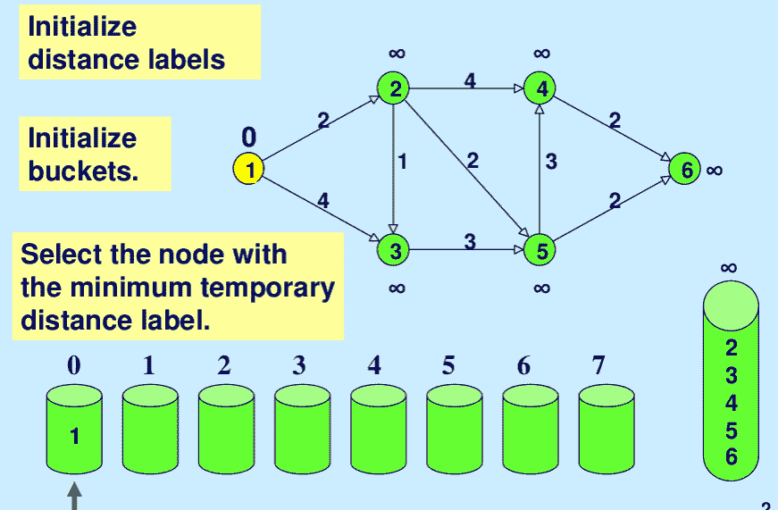](https://media.geeksforgeeks.org/wp-content/cdn-uploads/step1.png)

[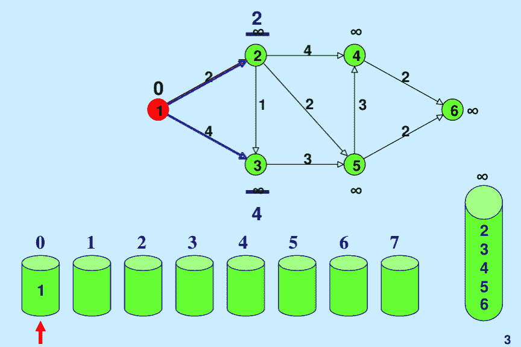](https://media.geeksforgeeks.org/wp-content/cdn-uploads/step2.png)

[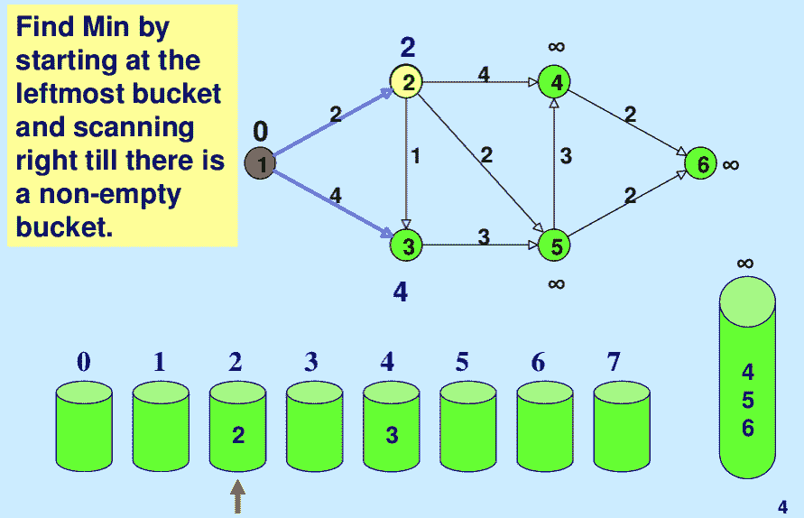](https://media.geeksforgeeks.org/wp-content/cdn-uploads/step3.png)

[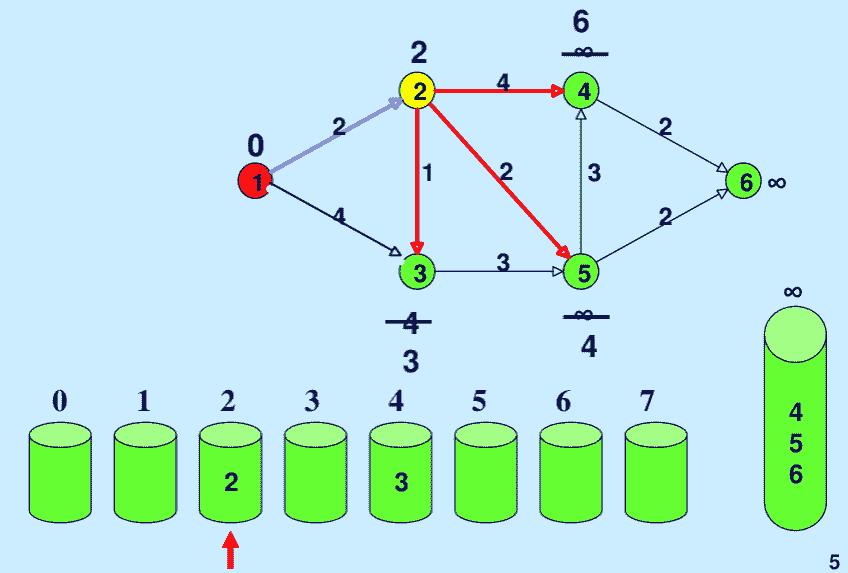](https://media.geeksforgeeks.org/wp-content/cdn-uploads/step4.png)

[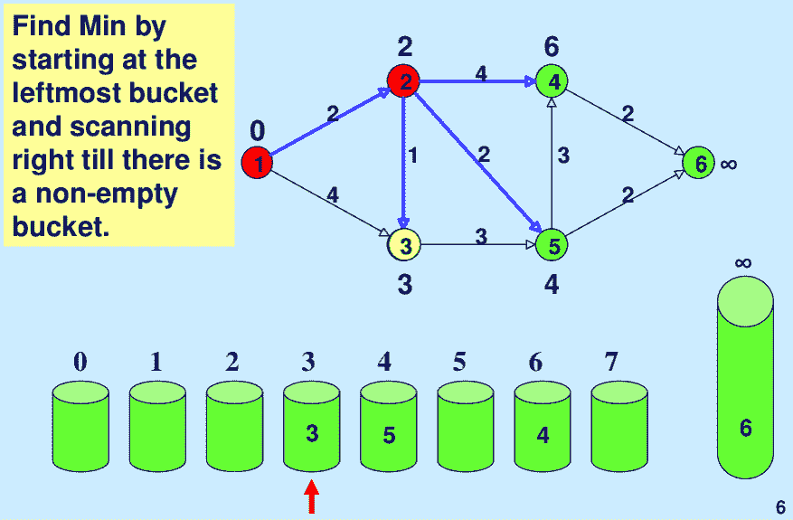](https://media.geeksforgeeks.org/wp-content/cdn-uploads/step5.png)

[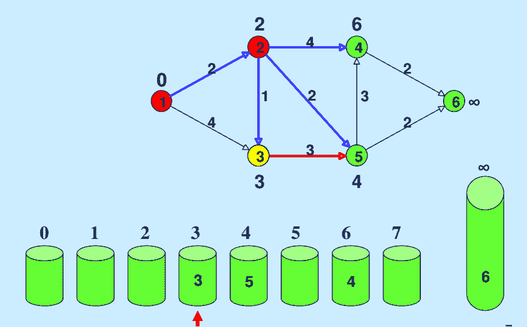](https://media.geeksforgeeks.org/wp-content/cdn-uploads/step6.png)

[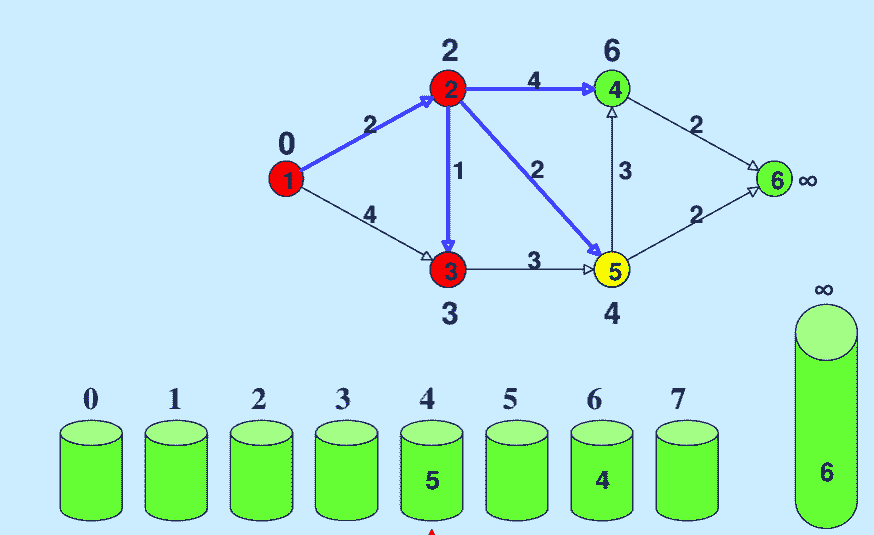](https://media.geeksforgeeks.org/wp-content/cdn-uploads/step7.png)

[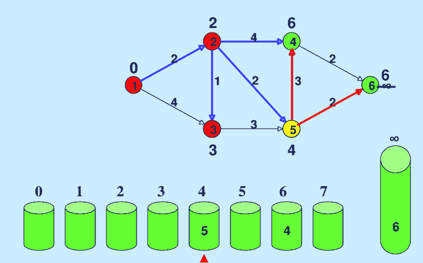](https://media.geeksforgeeks.org/wp-content/cdn-uploads/step8.png)

[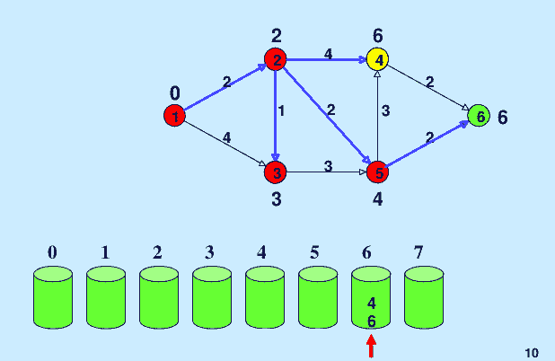](https://media.geeksforgeeks.org/wp-content/cdn-uploads/step10.png)

[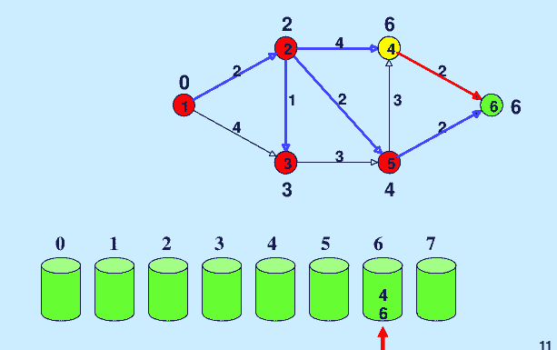](https://media.geeksforgeeks.org/wp-content/cdn-uploads/step11.png)

[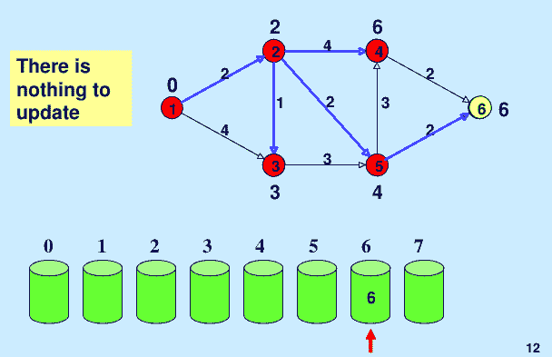](https://media.geeksforgeeks.org/wp-content/cdn-uploads/step12.png)

[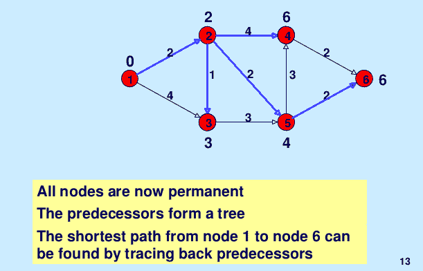](https://media.geeksforgeeks.org/wp-content/cdn-uploads/step13.png) 

本文由乌卡什·特里维迪供稿。如果你发现任何不正确的地方，或者你想分享更多关于上面讨论的话题的信息，请写评论。