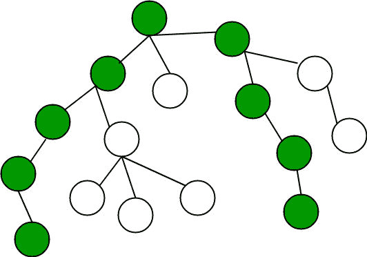

# 使用 BFS 的 n 元树直径

> 原文:[https://www . geesforgeks . org/diameter-n-ary-tree-using-bfs/](https://www.geeksforgeeks.org/diameter-n-ary-tree-using-bfs/)

**N 元**树是指根树，其中每个节点有 k 个子节点。n 元树的直径是两个叶节点之间最长的路径。

已经讨论了各种方法来计算树的直径。
1。[N 元树的直径](https://www.geeksforgeeks.org/diameter-n-ary-tree/)
2。[一棵二叉树的直径在 O(n)](https://www.geeksforgeeks.org/diameter-of-a-binary-tree-in-on-a-new-method/)
3。[二叉树的直径](https://www.geeksforgeeks.org/diameter-of-a-binary-tree/)
4。[使用 DFS 的树木直径](https://www.geeksforgeeks.org/diameter-tree-using-dfs/)

本文讨论用 bfs 计算 n 元树直径树的另一种方法。



**第一步:**运行 bfs 找到离根树最远的节点假设 A
**第二步:**然后运行 bfs 从 A 找到离 A 最远的节点假设 B
**第三步:**节点 A 和 B 之间的距离是给定树的直径

## C++

```
// C++ Program to find Diameter of n-ary tree
#include <bits/stdc++.h>
using namespace std;

// Here 10000 is maximum number of nodes in
// given tree.
int diameter[10001];

// The Function to do bfs traversal.
// It uses iterative approach to do bfs
// bfsUtil()
int bfs(int init, vector<int> arr[], int n)
{
    // Initializing queue
    queue<int> q;
    q.push(init);

    int visited[n + 1];
    for (int i = 0; i <= n; i++) {
        visited[i] = 0;
        diameter[i] = 0;
    }

    // Pushing each node in queue
    q.push(init);

    // Mark the traversed node visited
    visited[init] = 1;
    while (!q.empty()) {
        int u = q.front();
        q.pop();
        for (int i = 0; i < arr[u].size(); i++) {
            if (visited[arr[u][i]] == 0) {
                visited[arr[u][i]] = 1;

                // Considering weight of edges equal to 1
                diameter[arr[u][i]] += diameter[u] + 1;
                q.push(arr[u][i]);
            }
        }
    }

    // return index of max value in diameter
    return int(max_element(diameter + 1,
                           diameter + n + 1)
               - diameter);
}

int findDiameter(vector<int> arr[], int n)
{
    int init = bfs(1, arr, n);
    int val = bfs(init, arr, n);
    return diameter[val];
}

// Driver Code
int main()
{
    // Input number of nodes
    int n = 6;

    vector<int> arr[n + 1];

    // Input nodes in adjacency list
    arr[1].push_back(2);
    arr[1].push_back(3);
    arr[1].push_back(6);
    arr[2].push_back(4);
    arr[2].push_back(1);
    arr[2].push_back(5);
    arr[3].push_back(1);
    arr[4].push_back(2);
    arr[5].push_back(2);
    arr[6].push_back(1);

    printf("Diameter of n-ary tree is %d\n",
           findDiameter(arr, n));

    return 0;
}
```

## Java 语言(一种计算机语言，尤用于创建网站)

```
// Java Program to find Diameter of n-ary tree
import java.util.*;

class GFG
{

// Here 10000 is maximum number of nodes in
// given tree.
static int diameter[] = new int[10001];

// The Function to do bfs traversal.
// It uses iterative approach to do bfs
// bfsUtil()
static int bfs(int init,
               Vector<Vector<Integer>>arr, int n)
{
    // Initializing queue
    Queue<Integer> q = new LinkedList<>();
    q.add(init);

    int visited[] = new int[n + 1];
    for (int i = 0; i <= n; i++)
    {
        visited[i] = 0;
        diameter[i] = 0;
    }

    // Pushing each node in queue
    q.add(init);

    // Mark the traversed node visited
    visited[init] = 1;
    while (q.size() > 0)
    {
        int u = q.peek();
        q.remove();
        for (int i = 0;
                 i < arr.get(u).size(); i++)
        {
            if (visited[arr.get(u).get(i)] == 0)
            {
                visited[arr.get(u).get(i)] = 1;

                // Considering weight of edges equal to 1
                diameter[arr.get(u).get(i)] += diameter[u] + 1;
                q.add(arr.get(u).get(i));
            }
        }
    }
    int in = 0;
    for(int i = 0; i <= n; i++)
    {
        if(diameter[i] > diameter[in])
        in = i;
    }

    // return index of max value in diameter
    return in;
}

static int findDiameter(Vector<Vector<Integer>> arr, int n)
{
    int init = bfs(1, arr, n);
    int val = bfs(init, arr, n);
    return diameter[val];
}

// Driver Code
public static void main(String args[])
{
    // Input number of nodes
    int n = 6;

    Vector<Vector<Integer>> arr = new
    Vector<Vector<Integer>>();

    for(int i = 0; i < n + 1; i++)
    {
        arr.add(new Vector<Integer>());
    }

    // Input nodes in adjacency list
    arr.get(1).add(2);
    arr.get(1).add(3);
    arr.get(1).add(6);
    arr.get(2).add(4);
    arr.get(2).add(1);
    arr.get(2).add(5);
    arr.get(3).add(1);
    arr.get(4).add(2);
    arr.get(5).add(2);
    arr.get(6).add(1);

    System.out.printf("Diameter of n-ary tree is %d\n",
                                 findDiameter(arr, n));
}
}

// This code is contributed by Arnab Kundu
```

## 蟒蛇 3

```
# Python3 program to find diameter of n-ary tree

# Here 10000 is maximum number of nodes in
# given tree.
diameter = [0 for i in range(10001)]

# The Function to do bfs traversal.
# It uses iterative approach to do bfs
# bfsUtil()
def bfs(init, arr, n):

    # Initializing queue
    q = []
    q.append(init)

    visited = [0 for i in range(n + 1)]

    for i in range(n + 1):
        visited[i] = 0
        diameter[i] = 0

    # Pushing each node in queue
    q.append(init)

    # Mark the traversed node visited
    visited[init] = 1

    while (len(q) > 0):
        u = q[0]
        q.pop(0)

        for i in range(len(arr[u])):
            if (visited[arr[u][i]] == 0):
                visited[arr[u][i]] = 1

                # Considering weight of edges equal to 1
                diameter[arr[u][i]] += diameter[u] + 1
                q.append(arr[u][i])

    ing = 0

    for i in range(n + 1):
        if(diameter[i] > diameter[ing]):
            ing = i

    # Return index of max value in diameter
    return ing

def findDiameter(arr, n):

    init = bfs(1, arr, n)
    val = bfs(init, arr, n)
    return diameter[val]

# Driver Code
if __name__=='__main__':

    # Input number of nodes
    n = 6

    arr = [[] for i in range(n + 1)]

    # Input nodes in adjacency list
    arr[1].append(2)
    arr[1].append(3)
    arr[1].append(6)
    arr[2].append(4)
    arr[2].append(1)
    arr[2].append(5)
    arr[3].append(1)
    arr[4].append(2)
    arr[5].append(2)
    arr[6].append(1)

    print("Diameter of n-ary tree is " +
          str(findDiameter(arr, n)))

# This code is contributed by rutvik_56
```

## C#

```
// C# Program to find Diameter of n-ary tree
using System;
using System.Collections.Generic;

class GFG
{

// Here 10000 is maximum number of nodes
// in given tree.
static int []diameter = new int[10001];

// The Function to do bfs traversal.
// It uses iterative approach to do bfs
// bfsUtil()
static int bfs(int init,
               List<List<int>>arr, int n)
{
    // Initializing queue
    Queue<int> q = new Queue<int>();
    q.Enqueue(init);

    int []visited = new int[n + 1];
    for (int i = 0; i <= n; i++)
    {
        visited[i] = 0;
        diameter[i] = 0;
    }

    // Pushing each node in queue
    q.Enqueue(init);

    // Mark the traversed node visited
    visited[init] = 1;
    while (q.Count > 0)
    {
        int u = q.Peek();
        q.Dequeue();
        for (int i = 0;
                 i < arr[u].Count; i++)
        {
            if (visited[arr[u][i]] == 0)
            {
                visited[arr[u][i]] = 1;

                // Considering weight of edges equal to 1
                diameter[arr[u][i]] += diameter[u] + 1;
                q.Enqueue(arr[u][i]);
            }
        }
    }
    int iN = 0;
    for(int i = 0; i <= n; i++)
    {
        if(diameter[i] > diameter[iN])
        iN = i;
    }

    // return index of max value in diameter
    return iN;
}

static int findDiameter(List<List<int>> arr, int n)
{
    int init = bfs(1, arr, n);
    int val = bfs(init, arr, n);
    return diameter[val];
}

// Driver Code
public static void Main(String []args)
{
    // Input number of nodes
    int n = 6;

    List<List<int>> arr = new
    List<List<int>>();

    for(int i = 0; i < n + 1; i++)
    {
        arr.Add(new List<int>());
    }

    // Input nodes in adjacency list
    arr[1].Add(2);
    arr[1].Add(3);
    arr[1].Add(6);
    arr[2].Add(4);
    arr[2].Add(1);
    arr[2].Add(5);
    arr[3].Add(1);
    arr[4].Add(2);
    arr[5].Add(2);
    arr[6].Add(1);

    Console.Write("Diameter of n-ary tree is {0}\n",
                              findDiameter(arr, n));
}
}

// This code is contributed by PrinciRaj1992
```

## java 描述语言

```
<script>

    // JavaScript Program to find Diameter of n-ary tree

    // Here 10000 is maximum number of nodes in
    // given tree.
    let diameter = new Array(10001);

    // The Function to do bfs traversal.
    // It uses iterative approach to do bfs
    // bfsUtil()
    function bfs(init, arr, n)
    {
        // Initializing queue
        let q = [];
        q.push(init);

        let visited = new Array(n + 1);
        for (let i = 0; i <= n; i++)
        {
            visited[i] = 0;
            diameter[i] = 0;
        }

        // Pushing each node in queue
        q.push(init);

        // Mark the traversed node visited
        visited[init] = 1;
        while (q.length > 0)
        {
            let u = q[0];
            q.shift();
            for (let i = 0;
                     i < arr[u].length; i++)
            {
                if (visited[arr[u][i]] == 0)
                {
                    visited[arr[u][i]] = 1;

                    // Considering weight of edges equal to 1
                    diameter[arr[u][i]] += diameter[u] + 1;
                    q.push(arr[u][i]);
                }
            }
        }
        let In = 0;
        for(let i = 0; i <= n; i++)
        {
            if(diameter[i] > diameter[In])
            In = i;
        }

        // return index of max value in diameter
        return In;
    }

    function findDiameter(arr, n)
    {
        let init = bfs(1, arr, n);
        let val = bfs(init, arr, n);
        return diameter[val];
    }

    // Input number of nodes
    let n = 6;

    let arr = [];

    for(let i = 0; i < n + 1; i++)
    {
        arr.push([]);
    }

    // Input nodes in adjacency list
    arr[1].push(2);
    arr[1].push(3);
    arr[1].push(6);
    arr[2].push(4);
    arr[2].push(1);
    arr[2].push(5);
    arr[3].push(1);
    arr[4].push(2);
    arr[5].push(2);
    arr[6].push(1);

    document.write("Diameter of n-ary tree is " +
    findDiameter(arr, n) + "</br>");

</script>
```

**输出:**

```
Diameter of n-ary tree is 3
```